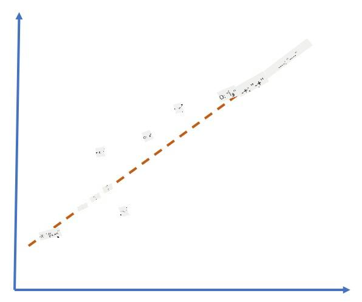
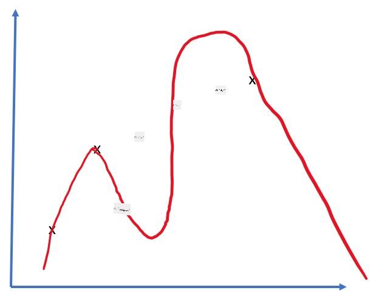
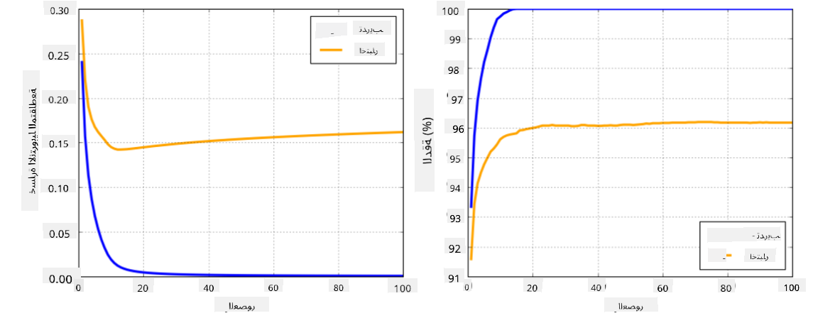

<!--
CO_OP_TRANSLATOR_METADATA:
{
  "original_hash": "2b544f20b796402507fb05a0df893323",
  "translation_date": "2025-08-26T10:29:57+00:00",
  "source_file": "lessons/3-NeuralNetworks/05-Frameworks/README.md",
  "language_code": "ar"
}
-->
# أطر الشبكات العصبية

كما تعلمنا بالفعل، لكي نتمكن من تدريب الشبكات العصبية بكفاءة، نحتاج إلى القيام بأمرين:

* العمل على المصفوفات (tensors)، مثل الضرب، الجمع، وحساب بعض الدوال مثل sigmoid أو softmax  
* حساب التدرجات لجميع التعبيرات، من أجل تنفيذ تحسين الانحدار التدرجي

## [اختبار ما قبل المحاضرة](https://red-field-0a6ddfd03.1.azurestaticapps.net/quiz/105)

بينما يمكن لمكتبة `numpy` القيام بالجزء الأول، نحتاج إلى آلية لحساب التدرجات. في [الإطار الخاص بنا](../../../../../lessons/3-NeuralNetworks/04-OwnFramework/OwnFramework.ipynb) الذي قمنا بتطويره في القسم السابق، كان علينا برمجة جميع دوال المشتقات يدويًا داخل طريقة `backward`، التي تقوم بتنفيذ الانتشار العكسي. من الناحية المثالية، يجب أن يوفر لنا الإطار فرصة لحساب التدرجات لأي تعبير يمكننا تعريفه.

أمر آخر مهم هو القدرة على إجراء العمليات الحسابية على وحدة معالجة الرسومات (GPU) أو أي وحدات حسابية متخصصة أخرى، مثل [TPU](https://en.wikipedia.org/wiki/Tensor_Processing_Unit). يتطلب تدريب الشبكات العصبية العميقة *الكثير* من العمليات الحسابية، والقدرة على توزيع هذه العمليات على وحدات GPU أمر بالغ الأهمية.

> ✅ مصطلح "parallelize" يعني توزيع العمليات الحسابية على أجهزة متعددة.

حاليًا، الإطاران الأكثر شيوعًا للشبكات العصبية هما: [TensorFlow](http://TensorFlow.org) و [PyTorch](https://pytorch.org/). كلاهما يوفر واجهة برمجية منخفضة المستوى للعمل مع المصفوفات على كل من وحدة المعالجة المركزية (CPU) ووحدة معالجة الرسومات (GPU). بالإضافة إلى ذلك، هناك واجهات برمجية عالية المستوى، تُعرف بـ [Keras](https://keras.io/) و [PyTorch Lightning](https://pytorchlightning.ai/) على التوالي.

واجهة منخفضة المستوى | [TensorFlow](http://TensorFlow.org) | [PyTorch](https://pytorch.org/)  
----------------------|-------------------------------------|--------------------------------  
واجهة عالية المستوى  | [Keras](https://keras.io/)         | [PyTorch Lightning](https://pytorchlightning.ai/)  

**الواجهات منخفضة المستوى** في كلا الإطارين تتيح لك بناء ما يُعرف بـ **الرسوم البيانية الحسابية**. يحدد هذا الرسم البياني كيفية حساب المخرجات (عادةً دالة الخسارة) باستخدام معطيات الإدخال، ويمكن دفعه للحساب على وحدة GPU إذا كانت متوفرة. هناك دوال لتفاضل هذا الرسم البياني الحسابي وحساب التدرجات، والتي يمكن استخدامها بعد ذلك لتحسين معلمات النموذج.

**الواجهات عالية المستوى** تعتبر الشبكات العصبية بشكل كبير **تسلسلاً من الطبقات**، مما يجعل بناء معظم الشبكات العصبية أسهل بكثير. عادةً ما يتطلب تدريب النموذج إعداد البيانات ثم استدعاء دالة `fit` للقيام بالمهمة.

تتيح لك الواجهة عالية المستوى بناء الشبكات العصبية النموذجية بسرعة كبيرة دون القلق بشأن الكثير من التفاصيل. في الوقت نفسه، توفر الواجهة منخفضة المستوى تحكمًا أكبر في عملية التدريب، وبالتالي تُستخدم كثيرًا في الأبحاث عند التعامل مع هياكل جديدة للشبكات العصبية.

من المهم أيضًا أن تفهم أنه يمكنك استخدام كلا الواجهتين معًا. على سبيل المثال، يمكنك تطوير بنية طبقة شبكية خاصة بك باستخدام الواجهة منخفضة المستوى، ثم استخدامها داخل شبكة أكبر تم بناؤها وتدريبها باستخدام الواجهة عالية المستوى. أو يمكنك تعريف شبكة باستخدام الواجهة عالية المستوى كتسلسل من الطبقات، ثم استخدام حلقة تدريب منخفضة المستوى خاصة بك لتنفيذ التحسين. كلا الواجهتين تستخدمان نفس المفاهيم الأساسية، وتم تصميمهما للعمل معًا بشكل جيد.

## التعلم

في هذه الدورة، نقدم معظم المحتوى لكل من PyTorch و TensorFlow. يمكنك اختيار الإطار المفضل لديك ومتابعة الدفاتر (notebooks) المقابلة فقط. إذا لم تكن متأكدًا من الإطار الذي تختاره، اقرأ بعض النقاشات على الإنترنت حول **PyTorch مقابل TensorFlow**. يمكنك أيضًا إلقاء نظرة على كلا الإطارين للحصول على فهم أفضل.

حيثما أمكن، سنستخدم الواجهات عالية المستوى من أجل البساطة. ومع ذلك، نعتقد أنه من المهم فهم كيفية عمل الشبكات العصبية من الأساس، لذلك نبدأ في البداية بالعمل مع الواجهة منخفضة المستوى والمصفوفات. ومع ذلك، إذا كنت ترغب في البدء بسرعة ولا تريد قضاء الكثير من الوقت في تعلم هذه التفاصيل، يمكنك تخطيها والانتقال مباشرة إلى دفاتر الواجهة عالية المستوى.

## ✍️ تمارين: الأطر

واصل التعلم في الدفاتر التالية:

واجهة منخفضة المستوى | [دفتر TensorFlow+Keras](../../../../../lessons/3-NeuralNetworks/05-Frameworks/IntroKerasTF.ipynb) | [PyTorch](../../../../../lessons/3-NeuralNetworks/05-Frameworks/IntroPyTorch.ipynb)  
----------------------|-------------------------------------|--------------------------------  
واجهة عالية المستوى  | [Keras](../../../../../lessons/3-NeuralNetworks/05-Frameworks/IntroKeras.ipynb)         | *PyTorch Lightning*  

بعد إتقان الأطر، دعونا نراجع مفهوم الإفراط في التخصيص (Overfitting).

# الإفراط في التخصيص

الإفراط في التخصيص هو مفهوم مهم للغاية في تعلم الآلة، ومن المهم جدًا فهمه بشكل صحيح!

فكر في المشكلة التالية لتقريب 5 نقاط (ممثلة بـ `x` في الرسوم البيانية أدناه):

 |   
-------------------------|--------------------------  
**نموذج خطي، 2 من المعاملات** | **نموذج غير خطي، 7 من المعاملات**  
خطأ التدريب = 5.3 | خطأ التدريب = 0  
خطأ التحقق = 5.1 | خطأ التحقق = 20  

* على اليسار، نرى تقريبًا جيدًا بخط مستقيم. لأن عدد المعاملات مناسب، النموذج يفهم توزيع النقاط بشكل صحيح.  
* على اليمين، النموذج قوي جدًا. لأن لدينا فقط 5 نقاط والنموذج يحتوي على 7 معاملات، يمكنه التكيف بطريقة تمر عبر جميع النقاط، مما يجعل خطأ التدريب يساوي 0. ومع ذلك، يمنع هذا النموذج من فهم النمط الصحيح وراء البيانات، وبالتالي يكون خطأ التحقق عاليًا جدًا.

من المهم جدًا تحقيق توازن صحيح بين قوة النموذج (عدد المعاملات) وعدد عينات التدريب.

## لماذا يحدث الإفراط في التخصيص

  * قلة بيانات التدريب  
  * نموذج قوي جدًا  
  * الكثير من الضوضاء في بيانات الإدخال  

## كيفية اكتشاف الإفراط في التخصيص

كما ترى من الرسم البياني أعلاه، يمكن اكتشاف الإفراط في التخصيص من خلال خطأ تدريب منخفض جدًا وخطأ تحقق مرتفع. عادةً أثناء التدريب، نرى كلًا من أخطاء التدريب والتحقق تبدأ في الانخفاض، ثم في مرحلة ما قد يتوقف خطأ التحقق عن الانخفاض ويبدأ في الارتفاع. سيكون هذا علامة على الإفراط في التخصيص، ومؤشرًا على أنه يجب علينا على الأرجح إيقاف التدريب في هذه المرحلة (أو على الأقل أخذ لقطة للنموذج).

## كيفية منع الإفراط في التخصيص

إذا لاحظت حدوث الإفراط في التخصيص، يمكنك القيام بأحد الأمور التالية:

 * زيادة كمية بيانات التدريب  
 * تقليل تعقيد النموذج  
 * استخدام بعض [تقنيات التنظيم](../../4-ComputerVision/08-TransferLearning/TrainingTricks.md)، مثل [Dropout](../../4-ComputerVision/08-TransferLearning/TrainingTricks.md#Dropout)، التي سنناقشها لاحقًا.  

## الإفراط في التخصيص ومقايضة التحيز-التباين

الإفراط في التخصيص هو في الواقع حالة من مشكلة أكثر عمومية في الإحصاء تُعرف بـ [مقايضة التحيز-التباين](https://en.wikipedia.org/wiki/Bias%E2%80%93variance_tradeoff). إذا نظرنا إلى المصادر المحتملة للخطأ في نموذجنا، يمكننا رؤية نوعين من الأخطاء:

* **أخطاء التحيز** ناتجة عن عدم قدرة خوارزمية النموذج على التقاط العلاقة بين بيانات التدريب بشكل صحيح. يمكن أن ينتج ذلك عن كون النموذج غير قوي بما يكفي (**نقص التخصيص**).  
* **أخطاء التباين**، التي تنتج عن النموذج الذي يقوم بتقريب الضوضاء في بيانات الإدخال بدلاً من العلاقة ذات المعنى (**الإفراط في التخصيص**).  

أثناء التدريب، ينخفض خطأ التحيز (مع تعلم النموذج لتقريب البيانات)، ويزداد خطأ التباين. من المهم إيقاف التدريب - إما يدويًا (عند اكتشاف الإفراط في التخصيص) أو تلقائيًا (عن طريق إدخال التنظيم) - لمنع الإفراط في التخصيص.

## الخلاصة

في هذا الدرس، تعلمت عن الفروقات بين الواجهات المختلفة للإطارين الأكثر شيوعًا في الذكاء الاصطناعي، TensorFlow و PyTorch. بالإضافة إلى ذلك، تعلمت عن موضوع مهم جدًا، وهو الإفراط في التخصيص.

## 🚀 التحدي

في الدفاتر المرفقة، ستجد "مهام" في الأسفل؛ اعمل من خلال الدفاتر وأكمل المهام.

## [اختبار ما بعد المحاضرة](https://red-field-0a6ddfd03.1.azurestaticapps.net/quiz/205)

## المراجعة والدراسة الذاتية

قم ببعض البحث حول المواضيع التالية:

- TensorFlow  
- PyTorch  
- الإفراط في التخصيص  

اسأل نفسك الأسئلة التالية:

- ما الفرق بين TensorFlow و PyTorch؟  
- ما الفرق بين الإفراط في التخصيص ونقص التخصيص؟  

## [التكليف](lab/README.md)

في هذا المختبر، يُطلب منك حل مشكلتين تصنيفيتين باستخدام شبكات متصلة بالكامل ذات طبقة واحدة ومتعددة الطبقات باستخدام PyTorch أو TensorFlow.

* [التعليمات](lab/README.md)  
* [دفتر الملاحظات](../../../../../lessons/3-NeuralNetworks/05-Frameworks/lab/LabFrameworks.ipynb)  

**إخلاء المسؤولية**:  
تم ترجمة هذا المستند باستخدام خدمة الترجمة بالذكاء الاصطناعي [Co-op Translator](https://github.com/Azure/co-op-translator). بينما نسعى لتحقيق الدقة، يرجى العلم أن الترجمات الآلية قد تحتوي على أخطاء أو معلومات غير دقيقة. يجب اعتبار المستند الأصلي بلغته الأصلية المصدر الرسمي. للحصول على معلومات حاسمة، يُوصى بالاستعانة بترجمة بشرية احترافية. نحن غير مسؤولين عن أي سوء فهم أو تفسيرات خاطئة تنشأ عن استخدام هذه الترجمة.