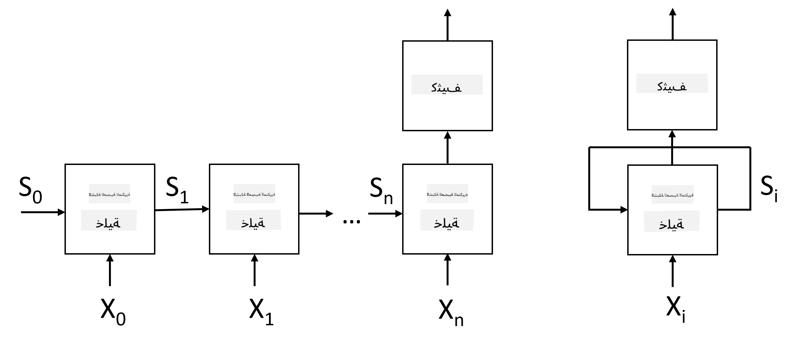
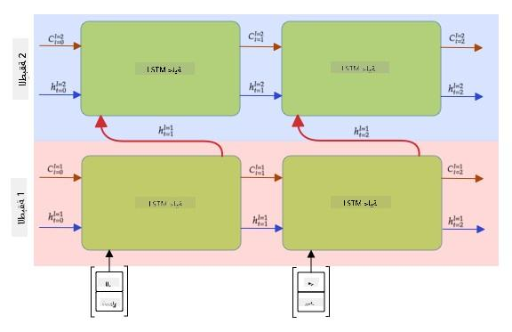

<!--
CO_OP_TRANSLATOR_METADATA:
{
  "original_hash": "58bf4adb210aab53e8f78c8082040e7c",
  "translation_date": "2025-08-26T08:07:12+00:00",
  "source_file": "lessons/5-NLP/16-RNN/README.md",
  "language_code": "ar"
}
-->
# الشبكات العصبية المتكررة

## [اختبار ما قبل المحاضرة](https://ff-quizzes.netlify.app/en/ai/quiz/31)

في الأقسام السابقة، كنا نستخدم تمثيلات دلالية غنية للنصوص ومصنف خطي بسيط فوق التضمينات. ما تفعله هذه البنية هو التقاط المعنى المجمع للكلمات في الجملة، لكنها لا تأخذ في الاعتبار **ترتيب** الكلمات، لأن عملية التجميع فوق التضمينات أزالت هذه المعلومات من النص الأصلي. وبسبب عدم قدرة هذه النماذج على نمذجة ترتيب الكلمات، فإنها لا تستطيع حل المهام الأكثر تعقيدًا أو الغموض مثل توليد النصوص أو الإجابة على الأسئلة.

للتقاط معنى تسلسل النصوص، نحتاج إلى استخدام بنية شبكة عصبية أخرى تُسمى **الشبكة العصبية المتكررة** أو RNN. في RNN، نقوم بتمرير الجملة عبر الشبكة رمزًا واحدًا في كل مرة، وتنتج الشبكة بعض **الحالة**، والتي نمررها مرة أخرى إلى الشبكة مع الرمز التالي.

> الصورة بواسطة المؤلف

بالنظر إلى تسلسل المدخلات من الرموز X0,...,Xn، تقوم RNN بإنشاء تسلسل من كتل الشبكة العصبية، وتدرب هذا التسلسل من البداية إلى النهاية باستخدام الانتشار العكسي. كل كتلة شبكة تأخذ زوجًا (Xi,Si) كمدخل، وتنتج Si+1 كنتيجة. الحالة النهائية Sn أو (المخرجات Yn) تدخل إلى مصنف خطي لإنتاج النتيجة. جميع كتل الشبكة تشترك في نفس الأوزان، ويتم تدريبها من البداية إلى النهاية باستخدام تمرير واحد للانتشار العكسي.

نظرًا لأن متجهات الحالة S0,...,Sn تمر عبر الشبكة، فإنها قادرة على تعلم التبعيات التسلسلية بين الكلمات. على سبيل المثال، عندما تظهر كلمة *ليس* في مكان ما في التسلسل، يمكنها تعلم نفي عناصر معينة داخل متجه الحالة، مما يؤدي إلى النفي.

> ✅ نظرًا لأن أوزان جميع كتل RNN في الصورة أعلاه مشتركة، يمكن تمثيل نفس الصورة ككتلة واحدة (على اليمين) مع حلقة تغذية راجعة متكررة، والتي تمرر حالة المخرجات للشبكة مرة أخرى إلى المدخلات.

## تشريح خلية RNN

دعونا نرى كيف يتم تنظيم خلية RNN بسيطة. تقبل الحالة السابقة Si-1 والرمز الحالي Xi كمدخلات، ويجب أن تنتج حالة المخرجات Si (وفي بعض الأحيان، نهتم أيضًا ببعض المخرجات الأخرى Yi، كما هو الحال مع الشبكات التوليدية).

تحتوي خلية RNN بسيطة على مصفوفتين وزنيتين داخليًا: واحدة تحول رمز المدخلات (دعونا نسميها W)، والأخرى تحول حالة المدخلات (H). في هذه الحالة يتم حساب مخرجات الشبكة كـ σ(W×Xi+H×Si-1+b)، حيث σ هي دالة التنشيط وb هو انحياز إضافي.

> الصورة بواسطة المؤلف

في كثير من الحالات، يتم تمرير رموز المدخلات عبر طبقة تضمين قبل دخولها إلى RNN لتقليل الأبعاد. في هذه الحالة، إذا كان بُعد متجهات المدخلات هو *emb_size*، ومتجه الحالة هو *hid_size* - فإن حجم W هو *emb_size*×*hid_size*، وحجم H هو *hid_size*×*hid_size*.

## الذاكرة طويلة وقصيرة المدى (LSTM)

واحدة من المشاكل الرئيسية في RNN التقليدية هي مشكلة **تلاشي التدرجات**. نظرًا لأن RNN يتم تدريبها من البداية إلى النهاية في تمرير واحد للانتشار العكسي، فإنها تواجه صعوبة في نشر الخطأ إلى الطبقات الأولى من الشبكة، وبالتالي لا يمكن للشبكة تعلم العلاقات بين الرموز البعيدة. واحدة من الطرق لتجنب هذه المشكلة هي إدخال **إدارة حالة صريحة** باستخدام ما يسمى **البوابات**. هناك بنيتان معروفتان جيدًا من هذا النوع: **الذاكرة طويلة وقصيرة المدى** (LSTM) و**وحدة الترحيل ذات البوابات** (GRU).

> مصدر الصورة TBD

يتم تنظيم شبكة LSTM بطريقة مشابهة لـ RNN، ولكن هناك حالتان يتم تمريرهما من طبقة إلى أخرى: الحالة الفعلية C، والمتجه المخفي H. في كل وحدة، يتم دمج المتجه المخفي Hi مع المدخل Xi، ويتحكمان فيما يحدث للحالة C عبر **البوابات**. كل بوابة هي شبكة عصبية مع تنشيط سيجمويد (المخرجات في النطاق [0,1])، والتي يمكن اعتبارها قناعًا ثنائيًا عند ضربها في متجه الحالة. هناك البوابات التالية (من اليسار إلى اليمين في الصورة أعلاه):

* **بوابة النسيان** تأخذ المتجه المخفي وتحدد أي مكونات من المتجه C نحتاج إلى نسيانها وأيها نمررها.
* **بوابة الإدخال** تأخذ بعض المعلومات من المدخلات والمتجهات المخفية وتدخلها في الحالة.
* **بوابة الإخراج** تحول الحالة عبر طبقة خطية مع تنشيط *tanh*، ثم تختار بعض مكوناتها باستخدام المتجه المخفي Hi لإنتاج حالة جديدة Ci+1.

يمكن اعتبار مكونات الحالة C كعلامات يمكن تشغيلها وإيقافها. على سبيل المثال، عندما نواجه اسم *أليس* في التسلسل، قد نرغب في افتراض أنه يشير إلى شخصية أنثوية، ونرفع العلامة في الحالة التي لدينا اسم أنثوي في الجملة. عندما نواجه لاحقًا عبارة *وتوم*، سنرفع العلامة التي لدينا اسم جمع. وبالتالي من خلال التلاعب بالحالة يمكننا افتراضًا تتبع الخصائص النحوية لأجزاء الجملة.

> ✅ مورد ممتاز لفهم التفاصيل الداخلية لـ LSTM هو هذه المقالة الرائعة [Understanding LSTM Networks](https://colah.github.io/posts/2015-08-Understanding-LSTMs/) بواسطة كريستوفر أولاه.

## الشبكات العصبية المتكررة ثنائية الاتجاه ومتعددة الطبقات

لقد ناقشنا الشبكات المتكررة التي تعمل في اتجاه واحد، من بداية التسلسل إلى نهايته. يبدو ذلك طبيعيًا، لأنه يشبه الطريقة التي نقرأ بها ونستمع إلى الكلام. ومع ذلك، نظرًا لأننا في العديد من الحالات العملية لدينا وصول عشوائي إلى تسلسل المدخلات، فقد يكون من المنطقي تشغيل الحساب المتكرر في كلا الاتجاهين. تُسمى هذه الشبكات **الشبكات العصبية المتكررة ثنائية الاتجاه**. عند التعامل مع الشبكة ثنائية الاتجاه، سنحتاج إلى متجهين للحالة المخفية، واحد لكل اتجاه.

الشبكة المتكررة، سواء كانت أحادية الاتجاه أو ثنائية الاتجاه، تلتقط أنماطًا معينة داخل التسلسل، ويمكنها تخزينها في متجه الحالة أو تمريرها إلى المخرجات. كما هو الحال مع الشبكات الالتفافية، يمكننا بناء طبقة متكررة أخرى فوق الأولى لالتقاط أنماط ذات مستوى أعلى وبناء من الأنماط ذات المستوى المنخفض المستخرجة بواسطة الطبقة الأولى. يؤدي هذا إلى مفهوم **الشبكة العصبية المتكررة متعددة الطبقات** التي تتكون من شبكتين متكررتين أو أكثر، حيث يتم تمرير مخرجات الطبقة السابقة إلى الطبقة التالية كمدخلات.

*الصورة من [هذا المنشور الرائع](https://towardsdatascience.com/from-a-lstm-cell-to-a-multilayer-lstm-network-with-pytorch-2899eb5696f3) بواسطة فرناندو لوبيز*

## ✍️ تمارين: التضمينات

واصل تعلمك في دفاتر الملاحظات التالية:

* [RNNs باستخدام PyTorch](../../../../../lessons/5-NLP/16-RNN/RNNPyTorch.ipynb)
* [RNNs باستخدام TensorFlow](../../../../../lessons/5-NLP/16-RNN/RNNTF.ipynb)

## الخاتمة

في هذه الوحدة، رأينا أن RNNs يمكن استخدامها لتصنيف التسلسلات، ولكن في الواقع، يمكنها التعامل مع العديد من المهام الأخرى، مثل توليد النصوص، الترجمة الآلية، والمزيد. سنناقش تلك المهام في الوحدة التالية.

## 🚀 التحدي

اقرأ بعض الأدبيات حول LSTMs وفكر في تطبيقاتها:

- [Grid Long Short-Term Memory](https://arxiv.org/pdf/1507.01526v1.pdf)
- [Show, Attend and Tell: Neural Image Caption
Generation with Visual Attention](https://arxiv.org/pdf/1502.03044v2.pdf)

## [اختبار ما بعد المحاضرة](https://ff-quizzes.netlify.app/en/ai/quiz/32)

## المراجعة والدراسة الذاتية

- [Understanding LSTM Networks](https://colah.github.io/posts/2015-08-Understanding-LSTMs/) بواسطة كريستوفر أولاه.

## [التكليف: دفاتر الملاحظات](assignment.md)

**إخلاء المسؤولية**:  
تم ترجمة هذا المستند باستخدام خدمة الترجمة بالذكاء الاصطناعي [Co-op Translator](https://github.com/Azure/co-op-translator). بينما نسعى لتحقيق الدقة، يرجى العلم أن الترجمات الآلية قد تحتوي على أخطاء أو معلومات غير دقيقة. يجب اعتبار المستند الأصلي بلغته الأصلية المصدر الرسمي. للحصول على معلومات حاسمة، يُوصى بالاستعانة بترجمة بشرية احترافية. نحن غير مسؤولين عن أي سوء فهم أو تفسيرات خاطئة تنشأ عن استخدام هذه الترجمة.