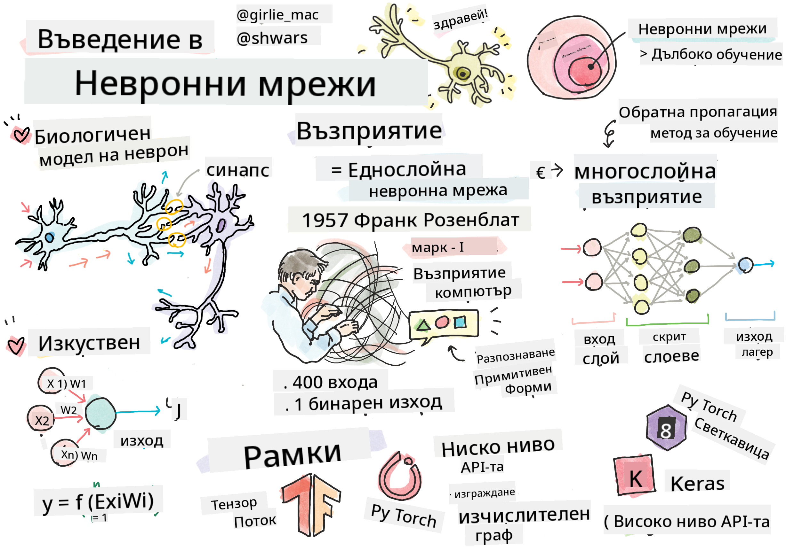
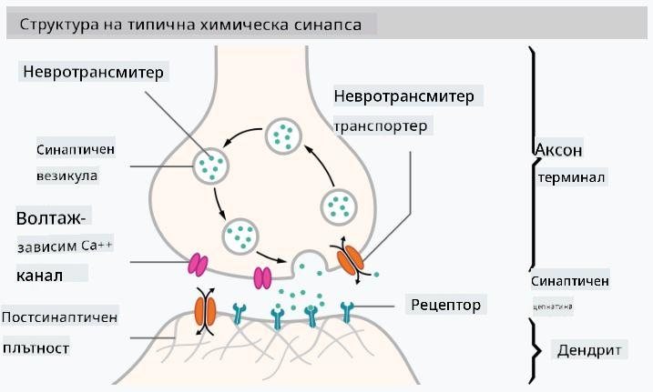

<!--
CO_OP_TRANSLATOR_METADATA:
{
  "original_hash": "5abc5f7978919be90cd313f0c20e8228",
  "translation_date": "2025-09-07T14:36:36+00:00",
  "source_file": "lessons/3-NeuralNetworks/README.md",
  "language_code": "bg"
}
-->
# Въведение в невронните мрежи

Както обсъдихме във въведението, един от начините за постигане на интелигентност е чрез обучение на **компютърен модел** или **изкуствен мозък**. От средата на 20-ти век изследователите опитват различни математически модели, докато през последните години този подход се оказа изключително успешен. Такива математически модели на мозъка се наричат **невронни мрежи**.

> Понякога невронните мрежи се наричат *Изкуствени невронни мрежи* (Artificial Neural Networks, ANNs), за да се подчертае, че става въпрос за модели, а не за реални мрежи от неврони.

## Машинно обучение

Невронните мрежи са част от по-голяма дисциплина, наречена **Машинно обучение**, чиято цел е да използва данни за обучение на компютърни модели, способни да решават проблеми. Машинното обучение представлява значителна част от изкуствения интелект, но в тази учебна програма няма да разглеждаме класическо машинно обучение.

> Посетете нашата отделна учебна програма **[Машинно обучение за начинаещи](http://github.com/microsoft/ml-for-beginners)**, за да научите повече за класическото машинно обучение.

В машинното обучение приемаме, че разполагаме с някакъв набор от примери **X** и съответстващи изходни стойности **Y**. Примерите често са N-мерни вектори, състоящи се от **характеристики**, а изходите се наричат **етикети**.

Ще разгледаме двата най-често срещани проблема в машинното обучение:

* **Класификация**, при която трябва да класифицираме входен обект в две или повече категории.
* **Регресия**, при която трябва да предвидим числова стойност за всеки от входните примери.

> Когато представяме входовете и изходите като тензори, входният набор от данни е матрица с размер M×N, където M е броят на примерите, а N е броят на характеристиките. Изходните етикети Y са вектор с размер M.

В тази учебна програма ще се фокусираме само върху модели на невронни мрежи.

## Модел на неврон

От биологията знаем, че нашият мозък се състои от невронни клетки, всяка от които има множество "входове" (аксони) и един изход (дендрит). Аксоните и дендритите могат да провеждат електрически сигнали, а връзките между тях могат да имат различна степен на проводимост (контролирана от невромедиатори).

 | 
----|----
Реален неврон *([Изображение](https://en.wikipedia.org/wiki/Synapse#/media/File:SynapseSchematic_lines.svg) от Wikipedia)* | Изкуствен неврон *(Изображение от автора)*

Следователно, най-простият математически модел на неврон съдържа няколко входа X1, ..., XN и един изход Y, както и серия от тегла W1, ..., WN. Изходът се изчислява като:

където f е някаква нелинейна **активационна функция**.

> Ранните модели на неврон са описани в класическата статия [A logical calculus of the ideas immanent in nervous activity](https://www.cs.cmu.edu/~./epxing/Class/10715/reading/McCulloch.and.Pitts.pdf) от Уорън Маккълок и Уолтър Питс през 1943 г. Доналд Хеб в своята книга "[The Organization of Behavior: A Neuropsychological Theory](https://books.google.com/books?id=VNetYrB8EBoC)" предлага начин за обучение на тези мрежи.

## В тази секция

В тази секция ще научим за:
* [Перцептрон](03-Perceptron/README.md), един от най-ранните модели на невронни мрежи за класификация с две категории
* [Многослойни мрежи](04-OwnFramework/README.md) с придружаващ бележник [как да изградим собствена рамка](04-OwnFramework/OwnFramework.ipynb)
* [Рамки за невронни мрежи](05-Frameworks/README.md), с тези бележници: [PyTorch](05-Frameworks/IntroPyTorch.ipynb) и [Keras/Tensorflow](05-Frameworks/IntroKerasTF.ipynb)
* [Пренасищане](../../../../lessons/3-NeuralNetworks/05-Frameworks)

---

**Отказ от отговорност**:  
Този документ е преведен с помощта на AI услуга за превод [Co-op Translator](https://github.com/Azure/co-op-translator). Въпреки че се стремим към точност, моля, имайте предвид, че автоматизираните преводи може да съдържат грешки или неточности. Оригиналният документ на неговия роден език трябва да се счита за авторитетен източник. За критична информация се препоръчва професионален човешки превод. Ние не носим отговорност за недоразумения или погрешни интерпретации, произтичащи от използването на този превод.