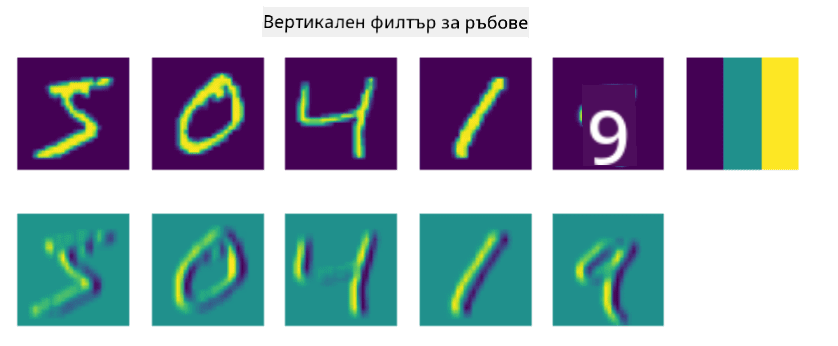
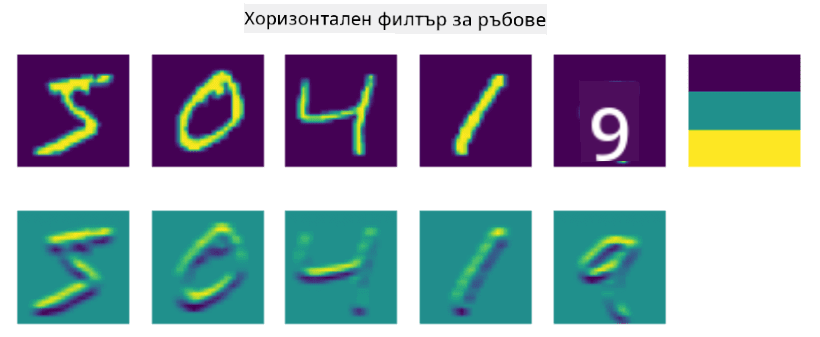
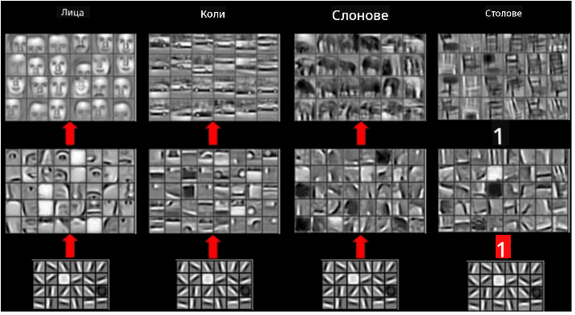

<!--
CO_OP_TRANSLATOR_METADATA:
{
  "original_hash": "088837b42b7d99198bf62db8a42411e0",
  "translation_date": "2025-08-25T22:52:34+00:00",
  "source_file": "lessons/4-ComputerVision/07-ConvNets/README.md",
  "language_code": "bg"
}
-->
# Конволюционни невронни мрежи

Вече видяхме, че невронните мрежи са доста добри в работата с изображения, и дори еднослоен перцептрон може да разпознава ръкописни цифри от набора данни MNIST с приемлива точност. Въпреки това, MNIST е много специален набор от данни, където всички цифри са центрирани в изображението, което прави задачата по-лесна.

## [Тест преди лекцията](https://ff-quizzes.netlify.app/en/ai/quiz/13)

В реалния живот искаме да можем да разпознаваме обекти на изображение, независимо от тяхното точно местоположение. Компютърното зрение е различно от обикновената класификация, защото когато се опитваме да намерим определен обект в изображението, ние сканираме изображението, търсейки специфични **модели** и техните комбинации. Например, когато търсим котка, първо може да търсим хоризонтални линии, които могат да формират мустаци, а след това определена комбинация от мустаци може да ни подскаже, че това всъщност е изображение на котка. Относителната позиция и наличието на определени модели са важни, а не тяхното точно местоположение в изображението.

За да извлечем модели, ще използваме понятието за **конволюционни филтри**. Както знаете, изображението се представя чрез 2D-матрица или 3D-тензор с цветова дълбочина. Прилагането на филтър означава, че вземаме сравнително малка матрица, наречена **ядро на филтъра**, и за всеки пиксел в оригиналното изображение изчисляваме претегленото средно с околните точки. Можем да си представим това като малък прозорец, който се плъзга по цялото изображение и осреднява всички пиксели според теглата в матрицата на ядрото на филтъра.

 | 
----|----

> Изображение от Дмитрий Сошников

Например, ако приложим 3x3 филтри за вертикални и хоризонтални ръбове към цифрите от MNIST, можем да получим акценти (например високи стойности) там, където има вертикални и хоризонтални ръбове в оригиналното изображение. Така тези два филтъра могат да се използват за "търсене" на ръбове. По същия начин можем да проектираме различни филтри, за да търсим други нискоуровневи модели:

> Изображение на [Leung-Malik Filter Bank](https://www.robots.ox.ac.uk/~vgg/research/texclass/filters.html)

Въпреки това, докато можем ръчно да проектираме филтри за извличане на определени модели, можем също така да проектираме мрежата така, че тя да научава моделите автоматично. Това е една от основните идеи зад CNN.

## Основни идеи зад CNN

Работата на CNN се основава на следните важни идеи:

* Конволюционните филтри могат да извличат модели
* Можем да проектираме мрежата така, че филтрите да се обучават автоматично
* Можем да използваме същия подход, за да намираме модели в характеристики на високо ниво, а не само в оригиналното изображение. Така извличането на характеристики в CNN работи на йерархия от характеристики, започвайки от нискоуровневи комбинации от пиксели до по-високо ниво комбинации от части на изображението.

> Изображение от [статия на Hislop-Lynch](https://www.semanticscholar.org/paper/Computer-vision-based-pedestrian-trajectory-Hislop-Lynch/26e6f74853fc9bbb7487b06dc2cf095d36c9021d), базирано на [тяхното изследване](https://dl.acm.org/doi/abs/10.1145/1553374.1553453)

## ✍️ Упражнения: Конволюционни невронни мрежи

Нека продължим да изследваме как работят конволюционните невронни мрежи и как можем да постигнем обучаеми филтри, като преминем през съответните тетрадки:

* [Конволюционни невронни мрежи - PyTorch](../../../../../lessons/4-ComputerVision/07-ConvNets/ConvNetsPyTorch.ipynb)
* [Конволюционни невронни мрежи - TensorFlow](../../../../../lessons/4-ComputerVision/07-ConvNets/ConvNetsTF.ipynb)

## Пирамидална архитектура

Повечето CNN, използвани за обработка на изображения, следват така наречената пирамидална архитектура. Първият конволюционен слой, приложен към оригиналните изображения, обикновено има сравнително малък брой филтри (8-16), които съответстват на различни комбинации от пиксели, като хоризонтални/вертикални линии или щрихи. На следващото ниво намаляваме пространственото измерение на мрежата и увеличаваме броя на филтрите, което съответства на повече възможни комбинации от прости характеристики. С всеки слой, докато се придвижваме към крайния класификатор, пространствените измерения на изображението намаляват, а броят на филтрите нараства.

Като пример, нека разгледаме архитектурата на VGG-16, мрежа, която постигна 92.7% точност в класификацията на ImageNet в топ-5 през 2014 г.:

> Изображение от [Researchgate](https://www.researchgate.net/figure/Vgg16-model-structure-To-get-the-VGG-NIN-model-we-replace-the-2-nd-4-th-6-th-7-th_fig2_335194493)

## Най-известни архитектури на CNN

[Продължете изучаването на най-известните архитектури на CNN](CNN_Architectures.md)

**Отказ от отговорност**:  
Този документ е преведен с помощта на AI услуга за превод [Co-op Translator](https://github.com/Azure/co-op-translator). Въпреки че се стремим към точност, моля, имайте предвид, че автоматизираните преводи може да съдържат грешки или неточности. Оригиналният документ на неговия роден език трябва да се счита за авторитетен източник. За критична информация се препоръчва професионален човешки превод. Не носим отговорност за недоразумения или погрешни интерпретации, произтичащи от използването на този превод.