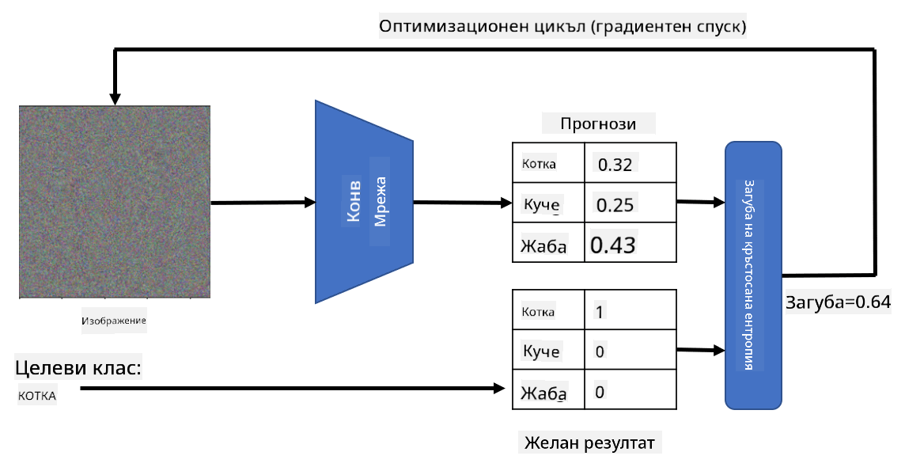
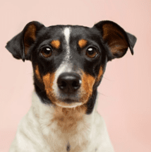

<!--
CO_OP_TRANSLATOR_METADATA:
{
  "original_hash": "178c0b5ee5395733eb18aec51e71a0a9",
  "translation_date": "2025-09-23T14:26:57+00:00",
  "source_file": "lessons/4-ComputerVision/08-TransferLearning/README.md",
  "language_code": "bg"
}
-->
# Предварително обучени мрежи и трансферно обучение

Обучението на CNN може да отнеме много време и изисква голямо количество данни. Въпреки това, голяма част от времето се отделя за научаване на най-добрите нискоуровневи филтри, които мрежата може да използва за извличане на модели от изображения. Възниква естествен въпрос - можем ли да използваме невронна мрежа, обучена върху един набор от данни, и да я адаптираме за класифициране на различни изображения, без да е необходим пълен процес на обучение?

## [Тест преди лекцията](https://ff-quizzes.netlify.app/en/ai/quiz/15)

Този подход се нарича **трансферно обучение**, защото прехвърляме част от знанията от един модел на невронна мрежа към друг. При трансферното обучение обикновено започваме с предварително обучен модел, който е обучен върху голям набор от изображения, като например **ImageNet**. Тези модели вече могат да извличат различни характеристики от общи изображения, а в много случаи само изграждането на класификатор върху тези извлечени характеристики може да даде добри резултати.

> ✅ Трансферното обучение е термин, който се среща и в други академични области, като например образованието. Той се отнася до процеса на пренасяне на знания от една област и прилагането им в друга.

## Предварително обучени модели като екстрактори на характеристики

Конволюционните мрежи, за които говорихме в предишния раздел, съдържат редица слоеве, всеки от които трябва да извлича определени характеристики от изображението, започвайки от нискоуровневи комбинации от пиксели (като хоризонтални/вертикални линии или щрихи), до по-високоуровневи комбинации от характеристики, съответстващи на неща като око на пламък. Ако обучим CNN върху достатъчно голям набор от общи и разнообразни изображения, мрежата би трябвало да се научи да извлича тези общи характеристики.

Както Keras, така и PyTorch съдържат функции за лесно зареждане на предварително обучени тегла на невронни мрежи за някои често срещани архитектури, повечето от които са обучени върху изображения от ImageNet. Най-често използваните са описани на страницата [CNN Architectures](../07-ConvNets/CNN_Architectures.md) от предишния урок. По-специално, може да обмислите използването на някоя от следните:

* **VGG-16/VGG-19**, които са сравнително прости модели, но все пак дават добра точност. Често използването на VGG като първи опит е добър избор, за да видите как работи трансферното обучение.
* **ResNet** е семейство модели, предложени от Microsoft Research през 2015 г. Те имат повече слоеве и следователно изискват повече ресурси.
* **MobileNet** е семейство модели с намален размер, подходящи за мобилни устройства. Използвайте ги, ако разполагате с ограничени ресурси и можете да жертвате малко точност.

Ето примерни характеристики, извлечени от снимка на котка от мрежата VGG-16:

## Набор от данни за котки и кучета

В този пример ще използваме набор от данни за [котки и кучета](https://www.microsoft.com/download/details.aspx?id=54765&WT.mc_id=academic-77998-cacaste), който е много близък до реален сценарий за класификация на изображения.

## ✍️ Упражнение: Трансферно обучение

Нека видим трансферното обучение в действие в съответните ноутбуци:

* [Трансферно обучение - PyTorch](TransferLearningPyTorch.ipynb)
* [Трансферно обучение - TensorFlow](TransferLearningTF.ipynb)

## Визуализиране на идеална котка

Предварително обучената невронна мрежа съдържа различни модели в своята *"мозъчна структура"*, включително представи за **идеална котка** (както и идеално куче, идеална зебра и т.н.). Би било интересно да визуализираме това изображение. Въпреки това, това не е лесно, защото моделите са разпръснати из теглата на мрежата и са организирани в йерархична структура.

Един подход, който можем да използваме, е да започнем с произволно изображение и след това да използваме техниката **оптимизация чрез градиентен спуск**, за да го коригираме така, че мрежата да започне да мисли, че това е котка.

Ако направим това, ще получим нещо много подобно на случаен шум. Това е така, защото *има много начини мрежата да мисли, че входното изображение е котка*, включително такива, които визуално не изглеждат логични. Докато тези изображения съдържат много модели, типични за котка, няма нищо, което да ги ограничава да бъдат визуално разпознаваеми.

За да подобрим резултата, можем да добавим друг термин към функцията за загуба, наречен **variation loss**. Това е метрика, която показва колко сходни са съседните пиксели на изображението. Минимизирането на variation loss прави изображението по-гладко и премахва шума, разкривайки по-визуално привлекателни модели. Ето пример за такива "идеални" изображения, които се класифицират като котка и като зебра с висока вероятност:

 | 
-----|-----
*Идеална котка* | *Идеална зебра*

Подобен подход може да се използва за извършване на така наречените **адверсариални атаки** върху невронна мрежа. Да предположим, че искаме да заблудим невронната мрежа и да направим така, че куче да изглежда като котка. Ако вземем изображение на куче, което мрежата разпознава като куче, можем да го коригираме малко чрез оптимизация с градиентен спуск, докато мрежата започне да го класифицира като котка:

 | 
-----|-----
*Оригинална снимка на куче* | *Снимка на куче, класифицирано като котка*

Вижте кода за възпроизвеждане на горните резултати в следния ноутбук:

* [Идеална и адверсариална котка - TensorFlow](AdversarialCat_TF.ipynb)

## Заключение

С помощта на трансферно обучение можете бързо да създадете класификатор за задача за класификация на обекти и да постигнете висока точност. Виждате, че по-сложните задачи, които решаваме сега, изискват по-голяма изчислителна мощност и не могат лесно да бъдат решени на CPU. В следващия модул ще се опитаме да използваме по-лека имплементация, за да обучим същия модел с по-ниски изчислителни ресурси, което води до само леко намаляване на точността.

## 🚀 Предизвикателство

В съпътстващите ноутбуци има бележки в края за това как трансферното обучение работи най-добре с донякъде подобни тренировъчни данни (например нов вид животно). Направете експерименти с напълно нови типове изображения, за да видите колко добре или зле се представят вашите модели за трансферно обучение.

## [Тест след лекцията](https://ff-quizzes.netlify.app/en/ai/quiz/16)

## Преглед и самостоятелно обучение

Прочетете [TrainingTricks.md](TrainingTricks.md), за да задълбочите знанията си за други начини за обучение на вашите модели.

## [Задание](lab/README.md)

В тази лаборатория ще използваме реалния набор от данни [Oxford-IIIT](https://www.robots.ox.ac.uk/~vgg/data/pets/) за домашни любимци с 35 породи котки и кучета и ще изградим класификатор с трансферно обучение.

---

