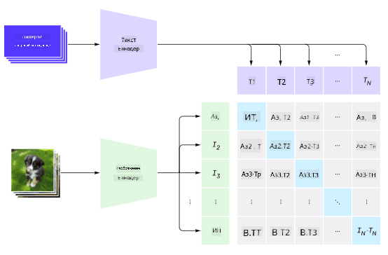
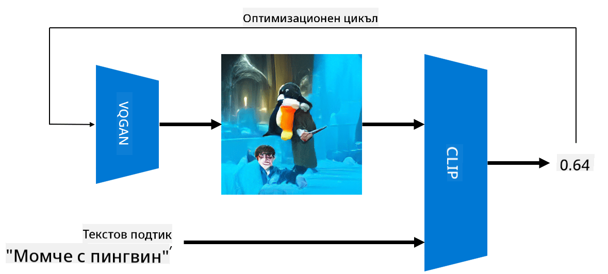

<!--
CO_OP_TRANSLATOR_METADATA:
{
  "original_hash": "9c592c26aca16ca085d268c732284187",
  "translation_date": "2025-08-25T23:38:21+00:00",
  "source_file": "lessons/X-Extras/X1-MultiModal/README.md",
  "language_code": "bg"
}
-->
# Мултимодални мрежи

След успеха на трансформър моделите за решаване на задачи в обработката на естествен език (NLP), същите или подобни архитектури започнаха да се прилагат и за задачи в компютърното зрение. Нараства интересът към създаването на модели, които да *комбинират* възможностите на зрението и естествения език. Един от тези опити е направен от OpenAI и се нарича CLIP и DALL.E.

## Контрастивно предварително обучение на изображения (CLIP)

Основната идея на CLIP е да може да сравнява текстови подсказки с изображение и да определя доколко изображението съответства на подсказката.

> *Снимка от [тази публикация в блог](https://openai.com/blog/clip/)*

Моделът е обучен върху изображения, получени от интернет, и техните описания. За всеки пакет вземаме N двойки (изображение, текст) и ги преобразуваме в някакви векторни представяния I, ..., T. 

Тези представяния след това се съпоставят едно с друго. Функцията на загуба е дефинирана така, че да максимизира косинусната сходство между векторите, съответстващи на една двойка (например I и T), и да минимизира косинусната сходство между всички останали двойки. Именно затова този подход се нарича **контрастивен**.

Моделът/библиотеката CLIP е достъпна от [GitHub на OpenAI](https://github.com/openai/CLIP). Подходът е описан в [тази публикация в блог](https://openai.com/blog/clip/) и по-подробно в [тази статия](https://arxiv.org/pdf/2103.00020.pdf).

След като този модел е предварително обучен, можем да му подадем пакет от изображения и пакет от текстови подсказки, и той ще върне тензор с вероятности. CLIP може да се използва за няколко задачи:

**Класификация на изображения**

Да предположим, че трябва да класифицираме изображения между, например, котки, кучета и хора. В този случай можем да подадем на модела изображение и серия от текстови подсказки: "*снимка на котка*", "*снимка на куче*", "*снимка на човек*". В получения вектор от 3 вероятности просто трябва да изберем индекса с най-висока стойност.

> *Снимка от [тази публикация в блог](https://openai.com/blog/clip/)*

**Търсене на изображения по текст**

Можем също да направим обратното. Ако имаме колекция от изображения, можем да подадем тази колекция на модела и текстова подсказка – това ще ни даде изображението, което е най-сходно с дадената подсказка.

## ✍️ Пример: [Използване на CLIP за класификация на изображения и търсене на изображения](../../../../../lessons/X-Extras/X1-MultiModal/Clip.ipynb)

Отворете [Clip.ipynb](../../../../../lessons/X-Extras/X1-MultiModal/Clip.ipynb), за да видите CLIP в действие.

## Генериране на изображения с VQGAN+CLIP

CLIP може също да се използва за **генериране на изображения** от текстова подсказка. За да направим това, ни е необходим **генеративен модел**, който може да генерира изображения на базата на някакъв входен вектор. Един от тези модели се нарича [VQGAN](https://compvis.github.io/taming-transformers/) (Vector-Quantized GAN).

Основните идеи на VQGAN, които го отличават от обикновените [GAN](../../4-ComputerVision/10-GANs/README.md), са следните:
* Използване на авторегресивна трансформър архитектура за генериране на последователност от контекстуално богати визуални части, които съставят изображението. Тези визуални части се изучават от [CNN](../../4-ComputerVision/07-ConvNets/README.md).
* Използване на дискриминатор за под-изображения, който открива дали частите на изображението са "истински" или "фалшиви" (за разлика от подхода "всичко или нищо" в традиционните GAN).

Научете повече за VQGAN на уебсайта [Taming Transformers](https://compvis.github.io/taming-transformers/).

Една от важните разлики между VQGAN и традиционните GAN е, че последните могат да произведат прилично изображение от всеки входен вектор, докато VQGAN е по-вероятно да произведе изображение, което не е кохерентно. Затова трябва допълнително да насочим процеса на създаване на изображението, което може да се направи с помощта на CLIP.

За да генерираме изображение, съответстващо на текстова подсказка, започваме с някакъв случаен вектор за кодиране, който се подава през VQGAN, за да се произведе изображение. След това CLIP се използва за създаване на функция на загуба, която показва доколко изображението съответства на текстовата подсказка. Целта е да минимизираме тази загуба, използвайки обратна пропагация за настройка на параметрите на входния вектор.

Отлична библиотека, която реализира VQGAN+CLIP, е [Pixray](http://github.com/pixray/pixray).

 |   | 
----|----|----
Снимка, генерирана от подсказка *близък акварелен портрет на млад мъж учител по литература с книга* | Снимка, генерирана от подсказка *близък маслен портрет на млада жена учител по компютърни науки с компютър* | Снимка, генерирана от подсказка *близък маслен портрет на възрастен мъж учител по математика пред черна дъска*

> Снимки от колекцията **Изкуствени учители** на [Дмитрий Сошников](http://soshnikov.com)

## DALL-E
### [DALL-E 1](https://openai.com/research/dall-e)
DALL-E е версия на GPT-3, обучена да генерира изображения от текстови подсказки. Тя е обучена с 12 милиарда параметъра.

За разлика от CLIP, DALL-E получава както текст, така и изображение като един поток от токени за изображения и текст. Следователно, от множество подсказки можете да генерирате изображения на базата на текста.

### [DALL-E 2](https://openai.com/dall-e-2)
Основната разлика между DALL.E 1 и 2 е, че вторият генерира по-реалистични изображения и изкуство.

Примери за генериране на изображения с DALL-E:
 |   | 
----|----|----
Снимка, генерирана от подсказка *близък акварелен портрет на млад мъж учител по литература с книга* | Снимка, генерирана от подсказка *близък маслен портрет на млада жена учител по компютърни науки с компютър* | Снимка, генерирана от подсказка *близък маслен портрет на възрастен мъж учител по математика пред черна дъска*

## Референции

* Статия за VQGAN: [Taming Transformers for High-Resolution Image Synthesis](https://compvis.github.io/taming-transformers/paper/paper.pdf)
* Статия за CLIP: [Learning Transferable Visual Models From Natural Language Supervision](https://arxiv.org/pdf/2103.00020.pdf)

**Отказ от отговорност**:  
Този документ е преведен с помощта на AI услуга за превод [Co-op Translator](https://github.com/Azure/co-op-translator). Въпреки че се стремим към точност, моля, имайте предвид, че автоматизираните преводи може да съдържат грешки или неточности. Оригиналният документ на неговия роден език трябва да се счита за авторитетен източник. За критична информация се препоръчва професионален човешки превод. Не носим отговорност за недоразумения или погрешни интерпретации, произтичащи от използването на този превод.