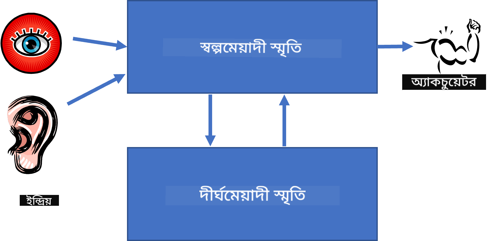
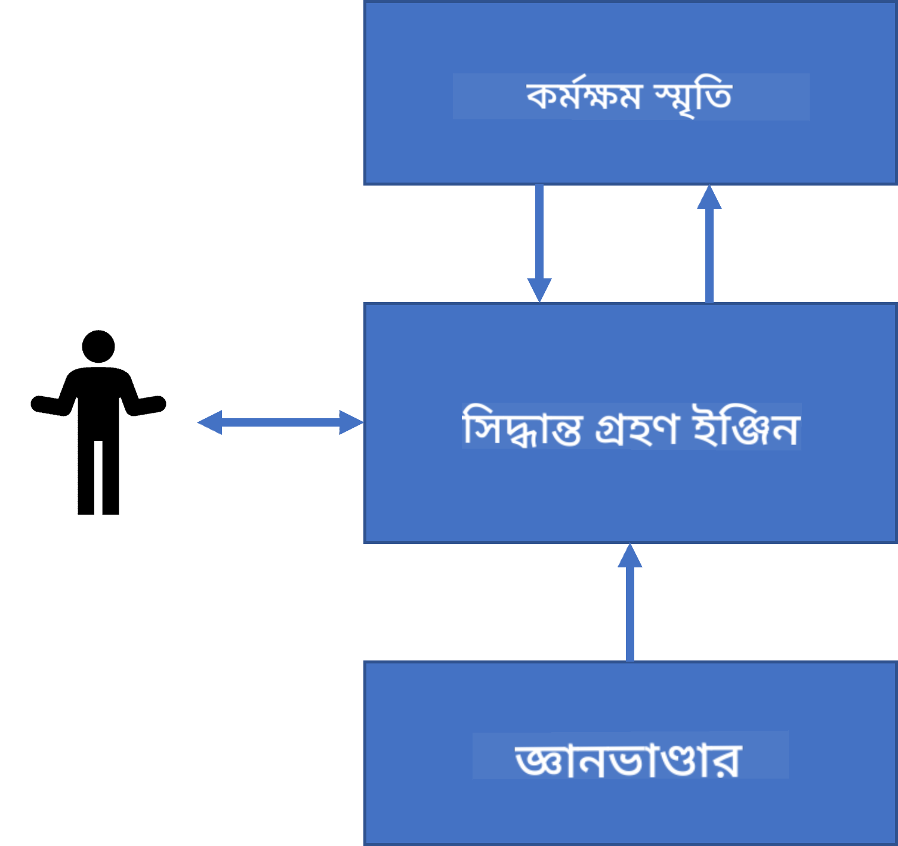
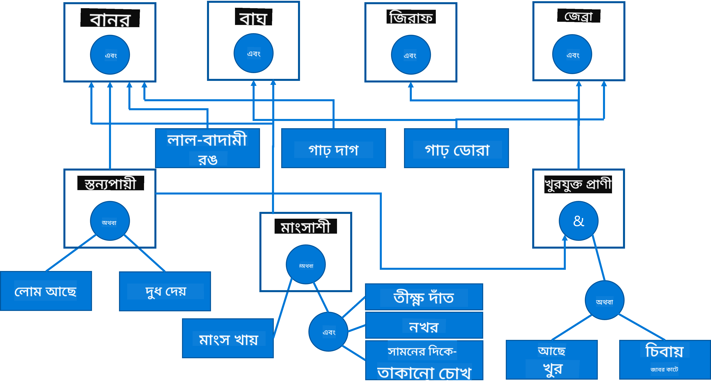

<!--
CO_OP_TRANSLATOR_METADATA:
{
  "original_hash": "98c5222ff9556b55223fed2337145e18",
  "translation_date": "2025-08-26T10:57:37+00:00",
  "source_file": "lessons/2-Symbolic/README.md",
  "language_code": "bn"
}
-->
# জ্ঞান উপস্থাপন এবং বিশেষজ্ঞ সিস্টেম


> স্কেচনোট: [Tomomi Imura](https://twitter.com/girlie_mac)

কৃত্রিম বুদ্ধিমত্তার অনুসন্ধান মূলত জ্ঞান অর্জনের উপর ভিত্তি করে, যা মানুষের মতো পৃথিবীকে বোঝার চেষ্টা করে। কিন্তু এটি কীভাবে করা সম্ভব?

## [পূর্ব-লেকচার কুইজ](https://ff-quizzes.netlify.app/en/ai/quiz/3)

AI-এর প্রাথমিক দিনগুলোতে, বুদ্ধিমান সিস্টেম তৈরির জন্য টপ-ডাউন পদ্ধতি (পূর্ববর্তী পাঠে আলোচনা করা হয়েছে) জনপ্রিয় ছিল। ধারণাটি ছিল মানুষের কাছ থেকে জ্ঞান সংগ্রহ করে তা মেশিন-পঠনযোগ্য আকারে রূপান্তর করা এবং তারপর এটি ব্যবহার করে স্বয়ংক্রিয়ভাবে সমস্যার সমাধান করা। এই পদ্ধতি দুটি বড় ধারণার উপর ভিত্তি করে ছিল:

* জ্ঞান উপস্থাপন
* যুক্তি

## জ্ঞান উপস্থাপন

সিম্বলিক AI-এর একটি গুরুত্বপূর্ণ ধারণা হল **জ্ঞান**। এটি *তথ্য* বা *ডেটা* থেকে জ্ঞানকে আলাদা করা গুরুত্বপূর্ণ। উদাহরণস্বরূপ, কেউ বলতে পারে যে বইগুলো জ্ঞান ধারণ করে, কারণ বই পড়ে একজন বিশেষজ্ঞ হতে পারে। তবে, বইগুলো আসলে *ডেটা* ধারণ করে, এবং বই পড়ে এবং এই ডেটাকে আমাদের বিশ্ব মডেলে সংযুক্ত করে আমরা এই ডেটাকে জ্ঞানে রূপান্তর করি।

> ✅ **জ্ঞান** হল এমন কিছু যা আমাদের মাথায় থাকে এবং আমাদের পৃথিবী সম্পর্কে বোঝার প্রতিনিধিত্ব করে। এটি একটি সক্রিয় **শেখার** প্রক্রিয়ার মাধ্যমে অর্জিত হয়, যা আমরা যে তথ্য পাই তা আমাদের সক্রিয় বিশ্ব মডেলে সংযুক্ত করে।

প্রায়শই, আমরা জ্ঞানকে কঠোরভাবে সংজ্ঞায়িত করি না, তবে আমরা এটি অন্যান্য সম্পর্কিত ধারণার সাথে [DIKW Pyramid](https://en.wikipedia.org/wiki/DIKW_pyramid) ব্যবহার করে সামঞ্জস্য করি। এতে নিম্নলিখিত ধারণাগুলো অন্তর্ভুক্ত:

* **ডেটা** হল এমন কিছু যা শারীরিক মাধ্যমে উপস্থাপিত হয়, যেমন লেখা টেক্সট বা কথিত শব্দ। ডেটা মানুষের থেকে স্বাধীনভাবে বিদ্যমান এবং এটি মানুষের মধ্যে স্থানান্তরিত হতে পারে।
* **তথ্য** হল আমাদের মাথায় ডেটার ব্যাখ্যা। উদাহরণস্বরূপ, যখন আমরা *কম্পিউটার* শব্দটি শুনি, তখন আমাদের কিছু ধারণা থাকে এটি কী।
* **জ্ঞান** হল তথ্যকে আমাদের বিশ্ব মডেলে সংযুক্ত করার প্রক্রিয়া। উদাহরণস্বরূপ, একবার আমরা শিখি যে কম্পিউটার কী, তখন আমরা এটি কীভাবে কাজ করে, এর দাম কত এবং এটি কী কাজে ব্যবহার করা যায় তা সম্পর্কে ধারণা পেতে শুরু করি। এই আন্তঃসম্পর্কিত ধারণাগুলোর নেটওয়ার্ক আমাদের জ্ঞান গঠন করে।
* **বুদ্ধিমত্তা** হল আমাদের পৃথিবী সম্পর্কে বোঝার আরও একটি স্তর, এবং এটি *মেটা-জ্ঞান* প্রতিনিধিত্ব করে, যেমন জ্ঞান কীভাবে এবং কখন ব্যবহার করা উচিত তা সম্পর্কে ধারণা।

*Image [from Wikipedia](https://commons.wikimedia.org/w/index.php?curid=37705247), By Longlivetheux - Own work, CC BY-SA 4.0*

তাই, **জ্ঞান উপস্থাপনের** সমস্যাটি হল কম্পিউটারের ভিতরে ডেটার আকারে জ্ঞান উপস্থাপন করার একটি কার্যকর উপায় খুঁজে বের করা, যাতে এটি স্বয়ংক্রিয়ভাবে ব্যবহারযোগ্য হয়। এটি একটি স্পেকট্রামের মতো দেখা যেতে পারে:


> চিত্র: [Dmitry Soshnikov](http://soshnikov.com)

* বাম দিকে, খুব সহজ ধরনের জ্ঞান উপস্থাপন রয়েছে যা কম্পিউটার দ্বারা কার্যকরভাবে ব্যবহার করা যেতে পারে। সবচেয়ে সহজটি হল অ্যালগরিদমিক, যেখানে জ্ঞান একটি কম্পিউটার প্রোগ্রামের মাধ্যমে উপস্থাপিত হয়। তবে, এটি জ্ঞান উপস্থাপনের সেরা উপায় নয়, কারণ এটি নমনীয় নয়। আমাদের মাথার ভিতরে থাকা জ্ঞান প্রায়ই অ্যালগরিদমিক নয়।
* ডান দিকে, প্রাকৃতিক টেক্সটের মতো উপস্থাপন রয়েছে। এটি সবচেয়ে শক্তিশালী, তবে স্বয়ংক্রিয় যুক্তির জন্য ব্যবহার করা যায় না।

> ✅ এক মিনিটের জন্য ভাবুন আপনি কীভাবে আপনার মাথার ভিতরে জ্ঞান উপস্থাপন করেন এবং এটি নোটে রূপান্তর করেন। আপনার জন্য কোন নির্দিষ্ট ফরম্যাটটি ভালো কাজ করে যা স্মৃতিশক্তি বাড়াতে সাহায্য করে?

## কম্পিউটার জ্ঞান উপস্থাপনের শ্রেণীবিন্যাস

আমরা কম্পিউটার জ্ঞান উপস্থাপনের বিভিন্ন পদ্ধতিকে নিম্নলিখিত বিভাগে শ্রেণীবদ্ধ করতে পারি:

* **নেটওয়ার্ক উপস্থাপন** আমাদের মাথার ভিতরে আন্তঃসম্পর্কিত ধারণার একটি নেটওয়ার্ক থাকার উপর ভিত্তি করে। আমরা একই নেটওয়ার্ককে কম্পিউটারের ভিতরে একটি গ্রাফ হিসাবে পুনরুত্পাদন করতে পারি - একটি **সেমান্টিক নেটওয়ার্ক**।

1. **অবজেক্ট-অ্যাট্রিবিউট-ভ্যালু ট্রিপলেট** বা **অ্যাট্রিবিউট-ভ্যালু পেয়ার**। যেহেতু একটি গ্রাফ কম্পিউটারের ভিতরে নোড এবং এজের তালিকা হিসাবে উপস্থাপিত হতে পারে, আমরা একটি সেমান্টিক নেটওয়ার্ককে একটি ট্রিপলেটের তালিকা হিসাবে উপস্থাপন করতে পারি, যাতে অবজেক্ট, অ্যাট্রিবিউট এবং মান থাকে। উদাহরণস্বরূপ, আমরা প্রোগ্রামিং ভাষা সম্পর্কে নিম্নলিখিত ট্রিপলেট তৈরি করি:

Object | Attribute | Value
-------|-----------|------
Python | is | Untyped-Language
Python | invented-by | Guido van Rossum
Python | block-syntax | indentation
Untyped-Language | doesn't have | type definitions

> ✅ ভাবুন কীভাবে ট্রিপলেটগুলো অন্যান্য ধরনের জ্ঞান উপস্থাপন করতে ব্যবহার করা যেতে পারে।

2. **হায়ারারকিক্যাল উপস্থাপন** জোর দেয় যে আমরা প্রায়ই আমাদের মাথার ভিতরে অবজেক্টের একটি শ্রেণীবিন্যাস তৈরি করি। উদাহরণস্বরূপ, আমরা জানি যে ক্যানারি একটি পাখি, এবং সব পাখির ডানা থাকে। আমরা ক্যানারির সাধারণত কী রঙ হয় এবং তাদের উড়ার গতি সম্পর্কে কিছু ধারণা রাখি।

   - **ফ্রেম উপস্থাপন** প্রতিটি অবজেক্ট বা অবজেক্টের শ্রেণীকে একটি **ফ্রেম** হিসাবে উপস্থাপন করার উপর ভিত্তি করে, যা **স্লট** ধারণ করে। স্লটগুলোর সম্ভাব্য ডিফল্ট মান, মানের সীমাবদ্ধতা, বা সংরক্ষিত পদ্ধতি থাকতে পারে যা স্লটের মান পেতে ডাকা যেতে পারে। সমস্ত ফ্রেম একটি শ্রেণীবিন্যাস গঠন করে যা অবজেক্ট-ওরিয়েন্টেড প্রোগ্রামিং ভাষার অবজেক্ট শ্রেণীবিন্যাসের অনুরূপ।
   - **সিনারিও** হল বিশেষ ধরনের ফ্রেম যা সময়ের সাথে সাথে unfold হতে পারে এমন জটিল পরিস্থিতি উপস্থাপন করে।

**Python**

Slot | Value | Default value | Interval |
-----|-------|---------------|----------|
Name | Python | | |
Is-A | Untyped-Language | | |
Variable Case | | CamelCase | |
Program Length | | | 5-5000 lines |
Block Syntax | Indent | | |

3. **প্রসিডিউরাল উপস্থাপন** জ্ঞানকে এমন একটি ক্রিয়াকলাপের তালিকা হিসাবে উপস্থাপন করার উপর ভিত্তি করে যা একটি নির্দিষ্ট শর্ত ঘটলে কার্যকর করা যেতে পারে।
   - প্রোডাকশন রুল হলো if-then বিবৃতি যা আমাদের সিদ্ধান্ত নিতে সাহায্য করে। উদাহরণস্বরূপ, একজন ডাক্তারের একটি নিয়ম থাকতে পারে যা বলে যে **যদি** একজন রোগীর উচ্চ জ্বর থাকে **অথবা** রক্ত পরীক্ষায় উচ্চ মাত্রার C-reactive প্রোটিন থাকে **তাহলে** তার প্রদাহ আছে। একবার আমরা শর্তগুলোর মধ্যে একটি পূরণ করলে, আমরা প্রদাহ সম্পর্কে একটি সিদ্ধান্ত নিতে পারি এবং তারপর এটি আরও যুক্তিতে ব্যবহার করতে পারি।
   - অ্যালগরিদমকে প্রসিডিউরাল উপস্থাপনের আরেকটি রূপ হিসাবে বিবেচনা করা যেতে পারে, যদিও সেগুলো প্রায় কখনোই সরাসরি জ্ঞান-ভিত্তিক সিস্টেমে ব্যবহার করা হয় না।

4. **লজিক** মূলত অ্যারিস্টটল দ্বারা প্রস্তাবিত হয়েছিল মানব জ্ঞানকে সর্বজনীনভাবে উপস্থাপন করার একটি উপায় হিসাবে।
   - প্রেডিকেট লজিক একটি গাণিতিক তত্ত্ব হিসাবে খুব সমৃদ্ধ, তাই এটি গণনাযোগ্য নয়। সাধারণত এর কিছু উপসেট ব্যবহার করা হয়, যেমন প্রোলগে ব্যবহৃত হর্ন ক্লজ।
   - ডেসক্রিপটিভ লজিক হল লজিক্যাল সিস্টেমের একটি পরিবার যা অবজেক্টের শ্রেণীবিন্যাস এবং বিতরণকৃত জ্ঞান উপস্থাপন যেমন *সেমান্টিক ওয়েব* সম্পর্কে যুক্তি করতে ব্যবহৃত হয়।

## বিশেষজ্ঞ সিস্টেম

সিম্বলিক AI-এর প্রাথমিক সাফল্যগুলোর মধ্যে একটি ছিল তথাকথিত **বিশেষজ্ঞ সিস্টেম** - কম্পিউটার সিস্টেম যা একটি সীমিত সমস্যার ক্ষেত্রে একজন বিশেষজ্ঞের মতো কাজ করার জন্য ডিজাইন করা হয়েছিল। এগুলো একটি **জ্ঞানভিত্তি** নিয়ে গঠিত ছিল যা একজন বা একাধিক মানব বিশেষজ্ঞ থেকে সংগ্রহ করা হয়েছিল এবং এতে একটি **ইনফারেন্স ইঞ্জিন** ছিল যা এর উপর কিছু যুক্তি সম্পাদন করত।

 | 
---------------------------------------------|------------------------------------------------
মানব স্নায়ুতন্ত্রের সরলীকৃত কাঠামো | জ্ঞান-ভিত্তিক সিস্টেমের স্থাপত্য

বিশেষজ্ঞ সিস্টেমগুলো মানব যুক্তি ব্যবস্থার মতো তৈরি করা হয়, যা **স্বল্পমেয়াদী স্মৃতি** এবং **দীর্ঘমেয়াদী স্মৃতি** ধারণ করে। অনুরূপভাবে, জ্ঞান-ভিত্তিক সিস্টেমে আমরা নিম্নলিখিত উপাদানগুলো আলাদা করি:

* **সমস্যার স্মৃতি**: বর্তমানে সমাধান করা সমস্যার সম্পর্কে জ্ঞান ধারণ করে, যেমন রোগীর তাপমাত্রা বা রক্তচাপ, তার প্রদাহ আছে কিনা ইত্যাদি। এই জ্ঞানকে **স্থির জ্ঞান**ও বলা হয়, কারণ এটি আমরা বর্তমানে সমস্যার সম্পর্কে যা জানি তার একটি স্ন্যাপশট ধারণ করে - তথাকথিত *সমস্যার অবস্থা*।
* **জ্ঞানভিত্তি**: একটি সমস্যার ক্ষেত্র সম্পর্কে দীর্ঘমেয়াদী জ্ঞান উপস্থাপন করে। এটি মানব বিশেষজ্ঞদের থেকে ম্যানুয়ালি সংগ্রহ করা হয় এবং পরামর্শ থেকে পরামর্শে পরিবর্তিত হয় না। কারণ এটি আমাদের একটি সমস্যা অবস্থান থেকে অন্য অবস্থানে নেভিগেট করতে দেয়, এটিকে **গতিশীল জ্ঞান**ও বলা হয়।
* **ইনফারেন্স ইঞ্জিন**: পুরো প্রক্রিয়াটি পরিচালনা করে, প্রয়োজন হলে ব্যবহারকারীর কাছে প্রশ্ন জিজ্ঞাসা করে। এটি প্রতিটি অবস্থায় প্রয়োগ করার জন্য সঠিক নিয়ম খুঁজে বের করার জন্যও দায়ী।

উদাহরণস্বরূপ, চলুন একটি বিশেষজ্ঞ সিস্টেমের কথা বিবেচনা করি যা একটি প্রাণীকে তার শারীরিক বৈশিষ্ট্যের উপর ভিত্তি করে নির্ধারণ করে:



> চিত্র: [Dmitry Soshnikov](http://soshnikov.com)

এই ডায়াগ্রামটি **AND-OR গাছ** নামে পরিচিত, এবং এটি প্রোডাকশন রুলের একটি সেটের গ্রাফিকাল উপস্থাপনা। বিশেষজ্ঞ থেকে জ্ঞান সংগ্রহের শুরুতে একটি গাছ আঁকা উপকারী। কম্পিউটারের ভিতরে জ্ঞান উপস্থাপন করতে নিয়ম ব্যবহার করা আরও সুবিধাজনক:

```
IF the animal eats meat
OR (animal has sharp teeth
    AND animal has claws
    AND animal has forward-looking eyes
) 
THEN the animal is a carnivore
```

আপনি লক্ষ্য করবেন যে নিয়মের বাম দিকের শর্ত এবং ক্রিয়াটি মূলত অবজেক্ট-অ্যাট্রিবিউট-ভ্যালু (OAV) ট্রিপলেট। **ওয়ার্কিং মেমরি** OAV ট্রিপলেটের সেট ধারণ করে যা বর্তমানে সমাধান করা সমস্যার সাথে সম্পর্কিত। একটি **রুলস ইঞ্জিন** এমন নিয়ম খুঁজে বের করে যার শর্ত পূরণ হয়েছে এবং সেগুলো প্রয়োগ করে, ওয়ার্কিং মেমরিতে একটি নতুন ট্রিপলেট যোগ করে।

> ✅ আপনার পছন্দের একটি বিষয় নিয়ে নিজের AND-OR গাছ আঁকুন!

### ফরওয়ার্ড বনাম ব্যাকওয়ার্ড ইনফারেন্স

উপরে বর্ণিত প্রক্রিয়াটি **ফরওয়ার্ড ইনফারেন্স** নামে পরিচিত। এটি ওয়ার্কিং মেমরিতে সমস্যার প্রাথমিক ডেটা দিয়ে শুরু হয় এবং তারপর নিম্নলিখিত যুক্তি লুপটি কার্যকর করে:

1. যদি লক্ষ্য অ্যাট্রিবিউটটি ওয়ার্কিং মেমরিতে উপস্থিত থাকে - থামুন এবং ফলাফল দিন
2. সমস্ত নিয়ম খুঁজুন যার শর্ত বর্তমানে পূরণ হয়েছে - **কনফ্লিক্ট সেট** পেতে।
3. **কনফ্লিক্ট রেজোলিউশন** সম্পাদন করুন - এই ধাপে কার্যকর করার জন্য একটি নিয়ম নির্বাচন করুন। বিভিন্ন কনফ্লিক্ট রেজোলিউশন কৌশল থাকতে পারে:
   - জ্ঞানভিত্তিতে প্রথম প্রযোজ্য নিয়ম নির্বাচন করুন
   - একটি র্যান্ডম নিয়ম নির্বাচন করুন
   - একটি *আরও নির্দিষ্ট* নিয়ম নির্বাচন করুন, অর্থাৎ বাম দিকের (LHS) সবচেয়ে বেশি শর্ত পূরণ করে এমন নিয়ম
4. নির্বাচিত নিয়ম প্রয়োগ করুন এবং সমস্যার অবস্থায় নতুন জ্ঞানের অংশ যোগ করুন
5. ধাপ 1 থেকে পুনরাবৃত্তি করুন।

তবে, কিছু ক্ষেত্রে আমরা সমস্যার সম্পর্কে শূন্য জ্ঞান দিয়ে শুরু করতে চাই এবং এমন প্রশ্ন জিজ্ঞাসা করতে চাই যা আমাদের সিদ্ধান্তে পৌঁছাতে সাহায্য করবে। উদাহরণস্বরূপ, যখন চিকিৎসা নির্ণয় করা হয়, আমরা সাধারণত রোগীর সমস্ত চিকিৎসা বিশ্লেষণ আগেই সম্পাদন করি না। বরং আমরা সিদ্ধান্ত নেওয়ার সময় বিশ্লেষণ করতে চাই।

এই প্রক্রিয়াটি **ব্যাকওয়ার্ড ইনফারেন্স** ব্যবহার করে মডেল করা যেতে পারে। এটি **লক্ষ্য** দ্বারা চালিত হয় - আমরা যে অ্যাট্রিবিউট মানটি খুঁজে বের করতে চাই:

1. সমস্ত নিয়ম নির্বাচন করুন যা আমাদের লক্ষ্য মান দিতে পারে (অর্থাৎ লক্ষ্যটি ডান দিকের (RHS) অংশে) - একটি কনফ্লিক্ট সেট
1. যদি এই অ্যাট্রিবিউটের জন্য কোনো নিয়ম না থাকে, বা একটি নিয়ম থাকে যা বলে যে আমরা ব্যবহারকারীর কাছ থেকে মান জিজ্ঞাসা করা উচিত - জিজ্ঞাসা করুন, অন্যথায়:
1. কনফ্লিক্ট রেজোলিউশন কৌশল ব্যবহার করে একটি নিয়ম নির্বাচন করুন যা আমরা *হাইপোথিসিস* হিসাবে ব্যবহার করব - আমরা এটি প্রমাণ করার চেষ্টা করব
1. নিয়মের বাম দিকের (LHS) সমস্ত অ্যাট্রিবিউটের জন্য প্রক্রিয়াটি পুনরাবৃত্তি করুন, লক্ষ্য হিসাবে সেগুলো প্রমাণ করার চেষ্টা করুন
1. যদি কোনো সময় প্রক্রিয়াটি ব্যর্থ হয় - ধাপ 3-এ অন্য নিয়ম ব্যবহার করুন।

> ✅ কোন পরিস্থিতিতে ফরওয়ার্ড ইনফারেন্স আরও উপযুক্ত? ব্যাকওয়ার্ড ইনফারেন্স কীভাবে?

### বিশেষজ্ঞ সিস্টেম বাস্তবায়ন

বিশেষজ্ঞ সিস্টেম বিভিন্ন সরঞ্জাম ব্যবহার করে বাস্তবায়ন করা যেতে পারে:

* কিছু উচ্চ-স্তরের প্রোগ্রামিং ভাষায় সরাসরি প্রোগ্রামিং করা। এটি সেরা ধারণা নয়, কারণ একটি জ্ঞান-ভিত্তিক সিস্টেমের প্রধান সুবিধা হল যে জ্ঞান যুক্তি থেকে পৃথক করা হয়, এবং সম্ভাব্যভাবে একটি সমস্যার ক্ষেত্রের বিশেষজ্ঞ নিয়ম লিখতে সক্ষম হওয়া উচিত যুক্তি প্রক্রিয়ার বিশদ না বুঝেই।
* **বিশেষজ্ঞ সিস্টেম শেল** ব্যবহার করা, অর্থাৎ একটি সিস্টেম যা বিশেষভাবে কিছু জ্ঞান উপস্থাপন ভাষা ব্যবহার করে জ্ঞান দ্বারা পূরণ করার জন্য ডিজাইন করা হয়েছে।

## ✍️ অনুশীলন: প্রাণী নির্ণয়

[Animals.ipynb](https://github.com/microsoft/AI-For-Beginners/blob/main/lessons/2-Symbolic/Animals.ipynb) দেখুন ফরওয়ার্ড এবং ব্যাকওয়ার্ড ইনফারেন্স বিশেষজ্ঞ সিস্টেম বাস্তবায়নের একটি উদাহরণের জন্য।
> **নোট**: এই উদাহরণটি বেশ সহজ এবং কেবল একটি বিশেষজ্ঞ সিস্টেম কেমন দেখায় তার ধারণা দেয়। যখন আপনি এমন একটি সিস্টেম তৈরি করা শুরু করবেন, তখন আপনি কেবলমাত্র কিছু *বুদ্ধিমান* আচরণ লক্ষ্য করবেন যখন নিয়মের সংখ্যা একটি নির্দিষ্ট সীমা, প্রায় ২০০+ এ পৌঁছাবে। এক পর্যায়ে, নিয়মগুলো এত জটিল হয়ে যায় যে সবগুলো মনে রাখা কঠিন হয়ে পড়ে, এবং তখন আপনি ভাবতে পারেন কেন সিস্টেমটি নির্দিষ্ট কিছু সিদ্ধান্ত নিচ্ছে। তবে, জ্ঞান-ভিত্তিক সিস্টেমের একটি গুরুত্বপূর্ণ বৈশিষ্ট্য হলো আপনি সবসময় *ব্যাখ্যা* করতে পারবেন ঠিক কীভাবে কোনো সিদ্ধান্ত নেওয়া হয়েছে।
## অন্টোলজি এবং সেমান্টিক ওয়েব

২০শ শতকের শেষের দিকে ইন্টারনেট রিসোর্সগুলোকে জ্ঞান উপস্থাপনার মাধ্যমে এনোটেট করার একটি উদ্যোগ নেওয়া হয়েছিল, যাতে খুব নির্দিষ্ট প্রশ্নের সাথে মিলে যায় এমন রিসোর্স খুঁজে পাওয়া সম্ভব হয়। এই উদ্যোগটিকে **সেমান্টিক ওয়েব** বলা হয়, এবং এটি কয়েকটি ধারণার উপর ভিত্তি করে গড়ে উঠেছিল:

- **[ডিসক্রিপশন লজিকস](https://en.wikipedia.org/wiki/Description_logic)** (DL)-এর উপর ভিত্তি করে একটি বিশেষ জ্ঞান উপস্থাপনা। এটি ফ্রেম জ্ঞান উপস্থাপনার মতো, কারণ এটি বৈশিষ্ট্যসহ বস্তুর একটি শ্রেণিবিন্যাস তৈরি করে, তবে এতে আনুষ্ঠানিক যৌক্তিক অর্থ এবং উপসংহার রয়েছে। DL-এর একটি পুরো পরিবার রয়েছে যা প্রকাশক্ষমতা এবং উপসংহারের অ্যালগরিদমিক জটিলতার মধ্যে ভারসাম্য বজায় রাখে।
- বিতরণকৃত জ্ঞান উপস্থাপনা, যেখানে সমস্ত ধারণা একটি গ্লোবাল URI আইডেন্টিফায়ার দ্বারা উপস্থাপিত হয়, যা ইন্টারনেট জুড়ে জ্ঞান শ্রেণিবিন্যাস তৈরি করা সম্ভব করে।
- জ্ঞান বর্ণনার জন্য XML-ভিত্তিক ভাষার একটি পরিবার: RDF (রিসোর্স ডেসক্রিপশন ফ্রেমওয়ার্ক), RDFS (RDF স্কিমা), OWL (অন্টোলজি ওয়েব ল্যাঙ্গুয়েজ)।

সেমান্টিক ওয়েবের একটি মূল ধারণা হল **অন্টোলজি**। এটি একটি নির্দিষ্ট সমস্যা ক্ষেত্রের আনুষ্ঠানিক জ্ঞান উপস্থাপনার মাধ্যমে স্পষ্ট নির্দিষ্টকরণকে বোঝায়। সবচেয়ে সহজ অন্টোলজি কেবল একটি সমস্যা ক্ষেত্রের বস্তুর শ্রেণিবিন্যাস হতে পারে, তবে আরও জটিল অন্টোলজিগুলিতে এমন নিয়ম অন্তর্ভুক্ত থাকবে যা উপসংহারের জন্য ব্যবহার করা যেতে পারে।

সেমান্টিক ওয়েবে, সমস্ত উপস্থাপনা ট্রিপলেটের উপর ভিত্তি করে। প্রতিটি বস্তু এবং প্রতিটি সম্পর্ক URI দ্বারা অনন্যভাবে চিহ্নিত করা হয়। উদাহরণস্বরূপ, যদি আমরা বলতে চাই যে এই AI কারিকুলামটি দিমিত্রি সশনিকভ দ্বারা ১ জানুয়ারি, ২০২২-এ তৈরি করা হয়েছে - এখানে আমরা যে ট্রিপলেটগুলি ব্যবহার করতে পারি:


```
http://github.com/microsoft/ai-for-beginners http://www.example.com/terms/creation-date “Jan 13, 2007”
http://github.com/microsoft/ai-for-beginners http://purl.org/dc/elements/1.1/creator http://soshnikov.com
```

> ✅ এখানে `http://www.example.com/terms/creation-date` এবং `http://purl.org/dc/elements/1.1/creator` হল *স্রষ্টা* এবং *তৈরির তারিখ* ধারণাগুলি প্রকাশ করার জন্য কিছু সুপরিচিত এবং সর্বজনীনভাবে গৃহীত URI।

আরও জটিল ক্ষেত্রে, যদি আমরা স্রষ্টাদের একটি তালিকা সংজ্ঞায়িত করতে চাই, তবে আমরা RDF-এ সংজ্ঞায়িত কিছু ডেটা স্ট্রাকচার ব্যবহার করতে পারি।


> উপরের ডায়াগ্রাম [দিমিত্রি সশনিকভ](http://soshnikov.com) দ্বারা

সার্চ ইঞ্জিন এবং প্রাকৃতিক ভাষা প্রক্রিয়াকরণ কৌশলগুলির সাফল্যের কারণে, যা পাঠ্য থেকে কাঠামোগত ডেটা বের করতে সক্ষম, সেমান্টিক ওয়েব তৈরির অগ্রগতি কিছুটা ধীর হয়ে যায়। তবে, কিছু ক্ষেত্রে অন্টোলজি এবং জ্ঞানভিত্তি বজায় রাখার জন্য এখনও উল্লেখযোগ্য প্রচেষ্টা রয়েছে। কয়েকটি উল্লেখযোগ্য প্রকল্প:

* [WikiData](https://wikidata.org/) হল উইকিপিডিয়ার সাথে সম্পর্কিত মেশিন-পঠনযোগ্য জ্ঞানভিত্তির একটি সংগ্রহ। বেশিরভাগ ডেটা উইকিপিডিয়ার *ইনফোবক্স* থেকে আহরিত হয়, যা উইকিপিডিয়া পৃষ্ঠাগুলির ভিতরে কাঠামোগত বিষয়বস্তু। আপনি [SPARQL](https://query.wikidata.org/) ব্যবহার করে উইকিডেটা অনুসন্ধান করতে পারেন, যা সেমান্টিক ওয়েবের জন্য একটি বিশেষ অনুসন্ধান ভাষা। এখানে একটি নমুনা অনুসন্ধান রয়েছে যা মানুষের মধ্যে সবচেয়ে জনপ্রিয় চোখের রঙ প্রদর্শন করে:

```sparql
#defaultView:BubbleChart
SELECT ?eyeColorLabel (COUNT(?human) AS ?count)
WHERE
{
  ?human wdt:P31 wd:Q5.       # human instance-of homo sapiens
  ?human wdt:P1340 ?eyeColor. # human eye-color ?eyeColor
  SERVICE wikibase:label { bd:serviceParam wikibase:language "en". }
}
GROUP BY ?eyeColorLabel
```

* [DBpedia](https://www.dbpedia.org/) হল WikiData-এর মতো আরেকটি উদ্যোগ।

> ✅ আপনি যদি নিজের অন্টোলজি তৈরি করতে বা বিদ্যমান অন্টোলজি খুলতে পরীক্ষা করতে চান, তবে [Protégé](https://protege.stanford.edu/) নামে একটি চমৎকার ভিজ্যুয়াল অন্টোলজি এডিটর রয়েছে। এটি ডাউনলোড করুন, অথবা অনলাইনে ব্যবহার করুন।


*ওয়েব প্রোটেজ এডিটর রোমানভ পরিবারের অন্টোলজি সহ খোলা। স্ক্রিনশট দিমিত্রি সশনিকভ দ্বারা*

## ✍️ অনুশীলন: একটি পরিবারের অন্টোলজি

[FamilyOntology.ipynb](https://github.com/Ezana135/AI-For-Beginners/blob/main/lessons/2-Symbolic/FamilyOntology.ipynb) দেখুন, যেখানে সেমান্টিক ওয়েব কৌশল ব্যবহার করে পারিবারিক সম্পর্ক নিয়ে যুক্তি করার একটি উদাহরণ রয়েছে। আমরা GEDCOM ফরম্যাটে উপস্থাপিত একটি পারিবারিক গাছ এবং পারিবারিক সম্পর্কের একটি অন্টোলজি নেব এবং নির্দিষ্ট ব্যক্তিদের জন্য সমস্ত পারিবারিক সম্পর্কের একটি গ্রাফ তৈরি করব।

## মাইক্রোসফট কনসেপ্ট গ্রাফ

অধিকাংশ ক্ষেত্রে, অন্টোলজি সাবধানে হাতে তৈরি করা হয়। তবে, এটি **অসংগঠিত ডেটা** থেকে অন্টোলজি আহরণ করাও সম্ভব, উদাহরণস্বরূপ, প্রাকৃতিক ভাষার পাঠ্য থেকে।

মাইক্রোসফট রিসার্চ একটি এমন প্রচেষ্টা চালিয়েছিল, যার ফলাফল ছিল [Microsoft Concept Graph](https://blogs.microsoft.com/ai/microsoft-researchers-release-graph-that-helps-machines-conceptualize/?WT.mc_id=academic-77998-cacaste)।

এটি একটি বৃহৎ সংগ্রহ, যেখানে `is-a` উত্তরাধিকার সম্পর্ক ব্যবহার করে সত্তাগুলিকে একত্রিত করা হয়েছে। এটি "মাইক্রোসফট কী?" এর মতো প্রশ্নের উত্তর দিতে সক্ষম - যার উত্তর হতে পারে "একটি কোম্পানি (সম্ভাবনা ০.৮৭) এবং একটি ব্র্যান্ড (সম্ভাবনা ০.৭৫)"।

গ্রাফটি REST API বা একটি বড় ডাউনলোডযোগ্য টেক্সট ফাইল হিসাবে উপলব্ধ, যেখানে সমস্ত সত্তা জোড়া তালিকাভুক্ত করা হয়েছে।

## ✍️ অনুশীলন: একটি কনসেপ্ট গ্রাফ

[MSConceptGraph.ipynb](https://github.com/microsoft/AI-For-Beginners/blob/main/lessons/2-Symbolic/MSConceptGraph.ipynb) নোটবুকটি চেষ্টা করুন, যেখানে আমরা কীভাবে মাইক্রোসফট কনসেপ্ট গ্রাফ ব্যবহার করে সংবাদ নিবন্ধগুলোকে বিভিন্ন শ্রেণিতে গোষ্ঠীবদ্ধ করতে পারি তা দেখা যাবে।

## উপসংহার

বর্তমানে, AI প্রায়শই *মেশিন লার্নিং* বা *নিউরাল নেটওয়ার্কস*-এর সমার্থক হিসাবে বিবেচিত হয়। তবে, একজন মানুষ স্পষ্ট যুক্তি প্রদর্শন করে, যা নিউরাল নেটওয়ার্ক দ্বারা বর্তমানে পরিচালিত হয় না। বাস্তব জীবনের প্রকল্পে, স্পষ্ট যুক্তি এখনও এমন কাজ সম্পাদন করতে ব্যবহৃত হয় যা ব্যাখ্যার প্রয়োজন হয়, অথবা সিস্টেমের আচরণকে নিয়ন্ত্রিত উপায়ে পরিবর্তন করার ক্ষমতা প্রয়োজন।

## 🚀 চ্যালেঞ্জ

এই পাঠের সাথে সম্পর্কিত ফ্যামিলি অন্টোলজি নোটবুকে, অন্যান্য পারিবারিক সম্পর্ক নিয়ে পরীক্ষা করার সুযোগ রয়েছে। পারিবারিক গাছে নতুন সংযোগ আবিষ্কার করার চেষ্টা করুন।

## [পোস্ট-লেকচার কুইজ](https://ff-quizzes.netlify.app/en/ai/quiz/4)

## পর্যালোচনা এবং স্ব-অধ্যয়ন

ইন্টারনেটে গবেষণা করুন এবং এমন ক্ষেত্রগুলি আবিষ্কার করুন যেখানে মানুষ জ্ঞান পরিমাপ এবং কোডিফাই করার চেষ্টা করেছে। ব্লুমের ট্যাক্সোনমি দেখুন এবং ইতিহাসে ফিরে যান, যেখানে মানুষ তাদের পৃথিবীকে বোঝার চেষ্টা করেছিল। লিনিয়াসের কাজ দেখুন, যিনি জীবের একটি ট্যাক্সোনমি তৈরি করেছিলেন, এবং লক্ষ্য করুন কীভাবে দিমিত্রি মেন্ডেলিভ রাসায়নিক উপাদানগুলিকে বর্ণনা এবং গোষ্ঠীবদ্ধ করার একটি উপায় তৈরি করেছিলেন। আপনি আর কী আকর্ষণীয় উদাহরণ খুঁজে পেতে পারেন?

**অ্যাসাইনমেন্ট**: [একটি অন্টোলজি তৈরি করুন](assignment.md)

**অস্বীকৃতি**:  
এই নথিটি AI অনুবাদ পরিষেবা [Co-op Translator](https://github.com/Azure/co-op-translator) ব্যবহার করে অনুবাদ করা হয়েছে। আমরা যথাসম্ভব সঠিক অনুবাদের চেষ্টা করি, তবে অনুগ্রহ করে মনে রাখবেন যে স্বয়ংক্রিয় অনুবাদে ত্রুটি বা অসঙ্গতি থাকতে পারে। নথিটির মূল ভাষায় থাকা সংস্করণটিকেই প্রামাণিক উৎস হিসেবে বিবেচনা করা উচিত। গুরুত্বপূর্ণ তথ্যের জন্য, পেশাদার মানব অনুবাদ ব্যবহার করার পরামর্শ দেওয়া হয়। এই অনুবাদ ব্যবহারের ফলে সৃষ্ট কোনো ভুল বোঝাবুঝি বা ভুল ব্যাখ্যার জন্য আমরা দায়ী নই।