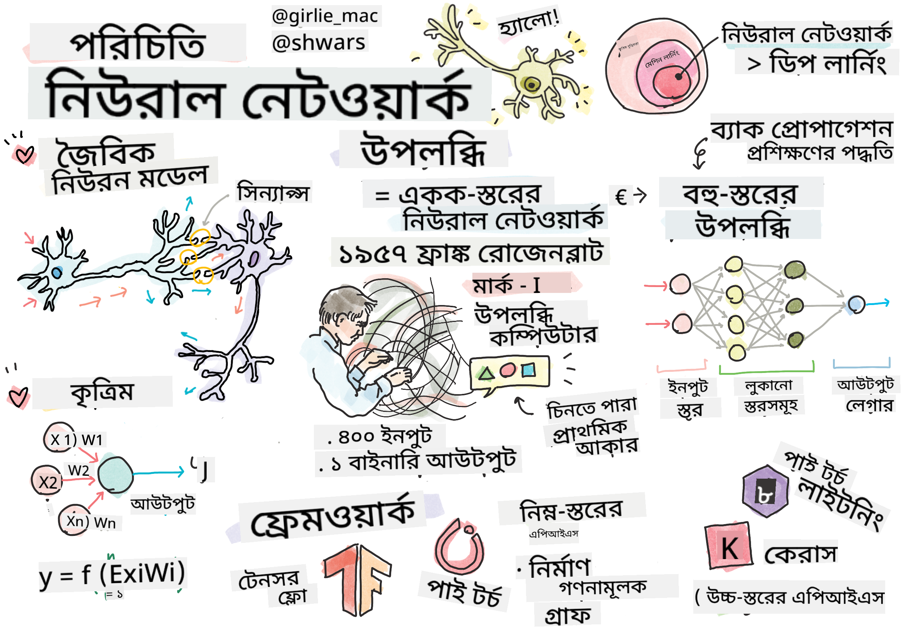
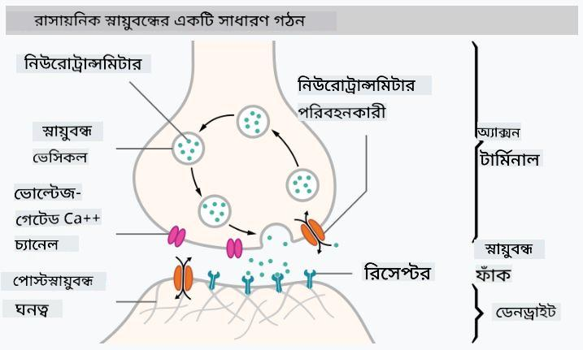
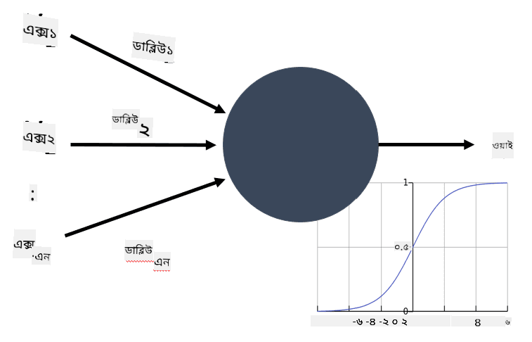

<!--
CO_OP_TRANSLATOR_METADATA:
{
  "original_hash": "1c6b8c7c1778a35fc1139b7f2aecb7b3",
  "translation_date": "2025-08-26T10:22:28+00:00",
  "source_file": "lessons/3-NeuralNetworks/README.md",
  "language_code": "bn"
}
-->
# নিউরাল নেটওয়ার্কের পরিচিতি

যেমনটি আমরা পরিচিতিতে আলোচনা করেছি, বুদ্ধিমত্তা অর্জনের একটি উপায় হল একটি **কম্পিউটার মডেল** বা একটি **কৃত্রিম মস্তিষ্ক** প্রশিক্ষণ দেওয়া। ২০শ শতকের মাঝামাঝি থেকে গবেষকরা বিভিন্ন গাণিতিক মডেল চেষ্টা করেছেন, এবং সাম্প্রতিক বছরগুলোতে এই দিকটি অত্যন্ত সফল প্রমাণিত হয়েছে। মস্তিষ্কের এই ধরনের গাণিতিক মডেলকে **নিউরাল নেটওয়ার্ক** বলা হয়।

> কখনও কখনও নিউরাল নেটওয়ার্ককে *কৃত্রিম নিউরাল নেটওয়ার্ক*, ANNs বলা হয়, যাতে বোঝানো যায় যে আমরা মডেল নিয়ে কথা বলছি, বাস্তব নিউরনের নেটওয়ার্ক নয়।

## মেশিন লার্নিং

নিউরাল নেটওয়ার্ক একটি বৃহত্তর শাখার অংশ, যার নাম **মেশিন লার্নিং**। এর লক্ষ্য হল ডেটা ব্যবহার করে কম্পিউটার মডেল প্রশিক্ষণ দেওয়া যা সমস্যার সমাধান করতে সক্ষম। মেশিন লার্নিং কৃত্রিম বুদ্ধিমত্তার একটি বড় অংশ গঠন করে, তবে আমরা এই পাঠ্যক্রমে ক্লাসিক্যাল মেশিন লার্নিং কভার করব না।

> ক্লাসিক্যাল মেশিন লার্নিং সম্পর্কে আরও জানতে আমাদের আলাদা **[Machine Learning for Beginners](http://github.com/microsoft/ml-for-beginners)** পাঠ্যক্রমটি দেখুন।

মেশিন লার্নিং-এ আমরা ধরে নিই যে আমাদের কাছে কিছু উদাহরণ **X** এবং সংশ্লিষ্ট আউটপুট মান **Y** সহ একটি ডেটাসেট রয়েছে। উদাহরণগুলো প্রায়শই N-ডাইমেনশনাল ভেক্টর হয় যা **ফিচার** নিয়ে গঠিত, এবং আউটপুটগুলোকে **লেবেল** বলা হয়।

আমরা দুটি সবচেয়ে সাধারণ মেশিন লার্নিং সমস্যার কথা বিবেচনা করব:

* **ক্লাসিফিকেশন**, যেখানে আমাদের একটি ইনপুট অবজেক্টকে দুই বা ততোধিক শ্রেণিতে শ্রেণিবদ্ধ করতে হবে।
* **রিগ্রেশন**, যেখানে আমাদের প্রতিটি ইনপুট নমুনার জন্য একটি সংখ্যাসূচক মান পূর্বাভাস দিতে হবে।

> ইনপুট এবং আউটপুটকে টেনসর হিসেবে উপস্থাপন করার সময়, ইনপুট ডেটাসেটটি M×N আকারের একটি ম্যাট্রিক্স, যেখানে M হল নমুনার সংখ্যা এবং N হল ফিচারের সংখ্যা। আউটপুট লেবেল **Y** হল M আকারের একটি ভেক্টর।

এই পাঠ্যক্রমে, আমরা শুধুমাত্র নিউরাল নেটওয়ার্ক মডেলগুলোর উপর ফোকাস করব।

## একটি নিউরনের মডেল

জীববিদ্যা থেকে আমরা জানি যে আমাদের মস্তিষ্ক নিউরাল কোষ নিয়ে গঠিত, প্রতিটি কোষের একাধিক "ইনপুট" (অ্যাক্সন) এবং একটি আউটপুট (ডেনড্রাইট) থাকে। অ্যাক্সন এবং ডেনড্রাইট বৈদ্যুতিক সংকেত পরিবহন করতে পারে, এবং অ্যাক্সন এবং ডেনড্রাইটের মধ্যে সংযোগ বিভিন্ন মাত্রার পরিবাহিতা প্রদর্শন করতে পারে (যা নিউরোমিডিয়েটর দ্বারা নিয়ন্ত্রিত হয়)।

 | 
----|----
বাস্তব নিউরন *([Wikipedia](https://en.wikipedia.org/wiki/Synapse#/media/File:SynapseSchematic_lines.svg) থেকে ইমেজ)* | কৃত্রিম নিউরন *(লেখকের তৈরি ইমেজ)*

তাই, একটি নিউরনের সবচেয়ে সহজ গাণিতিক মডেলটি কয়েকটি ইনপুট X1, ..., XN এবং একটি আউটপুট Y, এবং একটি সিরিজ ওজন W1, ..., WN নিয়ে গঠিত। আউটপুটটি নিম্নরূপ গণনা করা হয়:

যেখানে f হল কিছু অ-রৈখিক **অ্যাক্টিভেশন ফাংশন**।

> নিউরনের প্রাথমিক মডেলগুলো ১৯৪৩ সালে ওয়ারেন ম্যাককালক এবং ওয়াল্টার পিটসের ক্লাসিক্যাল পেপার [A logical calculus of the ideas immanent in nervous activity](https://www.cs.cmu.edu/~./epxing/Class/10715/reading/McCulloch.and.Pitts.pdf)-এ বর্ণনা করা হয়েছিল। ডোনাল্ড হেব তার বই "[The Organization of Behavior: A Neuropsychological Theory](https://books.google.com/books?id=VNetYrB8EBoC)"-এ এই নেটওয়ার্কগুলো কীভাবে প্রশিক্ষণ দেওয়া যায় তা প্রস্তাব করেছিলেন।

## এই অধ্যায়ে

এই অধ্যায়ে আমরা শিখব:
* [পারসেপট্রন](03-Perceptron/README.md), দুই-শ্রেণির ক্লাসিফিকেশনের জন্য প্রাথমিক নিউরাল নেটওয়ার্ক মডেলগুলোর একটি
* [মাল্টি-লেয়ার নেটওয়ার্ক](04-OwnFramework/README.md) এবং একটি সংযুক্ত নোটবুক [আমাদের নিজস্ব ফ্রেমওয়ার্ক তৈরি করা](../../../../lessons/3-NeuralNetworks/04-OwnFramework/OwnFramework.ipynb)
* [নিউরাল নেটওয়ার্ক ফ্রেমওয়ার্ক](05-Frameworks/README.md), এই নোটবুকগুলো সহ: [PyTorch](../../../../lessons/3-NeuralNetworks/05-Frameworks/IntroPyTorch.ipynb) এবং [Keras/Tensorflow](../../../../lessons/3-NeuralNetworks/05-Frameworks/IntroKerasTF.ipynb)
* [ওভারফিটিং](../../../../lessons/3-NeuralNetworks/05-Frameworks)

**অস্বীকৃতি**:  
এই নথিটি AI অনুবাদ পরিষেবা [Co-op Translator](https://github.com/Azure/co-op-translator) ব্যবহার করে অনুবাদ করা হয়েছে। আমরা যথাসম্ভব সঠিকতা নিশ্চিত করার চেষ্টা করি, তবে অনুগ্রহ করে মনে রাখবেন যে স্বয়ংক্রিয় অনুবাদে ত্রুটি বা অসঙ্গতি থাকতে পারে। মূল ভাষায় থাকা নথিটিকে প্রামাণিক উৎস হিসেবে বিবেচনা করা উচিত। গুরুত্বপূর্ণ তথ্যের জন্য, পেশাদার মানব অনুবাদ সুপারিশ করা হয়। এই অনুবাদ ব্যবহারের ফলে কোনো ভুল বোঝাবুঝি বা ভুল ব্যাখ্যা হলে আমরা তার জন্য দায়বদ্ধ থাকব না।