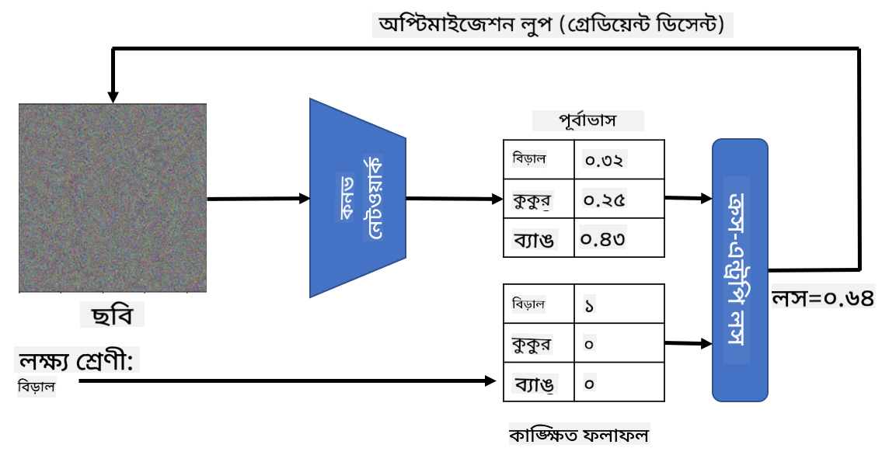

<!--
CO_OP_TRANSLATOR_METADATA:
{
  "original_hash": "717775c4050ccbffbe0c961ad8bf7bf7",
  "translation_date": "2025-08-26T09:43:13+00:00",
  "source_file": "lessons/4-ComputerVision/08-TransferLearning/README.md",
  "language_code": "bn"
}
-->
# প্রি-ট্রেইনড নেটওয়ার্ক এবং ট্রান্সফার লার্নিং

সিএনএন (CNN) প্রশিক্ষণ করতে অনেক সময় লাগে এবং এর জন্য প্রচুর ডেটা প্রয়োজন। তবে, বেশিরভাগ সময় নেটওয়ার্কের জন্য সেরা লো-লেভেল ফিল্টার শেখার কাজে ব্যয় হয়, যা ইমেজ থেকে প্যাটার্ন বের করতে ব্যবহার করা যায়। একটি স্বাভাবিক প্রশ্ন উঠে - আমরা কি একটি ডেটাসেটে প্রশিক্ষিত নিউরাল নেটওয়ার্ক ব্যবহার করে সম্পূর্ণ প্রশিক্ষণ প্রক্রিয়া ছাড়াই বিভিন্ন ইমেজ শ্রেণীবদ্ধ করতে এটি মানিয়ে নিতে পারি?

## [প্রি-লেকচার কুইজ](https://red-field-0a6ddfd03.1.azurestaticapps.net/quiz/108)

এই পদ্ধতিকে **ট্রান্সফার লার্নিং** বলা হয়, কারণ আমরা একটি নিউরাল নেটওয়ার্ক মডেল থেকে অন্যটিতে কিছু জ্ঞান স্থানান্তর করি। ট্রান্সফার লার্নিং-এ, আমরা সাধারণত একটি প্রি-ট্রেইনড মডেল দিয়ে শুরু করি, যা **ইমেজনেট** এর মতো বড় ইমেজ ডেটাসেটে প্রশিক্ষিত হয়েছে। এই মডেলগুলো ইতিমধ্যেই সাধারণ ইমেজ থেকে বিভিন্ন বৈশিষ্ট্য বের করতে ভালো কাজ করতে পারে, এবং অনেক ক্ষেত্রে এই বৈশিষ্ট্যগুলোর উপর ভিত্তি করে একটি ক্লাসিফায়ার তৈরি করলেই ভালো ফলাফল পাওয়া যায়।

> ✅ ট্রান্সফার লার্নিং শব্দটি অন্যান্য একাডেমিক ক্ষেত্রে যেমন শিক্ষা ক্ষেত্রেও পাওয়া যায়। এটি একটি ক্ষেত্র থেকে জ্ঞান নিয়ে অন্য ক্ষেত্রে প্রয়োগ করার প্রক্রিয়াকে বোঝায়।

## প্রি-ট্রেইনড মডেলগুলোকে ফিচার এক্সট্রাক্টর হিসেবে ব্যবহার করা

পূর্ববর্তী অংশে আমরা যে কনভোলিউশনাল নেটওয়ার্ক নিয়ে আলোচনা করেছি, তাতে বেশ কয়েকটি স্তর ছিল, প্রতিটি স্তর ইমেজ থেকে কিছু বৈশিষ্ট্য বের করার জন্য তৈরি। এটি লো-লেভেল পিক্সেল কম্বিনেশন (যেমন অনুভূমিক/উল্লম্ব লাইন বা স্ট্রোক) থেকে শুরু করে উচ্চ-লেভেল বৈশিষ্ট্যের কম্বিনেশন পর্যন্ত যেতে পারে, যা একটি শিখার চোখের মতো জিনিসের সাথে সম্পর্কিত। যদি আমরা সিএনএন-কে যথেষ্ট বড় এবং বৈচিত্র্যময় ইমেজ ডেটাসেটে প্রশিক্ষণ দিই, তাহলে নেটওয়ার্ক সাধারণ বৈশিষ্ট্যগুলো বের করতে শিখবে।

Keras এবং PyTorch-এ কিছু সাধারণ আর্কিটেকচারের জন্য প্রি-ট্রেইনড নিউরাল নেটওয়ার্ক ওজন সহজেই লোড করার ফাংশন রয়েছে, যেগুলো বেশিরভাগই ইমেজনেট ইমেজে প্রশিক্ষিত। সবচেয়ে বেশি ব্যবহৃত মডেলগুলো পূর্ববর্তী পাঠের [CNN Architectures](../07-ConvNets/CNN_Architectures.md) পৃষ্ঠায় বর্ণনা করা হয়েছে। বিশেষ করে, আপনি নিম্নলিখিতগুলোর মধ্যে একটি ব্যবহার করতে পারেন:

* **VGG-16/VGG-19**: তুলনামূলকভাবে সহজ মডেল, যা এখনও ভালো সঠিকতা দেয়। ট্রান্সফার লার্নিং কেমন কাজ করছে তা দেখতে প্রথম প্রচেষ্টা হিসেবে VGG ব্যবহার করা একটি ভালো পছন্দ।
* **ResNet**: Microsoft Research দ্বারা ২০১৫ সালে প্রস্তাবিত মডেলের একটি পরিবার। এতে আরও বেশি স্তর রয়েছে, এবং তাই এটি আরও বেশি রিসোর্স নেয়।
* **MobileNet**: ছোট আকারের মডেলের একটি পরিবার, যা মোবাইল ডিভাইসের জন্য উপযুক্ত। যদি আপনার রিসোর্স কম থাকে এবং সামান্য সঠিকতা ত্যাগ করতে পারেন, তাহলে এটি ব্যবহার করুন।

এখানে VGG-16 নেটওয়ার্ক দ্বারা একটি বিড়ালের ছবি থেকে বের করা নমুনা বৈশিষ্ট্যগুলো দেখানো হয়েছে:

## বিড়াল বনাম কুকুর ডেটাসেট

এই উদাহরণে, আমরা [Cats and Dogs](https://www.microsoft.com/download/details.aspx?id=54765&WT.mc_id=academic-77998-cacaste) ডেটাসেট ব্যবহার করব, যা বাস্তব জীবনের ইমেজ শ্রেণীবদ্ধকরণ পরিস্থিতির খুব কাছাকাছি।

## ✍️ অনুশীলন: ট্রান্সফার লার্নিং

চলুন সংশ্লিষ্ট নোটবুকে ট্রান্সফার লার্নিং-এর কার্যক্রম দেখি:

* [Transfer Learning - PyTorch](../../../../../lessons/4-ComputerVision/08-TransferLearning/TransferLearningPyTorch.ipynb)
* [Transfer Learning - TensorFlow](../../../../../lessons/4-ComputerVision/08-TransferLearning/TransferLearningTF.ipynb)

## অ্যাডভার্সারিয়াল বিড়াল ভিজুয়ালাইজ করা

প্রি-ট্রেইনড নিউরাল নেটওয়ার্কের *মস্তিষ্কে* বিভিন্ন প্যাটার্ন থাকে, যার মধ্যে **আদর্শ বিড়াল** (এবং আদর্শ কুকুর, আদর্শ জেব্রা, ইত্যাদি) ধারণা অন্তর্ভুক্ত থাকে। এই ইমেজটি **ভিজুয়ালাইজ** করা আকর্ষণীয় হবে। তবে এটি সহজ নয়, কারণ প্যাটার্নগুলো নেটওয়ার্কের ওজনের মধ্যে ছড়িয়ে থাকে এবং একটি হায়ারারকিকাল স্ট্রাকচারে সংগঠিত হয়।

একটি পদ্ধতি আমরা নিতে পারি তা হলো একটি র্যান্ডম ইমেজ দিয়ে শুরু করা এবং তারপর **গ্রেডিয়েন্ট ডিসেন্ট অপ্টিমাইজেশন** কৌশল ব্যবহার করে সেই ইমেজটি এমনভাবে সামঞ্জস্য করা যাতে নেটওয়ার্কটি মনে করে এটি একটি বিড়াল।

তবে, যদি আমরা এটি করি, আমরা এমন কিছু পাব যা র্যান্ডম নয়েজের মতো। কারণ *নেটওয়ার্ককে মনে করানোর অনেক উপায় আছে যে ইনপুট ইমেজটি একটি বিড়াল*, যার মধ্যে কিছু ভিজুয়ালি অর্থপূর্ণ নয়। যদিও এই ইমেজগুলোতে বিড়ালের জন্য সাধারণ প্যাটার্ন রয়েছে, এগুলোকে ভিজুয়ালি স্বতন্ত্র করার জন্য কিছুই বাধ্য করে না।

ফলাফল উন্নত করতে, আমরা লস ফাংশনে আরেকটি টার্ম যোগ করতে পারি, যাকে **ভ্যারিয়েশন লস** বলা হয়। এটি একটি মেট্রিক যা দেখায় ইমেজের প্রতিবেশী পিক্সেলগুলো কতটা মিল। ভ্যারিয়েশন লস কমানো ইমেজকে মসৃণ করে এবং নয়েজ দূর করে - ফলে আরও ভিজুয়ালি আকর্ষণীয় প্যাটার্ন প্রকাশ করে। এখানে এমন "আদর্শ" ইমেজের উদাহরণ রয়েছে, যা উচ্চ সম্ভাবনায় বিড়াল এবং জেব্রা হিসেবে শ্রেণীবদ্ধ:

 | 
-----|-----
 *আদর্শ বিড়াল* | *আদর্শ জেব্রা*

একই পদ্ধতি ব্যবহার করে তথাকথিত **অ্যাডভার্সারিয়াল আক্রমণ** করা যেতে পারে একটি নিউরাল নেটওয়ার্কে। ধরুন আমরা একটি কুকুরকে বিড়ালের মতো দেখাতে চাই। যদি আমরা কুকুরের একটি ছবি নিই, যা নেটওয়ার্ক দ্বারা কুকুর হিসেবে স্বীকৃত, আমরা তারপর এটি সামান্য পরিবর্তন করতে পারি গ্রেডিয়েন্ট ডিসেন্ট অপ্টিমাইজেশন ব্যবহার করে, যতক্ষণ না নেটওয়ার্ক এটি বিড়াল হিসেবে শ্রেণীবদ্ধ করতে শুরু করে:

 | 
-----|-----
*কুকুরের আসল ছবি* | *কুকুরের ছবি বিড়াল হিসেবে শ্রেণীবদ্ধ*

উপরের ফলাফল পুনরুত্পাদন করার কোডটি নিম্নলিখিত নোটবুকে দেখুন:

* [Ideal and Adversarial Cat - TensorFlow](../../../../../lessons/4-ComputerVision/08-TransferLearning/AdversarialCat_TF.ipynb)

## উপসংহার

ট্রান্সফার লার্নিং ব্যবহার করে, আপনি দ্রুত একটি কাস্টম অবজেক্ট শ্রেণীবদ্ধকরণ কাজের জন্য একটি ক্লাসিফায়ার তৈরি করতে পারেন এবং উচ্চ সঠিকতা অর্জন করতে পারেন। আপনি দেখতে পাবেন যে আমরা এখন যে আরও জটিল কাজগুলো সমাধান করছি তার জন্য উচ্চতর কম্পিউটেশনাল ক্ষমতা প্রয়োজন এবং সহজে CPU-তে সমাধান করা যায় না। পরবর্তী ইউনিটে, আমরা একই মডেলটি কম কম্পিউট রিসোর্স ব্যবহার করে প্রশিক্ষণ করার জন্য একটি আরও হালকা ওজনের বাস্তবায়ন ব্যবহার করার চেষ্টা করব, যার ফলে সঠিকতা সামান্য কম হয়।

## 🚀 চ্যালেঞ্জ

সংলগ্ন নোটবুকে, নোট রয়েছে নিচে যেখানে বলা হয়েছে ট্রান্সফার জ্ঞান সবচেয়ে ভালো কাজ করে কিছুটা মিল থাকা প্রশিক্ষণ ডেটার সাথে (সম্ভবত একটি নতুন ধরনের প্রাণী)। সম্পূর্ণ নতুন ধরনের ইমেজ নিয়ে কিছু পরীক্ষা-নিরীক্ষা করুন এবং দেখুন আপনার ট্রান্সফার জ্ঞান মডেলগুলো কতটা ভালো বা খারাপ কাজ করে।

## [পোস্ট-লেকচার কুইজ](https://red-field-0a6ddfd03.1.azurestaticapps.net/quiz/208)

## পর্যালোচনা এবং স্ব-অধ্যয়ন

[TrainingTricks.md](TrainingTricks.md) পড়ুন এবং আপনার মডেল প্রশিক্ষণের অন্যান্য উপায় সম্পর্কে জ্ঞান গভীর করুন।

## [অ্যাসাইনমেন্ট](lab/README.md)

এই ল্যাবে, আমরা বাস্তব জীবনের [Oxford-IIIT](https://www.robots.ox.ac.uk/~vgg/data/pets/) পেটস ডেটাসেট ব্যবহার করব, যেখানে বিড়াল এবং কুকুরের ৩৫টি প্রজাতি রয়েছে, এবং আমরা একটি ট্রান্সফার লার্নিং ক্লাসিফায়ার তৈরি করব।

**অস্বীকৃতি**:  
এই নথিটি AI অনুবাদ পরিষেবা [Co-op Translator](https://github.com/Azure/co-op-translator) ব্যবহার করে অনুবাদ করা হয়েছে। আমরা যথাসম্ভব সঠিক অনুবাদের চেষ্টা করি, তবে অনুগ্রহ করে মনে রাখবেন যে স্বয়ংক্রিয় অনুবাদে ত্রুটি বা অসঙ্গতি থাকতে পারে। নথিটির মূল ভাষায় রচিত সংস্করণটিকেই প্রামাণিক উৎস হিসেবে বিবেচনা করা উচিত। গুরুত্বপূর্ণ তথ্যের জন্য, পেশাদার মানব অনুবাদ সুপারিশ করা হয়। এই অনুবাদ ব্যবহারের ফলে সৃষ্ট কোনো ভুল বোঝাবুঝি বা ভুল ব্যাখ্যার জন্য আমরা দায়ী নই।