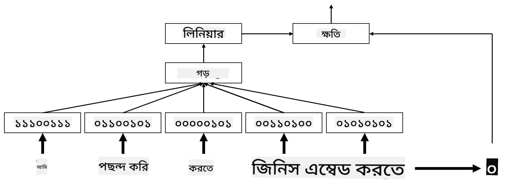

<!--
CO_OP_TRANSLATOR_METADATA:
{
  "original_hash": "b708c9b85b833864c73c6281f1e6b96e",
  "translation_date": "2025-09-23T07:54:30+00:00",
  "source_file": "lessons/5-NLP/14-Embeddings/README.md",
  "language_code": "bn"
}
-->
# এমবেডিংস

## [পূর্ব-লেকচার কুইজ](https://ff-quizzes.netlify.app/en/ai/quiz/27)

BoW বা TF/IDF ভিত্তিক ক্লাসিফায়ার প্রশিক্ষণ করার সময়, আমরা উচ্চ-মাত্রিক ব্যাগ-অফ-ওয়ার্ডস ভেক্টর নিয়ে কাজ করতাম যার দৈর্ঘ্য ছিল `vocab_size`, এবং আমরা নিম্ন-মাত্রিক পজিশনাল রিপ্রেজেন্টেশন ভেক্টর থেকে স্পার্স ওয়ান-হট রিপ্রেজেন্টেশনে স্পষ্টভাবে রূপান্তর করতাম। তবে, এই ওয়ান-হট রিপ্রেজেন্টেশন মেমোরি-ইফিশিয়েন্ট নয়। এছাড়াও, প্রতিটি শব্দকে একে অপরের থেকে স্বাধীনভাবে বিবেচনা করা হয়, অর্থাৎ ওয়ান-হট এনকোডেড ভেক্টরগুলো শব্দগুলোর মধ্যে কোনো সেমান্টিক সাদৃশ্য প্রকাশ করে না।

**এমবেডিং** এর ধারণা হলো শব্দগুলোকে নিম্ন-মাত্রিক ঘন ভেক্টর দিয়ে উপস্থাপন করা, যা কোনোভাবে শব্দের সেমান্টিক অর্থকে প্রতিফলিত করে। আমরা পরে আলোচনা করব কীভাবে অর্থপূর্ণ শব্দ এমবেডিং তৈরি করা যায়, তবে আপাতত এমবেডিংসকে শব্দ ভেক্টরের মাত্রা কমানোর একটি উপায় হিসেবে ভাবুন।

এমবেডিং লেয়ার একটি শব্দকে ইনপুট হিসেবে গ্রহণ করবে এবং নির্দিষ্ট `embedding_size` এর একটি আউটপুট ভেক্টর তৈরি করবে। এক অর্থে, এটি একটি `Linear` লেয়ারের মতোই, তবে এটি ওয়ান-হট এনকোডেড ভেক্টর গ্রহণ করার পরিবর্তে একটি শব্দ নম্বর ইনপুট হিসেবে নিতে পারবে, যা আমাদের বড় ওয়ান-হট-এনকোডেড ভেক্টর তৈরি করা এড়াতে সাহায্য করবে।

আমাদের ক্লাসিফায়ার নেটওয়ার্কে প্রথম লেয়ার হিসেবে একটি এমবেডিং লেয়ার ব্যবহার করে, আমরা ব্যাগ-অফ-ওয়ার্ডস থেকে **এমবেডিং ব্যাগ** মডেলে পরিবর্তন করতে পারি, যেখানে আমরা প্রথমে আমাদের টেক্সটের প্রতিটি শব্দকে সংশ্লিষ্ট এমবেডিংয়ে রূপান্তর করি এবং তারপর সেই এমবেডিংগুলোর উপর কিছু অ্যাগ্রিগেট ফাংশন গণনা করি, যেমন `sum`, `average` বা `max`।  

> লেখকের তৈরি চিত্র

## ✍️ অনুশীলন: এমবেডিংস

নিম্নলিখিত নোটবুকগুলোতে আপনার শেখা চালিয়ে যান:
* [PyTorch দিয়ে এমবেডিংস](EmbeddingsPyTorch.ipynb)
* [TensorFlow দিয়ে এমবেডিংস](EmbeddingsTF.ipynb)

## সেমান্টিক এমবেডিংস: Word2Vec

যদিও এমবেডিং লেয়ার শব্দগুলোকে ভেক্টর রিপ্রেজেন্টেশনে ম্যাপ করতে শিখেছে, তবে এই রিপ্রেজেন্টেশনটি প্রয়োজনীয়ভাবে অনেক সেমান্টিক অর্থ বহন করে না। এমন একটি ভেক্টর রিপ্রেজেন্টেশন শেখা ভালো হবে যেখানে সাদৃশ্যপূর্ণ শব্দ বা সমার্থক শব্দগুলো এমন ভেক্টরের সাথে সঙ্গতিপূর্ণ হয় যা কিছু ভেক্টর দূরত্ব (যেমন ইউক্লিডিয়ান দূরত্ব) অনুযায়ী একে অপরের কাছাকাছি থাকে।

এটি করতে, আমাদের একটি বড় টেক্সট সংগ্রহে একটি নির্দিষ্ট উপায়ে আমাদের এমবেডিং মডেল প্রি-ট্রেন করতে হবে। সেমান্টিক এমবেডিংস প্রশিক্ষণের একটি উপায় হলো [Word2Vec](https://en.wikipedia.org/wiki/Word2vec)। এটি দুটি প্রধান আর্কিটেকচারের উপর ভিত্তি করে তৈরি যা শব্দগুলোর একটি বিতরণকৃত রিপ্রেজেন্টেশন তৈরি করতে ব্যবহৃত হয়:

 - **কন্টিনিউয়াস ব্যাগ-অফ-ওয়ার্ডস** (CBoW) — এই আর্কিটেকচারে, আমরা মডেলকে আশেপাশের প্রসঙ্গ থেকে একটি শব্দ পূর্বানুমান করতে প্রশিক্ষণ দিই। ngram $(W_{-2},W_{-1},W_0,W_1,W_2)$ দেওয়া হলে, মডেলের লক্ষ্য হলো $(W_{-2},W_{-1},W_1,W_2)$ থেকে $W_0$ পূর্বানুমান করা।
 - **কন্টিনিউয়াস স্কিপ-গ্রাম** CBoW এর বিপরীত। মডেল আশেপাশের প্রসঙ্গ শব্দের উইন্ডো ব্যবহার করে বর্তমান শব্দ পূর্বানুমান করে।

CBoW দ্রুততর, তবে স্কিপ-গ্রাম ধীরতর, কিন্তু কম ঘন ঘন ব্যবহৃত শব্দগুলোকে ভালোভাবে রিপ্রেজেন্ট করে।

> [এই পেপার](https://arxiv.org/pdf/1301.3781.pdf) থেকে নেওয়া চিত্র

Word2Vec প্রি-ট্রেনড এমবেডিংস (এবং GloVe এর মতো অন্যান্য অনুরূপ মডেল) নিউরাল নেটওয়ার্কে এমবেডিং লেয়ারের পরিবর্তে ব্যবহার করা যেতে পারে। তবে, আমাদের ভোকাবুলারির সাথে কাজ করতে হবে, কারণ Word2Vec/GloVe প্রি-ট্রেন করার জন্য ব্যবহৃত ভোকাবুলারি আমাদের টেক্সট কর্পাসের ভোকাবুলারি থেকে আলাদা হতে পারে। এই সমস্যাটি কীভাবে সমাধান করা যায় তা উপরের নোটবুকগুলোতে দেখুন।

## প্রসঙ্গভিত্তিক এমবেডিংস

Word2Vec এর মতো ঐতিহ্যবাহী প্রি-ট্রেনড এমবেডিং রিপ্রেজেন্টেশনের একটি প্রধান সীমাবদ্ধতা হলো শব্দের অর্থ বিভ্রান্তি সমস্যা। যদিও প্রি-ট্রেনড এমবেডিংস প্রসঙ্গের মধ্যে শব্দগুলোর কিছু অর্থ ধারণ করতে পারে, একটি শব্দের প্রতিটি সম্ভাব্য অর্থ একই এমবেডিংয়ে এনকোড করা হয়। এটি ডাউনস্ট্রিম মডেলগুলোতে সমস্যা সৃষ্টি করতে পারে, কারণ অনেক শব্দ যেমন 'play' শব্দটি প্রসঙ্গ অনুযায়ী বিভিন্ন অর্থ বহন করে।

উদাহরণস্বরূপ, 'play' শব্দটি এই দুটি বাক্যে সম্পূর্ণ ভিন্ন অর্থ বহন করে:

- আমি থিয়েটারে একটি **play** দেখতে গিয়েছিলাম।
- জন তার বন্ধুদের সাথে **play** করতে চায়।

উপরের প্রি-ট্রেনড এমবেডিংস 'play' শব্দের এই দুটি অর্থকে একই এমবেডিংয়ে রিপ্রেজেন্ট করে। এই সীমাবদ্ধতা কাটিয়ে উঠতে, আমাদের **ল্যাঙ্গুয়েজ মডেল** ভিত্তিক এমবেডিং তৈরি করতে হবে, যা একটি বড় টেক্সট কর্পাসে প্রশিক্ষিত হয় এবং *জানে* কীভাবে শব্দগুলো বিভিন্ন প্রসঙ্গে একসাথে ব্যবহার করা যায়। প্রসঙ্গভিত্তিক এমবেডিংস নিয়ে আলোচনা এই টিউটোরিয়ালের আওতার বাইরে, তবে আমরা কোর্সের পরে ল্যাঙ্গুয়েজ মডেল নিয়ে আলোচনা করার সময় এ বিষয়ে ফিরে আসব।

## উপসংহার

এই পাঠে, আপনি TensorFlow এবং PyTorch-এ এমবেডিং লেয়ার তৈরি এবং ব্যবহার করার মাধ্যমে শব্দগুলোর সেমান্টিক অর্থকে আরও ভালোভাবে প্রতিফলিত করার উপায় শিখেছেন।

## 🚀 চ্যালেঞ্জ

Word2Vec কিছু আকর্ষণীয় অ্যাপ্লিকেশনে ব্যবহৃত হয়েছে, যার মধ্যে গান এবং কবিতা তৈরি অন্তর্ভুক্ত। [এই আর্টিকেলটি](https://www.politetype.com/blog/word2vec-color-poems) দেখুন যেখানে লেখক Word2Vec ব্যবহার করে কবিতা তৈরি করার পদ্ধতি ব্যাখ্যা করেছেন। [ড্যান শিফম্যানের এই ভিডিওটি](https://www.youtube.com/watch?v=LSS_bos_TPI&ab_channel=TheCodingTrain) দেখুন যেখানে এই কৌশলটির একটি ভিন্ন ব্যাখ্যা দেওয়া হয়েছে। তারপর এই কৌশলগুলো আপনার নিজের টেক্সট কর্পাসে প্রয়োগ করার চেষ্টা করুন, যা Kaggle থেকে সংগ্রহ করা হতে পারে।

## [পোস্ট-লেকচার কুইজ](https://ff-quizzes.netlify.app/en/ai/quiz/28)

## পর্যালোচনা ও স্ব-অধ্যয়ন

Word2Vec নিয়ে এই পেপারটি পড়ুন: [Efficient Estimation of Word Representations in Vector Space](https://arxiv.org/pdf/1301.3781.pdf)

## [অ্যাসাইনমেন্ট: নোটবুকস](assignment.md)

---

