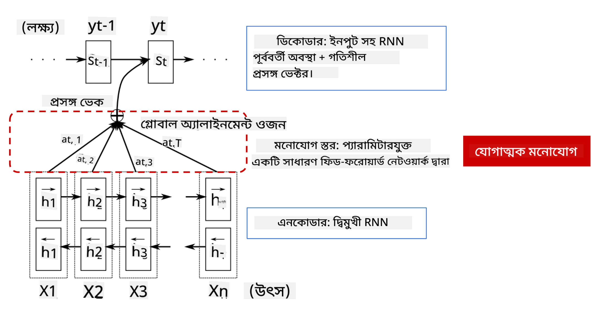
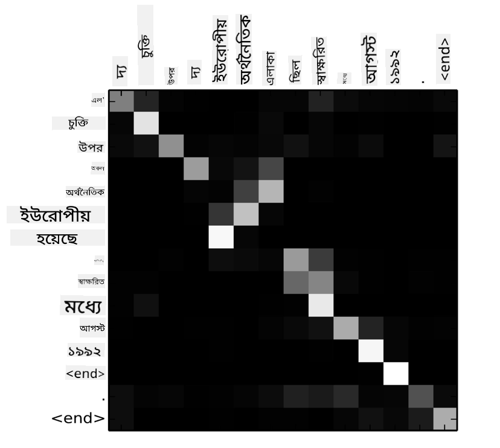
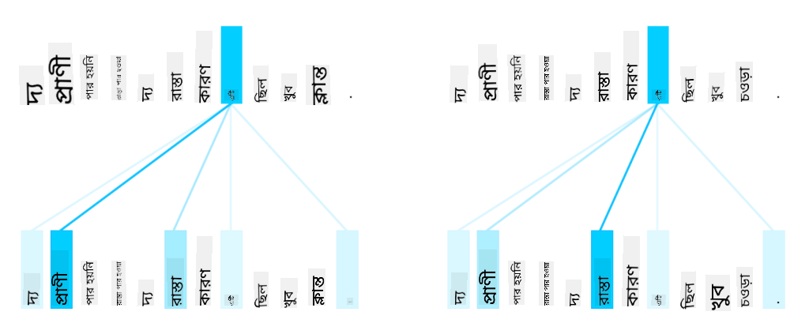
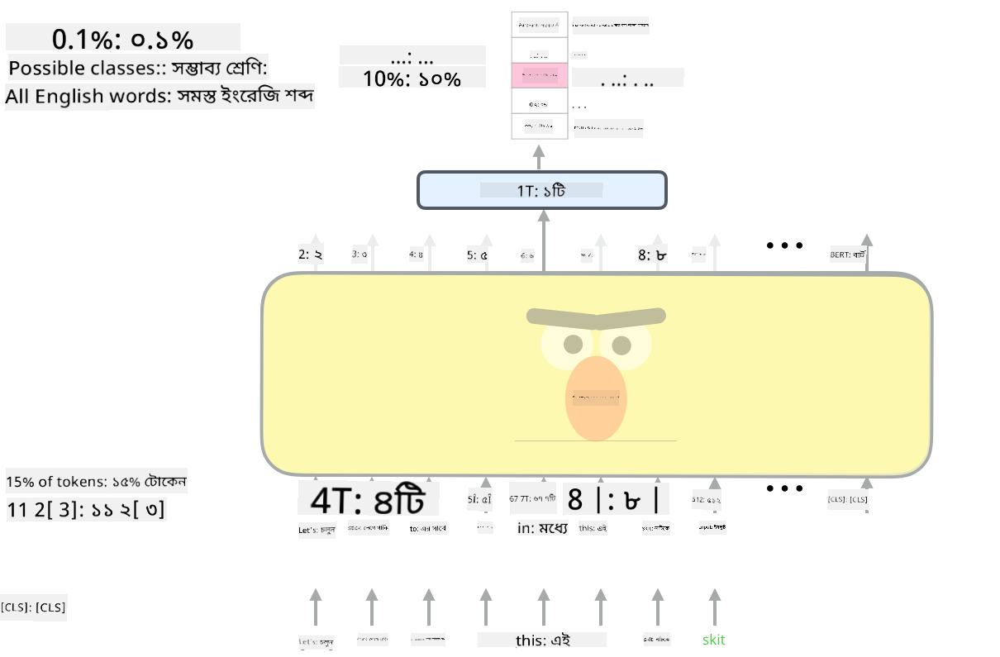

<!--
CO_OP_TRANSLATOR_METADATA:
{
  "original_hash": "f335dfcb4a993920504c387973a36957",
  "translation_date": "2025-09-23T07:52:55+00:00",
  "source_file": "lessons/5-NLP/18-Transformers/README.md",
  "language_code": "bn"
}
-->
# অ্যাটেনশন মেকানিজম এবং ট্রান্সফর্মার

## [পূর্ব-লেকচার কুইজ](https://ff-quizzes.netlify.app/en/ai/quiz/35)

NLP ডোমেইনের অন্যতম গুরুত্বপূর্ণ সমস্যা হলো **মেশিন অনুবাদ**, যা Google Translate-এর মতো টুলগুলোর ভিত্তি। এই অংশে আমরা মেশিন অনুবাদ, বা আরও সাধারণভাবে, *সিকোয়েন্স-টু-সিকোয়েন্স* টাস্ক (যাকে **সেন্টেন্স ট্রান্সডাকশন**ও বলা হয়) নিয়ে আলোচনা করব।

RNN ব্যবহার করে সিকোয়েন্স-টু-সিকোয়েন্স দুটি পুনরাবৃত্ত নেটওয়ার্কের মাধ্যমে বাস্তবায়িত হয়, যেখানে একটি নেটওয়ার্ক, **এনকোডার**, ইনপুট সিকোয়েন্সকে একটি হিডেন স্টেটে সংকুচিত করে, এবং অন্য নেটওয়ার্ক, **ডিকোডার**, এই হিডেন স্টেটকে একটি অনুবাদিত ফলাফলে রূপান্তরিত করে। এই পদ্ধতির কিছু সমস্যা রয়েছে:

* এনকোডার নেটওয়ার্কের চূড়ান্ত স্টেট একটি বাক্যের শুরু মনে রাখতে অসুবিধা করে, যার ফলে দীর্ঘ বাক্যের ক্ষেত্রে মডেলের গুণমান খারাপ হয়।
* সিকোয়েন্সের সমস্ত শব্দের ফলাফলের উপর একই প্রভাব থাকে। তবে বাস্তবে, ইনপুট সিকোয়েন্সের নির্দিষ্ট শব্দগুলো প্রায়ই অন্যান্য শব্দের তুলনায় সিকোয়েন্সিয়াল আউটপুটে বেশি প্রভাব ফেলে।

**অ্যাটেনশন মেকানিজম** RNN-এর আউটপুট প্রেডিকশনে প্রতিটি ইনপুট ভেক্টরের প্রসঙ্গগত প্রভাবকে ওজন করার একটি উপায় প্রদান করে। এটি বাস্তবায়িত হয় ইনপুট RNN এবং আউটপুট RNN-এর মধ্যবর্তী স্টেটগুলোর মধ্যে শর্টকাট তৈরি করে। এইভাবে, আউটপুট প্রতীক yt তৈরি করার সময়, আমরা সমস্ত ইনপুট হিডেন স্টেট hi বিবেচনা করব, বিভিন্ন ওজন সহগ &alpha;t,i সহ।

> [Bahdanau et al., 2015](https://arxiv.org/pdf/1409.0473.pdf)-এ অ্যাডিটিভ অ্যাটেনশন মেকানিজম সহ এনকোডার-ডিকোডার মডেল, [এই ব্লগ পোস্ট](https://lilianweng.github.io/lil-log/2018/06/24/attention-attention.html) থেকে উদ্ধৃত।

অ্যাটেনশন ম্যাট্রিক্স {&alpha;i,j} একটি আউটপুট সিকোয়েন্সের একটি নির্দিষ্ট শব্দ তৈরিতে ইনপুট শব্দগুলো কীভাবে ভূমিকা রাখে তা উপস্থাপন করবে। নিচে এমন একটি ম্যাট্রিক্সের উদাহরণ দেওয়া হয়েছে:

> [Bahdanau et al., 2015](https://arxiv.org/pdf/1409.0473.pdf) থেকে চিত্র (Fig.3)

অ্যাটেনশন মেকানিজম NLP-তে বর্তমান বা প্রায় বর্তমান স্টেট-অফ-দ্য-আর্টের জন্য দায়ী। তবে অ্যাটেনশন যোগ করলে মডেলের প্যারামিটারের সংখ্যা উল্লেখযোগ্যভাবে বৃদ্ধি পায়, যা RNN-এর স্কেলিং সমস্যার দিকে নিয়ে যায়। RNN-এর স্কেলিংয়ের একটি প্রধান সীমাবদ্ধতা হলো মডেলের পুনরাবৃত্ত প্রকৃতি, যা ব্যাচ এবং প্রশিক্ষণকে প্যারালালাইজ করা কঠিন করে তোলে। RNN-এ একটি সিকোয়েন্সের প্রতিটি উপাদানকে ক্রমানুসারে প্রক্রিয়া করতে হয়, যা সহজে প্যারালালাইজ করা যায় না।

> [গুগলের ব্লগ](https://research.googleblog.com/2016/09/a-neural-network-for-machine.html) থেকে চিত্র।

অ্যাটেনশন মেকানিজমের গ্রহণযোগ্যতা এবং এই সীমাবদ্ধতার সংমিশ্রণ আমাদের আজকের পরিচিত স্টেট-অফ-দ্য-আর্ট ট্রান্সফর্মার মডেলগুলোর সৃষ্টি করেছে, যেমন BERT এবং Open-GPT3।

## ট্রান্সফর্মার মডেল

ট্রান্সফর্মারের পিছনের প্রধান ধারণাগুলোর একটি হলো RNN-এর ক্রমানুসার প্রকৃতি এড়ানো এবং প্রশিক্ষণের সময় প্যারালালাইজযোগ্য একটি মডেল তৈরি করা। এটি দুটি ধারণা বাস্তবায়নের মাধ্যমে অর্জিত হয়:

* পজিশনাল এনকোডিং
* RNN (বা CNN)-এর পরিবর্তে প্যাটার্ন ধরার জন্য সেলফ-অ্যাটেনশন মেকানিজম ব্যবহার করা (এই কারণেই ট্রান্সফর্মার পরিচিতি পত্রটির নাম *[Attention is all you need](https://arxiv.org/abs/1706.03762)*)

### পজিশনাল এনকোডিং/এম্বেডিং

পজিশনাল এনকোডিংয়ের ধারণাটি নিম্নরূপ:
1. RNN ব্যবহার করার সময়, টোকেনগুলোর আপেক্ষিক অবস্থান ধাপের সংখ্যা দ্বারা উপস্থাপিত হয়, এবং তাই এটি স্পষ্টভাবে উপস্থাপন করার প্রয়োজন হয় না।
2. তবে, অ্যাটেনশন ব্যবহার করার সময়, আমাদের সিকোয়েন্সের মধ্যে টোকেনগুলোর আপেক্ষিক অবস্থান জানতে হবে।
3. পজিশনাল এনকোডিং পেতে, আমরা আমাদের টোকেন সিকোয়েন্সকে সিকোয়েন্সের টোকেন অবস্থানের একটি সিকোয়েন্স (যেমন, সংখ্যা 0,1, ...) দিয়ে বৃদ্ধি করি।
4. এরপর আমরা টোকেন অবস্থানকে একটি টোকেন এম্বেডিং ভেক্টরের সাথে মিশ্রিত করি। অবস্থান (ইন্টিজার)কে একটি ভেক্টরে রূপান্তর করতে, আমরা বিভিন্ন পদ্ধতি ব্যবহার করতে পারি:

* টোকেন এম্বেডিংয়ের মতো ট্রেনযোগ্য এম্বেডিং। এখানে আমরা এই পদ্ধতিটি বিবেচনা করি। আমরা টোকেন এবং তাদের অবস্থানের উপর এম্বেডিং লেয়ার প্রয়োগ করি, যার ফলে একই মাত্রার এম্বেডিং ভেক্টর তৈরি হয়, যা আমরা একসাথে যোগ করি।
* মূল পত্রে প্রস্তাবিত স্থির অবস্থান এনকোডিং ফাংশন।

> লেখকের তৈরি চিত্র

পজিশনাল এম্বেডিংয়ের মাধ্যমে আমরা মূল টোকেন এবং সিকোয়েন্সের মধ্যে তার অবস্থান উভয়কেই এম্বেড করি।

### মাল্টি-হেড সেলফ-অ্যাটেনশন

এরপর, আমাদের সিকোয়েন্সের মধ্যে কিছু প্যাটার্ন ধরতে হবে। এটি করতে, ট্রান্সফর্মারগুলো **সেলফ-অ্যাটেনশন** মেকানিজম ব্যবহার করে, যা মূলত ইনপুট এবং আউটপুট হিসেবে একই সিকোয়েন্সে অ্যাটেনশন প্রয়োগ। সেলফ-অ্যাটেনশন প্রয়োগ করে আমরা বাক্যের প্রসঙ্গ বিবেচনা করতে পারি এবং কোন শব্দগুলো আন্তঃসম্পর্কিত তা দেখতে পারি। উদাহরণস্বরূপ, এটি আমাদের *it* দ্বারা উল্লেখিত শব্দগুলো দেখতে এবং প্রসঙ্গ বিবেচনা করতে সাহায্য করে:

> [গুগলের ব্লগ](https://research.googleblog.com/2017/08/transformer-novel-neural-network.html) থেকে চিত্র।

ট্রান্সফর্মারগুলোতে, আমরা **মাল্টি-হেড অ্যাটেনশন** ব্যবহার করি যাতে নেটওয়ার্ক বিভিন্ন ধরনের নির্ভরতা ধরতে পারে, যেমন দীর্ঘমেয়াদী বনাম স্বল্পমেয়াদী শব্দ সম্পর্ক, কো-রেফারেন্স বনাম অন্য কিছু ইত্যাদি।

[TensorFlow Notebook](TransformersTF.ipynb)-এ ট্রান্সফর্মার লেয়ারের বাস্তবায়ন সম্পর্কে আরও বিস্তারিত রয়েছে।

### এনকোডার-ডিকোডার অ্যাটেনশন

ট্রান্সফর্মারগুলোতে অ্যাটেনশন দুটি স্থানে ব্যবহৃত হয়:

* ইনপুট টেক্সটের মধ্যে প্যাটার্ন ধরতে সেলফ-অ্যাটেনশন ব্যবহার করে।
* সিকোয়েন্স অনুবাদ করতে - এটি এনকোডার এবং ডিকোডারের মধ্যে অ্যাটেনশন লেয়ার।

এনকোডার-ডিকোডার অ্যাটেনশন RNN-এ ব্যবহৃত অ্যাটেনশন মেকানিজমের মতোই, যা এই অংশের শুরুতে বর্ণনা করা হয়েছে। এই অ্যানিমেটেড ডায়াগ্রামটি এনকোডার-ডিকোডার অ্যাটেনশনের ভূমিকা ব্যাখ্যা করে।

যেহেতু প্রতিটি ইনপুট অবস্থান স্বাধীনভাবে প্রতিটি আউটপুট অবস্থানে ম্যাপ করা হয়, ট্রান্সফর্মারগুলো RNN-এর তুলনায় ভালোভাবে প্যারালালাইজ করতে পারে, যা অনেক বড় এবং আরও প্রকাশক্ষম ভাষার মডেল সক্ষম করে। প্রতিটি অ্যাটেনশন হেড শব্দগুলোর মধ্যে বিভিন্ন সম্পর্ক শিখতে ব্যবহার করা যেতে পারে, যা ডাউনস্ট্রিম NLP টাস্কগুলো উন্নত করে।

## BERT

**BERT** (Bidirectional Encoder Representations from Transformers) একটি খুব বড় মাল্টি লেয়ার ট্রান্সফর্মার নেটওয়ার্ক, যেখানে *BERT-base*-এর জন্য 12টি লেয়ার এবং *BERT-large*-এর জন্য 24টি লেয়ার রয়েছে। মডেলটি প্রথমে একটি বড় টেক্সট ডেটা কর্পাস (WikiPedia + বই) ব্যবহার করে আনসুপারভাইজড প্রশিক্ষণের মাধ্যমে প্রি-ট্রেইন করা হয় (একটি বাক্যে মাস্ক করা শব্দগুলো প্রেডিক্ট করা)। প্রি-ট্রেইনিংয়ের সময় মডেলটি উল্লেখযোগ্য ভাষা বোঝার স্তর অর্জন করে, যা পরে অন্যান্য ডেটাসেটের সাথে ফাইন টিউনিংয়ের মাধ্যমে ব্যবহার করা যায়। এই প্রক্রিয়াকে **ট্রান্সফার লার্নিং** বলা হয়।

> [উৎস](http://jalammar.github.io/illustrated-bert/)

## ✍️ অনুশীলন: ট্রান্সফর্মার

নিম্নলিখিত নোটবুকগুলোতে আপনার শেখা চালিয়ে যান:

* [PyTorch-এ ট্রান্সফর্মার](TransformersPyTorch.ipynb)
* [TensorFlow-এ ট্রান্সফর্মার](TransformersTF.ipynb)

## উপসংহার

এই পাঠে আপনি ট্রান্সফর্মার এবং অ্যাটেনশন মেকানিজম সম্পর্কে শিখেছেন, যা NLP টুলবক্সের অপরিহার্য উপকরণ। ট্রান্সফর্মার আর্কিটেকচারের অনেক বৈচিত্র্য রয়েছে, যেমন BERT, DistilBERT, BigBird, OpenGPT3 এবং আরও অনেক কিছু, যা ফাইন টিউন করা যায়। [HuggingFace প্যাকেজ](https://github.com/huggingface/) PyTorch এবং TensorFlow উভয়ের সাথে এই আর্কিটেকচারগুলো প্রশিক্ষণের জন্য একটি রিপোজিটরি প্রদান করে।

## 🚀 চ্যালেঞ্জ

## [পোস্ট-লেকচার কুইজ](https://ff-quizzes.netlify.app/en/ai/quiz/36)

## পর্যালোচনা এবং স্ব-অধ্যয়ন

* [ব্লগ পোস্ট](https://mchromiak.github.io/articles/2017/Sep/12/Transformer-Attention-is-all-you-need/), যা ট্রান্সফর্মার সম্পর্কিত ক্লাসিক্যাল [Attention is all you need](https://arxiv.org/abs/1706.03762) পেপারটি ব্যাখ্যা করে।
* [ব্লগ পোস্টের একটি সিরিজ](https://towardsdatascience.com/transformers-explained-visually-part-1-overview-of-functionality-95a6dd460452), যা ট্রান্সফর্মার আর্কিটেকচার বিস্তারিতভাবে ব্যাখ্যা করে।

## [অ্যাসাইনমেন্ট](assignment.md)

---

