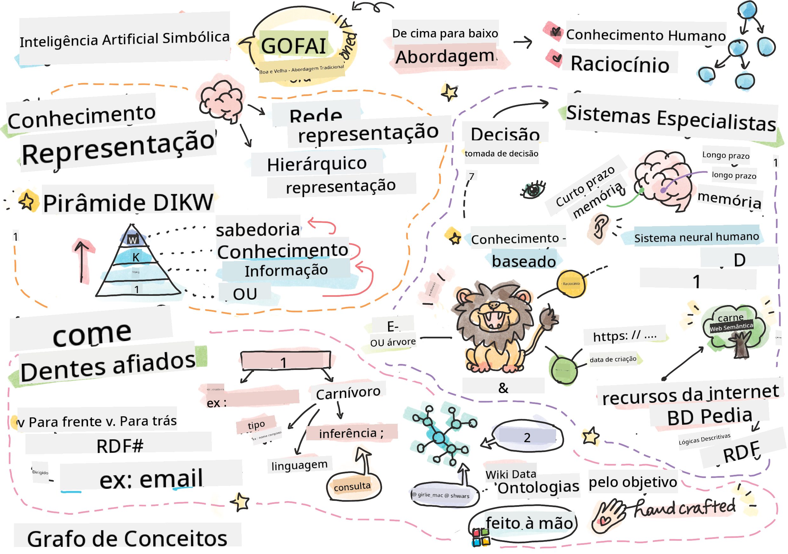
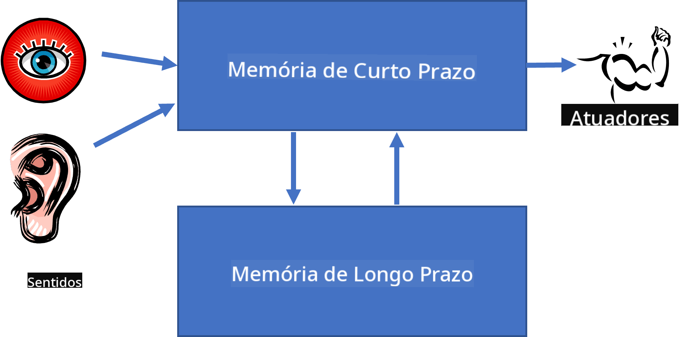
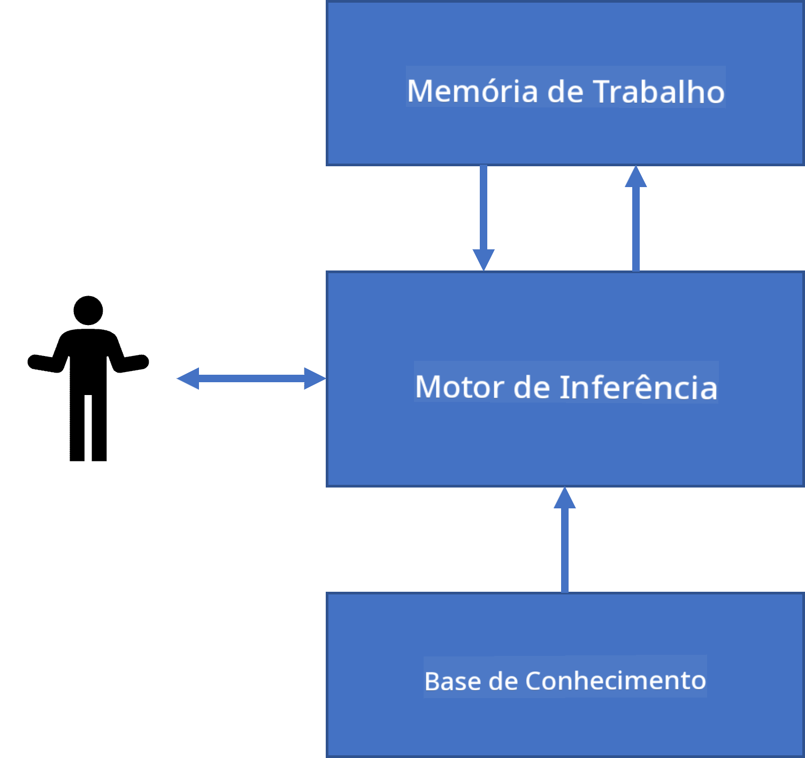
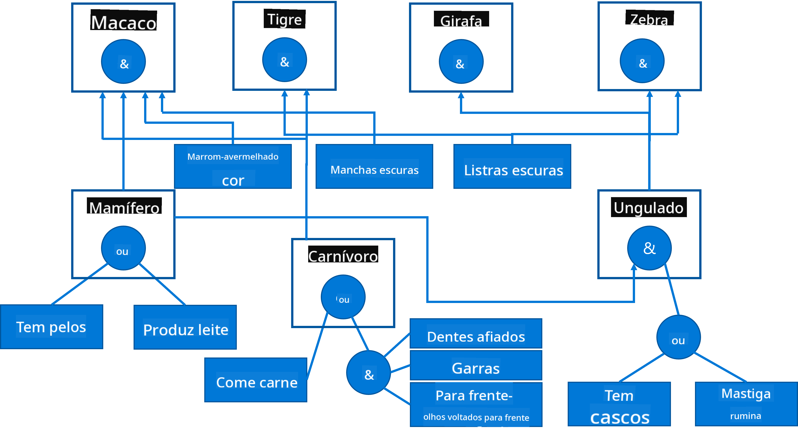

<!--
CO_OP_TRANSLATOR_METADATA:
{
  "original_hash": "98c5222ff9556b55223fed2337145e18",
  "translation_date": "2025-08-26T11:05:34+00:00",
  "source_file": "lessons/2-Symbolic/README.md",
  "language_code": "br"
}
-->
# Representação de Conhecimento e Sistemas Especialistas



> Sketchnote por [Tomomi Imura](https://twitter.com/girlie_mac)

A busca pela inteligência artificial é baseada na procura por conhecimento, para entender o mundo de forma semelhante aos humanos. Mas como podemos fazer isso?

## [Quiz pré-aula](https://red-field-0a6ddfd03.1.azurestaticapps.net/quiz/102)

Nos primeiros dias da IA, a abordagem de cima para baixo para criar sistemas inteligentes (discutida na aula anterior) era popular. A ideia era extrair o conhecimento das pessoas em uma forma legível por máquinas e usá-lo para resolver problemas automaticamente. Essa abordagem era baseada em duas grandes ideias:

* Representação de Conhecimento
* Raciocínio

## Representação de Conhecimento

Um dos conceitos importantes na IA Simbólica é o **conhecimento**. É importante diferenciar conhecimento de *informação* ou *dados*. Por exemplo, pode-se dizer que livros contêm conhecimento, porque podemos estudá-los e nos tornar especialistas. No entanto, o que os livros realmente contêm é chamado de *dados*, e ao ler livros e integrar esses dados em nosso modelo do mundo, transformamos esses dados em conhecimento.

> ✅ **Conhecimento** é algo que está em nossa mente e representa nossa compreensão do mundo. Ele é obtido por um processo ativo de **aprendizado**, que integra pedaços de informação que recebemos em nosso modelo ativo do mundo.

Na maioria das vezes, não definimos estritamente o conhecimento, mas o alinhamos com outros conceitos relacionados usando o [DIKW Pyramid](https://en.wikipedia.org/wiki/DIKW_pyramid). Ele contém os seguintes conceitos:

* **Dados** são algo representado em mídia física, como texto escrito ou palavras faladas. Os dados existem independentemente dos seres humanos e podem ser transmitidos entre pessoas.
* **Informação** é como interpretamos os dados em nossa mente. Por exemplo, quando ouvimos a palavra *computador*, temos alguma compreensão do que é.
* **Conhecimento** é a informação integrada em nosso modelo do mundo. Por exemplo, uma vez que aprendemos o que é um computador, começamos a ter algumas ideias sobre como ele funciona, quanto custa e para que pode ser usado. Essa rede de conceitos inter-relacionados forma nosso conhecimento.
* **Sabedoria** é mais um nível de nossa compreensão do mundo e representa o *meta-conhecimento*, ou seja, uma noção de como e quando o conhecimento deve ser usado.

*Imagem [da Wikipedia](https://commons.wikimedia.org/w/index.php?curid=37705247), Por Longlivetheux - Trabalho próprio, CC BY-SA 4.0*

Assim, o problema da **representação de conhecimento** é encontrar uma maneira eficaz de representar o conhecimento dentro de um computador na forma de dados, para torná-lo automaticamente utilizável. Isso pode ser visto como um espectro:


> Imagem por [Dmitry Soshnikov](http://soshnikov.com)

* À esquerda, há tipos muito simples de representações de conhecimento que podem ser usados de forma eficaz por computadores. O mais simples é o algorítmico, quando o conhecimento é representado por um programa de computador. No entanto, essa não é a melhor maneira de representar conhecimento, porque não é flexível. O conhecimento em nossa mente muitas vezes não é algorítmico.
* À direita, há representações como texto natural. É a mais poderosa, mas não pode ser usada para raciocínio automático.

> ✅ Pense por um minuto sobre como você representa conhecimento em sua mente e o converte em anotações. Existe um formato específico que funciona bem para você e ajuda na retenção?

## Classificando Representações de Conhecimento em Computadores

Podemos classificar diferentes métodos de representação de conhecimento em computadores nas seguintes categorias:

* **Representações em rede** são baseadas no fato de que temos uma rede de conceitos inter-relacionados em nossa mente. Podemos tentar reproduzir essas redes como um grafo dentro de um computador - uma chamada **rede semântica**.

1. **Triplas Objeto-Atributo-Valor** ou **pares atributo-valor**. Como um grafo pode ser representado dentro de um computador como uma lista de nós e arestas, podemos representar uma rede semântica por uma lista de triplas, contendo objetos, atributos e valores. Por exemplo, construímos as seguintes triplas sobre linguagens de programação:

Objeto | Atributo | Valor
-------|----------|------
Python | é | Linguagem Não Tipada
Python | inventado-por | Guido van Rossum
Python | sintaxe-de-bloco | indentação
Linguagem Não Tipada | não tem | definições de tipo

> ✅ Pense como as triplas podem ser usadas para representar outros tipos de conhecimento.

2. **Representações hierárquicas** enfatizam o fato de que frequentemente criamos uma hierarquia de objetos em nossa mente. Por exemplo, sabemos que o canário é um pássaro, e todos os pássaros têm asas. Também temos alguma ideia sobre qual é a cor usual de um canário e qual é sua velocidade de voo.

   - **Representação em quadros** é baseada em representar cada objeto ou classe de objetos como um **quadro** que contém **slots**. Os slots têm possíveis valores padrão, restrições de valor ou procedimentos armazenados que podem ser chamados para obter o valor de um slot. Todos os quadros formam uma hierarquia semelhante à hierarquia de objetos em linguagens de programação orientadas a objetos.
   - **Cenários** são um tipo especial de quadros que representam situações complexas que podem se desenrolar ao longo do tempo.

**Python**

Slot | Valor | Valor padrão | Intervalo |
-----|-------|--------------|-----------|
Nome | Python | | |
É-Um | Linguagem Não Tipada | | |
Caso de Variável | | CamelCase | |
Comprimento do Programa | | | 5-5000 linhas |
Sintaxe de Bloco | Indentação | | |

3. **Representações procedurais** são baseadas em representar conhecimento por uma lista de ações que podem ser executadas quando uma certa condição ocorre.
   - Regras de produção são declarações do tipo "se-então" que nos permitem tirar conclusões. Por exemplo, um médico pode ter uma regra dizendo que **SE** um paciente tem febre alta **OU** alto nível de proteína C-reativa no exame de sangue **ENTÃO** ele tem uma inflamação. Uma vez que encontramos uma das condições, podemos concluir sobre a inflamação e, em seguida, usá-la em raciocínios posteriores.
   - Algoritmos podem ser considerados outra forma de representação procedural, embora quase nunca sejam usados diretamente em sistemas baseados em conhecimento.

4. **Lógica** foi originalmente proposta por Aristóteles como uma forma de representar o conhecimento humano universal.
   - Lógica de predicados como teoria matemática é muito rica para ser computável, portanto, normalmente é usado algum subconjunto dela, como cláusulas de Horn usadas no Prolog.
   - Lógica descritiva é uma família de sistemas lógicos usados para representar e raciocinar sobre hierarquias de objetos e representações de conhecimento distribuído, como a *web semântica*.

## Sistemas Especialistas

Um dos primeiros sucessos da IA simbólica foram os chamados **sistemas especialistas** - sistemas computacionais projetados para agir como especialistas em um domínio de problema limitado. Eles eram baseados em uma **base de conhecimento** extraída de um ou mais especialistas humanos e continham um **motor de inferência** que realizava algum raciocínio sobre ela.

 | 
---------------------------------------------|------------------------------------------------
Estrutura simplificada do sistema neural humano | Arquitetura de um sistema baseado em conhecimento

Os sistemas especialistas são construídos como o sistema de raciocínio humano, que contém **memória de curto prazo** e **memória de longo prazo**. Da mesma forma, nos sistemas baseados em conhecimento distinguimos os seguintes componentes:

* **Memória do problema**: contém o conhecimento sobre o problema que está sendo resolvido atualmente, ou seja, a temperatura ou pressão arterial de um paciente, se ele tem inflamação ou não, etc. Esse conhecimento também é chamado de **conhecimento estático**, porque contém um instantâneo do que sabemos atualmente sobre o problema - o chamado *estado do problema*.
* **Base de conhecimento**: representa o conhecimento de longo prazo sobre um domínio de problema. Ele é extraído manualmente de especialistas humanos e não muda de consulta para consulta. Como permite navegar de um estado de problema para outro, também é chamado de **conhecimento dinâmico**.
* **Motor de inferência**: orquestra todo o processo de busca no espaço de estado do problema, fazendo perguntas ao usuário quando necessário. Também é responsável por encontrar as regras certas a serem aplicadas a cada estado.

Como exemplo, vamos considerar o seguinte sistema especialista para determinar um animal com base em suas características físicas:



> Imagem por [Dmitry Soshnikov](http://soshnikov.com)

Este diagrama é chamado de **árvore AND-OR**, e é uma representação gráfica de um conjunto de regras de produção. Desenhar uma árvore é útil no início da extração de conhecimento do especialista. Para representar o conhecimento dentro do computador, é mais conveniente usar regras:

```
IF the animal eats meat
OR (animal has sharp teeth
    AND animal has claws
    AND animal has forward-looking eyes
) 
THEN the animal is a carnivore
```

Você pode notar que cada condição no lado esquerdo da regra e a ação são essencialmente triplas objeto-atributo-valor (OAV). **Memória de trabalho** contém o conjunto de triplas OAV que correspondem ao problema que está sendo resolvido atualmente. Um **motor de regras** procura regras cujas condições são satisfeitas e as aplica, adicionando outra tripla à memória de trabalho.

> ✅ Escreva sua própria árvore AND-OR sobre um tópico que você goste!

### Inferência Progressiva vs. Regressiva

O processo descrito acima é chamado de **inferência progressiva**. Ele começa com alguns dados iniciais sobre o problema disponíveis na memória de trabalho e, em seguida, executa o seguinte ciclo de raciocínio:

1. Se o atributo alvo estiver presente na memória de trabalho - pare e forneça o resultado
2. Procure todas as regras cujas condições estão atualmente satisfeitas - obtenha o **conjunto de conflito** de regras.
3. Realize **resolução de conflito** - selecione uma regra que será executada nesta etapa. Podem existir diferentes estratégias de resolução de conflito:
   - Selecionar a primeira regra aplicável na base de conhecimento
   - Selecionar uma regra aleatória
   - Selecionar uma regra *mais específica*, ou seja, aquela que atende ao maior número de condições no "lado esquerdo" (LHS)
4. Aplicar a regra selecionada e inserir um novo pedaço de conhecimento no estado do problema
5. Repetir a partir do passo 1.

No entanto, em alguns casos, podemos querer começar com um conhecimento vazio sobre o problema e fazer perguntas que nos ajudarão a chegar à conclusão. Por exemplo, ao fazer um diagnóstico médico, geralmente não realizamos todas as análises médicas antecipadamente antes de começar a diagnosticar o paciente. Preferimos realizar análises quando uma decisão precisa ser tomada.

Esse processo pode ser modelado usando **inferência regressiva**. Ele é orientado pelo **objetivo** - o valor do atributo que estamos tentando encontrar:

1. Selecionar todas as regras que podem nos dar o valor de um objetivo (ou seja, com o objetivo no RHS ("lado direito")) - um conjunto de conflito
1. Se não houver regras para este atributo, ou houver uma regra dizendo que devemos perguntar o valor ao usuário - pergunte, caso contrário:
1. Use a estratégia de resolução de conflito para selecionar uma regra que usaremos como *hipótese* - tentaremos prová-la
1. Repetir recursivamente o processo para todos os atributos no LHS da regra, tentando prová-los como objetivos
1. Se em algum momento o processo falhar - use outra regra no passo 3.

> ✅ Em quais situações a inferência progressiva é mais apropriada? E a inferência regressiva?

### Implementando Sistemas Especialistas

Os sistemas especialistas podem ser implementados usando diferentes ferramentas:

* Programando-os diretamente em alguma linguagem de programação de alto nível. Esta não é a melhor ideia, porque a principal vantagem de um sistema baseado em conhecimento é que o conhecimento é separado da inferência, e potencialmente um especialista no domínio do problema deve ser capaz de escrever regras sem entender os detalhes do processo de inferência.
* Usando **shell de sistemas especialistas**, ou seja, um sistema projetado especificamente para ser preenchido com conhecimento usando alguma linguagem de representação de conhecimento.

## ✍️ Exercício: Inferência de Animais

Veja [Animals.ipynb](https://github.com/microsoft/AI-For-Beginners/blob/main/lessons/2-Symbolic/Animals.ipynb) para um exemplo de implementação de sistema especialista com inferência progressiva e regressiva.
> **Nota**: Este exemplo é bastante simples e serve apenas para dar uma ideia de como um sistema especialista se parece. Quando você começar a criar um sistema desse tipo, só perceberá algum comportamento *inteligente* depois de atingir um certo número de regras, em torno de 200 ou mais. Em algum momento, as regras se tornam complexas demais para serem mantidas todas na mente, e é nesse ponto que você pode começar a se perguntar por que o sistema toma certas decisões. No entanto, uma característica importante dos sistemas baseados em conhecimento é que você pode sempre *explicar* exatamente como qualquer uma das decisões foi tomada.
## Ontologias e a Web Semântica

No final do século 20, houve uma iniciativa para usar a representação de conhecimento para anotar recursos da Internet, de forma que fosse possível encontrar recursos que correspondessem a consultas muito específicas. Esse movimento foi chamado de **Web Semântica**, e baseava-se em vários conceitos:

- Uma representação de conhecimento especial baseada em **[lógicas descritivas](https://en.wikipedia.org/wiki/Description_logic)** (DL). É semelhante à representação de conhecimento em quadros, pois constrói uma hierarquia de objetos com propriedades, mas possui semântica lógica formal e inferência. Existe toda uma família de DLs que equilibram expressividade e complexidade algorítmica da inferência.
- Representação de conhecimento distribuída, onde todos os conceitos são representados por um identificador URI global, tornando possível criar hierarquias de conhecimento que abrangem a internet.
- Uma família de linguagens baseadas em XML para descrição de conhecimento: RDF (Resource Description Framework), RDFS (RDF Schema), OWL (Ontology Web Language).

Um conceito central na Web Semântica é o conceito de **Ontologia**. Refere-se a uma especificação explícita de um domínio de problema usando alguma representação formal de conhecimento. A ontologia mais simples pode ser apenas uma hierarquia de objetos em um domínio de problema, mas ontologias mais complexas incluirão regras que podem ser usadas para inferência.

Na Web Semântica, todas as representações são baseadas em triplas. Cada objeto e cada relação são identificados de forma única pelo URI. Por exemplo, se quisermos declarar o fato de que este Currículo de IA foi desenvolvido por Dmitry Soshnikov em 1º de janeiro de 2022, aqui estão as triplas que podemos usar:


```
http://github.com/microsoft/ai-for-beginners http://www.example.com/terms/creation-date “Jan 13, 2007”
http://github.com/microsoft/ai-for-beginners http://purl.org/dc/elements/1.1/creator http://soshnikov.com
```

> ✅ Aqui `http://www.example.com/terms/creation-date` e `http://purl.org/dc/elements/1.1/creator` são alguns URIs bem conhecidos e universalmente aceitos para expressar os conceitos de *criador* e *data de criação*.

Em um caso mais complexo, se quisermos definir uma lista de criadores, podemos usar algumas estruturas de dados definidas em RDF.


> Diagramas acima por [Dmitry Soshnikov](http://soshnikov.com)

O progresso na construção da Web Semântica foi de certa forma desacelerado pelo sucesso dos motores de busca e das técnicas de processamento de linguagem natural, que permitem extrair dados estruturados de textos. No entanto, em algumas áreas ainda há esforços significativos para manter ontologias e bases de conhecimento. Alguns projetos que merecem destaque:

* [WikiData](https://wikidata.org/) é uma coleção de bases de conhecimento legíveis por máquinas associadas à Wikipedia. A maior parte dos dados é extraída das *InfoBoxes* da Wikipedia, pedaços de conteúdo estruturado dentro das páginas da Wikipedia. Você pode [consultar](https://query.wikidata.org/) o WikiData em SPARQL, uma linguagem de consulta especial para a Web Semântica. Aqui está uma consulta de exemplo que exibe as cores de olhos mais populares entre os humanos:

```sparql
#defaultView:BubbleChart
SELECT ?eyeColorLabel (COUNT(?human) AS ?count)
WHERE
{
  ?human wdt:P31 wd:Q5.       # human instance-of homo sapiens
  ?human wdt:P1340 ?eyeColor. # human eye-color ?eyeColor
  SERVICE wikibase:label { bd:serviceParam wikibase:language "en". }
}
GROUP BY ?eyeColorLabel
```

* [DBpedia](https://www.dbpedia.org/) é outro esforço semelhante ao WikiData.

> ✅ Se você quiser experimentar construir suas próprias ontologias ou abrir ontologias existentes, há um ótimo editor visual de ontologias chamado [Protégé](https://protege.stanford.edu/). Baixe-o ou use-o online.


*Editor Web Protégé aberto com a ontologia da Família Romanov. Captura de tela por Dmitry Soshnikov*

## ✍️ Exercício: Uma Ontologia Familiar

Veja [FamilyOntology.ipynb](https://github.com/Ezana135/AI-For-Beginners/blob/main/lessons/2-Symbolic/FamilyOntology.ipynb) para um exemplo de uso de técnicas da Web Semântica para raciocinar sobre relações familiares. Vamos pegar uma árvore genealógica representada no formato comum GEDCOM e uma ontologia de relações familiares e construir um gráfico de todas as relações familiares para um conjunto dado de indivíduos.

## Microsoft Concept Graph

Na maioria dos casos, as ontologias são cuidadosamente criadas manualmente. No entanto, também é possível **extrair** ontologias de dados não estruturados, por exemplo, de textos em linguagem natural.

Uma dessas tentativas foi realizada pela Microsoft Research, resultando no [Microsoft Concept Graph](https://blogs.microsoft.com/ai/microsoft-researchers-release-graph-that-helps-machines-conceptualize/?WT.mc_id=academic-77998-cacaste).

É uma grande coleção de entidades agrupadas usando a relação de herança `is-a`. Permite responder a perguntas como "O que é a Microsoft?" - a resposta sendo algo como "uma empresa com probabilidade 0,87, e uma marca com probabilidade 0,75".

O Graph está disponível como uma API REST ou como um grande arquivo de texto para download que lista todos os pares de entidades.

## ✍️ Exercício: Um Concept Graph

Experimente o notebook [MSConceptGraph.ipynb](https://github.com/microsoft/AI-For-Beginners/blob/main/lessons/2-Symbolic/MSConceptGraph.ipynb) para ver como podemos usar o Microsoft Concept Graph para agrupar artigos de notícias em várias categorias.

## Conclusão

Hoje em dia, IA é frequentemente considerada sinônimo de *Aprendizado de Máquina* ou *Redes Neurais*. No entanto, um ser humano também exibe raciocínio explícito, algo que atualmente não é tratado por redes neurais. Em projetos do mundo real, o raciocínio explícito ainda é usado para realizar tarefas que exigem explicações ou a capacidade de modificar o comportamento do sistema de maneira controlada.

## 🚀 Desafio

No notebook Family Ontology associado a esta lição, há uma oportunidade de experimentar outras relações familiares. Tente descobrir novas conexões entre pessoas na árvore genealógica.

## [Questionário pós-aula](https://red-field-0a6ddfd03.1.azurestaticapps.net/quiz/202)

## Revisão e Autoestudo

Pesquise na internet para descobrir áreas onde os humanos tentaram quantificar e codificar conhecimento. Dê uma olhada na Taxonomia de Bloom e volte na história para aprender como os humanos tentaram entender o mundo. Explore o trabalho de Linnaeus para criar uma taxonomia de organismos e observe como Dmitri Mendeleev criou uma forma de descrever e agrupar elementos químicos. Que outros exemplos interessantes você pode encontrar?

**Tarefa**: [Construa uma Ontologia](assignment.md)

**Aviso Legal**:  
Este documento foi traduzido utilizando o serviço de tradução por IA [Co-op Translator](https://github.com/Azure/co-op-translator). Embora nos esforcemos para garantir a precisão, esteja ciente de que traduções automatizadas podem conter erros ou imprecisões. O documento original em seu idioma nativo deve ser considerado a fonte autoritativa. Para informações críticas, recomenda-se a tradução profissional realizada por humanos. Não nos responsabilizamos por quaisquer mal-entendidos ou interpretações equivocadas decorrentes do uso desta tradução.