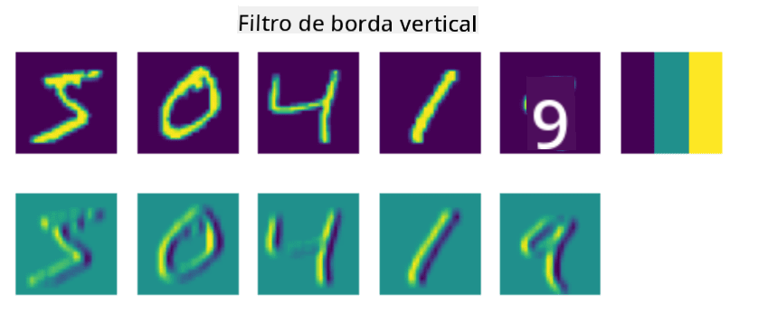
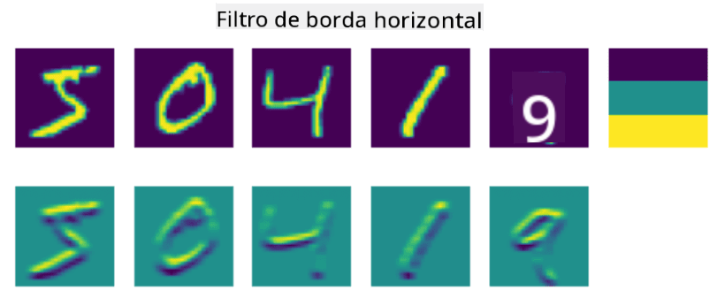
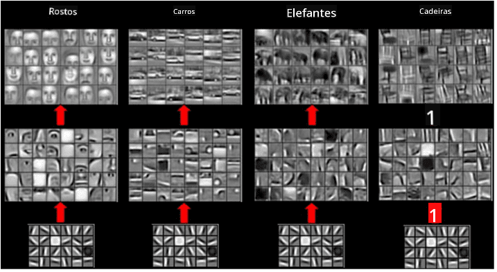

<!--
CO_OP_TRANSLATOR_METADATA:
{
  "original_hash": "088837b42b7d99198bf62db8a42411e0",
  "translation_date": "2025-08-26T09:29:51+00:00",
  "source_file": "lessons/4-ComputerVision/07-ConvNets/README.md",
  "language_code": "br"
}
-->
# Redes Neurais Convolucionais

Já vimos anteriormente que redes neurais são bastante eficazes ao lidar com imagens, e até mesmo um perceptron de uma única camada é capaz de reconhecer dígitos manuscritos do conjunto de dados MNIST com uma precisão razoável. No entanto, o conjunto de dados MNIST é muito especial, pois todos os dígitos estão centralizados na imagem, o que torna a tarefa mais simples.

## [Questionário pré-aula](https://red-field-0a6ddfd03.1.azurestaticapps.net/quiz/107)

Na vida real, queremos ser capazes de reconhecer objetos em uma imagem independentemente de sua localização exata. A visão computacional é diferente da classificação genérica, porque, ao tentar encontrar um determinado objeto na imagem, estamos analisando a imagem em busca de **padrões** específicos e suas combinações. Por exemplo, ao procurar por um gato, podemos primeiro buscar por linhas horizontais, que podem formar os bigodes, e então uma certa combinação de bigodes pode nos indicar que se trata de uma imagem de um gato. A posição relativa e a presença de certos padrões são importantes, e não sua posição exata na imagem.

Para extrair padrões, utilizaremos o conceito de **filtros convolucionais**. Como você sabe, uma imagem é representada por uma matriz 2D ou um tensor 3D com profundidade de cor. Aplicar um filtro significa que pegamos uma matriz relativamente pequena chamada de **kernel do filtro**, e para cada pixel na imagem original calculamos a média ponderada com os pontos vizinhos. Podemos imaginar isso como uma pequena janela deslizando sobre toda a imagem e calculando a média de todos os pixels de acordo com os pesos na matriz do kernel do filtro.

 | 
----|----

> Imagem por Dmitry Soshnikov

Por exemplo, se aplicarmos filtros de borda vertical e horizontal 3x3 aos dígitos do MNIST, podemos destacar (por exemplo, obter valores altos) onde há bordas verticais e horizontais na imagem original. Assim, esses dois filtros podem ser usados para "procurar" bordas. Da mesma forma, podemos projetar diferentes filtros para buscar outros padrões de baixo nível:

> Imagem do [Banco de Filtros Leung-Malik](https://www.robots.ox.ac.uk/~vgg/research/texclass/filters.html)

No entanto, embora possamos projetar manualmente os filtros para extrair alguns padrões, também podemos projetar a rede de forma que ela aprenda os padrões automaticamente. Essa é uma das principais ideias por trás das CNNs.

## Principais ideias por trás das CNNs

O funcionamento das CNNs baseia-se nas seguintes ideias importantes:

* Filtros convolucionais podem extrair padrões.
* Podemos projetar a rede de forma que os filtros sejam treinados automaticamente.
* Podemos usar a mesma abordagem para encontrar padrões em características de alto nível, não apenas na imagem original. Assim, a extração de características nas CNNs funciona em uma hierarquia de características, começando com combinações de pixels de baixo nível até combinações de alto nível de partes da imagem.

> Imagem de [um artigo de Hislop-Lynch](https://www.semanticscholar.org/paper/Computer-vision-based-pedestrian-trajectory-Hislop-Lynch/26e6f74853fc9bbb7487b06dc2cf095d36c9021d), baseado em [sua pesquisa](https://dl.acm.org/doi/abs/10.1145/1553374.1553453)

## ✍️ Exercícios: Redes Neurais Convolucionais

Vamos continuar explorando como as redes neurais convolucionais funcionam e como podemos obter filtros treináveis, trabalhando nos notebooks correspondentes:

* [Redes Neurais Convolucionais - PyTorch](../../../../../lessons/4-ComputerVision/07-ConvNets/ConvNetsPyTorch.ipynb)
* [Redes Neurais Convolucionais - TensorFlow](../../../../../lessons/4-ComputerVision/07-ConvNets/ConvNetsTF.ipynb)

## Arquitetura em Pirâmide

A maioria das CNNs usadas para processamento de imagens segue uma chamada arquitetura em pirâmide. A primeira camada convolucional aplicada às imagens originais geralmente possui um número relativamente baixo de filtros (8-16), que correspondem a diferentes combinações de pixels, como linhas horizontais/verticais ou traços. No nível seguinte, reduzimos a dimensão espacial da rede e aumentamos o número de filtros, o que corresponde a mais combinações possíveis de características simples. Com cada camada, à medida que avançamos em direção ao classificador final, as dimensões espaciais da imagem diminuem e o número de filtros aumenta.

Como exemplo, vejamos a arquitetura do VGG-16, uma rede que alcançou 92,7% de precisão na classificação top-5 do ImageNet em 2014:

> Imagem de [Researchgate](https://www.researchgate.net/figure/Vgg16-model-structure-To-get-the-VGG-NIN-model-we-replace-the-2-nd-4-th-6-th-7-th_fig2_335194493)

## Arquiteturas de CNN Mais Conhecidas

[Continue seus estudos sobre as arquiteturas de CNN mais conhecidas](CNN_Architectures.md)

**Aviso Legal**:  
Este documento foi traduzido utilizando o serviço de tradução por IA [Co-op Translator](https://github.com/Azure/co-op-translator). Embora nos esforcemos para garantir a precisão, esteja ciente de que traduções automáticas podem conter erros ou imprecisões. O documento original em seu idioma nativo deve ser considerado a fonte oficial. Para informações críticas, recomenda-se a tradução profissional feita por humanos. Não nos responsabilizamos por quaisquer mal-entendidos ou interpretações equivocadas decorrentes do uso desta tradução.