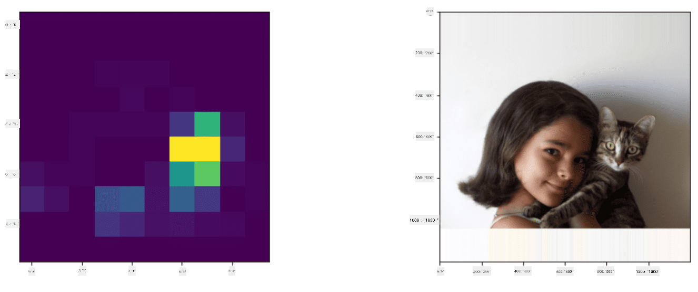
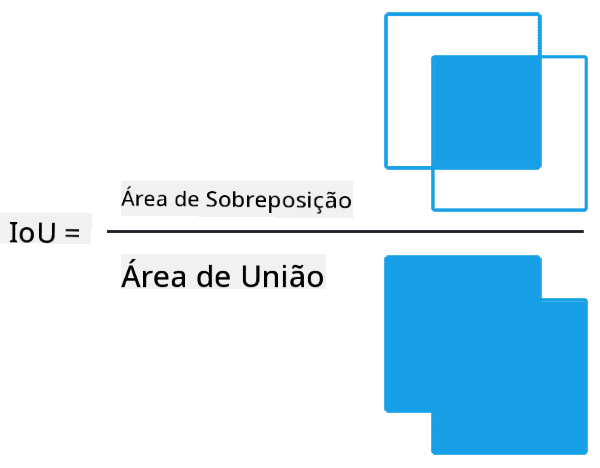
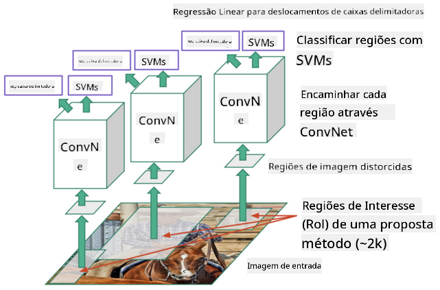
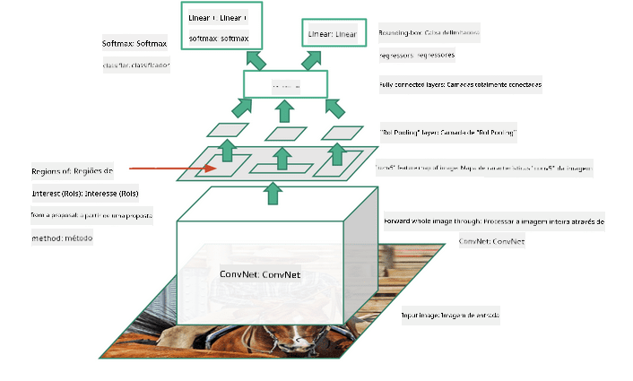
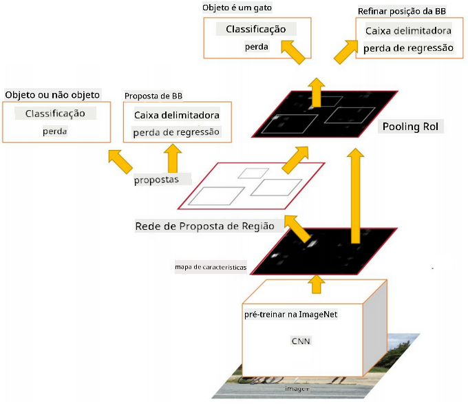
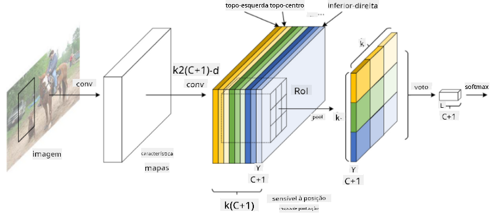
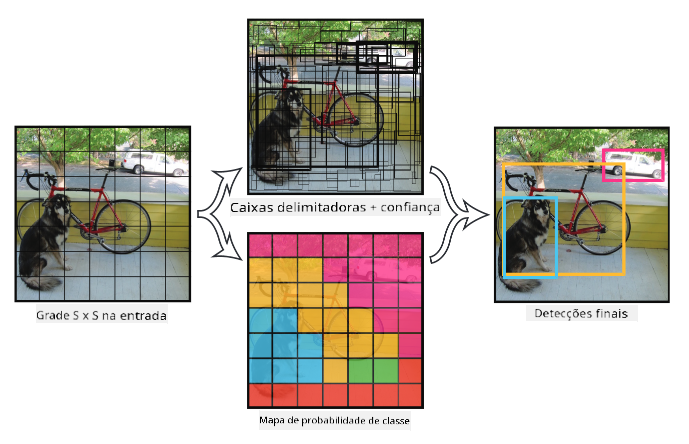

<!--
CO_OP_TRANSLATOR_METADATA:
{
  "original_hash": "d85c8b08f6d1b48fd7f35b99f93c1138",
  "translation_date": "2025-08-26T09:23:50+00:00",
  "source_file": "lessons/4-ComputerVision/11-ObjectDetection/README.md",
  "language_code": "br"
}
-->
# Detecção de Objetos

Os modelos de classificação de imagens que abordamos até agora tomam uma imagem e produzem um resultado categórico, como a classe 'número' em um problema MNIST. No entanto, em muitos casos, não queremos apenas saber que uma imagem retrata objetos - queremos determinar sua localização exata. Este é exatamente o objetivo da **detecção de objetos**.

## [Quiz pré-aula](https://ff-quizzes.netlify.app/en/ai/quiz/21)

> Imagem do [site YOLO v2](https://pjreddie.com/darknet/yolov2/)

## Uma Abordagem Ingênua para Detecção de Objetos

Suponha que queremos encontrar um gato em uma imagem. Uma abordagem muito ingênua para detecção de objetos seria a seguinte:

1. Dividir a imagem em vários blocos.
2. Executar a classificação de imagem em cada bloco.
3. Os blocos que resultarem em uma ativação suficientemente alta podem ser considerados como contendo o objeto em questão.

> *Imagem do [Notebook de Exercícios](../../../../../lessons/4-ComputerVision/11-ObjectDetection/ObjectDetection-TF.ipynb)*

No entanto, essa abordagem está longe de ser ideal, pois só permite que o algoritmo localize a caixa delimitadora do objeto de forma muito imprecisa. Para uma localização mais precisa, precisamos executar algum tipo de **regressão** para prever as coordenadas das caixas delimitadoras - e, para isso, precisamos de conjuntos de dados específicos.

## Regressão para Detecção de Objetos

[Este post no blog](https://towardsdatascience.com/object-detection-with-neural-networks-a4e2c46b4491) oferece uma ótima introdução à detecção de formas.

## Conjuntos de Dados para Detecção de Objetos

Você pode encontrar os seguintes conjuntos de dados para essa tarefa:

* [PASCAL VOC](http://host.robots.ox.ac.uk/pascal/VOC/) - 20 classes
* [COCO](http://cocodataset.org/#home) - Objetos Comuns em Contexto. 80 classes, caixas delimitadoras e máscaras de segmentação

## Métricas de Detecção de Objetos

### Interseção sobre União

Enquanto na classificação de imagens é fácil medir o desempenho do algoritmo, na detecção de objetos precisamos medir tanto a correção da classe quanto a precisão da localização inferida da caixa delimitadora. Para este último, usamos a chamada **Interseção sobre União** (IoU), que mede o quão bem duas caixas (ou duas áreas arbitrárias) se sobrepõem.

> *Figura 2 deste [excelente post sobre IoU](https://pyimagesearch.com/2016/11/07/intersection-over-union-iou-for-object-detection/)*

A ideia é simples - dividimos a área de interseção entre duas figuras pela área de sua união. Para duas áreas idênticas, IoU seria 1, enquanto para áreas completamente separadas será 0. Caso contrário, variará de 0 a 1. Normalmente, consideramos apenas as caixas delimitadoras para as quais IoU está acima de um determinado valor.

### Precisão Média

Suponha que queremos medir o quão bem uma determinada classe de objetos $C$ é reconhecida. Para medir isso, usamos a métrica de **Precisão Média**, que é calculada da seguinte forma:

1. Considere a curva de Precisão-Recall que mostra a precisão dependendo de um valor de limiar de detecção (de 0 a 1).
2. Dependendo do limiar, detectaremos mais ou menos objetos na imagem, e diferentes valores de precisão e recall.
3. A curva terá a seguinte aparência:

> *Imagem do [NeuroWorkshop](http://github.com/shwars/NeuroWorkshop)*

A Precisão Média para uma classe $C$ é a área sob essa curva. Mais precisamente, o eixo Recall é normalmente dividido em 10 partes, e a Precisão é calculada como a média de todos esses pontos:

$$
AP = {1\over11}\sum_{i=0}^{10}\mbox{Precision}(\mbox{Recall}={i\over10})
$$

### AP e IoU

Consideramos apenas as detecções para as quais IoU está acima de um determinado valor. Por exemplo, no conjunto de dados PASCAL VOC, normalmente $\mbox{IoU Threshold} = 0.5$ é assumido, enquanto no COCO AP é medido para diferentes valores de $\mbox{IoU Threshold}$.

> *Imagem do [NeuroWorkshop](http://github.com/shwars/NeuroWorkshop)*

### Precisão Média Global - mAP

A principal métrica para Detecção de Objetos é chamada de **Precisão Média Global**, ou **mAP**. É o valor da Precisão Média, calculado como a média entre todas as classes de objetos, e às vezes também sobre $\mbox{IoU Threshold}$. Em mais detalhes, o processo de cálculo do **mAP** é descrito
[neste post](https://medium.com/@timothycarlen/understanding-the-map-evaluation-metric-for-object-detection-a07fe6962cf3)), e também [aqui com exemplos de código](https://gist.github.com/tarlen5/008809c3decf19313de216b9208f3734).

## Diferentes Abordagens para Detecção de Objetos

Existem duas grandes classes de algoritmos de detecção de objetos:

* **Redes de Proposta de Região** (R-CNN, Fast R-CNN, Faster R-CNN). A ideia principal é gerar **Regiões de Interesse** (ROI) e executar CNN sobre elas, procurando a ativação máxima. É um pouco semelhante à abordagem ingênua, com a exceção de que as ROIs são geradas de forma mais inteligente. Uma das principais desvantagens desses métodos é que eles são lentos, pois precisamos de muitas passagens do classificador CNN sobre a imagem.
* Métodos de **uma única passagem** (YOLO, SSD, RetinaNet). Nessas arquiteturas, projetamos a rede para prever classes e ROIs em uma única passagem.

### R-CNN: CNN Baseada em Região

[R-CNN](http://islab.ulsan.ac.kr/files/announcement/513/rcnn_pami.pdf) usa [Selective Search](http://www.huppelen.nl/publications/selectiveSearchDraft.pdf) para gerar uma estrutura hierárquica de regiões ROI, que são então passadas por extratores de características CNN e classificadores SVM para determinar a classe do objeto, e regressão linear para determinar as coordenadas da *caixa delimitadora*. [Artigo Oficial](https://arxiv.org/pdf/1506.01497v1.pdf)

> *Imagem de van de Sande et al. ICCV’11*

> *Imagens deste [blog](https://towardsdatascience.com/r-cnn-fast-r-cnn-faster-r-cnn-yolo-object-detection-algorithms-36d53571365e)*

### F-RCNN - Fast R-CNN

Essa abordagem é semelhante à R-CNN, mas as regiões são definidas após as camadas de convolução terem sido aplicadas.

> Imagem do [Artigo Oficial](https://www.cv-foundation.org/openaccess/content_iccv_2015/papers/Girshick_Fast_R-CNN_ICCV_2015_paper.pdf), [arXiv](https://arxiv.org/pdf/1504.08083.pdf), 2015

### Faster R-CNN

A ideia principal dessa abordagem é usar uma rede neural para prever ROIs - a chamada *Rede de Proposta de Região*. [Artigo](https://arxiv.org/pdf/1506.01497.pdf), 2016

> Imagem do [Artigo Oficial](https://arxiv.org/pdf/1506.01497.pdf)

### R-FCN: Rede Totalmente Convolucional Baseada em Região

Este algoritmo é ainda mais rápido que o Faster R-CNN. A ideia principal é a seguinte:

1. Extraímos características usando ResNet-101.
2. As características são processadas por **Position-Sensitive Score Map**. Cada objeto de $C$ classes é dividido em $k\times k$ regiões, e treinamos para prever partes dos objetos.
3. Para cada parte das $k\times k$ regiões, todas as redes votam pelas classes de objetos, e a classe de objeto com o maior número de votos é selecionada.

> Imagem do [Artigo Oficial](https://arxiv.org/abs/1605.06409)

### YOLO - You Only Look Once

YOLO é um algoritmo de uma única passagem em tempo real. A ideia principal é a seguinte:

 * A imagem é dividida em regiões $S\times S$.
 * Para cada região, **CNN** prevê $n$ objetos possíveis, coordenadas da *caixa delimitadora* e *confiança*=*probabilidade* * IoU.

 

> Imagem do [Artigo Oficial](https://arxiv.org/abs/1506.02640)

### Outros Algoritmos

* RetinaNet: [Artigo Oficial](https://arxiv.org/abs/1708.02002)
   - [Implementação em PyTorch no Torchvision](https://pytorch.org/vision/stable/_modules/torchvision/models/detection/retinanet.html)
   - [Implementação em Keras](https://github.com/fizyr/keras-retinanet)
   - [Detecção de Objetos com RetinaNet](https://keras.io/examples/vision/retinanet/) em Exemplos do Keras
* SSD (Single Shot Detector): [Artigo Oficial](https://arxiv.org/abs/1512.02325)

## ✍️ Exercícios: Detecção de Objetos

Continue seu aprendizado no seguinte notebook:

[ObjectDetection.ipynb](../../../../../lessons/4-ComputerVision/11-ObjectDetection/ObjectDetection.ipynb)

## Conclusão

Nesta lição, você fez um tour rápido por todas as várias maneiras de realizar a detecção de objetos!

## 🚀 Desafio

Leia estes artigos e notebooks sobre YOLO e experimente por conta própria:

* [Bom post no blog](https://www.analyticsvidhya.com/blog/2018/12/practical-guide-object-detection-yolo-framewor-python/) descrevendo YOLO
 * [Site Oficial](https://pjreddie.com/darknet/yolo/)
 * YOLO: [Implementação em Keras](https://github.com/experiencor/keras-yolo2), [notebook passo a passo](https://github.com/experiencor/basic-yolo-keras/blob/master/Yolo%20Step-by-Step.ipynb)
 * YOLO v2: [Implementação em Keras](https://github.com/experiencor/keras-yolo2), [notebook passo a passo](https://github.com/experiencor/keras-yolo2/blob/master/Yolo%20Step-by-Step.ipynb)

## [Quiz pós-aula](https://ff-quizzes.netlify.app/en/ai/quiz/22)

## Revisão e Estudo Individual

* [Detecção de Objetos](https://tjmachinelearning.com/lectures/1718/obj/) por Nikhil Sardana
* [Uma boa comparação de algoritmos de detecção de objetos](https://lilianweng.github.io/lil-log/2018/12/27/object-detection-part-4.html)
* [Revisão de Algoritmos de Aprendizado Profundo para Detecção de Objetos](https://medium.com/comet-app/review-of-deep-learning-algorithms-for-object-detection-c1f3d437b852)
* [Uma Introdução Passo a Passo aos Algoritmos Básicos de Detecção de Objetos](https://www.analyticsvidhya.com/blog/2018/10/a-step-by-step-introduction-to-the-basic-object-detection-algorithms-part-1/)
* [Implementação de Faster R-CNN em Python para Detecção de Objetos](https://www.analyticsvidhya.com/blog/2018/11/implementation-faster-r-cnn-python-object-detection/)

## [Tarefa: Detecção de Objetos](lab/README.md)

**Aviso Legal**:  
Este documento foi traduzido utilizando o serviço de tradução por IA [Co-op Translator](https://github.com/Azure/co-op-translator). Embora nos esforcemos para garantir a precisão, esteja ciente de que traduções automáticas podem conter erros ou imprecisões. O documento original em seu idioma nativo deve ser considerado a fonte oficial. Para informações críticas, recomenda-se a tradução profissional feita por humanos. Não nos responsabilizamos por quaisquer mal-entendidos ou interpretações equivocadas decorrentes do uso desta tradução.