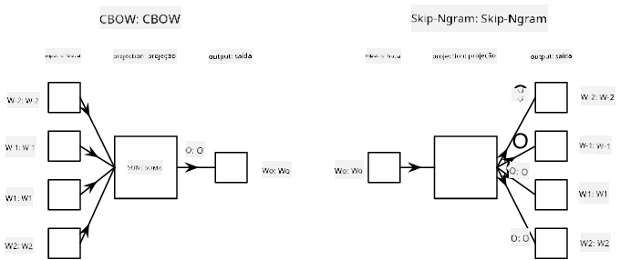

<!--
CO_OP_TRANSLATOR_METADATA:
{
  "original_hash": "31b46ba1f3aa78578134d4829f88be53",
  "translation_date": "2025-08-26T08:31:15+00:00",
  "source_file": "lessons/5-NLP/15-LanguageModeling/README.md",
  "language_code": "br"
}
-->
# Modelagem de Linguagem

Embeddings semânticos, como Word2Vec e GloVe, são, na verdade, um primeiro passo em direção à **modelagem de linguagem** - criando modelos que de alguma forma *entendem* (ou *representam*) a natureza da linguagem.

## [Pré-quiz da aula](https://red-field-0a6ddfd03.1.azurestaticapps.net/quiz/115)

A ideia principal por trás da modelagem de linguagem é treiná-los em conjuntos de dados não rotulados de forma não supervisionada. Isso é importante porque temos uma enorme quantidade de texto não rotulado disponível, enquanto a quantidade de texto rotulado sempre será limitada pelo esforço necessário para rotular. Na maioria das vezes, podemos construir modelos de linguagem que conseguem **prever palavras ausentes** no texto, porque é fácil mascarar uma palavra aleatória no texto e usá-la como um exemplo de treinamento.

## Treinando Embeddings

Nos nossos exemplos anteriores, usamos embeddings semânticos pré-treinados, mas é interessante ver como esses embeddings podem ser treinados. Existem várias ideias possíveis que podem ser utilizadas:

* **Modelagem de linguagem N-Gram**, onde prevemos um token observando os N tokens anteriores (N-grama).
* **Continuous Bag-of-Words** (CBoW), onde prevemos o token do meio $W_0$ em uma sequência de tokens $W_{-N}$, ..., $W_N$.
* **Skip-gram**, onde prevemos um conjunto de tokens vizinhos {$W_{-N},\dots, W_{-1}, W_1,\dots, W_N$} a partir do token do meio $W_0$.

> Imagem retirada [deste artigo](https://arxiv.org/pdf/1301.3781.pdf)

## ✍️ Notebooks de Exemplo: Treinando o modelo CBoW

Continue seu aprendizado nos seguintes notebooks:

* [Treinando CBoW Word2Vec com TensorFlow](../../../../../lessons/5-NLP/15-LanguageModeling/CBoW-TF.ipynb)
* [Treinando CBoW Word2Vec com PyTorch](../../../../../lessons/5-NLP/15-LanguageModeling/CBoW-PyTorch.ipynb)

## Conclusão

Na lição anterior, vimos que embeddings de palavras funcionam como mágica! Agora sabemos que treinar embeddings de palavras não é uma tarefa muito complexa, e devemos ser capazes de treinar nossos próprios embeddings para textos específicos de domínio, se necessário.

## [Pós-quiz da aula](https://red-field-0a6ddfd03.1.azurestaticapps.net/quiz/215)

## Revisão e Autoestudo

* [Tutorial oficial do PyTorch sobre Modelagem de Linguagem](https://pytorch.org/tutorials/beginner/nlp/word_embeddings_tutorial.html).
* [Tutorial oficial do TensorFlow sobre treinamento do modelo Word2Vec](https://www.TensorFlow.org/tutorials/text/word2vec).
* O uso do framework **gensim** para treinar os embeddings mais comumente usados em poucas linhas de código é descrito [nesta documentação](https://pytorch.org/tutorials/beginner/nlp/word_embeddings_tutorial.html).

## 🚀 [Tarefa: Treinar Modelo Skip-Gram](lab/README.md)

No laboratório, desafiamos você a modificar o código desta lição para treinar o modelo skip-gram em vez do CBoW. [Leia os detalhes](lab/README.md)

**Aviso Legal**:  
Este documento foi traduzido utilizando o serviço de tradução por IA [Co-op Translator](https://github.com/Azure/co-op-translator). Embora nos esforcemos para garantir a precisão, esteja ciente de que traduções automáticas podem conter erros ou imprecisões. O documento original em seu idioma nativo deve ser considerado a fonte oficial. Para informações críticas, recomenda-se a tradução profissional feita por humanos. Não nos responsabilizamos por quaisquer mal-entendidos ou interpretações equivocadas decorrentes do uso desta tradução.