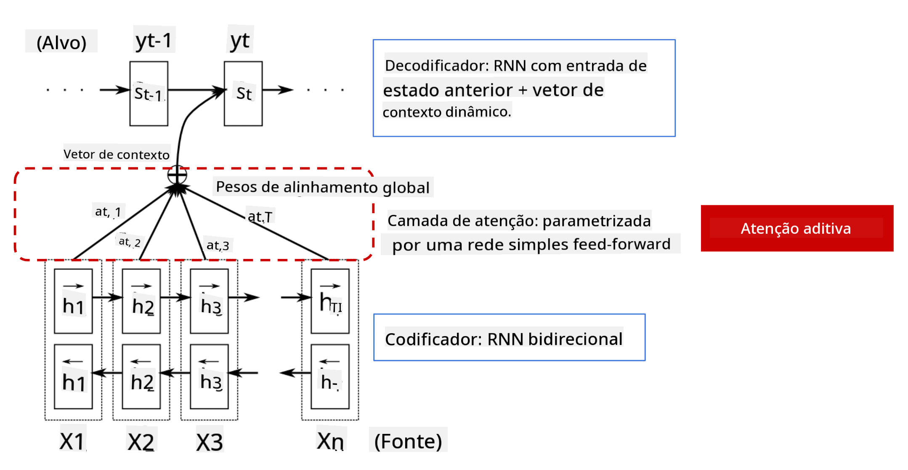
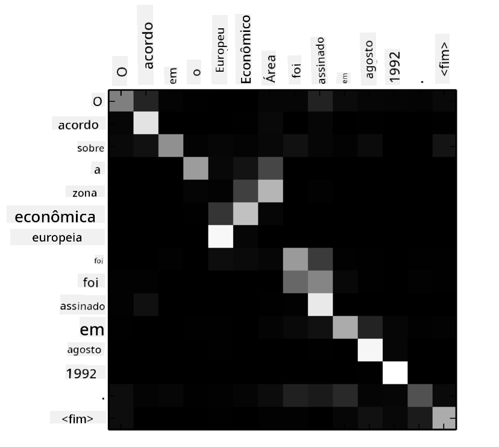
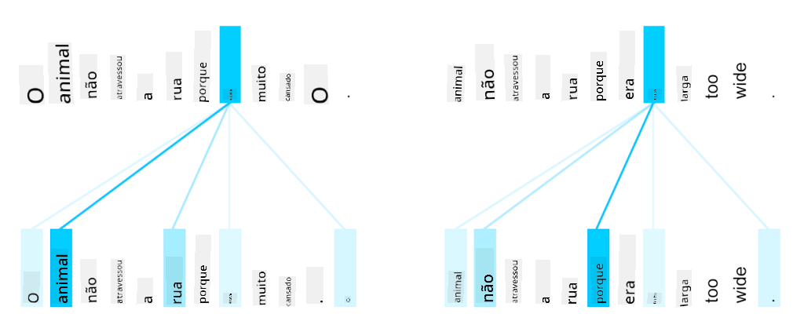

<!--
CO_OP_TRANSLATOR_METADATA:
{
  "original_hash": "7e617f0b8de85a43957a853aba09bfeb",
  "translation_date": "2025-08-26T08:38:53+00:00",
  "source_file": "lessons/5-NLP/18-Transformers/README.md",
  "language_code": "br"
}
-->
# Mecanismos de Atenção e Transformers

## [Quiz pré-aula](https://ff-quizzes.netlify.app/en/ai/quiz/35)

Um dos problemas mais importantes no domínio de NLP é a **tradução automática**, uma tarefa essencial que sustenta ferramentas como o Google Tradutor. Nesta seção, vamos focar na tradução automática ou, de forma mais geral, em qualquer tarefa de *sequência para sequência* (também chamada de **transdução de sentenças**).

Com RNNs, a tarefa de sequência para sequência é implementada por duas redes recorrentes, onde uma rede, o **codificador**, comprime uma sequência de entrada em um estado oculto, enquanto outra rede, o **decodificador**, expande esse estado oculto em um resultado traduzido. Existem alguns problemas com essa abordagem:

* O estado final da rede codificadora tem dificuldade em lembrar o início de uma sentença, causando baixa qualidade do modelo para sentenças longas.
* Todas as palavras em uma sequência têm o mesmo impacto no resultado. Na realidade, no entanto, palavras específicas na sequência de entrada frequentemente têm mais impacto nos resultados sequenciais do que outras.

**Mecanismos de Atenção** fornecem um meio de ponderar o impacto contextual de cada vetor de entrada em cada previsão de saída da RNN. Isso é implementado criando atalhos entre os estados intermediários da RNN de entrada e a RNN de saída. Dessa forma, ao gerar o símbolo de saída yt, levamos em conta todos os estados ocultos de entrada hi, com diferentes coeficientes de peso αt,i.

> O modelo codificador-decodificador com mecanismo de atenção aditiva em [Bahdanau et al., 2015](https://arxiv.org/pdf/1409.0473.pdf), citado deste [post de blog](https://lilianweng.github.io/lil-log/2018/06/24/attention-attention.html)

A matriz de atenção {αi,j} representaria o grau em que certas palavras de entrada influenciam a geração de uma determinada palavra na sequência de saída. Abaixo está um exemplo de tal matriz:

> Figura de [Bahdanau et al., 2015](https://arxiv.org/pdf/1409.0473.pdf) (Fig.3)

Os mecanismos de atenção são responsáveis por grande parte do estado da arte atual ou próximo ao atual em NLP. No entanto, adicionar atenção aumenta significativamente o número de parâmetros do modelo, o que levou a problemas de escalabilidade com RNNs. Uma restrição chave na escalabilidade das RNNs é que a natureza recorrente dos modelos torna desafiador agrupar e paralelizar o treinamento. Em uma RNN, cada elemento de uma sequência precisa ser processado em ordem sequencial, o que significa que não pode ser facilmente paralelizado.

> Figura do [Blog do Google](https://research.googleblog.com/2016/09/a-neural-network-for-machine.html)

A adoção de mecanismos de atenção combinada com essa restrição levou à criação dos modelos Transformers, agora estado da arte, que conhecemos e usamos hoje, como BERT e Open-GPT3.

## Modelos Transformers

Uma das principais ideias por trás dos transformers é evitar a natureza sequencial das RNNs e criar um modelo que seja paralelizável durante o treinamento. Isso é alcançado implementando duas ideias:

* codificação posicional
* uso de mecanismo de autoatenção para capturar padrões em vez de RNNs (ou CNNs) (é por isso que o artigo que introduz transformers é chamado *[Attention is all you need](https://arxiv.org/abs/1706.03762)*)

### Codificação/Embelezamento Posicional

A ideia da codificação posicional é a seguinte:  
1. Ao usar RNNs, a posição relativa dos tokens é representada pelo número de passos e, portanto, não precisa ser explicitamente representada.  
2. No entanto, ao mudar para atenção, precisamos saber as posições relativas dos tokens dentro de uma sequência.  
3. Para obter codificação posicional, aumentamos nossa sequência de tokens com uma sequência de posições dos tokens na sequência (ou seja, uma sequência de números 0,1, ...).  
4. Em seguida, misturamos a posição do token com um vetor de embelezamento do token. Para transformar a posição (inteiro) em um vetor, podemos usar diferentes abordagens:

* Embelezamento treinável, semelhante ao embelezamento de tokens. Esta é a abordagem que consideramos aqui. Aplicamos camadas de embelezamento tanto nos tokens quanto em suas posições, resultando em vetores de embelezamento de mesmas dimensões, que então somamos.
* Função de codificação de posição fixa, conforme proposto no artigo original.

> Imagem do autor

O resultado que obtemos com o embelezamento posicional incorpora tanto o token original quanto sua posição dentro de uma sequência.

### Autoatenção Multi-Head

Em seguida, precisamos capturar alguns padrões dentro de nossa sequência. Para isso, os transformers usam um mecanismo de **autoatenção**, que é essencialmente atenção aplicada à mesma sequência como entrada e saída. Aplicar autoatenção nos permite levar em conta o **contexto** dentro da sentença e ver quais palavras estão inter-relacionadas. Por exemplo, permite ver quais palavras são referidas por correferências, como *it*, e também levar o contexto em consideração:

> Imagem do [Blog do Google](https://research.googleblog.com/2017/08/transformer-novel-neural-network.html)

Nos transformers, usamos **Atenção Multi-Head** para dar à rede o poder de capturar vários tipos diferentes de dependências, como relações de palavras de longo prazo vs. curto prazo, correferência vs. algo mais, etc.

[Notebook TensorFlow](../../../../../lessons/5-NLP/18-Transformers/TransformersTF.ipynb) contém mais detalhes sobre a implementação das camadas de transformers.

### Atenção Codificador-Decodificador

Nos transformers, a atenção é usada em dois lugares:

* Para capturar padrões dentro do texto de entrada usando autoatenção.
* Para realizar tradução de sequência - é a camada de atenção entre codificador e decodificador.

A atenção codificador-decodificador é muito semelhante ao mecanismo de atenção usado em RNNs, conforme descrito no início desta seção. Este diagrama animado explica o papel da atenção codificador-decodificador.

Como cada posição de entrada é mapeada independentemente para cada posição de saída, os transformers podem paralelizar melhor do que as RNNs, o que permite modelos de linguagem muito maiores e mais expressivos. Cada cabeça de atenção pode ser usada para aprender diferentes relações entre palavras que melhoram tarefas de Processamento de Linguagem Natural.

## BERT

**BERT** (Bidirectional Encoder Representations from Transformers) é uma rede transformer muito grande com várias camadas: 12 camadas para *BERT-base* e 24 para *BERT-large*. O modelo é primeiro pré-treinado em um grande corpus de dados de texto (WikiPedia + livros) usando treinamento não supervisionado (prevendo palavras mascaradas em uma sentença). Durante o pré-treinamento, o modelo absorve níveis significativos de compreensão de linguagem que podem ser aproveitados com outros conjuntos de dados usando ajuste fino. Esse processo é chamado de **aprendizado por transferência**.

> Imagem [fonte](http://jalammar.github.io/illustrated-bert/)

## ✍️ Exercícios: Transformers

Continue seu aprendizado nos seguintes notebooks:

* [Transformers em PyTorch](../../../../../lessons/5-NLP/18-Transformers/TransformersPyTorch.ipynb)
* [Transformers em TensorFlow](../../../../../lessons/5-NLP/18-Transformers/TransformersTF.ipynb)

## Conclusão

Nesta lição, você aprendeu sobre Transformers e Mecanismos de Atenção, ferramentas essenciais na caixa de ferramentas de NLP. Existem muitas variações de arquiteturas de Transformers, incluindo BERT, DistilBERT, BigBird, OpenGPT3 e mais, que podem ser ajustadas. O pacote [HuggingFace](https://github.com/huggingface/) fornece um repositório para treinar muitas dessas arquiteturas com PyTorch e TensorFlow.

## 🚀 Desafio

## [Quiz pós-aula](https://ff-quizzes.netlify.app/en/ai/quiz/36)

## Revisão e Autoestudo

* [Post de blog](https://mchromiak.github.io/articles/2017/Sep/12/Transformer-Attention-is-all-you-need/), explicando o clássico artigo [Attention is all you need](https://arxiv.org/abs/1706.03762) sobre transformers.
* [Uma série de posts de blog](https://towardsdatascience.com/transformers-explained-visually-part-1-overview-of-functionality-95a6dd460452) sobre transformers, explicando a arquitetura em detalhes.

## [Tarefa](assignment.md)

**Aviso Legal**:  
Este documento foi traduzido utilizando o serviço de tradução por IA [Co-op Translator](https://github.com/Azure/co-op-translator). Embora nos esforcemos para garantir a precisão, esteja ciente de que traduções automáticas podem conter erros ou imprecisões. O documento original em seu idioma nativo deve ser considerado a fonte oficial. Para informações críticas, recomenda-se a tradução profissional feita por humanos. Não nos responsabilizamos por quaisquer mal-entendidos ou interpretações equivocadas decorrentes do uso desta tradução.