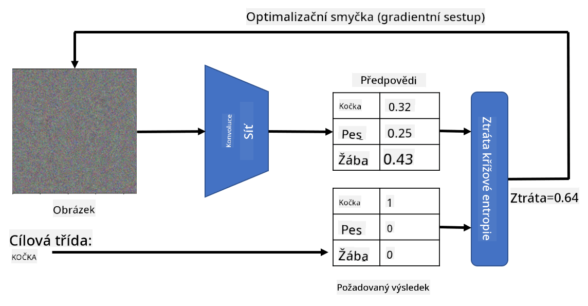

<!--
CO_OP_TRANSLATOR_METADATA:
{
  "original_hash": "717775c4050ccbffbe0c961ad8bf7bf7",
  "translation_date": "2025-08-25T23:06:53+00:00",
  "source_file": "lessons/4-ComputerVision/08-TransferLearning/README.md",
  "language_code": "cs"
}
-->
# Předtrénované sítě a transfer learning

Trénování CNN může zabrat hodně času a vyžaduje velké množství dat. Nicméně většina času je strávena učením nejlepších nízkoúrovňových filtrů, které síť může použít k extrakci vzorů z obrázků. Vyvstává přirozená otázka – můžeme použít neuronovou síť natrénovanou na jednom datasetu a přizpůsobit ji k klasifikaci jiných obrázků bez nutnosti kompletního trénovacího procesu?

## [Pre-lecture quiz](https://ff-quizzes.netlify.app/en/ai/quiz/15)

Tento přístup se nazývá **transfer learning**, protože přenášíme určité znalosti z jednoho modelu neuronové sítě na jiný. V transfer learningu obvykle začínáme s předtrénovaným modelem, který byl natrénován na nějakém velkém datasetu obrázků, jako je například **ImageNet**. Tyto modely už dokážou dobře extrahovat různé rysy z obecných obrázků, a v mnoha případech stačí postavit klasifikátor na vrcholu těchto extrahovaných rysů, aby bylo dosaženo dobrého výsledku.

> ✅ Transfer learning je termín, který najdete i v jiných akademických oborech, například ve vzdělávání. Odkazuje na proces přenosu znalostí z jedné oblasti do jiné.

## Předtrénované modely jako extraktory rysů

Konvoluční sítě, o kterých jsme mluvili v předchozí sekci, obsahují řadu vrstev, z nichž každá má za úkol extrahovat určité rysy z obrázku, počínaje nízkoúrovňovými kombinacemi pixelů (například horizontální/vertikální čáry nebo tahy), až po vyšší úrovně kombinací rysů, odpovídající věcem jako oko nebo plamen. Pokud natrénujeme CNN na dostatečně velkém datasetu obecných a různorodých obrázků, síť by měla být schopna naučit se extrahovat tyto běžné rysy.

Keras i PyTorch obsahují funkce pro snadné načtení předtrénovaných vah neuronových sítí pro některé běžné architektury, z nichž většina byla natrénována na obrázcích z ImageNetu. Nejčastěji používané jsou popsány na stránce [CNN Architectures](../07-ConvNets/CNN_Architectures.md) z předchozí lekce. Zejména můžete zvážit použití jednoho z následujících:

* **VGG-16/VGG-19**, což jsou relativně jednoduché modely, které stále poskytují dobrou přesnost. Často je dobré začít s VGG jako první pokus, abyste viděli, jak transfer learning funguje.
* **ResNet** je rodina modelů navržená Microsoft Research v roce 2015. Mají více vrstev, a proto vyžadují více zdrojů.
* **MobileNet** je rodina modelů s menší velikostí, vhodná pro mobilní zařízení. Použijte je, pokud máte omezené zdroje a můžete obětovat trochu přesnosti.

Zde jsou ukázkové rysy extrahované z obrázku kočky pomocí sítě VGG-16:

## Dataset Kočky vs. Psi

V tomto příkladu použijeme dataset [Kočky a Psi](https://www.microsoft.com/download/details.aspx?id=54765&WT.mc_id=academic-77998-cacaste), který je velmi blízký reálnému scénáři klasifikace obrázků.

## ✍️ Cvičení: Transfer Learning

Podívejme se na transfer learning v akci v odpovídajících noteboocích:

* [Transfer Learning - PyTorch](../../../../../lessons/4-ComputerVision/08-TransferLearning/TransferLearningPyTorch.ipynb)
* [Transfer Learning - TensorFlow](../../../../../lessons/4-ComputerVision/08-TransferLearning/TransferLearningTF.ipynb)

## Vizualizace Adversarial Cat

Předtrénovaná neuronová síť obsahuje různé vzory uvnitř svého *mozku*, včetně představ o **ideální kočce** (stejně jako ideálním psovi, ideální zebře atd.). Bylo by zajímavé nějak **vizualizovat tento obrázek**. Nicméně to není jednoduché, protože vzory jsou rozprostřeny po celých vahách sítě a také organizovány v hierarchické struktuře.

Jedním z přístupů, které můžeme použít, je začít s náhodným obrázkem a poté se pokusit pomocí techniky **optimalizace gradientního sestupu** upravit tento obrázek tak, aby síť začala myslet, že je to kočka.

Pokud to však uděláme, dostaneme něco velmi podobného náhodnému šumu. To je proto, že *existuje mnoho způsobů, jak síť přimět myslet si, že vstupní obrázek je kočka*, včetně některých, které vizuálně nedávají smysl. Zatímco tyto obrázky obsahují mnoho vzorů typických pro kočku, nic je nenutí být vizuálně rozlišitelné.

Pro zlepšení výsledku můžeme do ztrátové funkce přidat další termín, který se nazývá **variation loss**. Je to metrika, která ukazuje, jak podobné jsou sousední pixely obrázku. Minimalizace variation loss činí obrázek hladším a zbavuje se šumu – tím odhaluje vizuálně přitažlivější vzory. Zde je příklad takových "ideálních" obrázků, které jsou klasifikovány jako kočka a zebra s vysokou pravděpodobností:

 | 
-----|-----
 *Ideální kočka* | *Ideální zebra*

Podobný přístup lze použít k provádění tzv. **adversarial attacks** na neuronovou síť. Představme si, že chceme oklamat neuronovou síť a přimět ji, aby psa považovala za kočku. Pokud vezmeme obrázek psa, který je sítí rozpoznán jako pes, můžeme jej trochu upravit pomocí optimalizace gradientního sestupu, dokud síť nezačne klasifikovat obrázek jako kočku:

 | 
-----|-----
*Původní obrázek psa* | *Obrázek psa klasifikovaný jako kočka*

Podívejte se na kód pro reprodukci výše uvedených výsledků v následujícím notebooku:

* [Ideal and Adversarial Cat - TensorFlow](../../../../../lessons/4-ComputerVision/08-TransferLearning/AdversarialCat_TF.ipynb)

## Závěr

Pomocí transfer learningu můžete rychle sestavit klasifikátor pro úlohu klasifikace vlastních objektů a dosáhnout vysoké přesnosti. Vidíte, že složitější úlohy, které nyní řešíme, vyžadují vyšší výpočetní výkon a nelze je snadno řešit na CPU. V další jednotce se pokusíme použít lehčí implementaci k natrénování stejného modelu s nižšími výpočetními zdroji, což povede jen k mírně nižší přesnosti.

## 🚀 Výzva

V doprovodných noteboocích jsou poznámky na konci o tom, jak transfer knowledge nejlépe funguje s poněkud podobnými trénovacími daty (například nový typ zvířete). Proveďte experimenty s úplně novými typy obrázků, abyste zjistili, jak dobře nebo špatně vaše modely transfer knowledge fungují.

## [Post-lecture quiz](https://ff-quizzes.netlify.app/en/ai/quiz/16)

## Přehled & Samostudium

Projděte si [TrainingTricks.md](TrainingTricks.md), abyste si prohloubili znalosti o dalších způsobech trénování modelů.

## [Úkol](lab/README.md)

V tomto labu použijeme reálný dataset [Oxford-IIIT](https://www.robots.ox.ac.uk/~vgg/data/pets/) domácích mazlíčků s 35 plemeny koček a psů a vytvoříme klasifikátor pomocí transfer learningu.

**Prohlášení:**  
Tento dokument byl přeložen pomocí služby pro automatický překlad [Co-op Translator](https://github.com/Azure/co-op-translator). Ačkoli se snažíme o přesnost, mějte na paměti, že automatické překlady mohou obsahovat chyby nebo nepřesnosti. Původní dokument v jeho původním jazyce by měl být považován za autoritativní zdroj. Pro důležité informace se doporučuje profesionální lidský překlad. Neodpovídáme za žádná nedorozumění nebo nesprávné interpretace vyplývající z použití tohoto překladu.