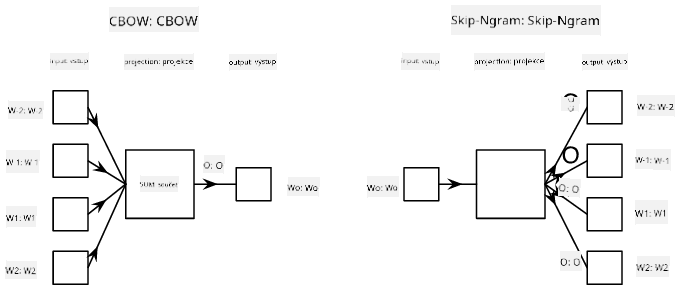

<!--
CO_OP_TRANSLATOR_METADATA:
{
  "original_hash": "31b46ba1f3aa78578134d4829f88be53",
  "translation_date": "2025-08-25T21:55:32+00:00",
  "source_file": "lessons/5-NLP/15-LanguageModeling/README.md",
  "language_code": "cs"
}
-->
# Jazykové modelování

Sémantické vektory, jako Word2Vec a GloVe, jsou ve skutečnosti prvním krokem k **jazykovému modelování** – vytváření modelů, které nějakým způsobem *rozumí* (nebo *reprezentují*) podstatu jazyka.

## [Kvíz před přednáškou](https://red-field-0a6ddfd03.1.azurestaticapps.net/quiz/115)

Hlavní myšlenkou jazykového modelování je jejich trénování na neoznačených datových sadách neřízeným způsobem. To je důležité, protože máme k dispozici obrovské množství neoznačeného textu, zatímco množství označeného textu bude vždy omezeno úsilím, které můžeme věnovat jeho označování. Nejčastěji můžeme vytvářet jazykové modely, které dokážou **předpovídat chybějící slova** v textu, protože je snadné náhodně vynechat slovo v textu a použít ho jako trénovací vzorek.

## Trénování vektorů

V našich předchozích příkladech jsme používali předem natrénované sémantické vektory, ale je zajímavé vidět, jak lze tyto vektory natrénovat. Existuje několik možných přístupů, které lze použít:

* **Jazykové modelování pomocí N-Gramů**, kdy předpovídáme token na základě N předchozích tokenů (N-gram).
* **Continuous Bag-of-Words** (CBoW), kdy předpovídáme prostřední token $W_0$ v sekvenci tokenů $W_{-N}$, ..., $W_N$.
* **Skip-gram**, kde předpovídáme sadu sousedních tokenů {$W_{-N},\dots, W_{-1}, W_1,\dots, W_N$} na základě prostředního tokenu $W_0$.

> Obrázek z [tohoto článku](https://arxiv.org/pdf/1301.3781.pdf)

## ✍️ Ukázkové notebooky: Trénování modelu CBoW

Pokračujte ve svém učení v následujících noteboocích:

* [Trénování CBoW Word2Vec pomocí TensorFlow](../../../../../lessons/5-NLP/15-LanguageModeling/CBoW-TF.ipynb)
* [Trénování CBoW Word2Vec pomocí PyTorch](../../../../../lessons/5-NLP/15-LanguageModeling/CBoW-PyTorch.ipynb)

## Závěr

V předchozí lekci jsme viděli, že vektory slov fungují jako kouzlo! Nyní víme, že trénování vektorů slov není příliš složitý úkol, a měli bychom být schopni natrénovat vlastní vektory slov pro text specifický pro danou oblast, pokud to bude potřeba.

## [Kvíz po přednášce](https://red-field-0a6ddfd03.1.azurestaticapps.net/quiz/215)

## Přehled & Samostudium

* [Oficiální tutoriál PyTorch o jazykovém modelování](https://pytorch.org/tutorials/beginner/nlp/word_embeddings_tutorial.html).
* [Oficiální tutoriál TensorFlow o trénování modelu Word2Vec](https://www.TensorFlow.org/tutorials/text/word2vec).
* Použití frameworku **gensim** k trénování nejběžněji používaných vektorů v několika řádcích kódu je popsáno [v této dokumentaci](https://pytorch.org/tutorials/beginner/nlp/word_embeddings_tutorial.html).

## 🚀 [Úkol: Natrénujte model Skip-Gram](lab/README.md)

V laboratoři vás vyzýváme, abyste upravili kód z této lekce a natrénovali model Skip-Gram místo CBoW. [Přečtěte si podrobnosti](lab/README.md)

**Prohlášení:**  
Tento dokument byl přeložen pomocí služby pro automatický překlad [Co-op Translator](https://github.com/Azure/co-op-translator). Ačkoli se snažíme o přesnost, mějte prosím na paměti, že automatické překlady mohou obsahovat chyby nebo nepřesnosti. Původní dokument v jeho původním jazyce by měl být považován za autoritativní zdroj. Pro důležité informace se doporučuje profesionální lidský překlad. Neodpovídáme za žádná nedorozumění nebo nesprávné interpretace vyplývající z použití tohoto překladu.