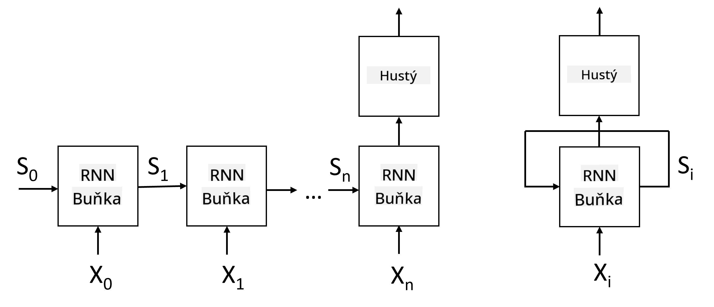

<!--
CO_OP_TRANSLATOR_METADATA:
{
  "original_hash": "e2273cc150380a5e191903cea858f021",
  "translation_date": "2025-09-23T11:30:46+00:00",
  "source_file": "lessons/5-NLP/16-RNN/README.md",
  "language_code": "cs"
}
-->
# Rekurentní neuronové sítě

## [Kvíz před přednáškou](https://ff-quizzes.netlify.app/en/ai/quiz/31)

V předchozích sekcích jsme používali bohaté sémantické reprezentace textu a jednoduchý lineární klasifikátor nad embeddingy. Tato architektura zachycuje agregovaný význam slov ve větě, ale nezohledňuje **pořadí** slov, protože operace agregace nad embeddingy tuto informaci z původního textu odstranila. Kvůli tomu, že tyto modely nedokážou modelovat pořadí slov, nejsou schopny řešit složitější nebo nejednoznačné úkoly, jako je generování textu nebo odpovídání na otázky.

Abychom zachytili význam textové sekvence, musíme použít jinou architekturu neuronové sítě, která se nazývá **rekurentní neuronová síť** (RNN). V RNN prochází věta sítí jeden symbol po druhém a síť produkuje nějaký **stav**, který se poté předává síti spolu s dalším symbolem.

> Obrázek od autora

Při dané vstupní sekvenci tokenů X0,...,Xn vytvoří RNN sekvenci bloků neuronové sítě a trénuje tuto sekvenci end-to-end pomocí zpětného šíření. Každý blok sítě přijímá dvojici (Xi,Si) jako vstup a produkuje Si+1 jako výsledek. Konečný stav Sn (nebo výstup Yn) se předává lineárnímu klasifikátoru, který produkuje výsledek. Všechny bloky sítě sdílejí stejné váhy a jsou trénovány end-to-end pomocí jednoho průchodu zpětného šíření.

Protože vektorové stavy S0,...,Sn procházejí sítí, je schopna se naučit sekvenční závislosti mezi slovy. Například když se někde v sekvenci objeví slovo *not*, síť se může naučit negovat určité prvky ve stavovém vektoru, což vede k negaci.

> ✅ Protože váhy všech bloků RNN na obrázku výše jsou sdílené, stejný obrázek lze reprezentovat jako jeden blok (vpravo) s rekurentní zpětnou smyčkou, která předává výstupní stav sítě zpět na vstup.

## Anatomie RNN buňky

Podívejme se, jak je organizována jednoduchá RNN buňka. Přijímá předchozí stav Si-1 a aktuální symbol Xi jako vstupy a musí produkovat výstupní stav Si (a někdy nás také zajímá jiný výstup Yi, například u generativních sítí).

Jednoduchá RNN buňka má uvnitř dvě váhové matice: jedna transformuje vstupní symbol (nazvěme ji W) a druhá transformuje vstupní stav (H). V tomto případě se výstup sítě vypočítá jako &sigma;(W&times;Xi+H&times;Si-1+b), kde &sigma; je aktivační funkce a b je dodatečná bias.

> Obrázek od autora

V mnoha případech jsou vstupní tokeny před vstupem do RNN předány přes embeddingovou vrstvu, aby se snížila dimenzionalita. V tomto případě, pokud je dimenze vstupních vektorů *emb_size* a stavového vektoru *hid_size*, velikost W je *emb_size*&times;*hid_size* a velikost H je *hid_size*&times;*hid_size*.

## Long Short Term Memory (LSTM)

Jedním z hlavních problémů klasických RNN je tzv. **problém mizejících gradientů**. Protože RNN jsou trénovány end-to-end v jednom průchodu zpětného šíření, mají potíže s propagací chyby do prvních vrstev sítě, a tím pádem se síť nemůže naučit vztahy mezi vzdálenými tokeny. Jedním ze způsobů, jak tento problém obejít, je zavést **explicitní správu stavu** pomocí tzv. **bran**. Existují dvě známé architektury tohoto typu: **Long Short Term Memory** (LSTM) a **Gated Relay Unit** (GRU).

> Zdroj obrázku TBD

LSTM síť je organizována podobně jako RNN, ale existují dva stavy, které se předávají z vrstvy do vrstvy: skutečný stav C a skrytý vektor H. V každé jednotce je skrytý vektor Hi spojen s vstupem Xi, a tyto kontrolují, co se stane se stavem C prostřednictvím **bran**. Každá brána je neuronová síť s sigmoidní aktivací (výstup v rozmezí [0,1]), kterou lze považovat za bitovou masku při násobení stavovým vektorem. Na obrázku výše jsou následující brány (zleva doprava):

* **Brána zapomínání** bere skrytý vektor a určuje, které komponenty vektoru C je třeba zapomenout a které předat dál.
* **Vstupní brána** bere určité informace ze vstupního a skrytého vektoru a vkládá je do stavu.
* **Výstupní brána** transformuje stav pomocí lineární vrstvy s aktivací *tanh* a poté vybere některé jeho komponenty pomocí skrytého vektoru Hi, aby vytvořila nový stav Ci+1.

Komponenty stavu C lze považovat za určité příznaky, které lze zapínat a vypínat. Například když v sekvenci narazíme na jméno *Alice*, můžeme předpokládat, že se jedná o ženskou postavu, a aktivovat příznak ve stavu, že máme ve větě ženské podstatné jméno. Když dále narazíme na frázi *and Tom*, aktivujeme příznak, že máme množné číslo. Manipulací se stavem tedy můžeme údajně sledovat gramatické vlastnosti částí věty.

> ✅ Skvělým zdrojem pro pochopení interních mechanismů LSTM je tento výborný článek [Understanding LSTM Networks](https://colah.github.io/posts/2015-08-Understanding-LSTMs/) od Christophera Olaha.

## Bidirekcionální a vícevrstvé RNN

Diskutovali jsme o rekurentních sítích, které fungují jedním směrem, od začátku sekvence do jejího konce. To se zdá přirozené, protože to připomíná způsob, jakým čteme a posloucháme řeč. Nicméně, protože v mnoha praktických případech máme náhodný přístup k vstupní sekvenci, může být smysluplné provádět rekurentní výpočty v obou směrech. Takové sítě se nazývají **bidirekcionální** RNN. Při práci s bidirekcionální sítí bychom potřebovali dva skryté stavové vektory, jeden pro každý směr.

Rekurentní síť, ať už jednosměrná nebo bidirekcionální, zachycuje určité vzory v sekvenci a může je uložit do stavového vektoru nebo předat do výstupu. Stejně jako u konvolučních sítí můžeme na první vrstvu postavit další rekurentní vrstvu, která zachytí vzory na vyšší úrovni a vytvoří vzory na nižší úrovni extrahované první vrstvou. To nás vede k pojmu **vícevrstvá RNN**, která se skládá ze dvou nebo více rekurentních sítí, kde výstup předchozí vrstvy je předán další vrstvě jako vstup.

*Obrázek z [tohoto skvělého příspěvku](https://towardsdatascience.com/from-a-lstm-cell-to-a-multilayer-lstm-network-with-pytorch-2899eb5696f3) od Fernanda Lópeze*

## ✍️ Cvičení: Embeddingy

Pokračujte ve svém učení v následujících noteboocích:

* [RNNs s PyTorch](RNNPyTorch.ipynb)
* [RNNs s TensorFlow](RNNTF.ipynb)

## Závěr

V této jednotce jsme viděli, že RNN lze použít pro klasifikaci sekvencí, ale ve skutečnosti zvládnou mnohem více úkolů, jako je generování textu, strojový překlad a další. Tyto úkoly budeme zkoumat v další jednotce.

## 🚀 Výzva

Projděte si literaturu o LSTM a zvažte jejich aplikace:

- [Grid Long Short-Term Memory](https://arxiv.org/pdf/1507.01526v1.pdf)
- [Show, Attend and Tell: Neural Image Caption
Generation with Visual Attention](https://arxiv.org/pdf/1502.03044v2.pdf)

## [Kvíz po přednášce](https://ff-quizzes.netlify.app/en/ai/quiz/32)

## Přehled & Samostudium

- [Understanding LSTM Networks](https://colah.github.io/posts/2015-08-Understanding-LSTMs/) od Christophera Olaha.

## [Úkol: Notebooks](assignment.md)

---

