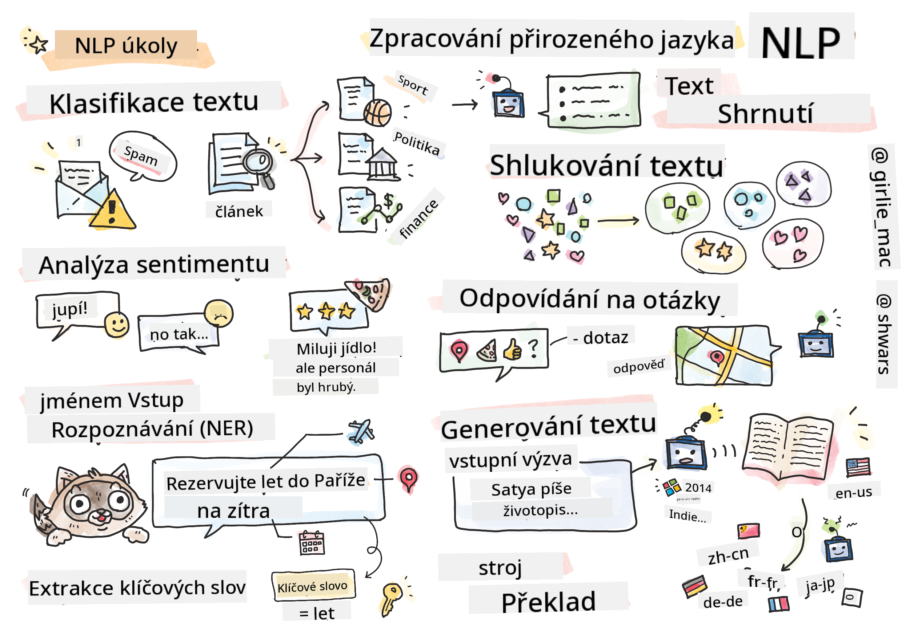

<!--
CO_OP_TRANSLATOR_METADATA:
{
  "original_hash": "8ef02a9318257ea140ed3ed74442096d",
  "translation_date": "2025-08-25T21:27:40+00:00",
  "source_file": "lessons/5-NLP/README.md",
  "language_code": "cs"
}
-->
# Zpracování přirozeného jazyka



V této sekci se zaměříme na použití neuronových sítí k řešení úkolů spojených se **zpracováním přirozeného jazyka (NLP)**. Existuje mnoho problémů v oblasti NLP, které bychom chtěli, aby počítače dokázaly vyřešit:

* **Klasifikace textu** je typický klasifikační problém týkající se textových sekvencí. Příklady zahrnují klasifikaci e-mailových zpráv jako spam vs. ne-spam nebo kategorizaci článků jako sport, obchod, politika atd. Při vývoji chatbotů často potřebujeme pochopit, co uživatel chtěl říct – v tomto případě se jedná o **klasifikaci záměru**. Často je při klasifikaci záměru nutné pracovat s mnoha kategoriemi.
* **Analýza sentimentu** je typický regresní problém, kdy potřebujeme přiřadit číslo (sentiment), které odpovídá tomu, jak pozitivní/negativní je význam věty. Pokročilejší verzí analýzy sentimentu je **analýza sentimentu na základě aspektů** (ABSA), kdy sentiment nepřiřazujeme celé větě, ale jejím různým částem (aspektům), např. *V této restauraci mi chutnala kuchyně, ale atmosféra byla příšerná*.
* **Rozpoznávání pojmenovaných entit** (NER) se týká problému extrakce určitých entit z textu. Například můžeme potřebovat pochopit, že ve frázi *Potřebuji letět do Paříže zítra* slovo *zítra* odkazuje na DATUM a *Paříž* je LOKACE.  
* **Extrakce klíčových slov** je podobná NER, ale potřebujeme automaticky extrahovat slova důležitá pro význam věty, aniž bychom předem trénovali na konkrétní typy entit.
* **Shlukování textu** může být užitečné, když chceme seskupit podobné věty, například podobné požadavky v konverzacích technické podpory.
* **Odpovídání na otázky** se týká schopnosti modelu odpovědět na konkrétní otázku. Model dostane jako vstup textový úryvek a otázku a musí poskytnout místo v textu, kde se odpověď na otázku nachází (nebo někdy vygenerovat text odpovědi).
* **Generování textu** je schopnost modelu generovat nový text. Může být považováno za klasifikační úkol, který předpovídá další písmeno/slovo na základě nějakého *textového podnětu*. Pokročilé modely generování textu, jako je GPT-3, dokážou řešit i jiné úkoly NLP pomocí techniky zvané [programování pomocí podnětů](https://towardsdatascience.com/software-3-0-how-prompting-will-change-the-rules-of-the-game-a982fbfe1e0) nebo [inženýrství podnětů](https://medium.com/swlh/openai-gpt-3-and-prompt-engineering-dcdc2c5fcd29).
* **Shrnutí textu** je technika, kdy chceme, aby počítač "přečetl" dlouhý text a shrnul ho do několika vět.
* **Strojový překlad** lze vnímat jako kombinaci porozumění textu v jednom jazyce a generování textu v jiném.

Zpočátku byly většina úkolů NLP řešena tradičními metodami, jako jsou gramatiky. Například při strojovém překladu byly použity analyzátory k transformaci původní věty na syntaktický strom, poté byly extrahovány vyšší úrovně sémantických struktur k reprezentaci významu věty a na základě tohoto významu a gramatiky cílového jazyka byl generován výsledek. Dnes je mnoho úkolů NLP efektivněji řešeno pomocí neuronových sítí.

> Mnoho klasických metod NLP je implementováno v Python knihovně [Natural Language Processing Toolkit (NLTK)](https://www.nltk.org). Online je dostupná skvělá [NLTK kniha](https://www.nltk.org/book/), která pokrývá, jak lze různé úkoly NLP řešit pomocí NLTK.

V našem kurzu se budeme převážně zaměřovat na použití neuronových sítí pro NLP a NLTK použijeme tam, kde to bude potřeba.

Již jsme se naučili používat neuronové sítě pro práci s tabulkovými daty a obrázky. Hlavní rozdíl mezi těmito typy dat a textem je, že text je sekvence proměnné délky, zatímco velikost vstupu v případě obrázků je předem známá. Zatímco konvoluční sítě dokážou extrahovat vzory z vstupních dat, vzory v textu jsou složitější. Například negace může být oddělena od subjektu libovolným počtem slov (např. *Nemám rád pomeranče* vs. *Nemám rád ty velké barevné chutné pomeranče*), a to by mělo být stále interpretováno jako jeden vzor. Proto je pro práci s jazykem nutné zavést nové typy neuronových sítí, jako jsou *rekurentní sítě* a *transformery*.

## Instalace knihoven

Pokud používáte lokální instalaci Pythonu pro spuštění tohoto kurzu, možná budete muset nainstalovat všechny potřebné knihovny pro NLP pomocí následujících příkazů:

**Pro PyTorch**
```bash
pip install -r requirements-torch.txt
```
**Pro TensorFlow**
```bash
pip install -r requirements-tf.txt
```

> NLP s TensorFlow si můžete vyzkoušet na [Microsoft Learn](https://docs.microsoft.com/learn/modules/intro-natural-language-processing-tensorflow/?WT.mc_id=academic-77998-cacaste)

## Upozornění na GPU

V této sekci budeme v některých příkladech trénovat poměrně velké modely.
* **Použijte počítač s podporou GPU**: Doporučuje se spouštět vaše notebooky na počítači s podporou GPU, aby se zkrátila doba čekání při práci s velkými modely.
* **Omezení paměti GPU**: Při běhu na GPU může dojít k situacím, kdy vám dojde paměť GPU, zejména při trénování velkých modelů.
* **Spotřeba paměti GPU**: Množství paměti GPU spotřebované během trénování závisí na různých faktorech, včetně velikosti minibatch.
* **Minimalizujte velikost minibatch**: Pokud narazíte na problémy s pamětí GPU, zvažte snížení velikosti minibatch ve vašem kódu jako možné řešení.
* **Uvolnění paměti GPU v TensorFlow**: Starší verze TensorFlow nemusí správně uvolňovat paměť GPU při trénování více modelů v jednom Python kernelu. Pro efektivní správu paměti GPU můžete nastavit TensorFlow tak, aby alokoval paměť GPU pouze podle potřeby.
* **Zahrnutí kódu**: Chcete-li nastavit TensorFlow tak, aby alokoval paměť GPU pouze podle potřeby, zahrňte následující kód do svých notebooků:

```python
physical_devices = tf.config.list_physical_devices('GPU') 
if len(physical_devices)>0:
    tf.config.experimental.set_memory_growth(physical_devices[0], True) 
```

Pokud vás zajímá učení NLP z pohledu klasického strojového učení, navštivte [tento soubor lekcí](https://github.com/microsoft/ML-For-Beginners/tree/main/6-NLP).

## V této sekci
V této sekci se naučíme:

* [Reprezentace textu jako tenzorů](13-TextRep/README.md)
* [Vektorové reprezentace slov](14-Emdeddings/README.md)
* [Modelování jazyka](15-LanguageModeling/README.md)
* [Rekurentní neuronové sítě](16-RNN/README.md)
* [Generativní sítě](17-GenerativeNetworks/README.md)
* [Transformery](18-Transformers/README.md)

**Prohlášení:**  
Tento dokument byl přeložen pomocí služby pro automatický překlad [Co-op Translator](https://github.com/Azure/co-op-translator). Ačkoli se snažíme o přesnost, mějte na paměti, že automatické překlady mohou obsahovat chyby nebo nepřesnosti. Původní dokument v jeho původním jazyce by měl být považován za autoritativní zdroj. Pro důležité informace se doporučuje profesionální lidský překlad. Neodpovídáme za žádná nedorozumění nebo nesprávné interpretace vyplývající z použití tohoto překladu.