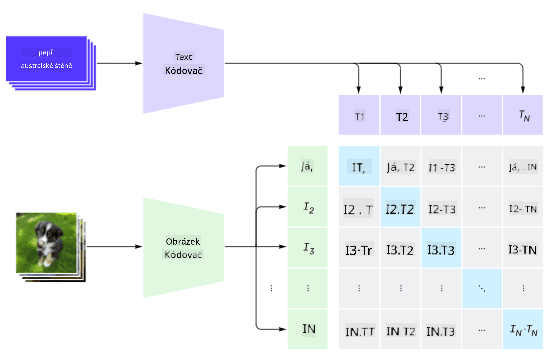

<!--
CO_OP_TRANSLATOR_METADATA:
{
  "original_hash": "9c592c26aca16ca085d268c732284187",
  "translation_date": "2025-08-25T23:37:04+00:00",
  "source_file": "lessons/X-Extras/X1-MultiModal/README.md",
  "language_code": "cs"
}
-->
# Multi-Modální Sítě

Po úspěchu modelů transformerů při řešení úloh NLP byly stejné nebo podobné architektury aplikovány na úlohy počítačového vidění. Roste zájem o vytváření modelů, které by *kombinovaly* schopnosti vidění a přirozeného jazyka. Jedním z takových pokusů je práce OpenAI, která vytvořila modely CLIP a DALL.E.

## Kontrastní Předtrénování Obrázků (CLIP)

Hlavní myšlenkou CLIP je schopnost porovnávat textové výzvy s obrázkem a určit, jak dobře obrázek odpovídá dané výzvě.

> *Obrázek z [tohoto blogového příspěvku](https://openai.com/blog/clip/)*

Model je trénován na obrázcích získaných z internetu a jejich popiscích. Pro každou dávku vezmeme N párů (obrázek, text) a převedeme je na vektorové reprezentace I, ..., I / T, ..., T. Tyto reprezentace jsou následně spárovány. Ztrátová funkce je definována tak, aby maximalizovala kosinovou podobnost mezi vektory odpovídajícími jednomu páru (např. I a T) a minimalizovala kosinovou podobnost mezi všemi ostatními páry. Proto se tento přístup nazývá **kontrastní**.

Model/knihovna CLIP je dostupná na [GitHubu OpenAI](https://github.com/openai/CLIP). Přístup je popsán v [tomto blogovém příspěvku](https://openai.com/blog/clip/) a podrobněji v [tomto článku](https://arxiv.org/pdf/2103.00020.pdf).

Jakmile je model předtrénován, můžeme mu předložit dávku obrázků a textových výzev, a vrátí tensor s pravděpodobnostmi. CLIP lze použít pro několik úloh:

**Klasifikace Obrázků**

Předpokládejme, že potřebujeme klasifikovat obrázky například na kočky, psy a lidi. V tomto případě můžeme modelu předložit obrázek a sérii textových výzev: "*obrázek kočky*", "*obrázek psa*", "*obrázek člověka*". Ve výsledném vektoru s 3 pravděpodobnostmi stačí vybrat index s nejvyšší hodnotou.

> *Obrázek z [tohoto blogového příspěvku](https://openai.com/blog/clip/)*

**Vyhledávání Obrázků na Základě Textu**

Můžeme také udělat opak. Pokud máme kolekci obrázků, můžeme tuto kolekci předložit modelu spolu s textovou výzvou – model nám vrátí obrázek, který je nejpodobnější dané výzvě.

## ✍️ Příklad: [Použití CLIP pro Klasifikaci Obrázků a Vyhledávání Obrázků](../../../../../lessons/X-Extras/X1-MultiModal/Clip.ipynb)

Otevřete notebook [Clip.ipynb](../../../../../lessons/X-Extras/X1-MultiModal/Clip.ipynb), abyste viděli CLIP v akci.

## Generování Obrázků s VQGAN+CLIP

CLIP lze také použít pro **generování obrázků** na základě textové výzvy. K tomu potřebujeme **generátorový model**, který bude schopen generovat obrázky na základě nějakého vektorového vstupu. Jedním z takových modelů je [VQGAN](https://compvis.github.io/taming-transformers/) (Vector-Quantized GAN).

Hlavní myšlenky VQGAN, které jej odlišují od běžného [GAN](../../4-ComputerVision/10-GANs/README.md), jsou následující:
* Použití autoregresivní transformerové architektury k vytvoření sekvence vizuálních částí bohatých na kontext, které tvoří obrázek. Tyto vizuální části se učí pomocí [CNN](../../4-ComputerVision/07-ConvNets/README.md).
* Použití diskriminátoru sub-obrázků, který detekuje, zda jsou části obrázku "reálné" nebo "falešné" (na rozdíl od přístupu "vše nebo nic" u tradičního GAN).

Více o VQGAN se dozvíte na webu [Taming Transformers](https://compvis.github.io/taming-transformers/).

Jedním z důležitých rozdílů mezi VQGAN a tradičním GAN je, že tradiční GAN může vytvořit slušný obrázek z jakéhokoli vstupního vektoru, zatímco VQGAN pravděpodobně vytvoří obrázek, který nebude koherentní. Proto je třeba dále řídit proces tvorby obrázku, což lze provést pomocí CLIP.

Pro generování obrázku odpovídajícího textové výzvě začneme s nějakým náhodným kódovacím vektorem, který je předán přes VQGAN k vytvoření obrázku. Poté je použit CLIP k vytvoření ztrátové funkce, která ukazuje, jak dobře obrázek odpovídá textové výzvě. Cílem je minimalizovat tuto ztrátu pomocí zpětné propagace k úpravě parametrů vstupního vektoru.

Skvělá knihovna, která implementuje VQGAN+CLIP, je [Pixray](http://github.com/pixray/pixray).

 |   | 
----|----|----
Obrázek vytvořený na základě výzvy *detailní akvarelový portrét mladého učitele literatury s knihou* | Obrázek vytvořený na základě výzvy *detailní olejový portrét mladé učitelky informatiky s počítačem* | Obrázek vytvořený na základě výzvy *detailní olejový portrét starého učitele matematiky před tabulí*

> Obrázky z kolekce **Umělí Učitelé** od [Dmitry Soshnikov](http://soshnikov.com)

## DALL-E
### [DALL-E 1](https://openai.com/research/dall-e)
DALL-E je verze GPT-3 trénovaná na generování obrázků z výzev. Byl trénován s 12 miliardami parametrů.

Na rozdíl od CLIP přijímá DALL-E text i obrázek jako jeden tok tokenů pro obrázky i text. Proto lze z více výzev generovat obrázky na základě textu.

### [DALL-E 2](https://openai.com/dall-e-2)
Hlavní rozdíl mezi DALL.E 1 a 2 je, že DALL.E 2 generuje realističtější obrázky a umění.

Příklady generování obrázků pomocí DALL-E:
 |   | 
----|----|----
Obrázek vytvořený na základě výzvy *detailní akvarelový portrét mladého učitele literatury s knihou* | Obrázek vytvořený na základě výzvy *detailní olejový portrét mladé učitelky informatiky s počítačem* | Obrázek vytvořený na základě výzvy *detailní olejový portrét starého učitele matematiky před tabulí*

## Reference

* Článek o VQGAN: [Taming Transformers for High-Resolution Image Synthesis](https://compvis.github.io/taming-transformers/paper/paper.pdf)
* Článek o CLIP: [Learning Transferable Visual Models From Natural Language Supervision](https://arxiv.org/pdf/2103.00020.pdf)

**Prohlášení**:  
Tento dokument byl přeložen pomocí služby pro automatický překlad [Co-op Translator](https://github.com/Azure/co-op-translator). Ačkoli se snažíme o přesnost, mějte prosím na paměti, že automatické překlady mohou obsahovat chyby nebo nepřesnosti. Původní dokument v jeho původním jazyce by měl být považován za autoritativní zdroj. Pro důležité informace doporučujeme profesionální lidský překlad. Neodpovídáme za žádné nedorozumění nebo nesprávné interpretace vyplývající z použití tohoto překladu.