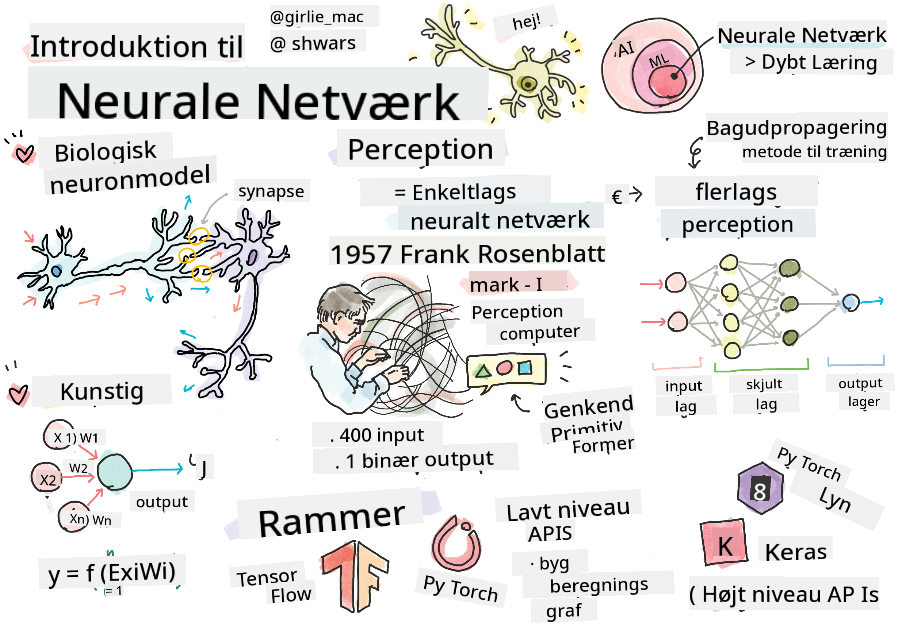
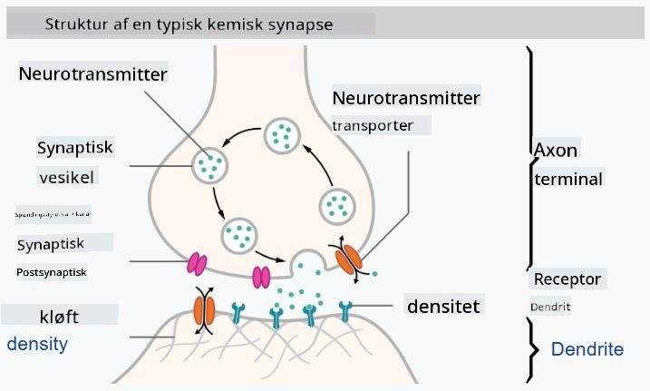

<!--
CO_OP_TRANSLATOR_METADATA:
{
  "original_hash": "1c6b8c7c1778a35fc1139b7f2aecb7b3",
  "translation_date": "2025-08-28T15:36:03+00:00",
  "source_file": "lessons/3-NeuralNetworks/README.md",
  "language_code": "da"
}
-->
# Introduktion til Neurale Netværk

Som vi diskuterede i introduktionen, er en af måderne at opnå intelligens på at træne en **computermodel** eller en **kunstig hjerne**. Siden midten af det 20. århundrede har forskere prøvet forskellige matematiske modeller, indtil denne tilgang i de seneste år har vist sig at være enormt succesfuld. Sådanne matematiske modeller af hjernen kaldes **neurale netværk**.

> Nogle gange kaldes neurale netværk for *Artificial Neural Networks*, ANNs, for at indikere, at vi taler om modeller og ikke om rigtige netværk af neuroner.

## Maskinlæring

Neurale netværk er en del af en større disciplin kaldet **Maskinlæring**, hvis mål er at bruge data til at træne computermodeller, der kan løse problemer. Maskinlæring udgør en stor del af Kunstig Intelligens, men vi dækker ikke klassisk maskinlæring i dette pensum.

> Besøg vores separate **[Maskinlæring for Begyndere](http://github.com/microsoft/ml-for-beginners)** pensum for at lære mere om klassisk maskinlæring.

I maskinlæring antager vi, at vi har et datasæt af eksempler **X** og tilsvarende outputværdier **Y**. Eksempler er ofte N-dimensionelle vektorer, der består af **features**, og outputs kaldes **labels**.

Vi vil overveje de to mest almindelige maskinlæringsproblemer:

* **Klassifikation**, hvor vi skal klassificere et inputobjekt i to eller flere klasser.
* **Regression**, hvor vi skal forudsige en numerisk værdi for hver af inputprøverne.

> Når input og output repræsenteres som tensorer, er inputdatasættet en matrix af størrelse M×N, hvor M er antallet af prøver, og N er antallet af features. Outputlabels Y er en vektor af størrelse M.

I dette pensum vil vi kun fokusere på modeller med neurale netværk.

## En Model af en Neuron

Fra biologien ved vi, at vores hjerne består af nerveceller, som hver har flere "inputs" (aksoner) og et output (dendrit). Aksoner og dendritter kan lede elektriske signaler, og forbindelserne mellem aksoner og dendritter kan udvise forskellige grader af ledningsevne (kontrolleret af neurotransmittere).

 | 
----|----
Rigtig Neuron *([Billede](https://en.wikipedia.org/wiki/Synapse#/media/File:SynapseSchematic_lines.svg) fra Wikipedia)* | Kunstig Neuron *(Billede af forfatteren)*

Den simpleste matematiske model af en neuron indeholder derfor flere inputs X1, ..., XN og et output Y samt en række vægte W1, ..., WN. Et output beregnes som:

hvor f er en ikke-lineær **aktiveringsfunktion**.

> Tidlige modeller af neuroner blev beskrevet i den klassiske artikel [A logical calculus of the ideas immanent in nervous activity](https://www.cs.cmu.edu/~./epxing/Class/10715/reading/McCulloch.and.Pitts.pdf) af Warren McCullock og Walter Pitts i 1943. Donald Hebb foreslog i sin bog "[The Organization of Behavior: A Neuropsychological Theory](https://books.google.com/books?id=VNetYrB8EBoC)" en metode til at træne disse netværk.

## I denne Sektion

I denne sektion vil vi lære om:
* [Perceptron](03-Perceptron/README.md), en af de tidligste modeller for neurale netværk til to-klasse klassifikation
* [Flerlagsnetværk](04-OwnFramework/README.md) med en tilhørende notebook [hvordan man bygger sit eget framework](04-OwnFramework/OwnFramework.ipynb)
* [Frameworks til Neurale Netværk](05-Frameworks/README.md), med disse notebooks: [PyTorch](05-Frameworks/IntroPyTorch.ipynb) og [Keras/Tensorflow](05-Frameworks/IntroKerasTF.ipynb)
* [Overfitting](../../../../lessons/3-NeuralNetworks/05-Frameworks)

---

**Ansvarsfraskrivelse**:  
Dette dokument er blevet oversat ved hjælp af AI-oversættelsestjenesten [Co-op Translator](https://github.com/Azure/co-op-translator). Selvom vi bestræber os på at sikre nøjagtighed, skal du være opmærksom på, at automatiserede oversættelser kan indeholde fejl eller unøjagtigheder. Det originale dokument på dets oprindelige sprog bør betragtes som den autoritative kilde. For kritisk information anbefales professionel menneskelig oversættelse. Vi påtager os ikke ansvar for eventuelle misforståelser eller fejltolkninger, der måtte opstå som følge af brugen af denne oversættelse.