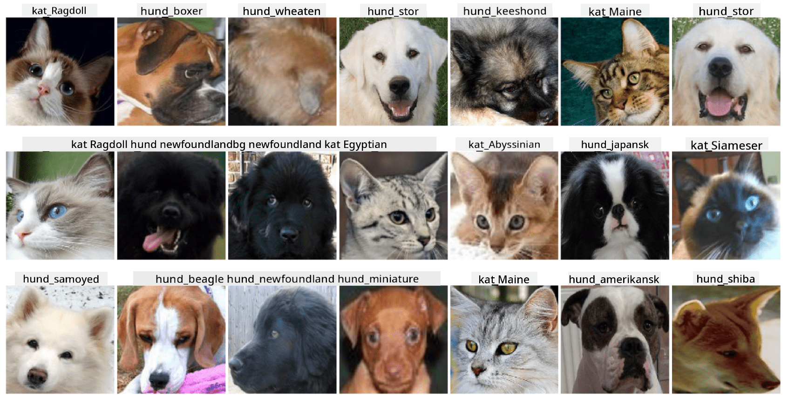

<!--
CO_OP_TRANSLATOR_METADATA:
{
  "original_hash": "f3d2cee9cb3c52160419e560c57a690e",
  "translation_date": "2025-08-28T15:14:18+00:00",
  "source_file": "lessons/4-ComputerVision/07-ConvNets/lab/README.md",
  "language_code": "da"
}
-->
# Klassificering af kæledyrs ansigter

Laboratorieopgave fra [AI for Beginners Curriculum](https://github.com/microsoft/ai-for-beginners).

## Opgave

Forestil dig, at du skal udvikle en applikation til en dyrepension, der skal katalogisere alle kæledyr. En fantastisk funktion i en sådan applikation ville være automatisk at identificere racen ud fra et fotografi. Dette kan med succes gøres ved hjælp af neurale netværk.

Du skal træne et konvolutionelt neuralt netværk til at klassificere forskellige racer af katte og hunde ved hjælp af **Pet Faces**-datasættet.

## Datasættet

Vi vil bruge **Pet Faces**-datasættet, som er afledt af [Oxford-IIIT](https://www.robots.ox.ac.uk/~vgg/data/pets/) kæledyrs-datasættet. Det indeholder 35 forskellige racer af hunde og katte.



For at downloade datasættet, brug denne kode:

```python
!wget https://mslearntensorflowlp.blob.core.windows.net/data/petfaces.tar.gz
!tar xfz petfaces.tar.gz
!rm petfaces.tar.gz
```

## Start Notebook

Start laboratoriet ved at åbne [PetFaces.ipynb](PetFaces.ipynb)

## Læring

Du har løst et relativt komplekst problem med billedklassificering fra bunden! Der var en hel del klasser, og du var stadig i stand til at opnå en rimelig nøjagtighed! Det giver også mening at måle top-k nøjagtighed, fordi det er nemt at forveksle nogle af klasserne, som ikke er tydeligt forskellige, selv for mennesker.

---

**Ansvarsfraskrivelse**:  
Dette dokument er blevet oversat ved hjælp af AI-oversættelsestjenesten [Co-op Translator](https://github.com/Azure/co-op-translator). Selvom vi bestræber os på nøjagtighed, skal du være opmærksom på, at automatiserede oversættelser kan indeholde fejl eller unøjagtigheder. Det originale dokument på dets oprindelige sprog bør betragtes som den autoritative kilde. For kritisk information anbefales professionel menneskelig oversættelse. Vi er ikke ansvarlige for eventuelle misforståelser eller fejltolkninger, der måtte opstå som følge af brugen af denne oversættelse.