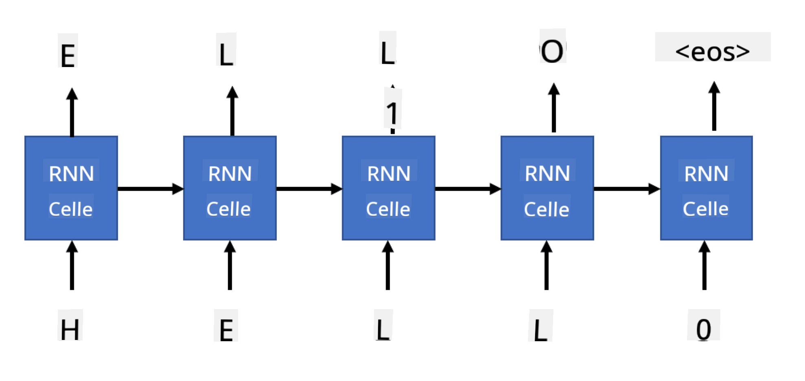

<!--
CO_OP_TRANSLATOR_METADATA:
{
  "original_hash": "51be6057374d01d70e07dd5ec88ebc0d",
  "translation_date": "2025-09-23T09:34:27+00:00",
  "source_file": "lessons/5-NLP/17-GenerativeNetworks/README.md",
  "language_code": "da"
}
-->
# Generative netværk

## [Quiz før forelæsning](https://ff-quizzes.netlify.app/en/ai/quiz/33)

Recurrent Neural Networks (RNNs) og deres gated cell-varianter såsom Long Short Term Memory Cells (LSTMs) og Gated Recurrent Units (GRUs) giver en mekanisme til sproglig modellering, da de kan lære ords rækkefølge og forudsige det næste ord i en sekvens. Dette gør det muligt at bruge RNNs til **generative opgaver**, såsom almindelig tekstgenerering, maskinoversættelse og endda billedbeskrivelse.

> ✅ Tænk over alle de gange, du har haft gavn af generative opgaver som tekstfuldførelse, mens du skriver. Undersøg dine yndlingsapplikationer for at se, om de har anvendt RNNs.

I RNN-arkitekturen, som vi diskuterede i den forrige enhed, producerede hver RNN-enhed den næste skjulte tilstand som output. Men vi kan også tilføje et andet output til hver rekurrent enhed, hvilket giver os mulighed for at generere en **sekvens** (som er lige så lang som den oprindelige sekvens). Desuden kan vi bruge RNN-enheder, der ikke modtager input ved hvert trin, men blot tager en initial tilstandsvektor og derefter producerer en sekvens af outputs.

Dette muliggør forskellige neurale arkitekturer, som vist på billedet nedenfor:


> Billede fra blogindlægget [Unreasonable Effectiveness of Recurrent Neural Networks](http://karpathy.github.io/2015/05/21/rnn-effectiveness/) af [Andrej Karpaty](http://karpathy.github.io/)

* **One-to-one** er et traditionelt neuralt netværk med én input og ét output
* **One-to-many** er en generativ arkitektur, der modtager én inputværdi og genererer en sekvens af outputværdier. For eksempel, hvis vi vil træne et **billedbeskrivende** netværk, der genererer en tekstbeskrivelse af et billede, kan vi tage et billede som input, lade det passere gennem en CNN for at opnå dets skjulte tilstand og derefter lade en rekurrent kæde generere beskrivelsen ord for ord.
* **Many-to-one** svarer til de RNN-arkitekturer, vi beskrev i den forrige enhed, såsom tekstklassifikation.
* **Many-to-many**, eller **sequence-to-sequence**, svarer til opgaver som **maskinoversættelse**, hvor vi først lader en RNN samle al information fra inputsekvensen i den skjulte tilstand, og en anden RNN-kæde udfolder denne tilstand til outputsekvensen.

I denne enhed vil vi fokusere på simple generative modeller, der hjælper os med at generere tekst. For enkelhedens skyld vil vi bruge tokenisering på tegnniveau.

Vi vil træne denne RNN til at generere tekst trin for trin. Ved hvert trin tager vi en sekvens af tegn med længden `nchars` og beder netværket om at generere det næste outputtegn for hvert inputtegn:



Når vi genererer tekst (under inferens), starter vi med en **prompt**, som sendes gennem RNN-celler for at generere dens mellemliggende tilstand, og derefter starter genereringen fra denne tilstand. Vi genererer ét tegn ad gangen og sender tilstanden og det genererede tegn til en anden RNN-celle for at generere det næste, indtil vi har genereret nok tegn.


> Billede af forfatteren

## ✍️ Øvelser: Generative netværk

Fortsæt din læring i følgende notebooks:

* [Generative netværk med PyTorch](GenerativePyTorch.ipynb)
* [Generative netværk med TensorFlow](GenerativeTF.ipynb)

## Blød tekstgenerering og temperatur

Outputtet fra hver RNN-celle er en sandsynlighedsfordeling af tegn. Hvis vi altid vælger det tegn med den højeste sandsynlighed som det næste tegn i den genererede tekst, kan teksten ofte ende med at "cirkulere" mellem de samme tegnsekvenser igen og igen, som i dette eksempel:

```
today of the second the company and a second the company ...
```

Men hvis vi ser på sandsynlighedsfordelingen for det næste tegn, kan det være, at forskellen mellem de højeste sandsynligheder ikke er stor, f.eks. kan ét tegn have sandsynligheden 0.2, og et andet 0.19 osv. For eksempel, når vi leder efter det næste tegn i sekvensen '*play*', kan det næste tegn lige så godt være enten et mellemrum eller **e** (som i ordet *player*).

Dette leder os til konklusionen, at det ikke altid er "retfærdigt" at vælge tegnet med den højeste sandsynlighed, da det at vælge det næsthøjeste stadig kan føre til meningsfuld tekst. Det er mere fornuftigt at **udvælge** tegn fra sandsynlighedsfordelingen givet af netværkets output. Vi kan også bruge en parameter, **temperatur**, der kan udjævne sandsynlighedsfordelingen, hvis vi ønsker at tilføje mere tilfældighed, eller gøre den stejlere, hvis vi vil holde os tættere til de tegn med højeste sandsynlighed.

Undersøg, hvordan denne bløde tekstgenerering er implementeret i de notebooks, der er linket ovenfor.

## Konklusion

Selvom tekstgenerering kan være nyttig i sig selv, kommer de største fordele fra evnen til at generere tekst ved hjælp af RNNs fra en initial feature-vektor. For eksempel bruges tekstgenerering som en del af maskinoversættelse (sequence-to-sequence, i dette tilfælde bruges tilstandsvektoren fra *encoder* til at generere eller *decode* den oversatte besked) eller til at generere tekstbeskrivelser af et billede (i hvilket tilfælde feature-vektoren ville komme fra CNN-ekstraktoren).

## 🚀 Udfordring

Tag nogle lektioner på Microsoft Learn om dette emne

* Tekstgenerering med [PyTorch](https://docs.microsoft.com/learn/modules/intro-natural-language-processing-pytorch/6-generative-networks/?WT.mc_id=academic-77998-cacaste)/[TensorFlow](https://docs.microsoft.com/learn/modules/intro-natural-language-processing-tensorflow/5-generative-networks/?WT.mc_id=academic-77998-cacaste)

## [Quiz efter forelæsning](https://ff-quizzes.netlify.app/en/ai/quiz/34)

## Gennemgang & Selvstudie

Her er nogle artikler til at udvide din viden

* Forskellige tilgange til tekstgenerering med Markov Chain, LSTM og GPT-2: [blogindlæg](https://towardsdatascience.com/text-generation-gpt-2-lstm-markov-chain-9ea371820e1e)
* Eksempel på tekstgenerering i [Keras dokumentation](https://keras.io/examples/generative/lstm_character_level_text_generation/)

## [Opgave](lab/README.md)

Vi har set, hvordan man genererer tekst tegn for tegn. I laboratoriet vil du udforske tekstgenerering på ordniveau.

---

