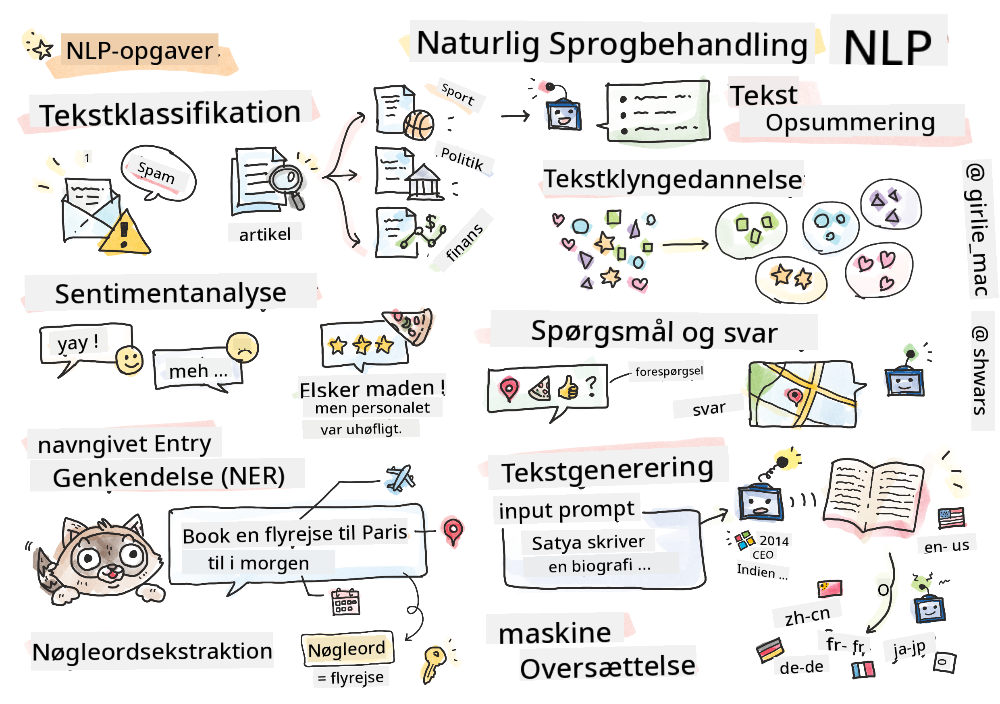

<!--
CO_OP_TRANSLATOR_METADATA:
{
  "original_hash": "8ef02a9318257ea140ed3ed74442096d",
  "translation_date": "2025-08-28T15:51:00+00:00",
  "source_file": "lessons/5-NLP/README.md",
  "language_code": "da"
}
-->
# Naturlig Sprogbehandling



I denne sektion vil vi fokusere på at bruge neurale netværk til at håndtere opgaver relateret til **naturlig sprogbehandling (NLP)**. Der er mange NLP-problemer, som vi ønsker, at computere skal kunne løse:

* **Tekstklassifikation** er et typisk klassifikationsproblem, der vedrører tekstsekvenser. Eksempler inkluderer at klassificere e-mails som spam vs. ikke-spam eller kategorisere artikler som sport, erhverv, politik osv. Når vi udvikler chatbots, har vi ofte brug for at forstå, hvad en bruger ønskede at sige – i dette tilfælde arbejder vi med **intentionklassifikation**. Ofte skal vi i intentionklassifikation håndtere mange kategorier.
* **Sentimentanalyse** er et typisk regressionsproblem, hvor vi skal tildele et tal (et sentiment), der svarer til, hvor positivt/negativt betydningen af en sætning er. En mere avanceret version af sentimentanalyse er **aspektbaseret sentimentanalyse** (ABSA), hvor vi tilskriver sentiment ikke til hele sætningen, men til forskellige dele af den (aspekter), fx *På denne restaurant kunne jeg godt lide maden, men atmosfæren var forfærdelig*.
* **Genkendelse af navngivne entiteter** (NER) refererer til problemet med at udtrække visse entiteter fra tekst. For eksempel kan vi have brug for at forstå, at i sætningen *Jeg skal flyve til Paris i morgen* refererer ordet *i morgen* til en DATO, og *Paris* er en LOKATION.  
* **Nøgleordsudtrækning** ligner NER, men her skal vi automatisk udtrække ord, der er vigtige for sætningens betydning, uden forudgående træning for specifikke entitetstyper.
* **Tekstgruppering** kan være nyttigt, når vi vil samle lignende sætninger, for eksempel lignende forespørgsler i tekniske support-samtaler.
* **Spørgsmål-besvarelse** refererer til en models evne til at besvare et specifikt spørgsmål. Modellen modtager et tekstafsnit og et spørgsmål som input og skal angive et sted i teksten, hvor svaret på spørgsmålet findes (eller nogle gange generere selve svaret).
* **Tekstgenerering** er en models evne til at generere ny tekst. Det kan betragtes som en klassifikationsopgave, der forudsiger næste bogstav/ord baseret på en *tekstprompt*. Avancerede tekstgenereringsmodeller, såsom GPT-3, er i stand til at løse andre NLP-opgaver som klassifikation ved hjælp af en teknik kaldet [prompt-programmering](https://towardsdatascience.com/software-3-0-how-prompting-will-change-the-rules-of-the-game-a982fbfe1e0) eller [prompt-engineering](https://medium.com/swlh/openai-gpt-3-and-prompt-engineering-dcdc2c5fcd29).
* **Tekstsammenfatning** er en teknik, hvor vi ønsker, at en computer skal "læse" en lang tekst og opsummere den i få sætninger.
* **Maskinoversættelse** kan ses som en kombination af tekstforståelse på ét sprog og tekstgenerering på et andet.

Oprindeligt blev de fleste NLP-opgaver løst ved hjælp af traditionelle metoder som grammatikker. For eksempel blev der i maskinoversættelse brugt parsere til at transformere den oprindelige sætning til et syntakstræ, hvorefter højere niveau semantiske strukturer blev udtrukket for at repræsentere sætningens betydning. Baseret på denne betydning og grammatikken for målsproget blev resultatet genereret. I dag løses mange NLP-opgaver mere effektivt ved hjælp af neurale netværk.

> Mange klassiske NLP-metoder er implementeret i [Natural Language Processing Toolkit (NLTK)](https://www.nltk.org) Python-biblioteket. Der findes en fremragende [NLTK-bog](https://www.nltk.org/book/), der er tilgængelig online og dækker, hvordan forskellige NLP-opgaver kan løses ved hjælp af NLTK.

I dette kursus vil vi primært fokusere på at bruge neurale netværk til NLP, og vi vil bruge NLTK, hvor det er nødvendigt.

Vi har allerede lært at bruge neurale netværk til at håndtere tabeldata og billeder. Den største forskel mellem disse datatyper og tekst er, at tekst er en sekvens af variabel længde, mens inputstørrelsen i tilfælde af billeder er kendt på forhånd. Mens konvolutionsnetværk kan udtrække mønstre fra inputdata, er mønstre i tekst mere komplekse. For eksempel kan negation være adskilt fra subjektet med mange ord (fx *Jeg kan ikke lide appelsiner* vs. *Jeg kan ikke lide de store farverige lækre appelsiner*), og det skal stadig fortolkes som ét mønster. Derfor har vi brug for nye typer neurale netværk, såsom *rekurrente netværk* og *transformere*, for at håndtere sprog.

## Installation af biblioteker

Hvis du bruger en lokal Python-installation til at køre dette kursus, skal du muligvis installere alle nødvendige biblioteker til NLP ved hjælp af følgende kommandoer:

**For PyTorch**  
```bash
pip install -r requirements-torch.txt
```  
**For TensorFlow**  
```bash
pip install -r requirements-tf.txt
```  

> Du kan prøve NLP med TensorFlow på [Microsoft Learn](https://docs.microsoft.com/learn/modules/intro-natural-language-processing-tensorflow/?WT.mc_id=academic-77998-cacaste)

## GPU-advarsel

I denne sektion vil vi i nogle af eksemplerne træne ret store modeller.
* **Brug en GPU-aktiveret computer**: Det anbefales at køre dine notebooks på en GPU-aktiveret computer for at reducere ventetiden, når du arbejder med store modeller.
* **GPU-hukommelsesbegrænsninger**: Kørsel på en GPU kan føre til situationer, hvor du løber tør for GPU-hukommelse, især når du træner store modeller.
* **GPU-hukommelsesforbrug**: Mængden af GPU-hukommelse, der forbruges under træning, afhænger af forskellige faktorer, herunder minibatch-størrelsen.
* **Minimer minibatch-størrelse**: Hvis du oplever GPU-hukommelsesproblemer, kan du overveje at reducere minibatch-størrelsen i din kode som en mulig løsning.
* **TensorFlow GPU-hukommelsesfrigivelse**: Ældre versioner af TensorFlow frigiver muligvis ikke GPU-hukommelse korrekt, når der trænes flere modeller inden for én Python-kerne. For at håndtere GPU-hukommelsesforbrug effektivt kan du konfigurere TensorFlow til kun at allokere GPU-hukommelse efter behov.
* **Inklusion af kode**: For at indstille TensorFlow til kun at øge GPU-hukommelsesallokering, når det er nødvendigt, skal du inkludere følgende kode i dine notebooks:

```python
physical_devices = tf.config.list_physical_devices('GPU') 
if len(physical_devices)>0:
    tf.config.experimental.set_memory_growth(physical_devices[0], True) 
```

Hvis du er interesseret i at lære om NLP fra et klassisk ML-perspektiv, kan du besøge [denne samling af lektioner](https://github.com/microsoft/ML-For-Beginners/tree/main/6-NLP).

## I denne sektion
I denne sektion vil vi lære om:

* [Repræsentation af tekst som tensorer](13-TextRep/README.md)
* [Ordindlejringer](14-Emdeddings/README.md)
* [Sproglig modellering](15-LanguageModeling/README.md)
* [Rekurrente neurale netværk](16-RNN/README.md)
* [Generative netværk](17-GenerativeNetworks/README.md)
* [Transformere](18-Transformers/README.md)

---

**Ansvarsfraskrivelse**:  
Dette dokument er blevet oversat ved hjælp af AI-oversættelsestjenesten [Co-op Translator](https://github.com/Azure/co-op-translator). Selvom vi bestræber os på nøjagtighed, skal du være opmærksom på, at automatiserede oversættelser kan indeholde fejl eller unøjagtigheder. Det originale dokument på dets oprindelige sprog bør betragtes som den autoritative kilde. For kritisk information anbefales professionel menneskelig oversættelse. Vi er ikke ansvarlige for eventuelle misforståelser eller fejltolkninger, der opstår som følge af brugen af denne oversættelse.