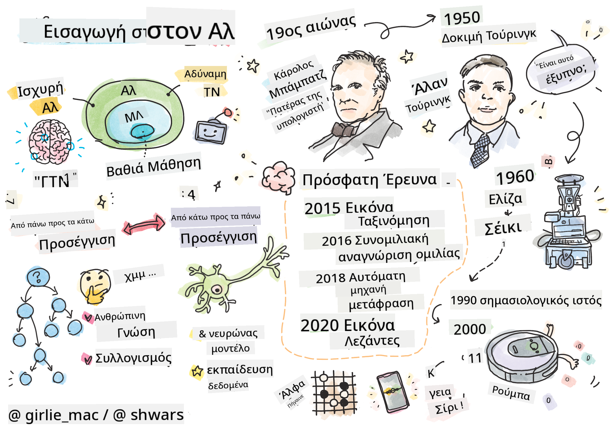
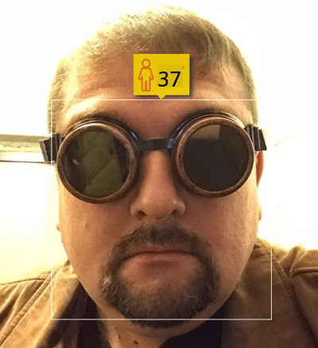
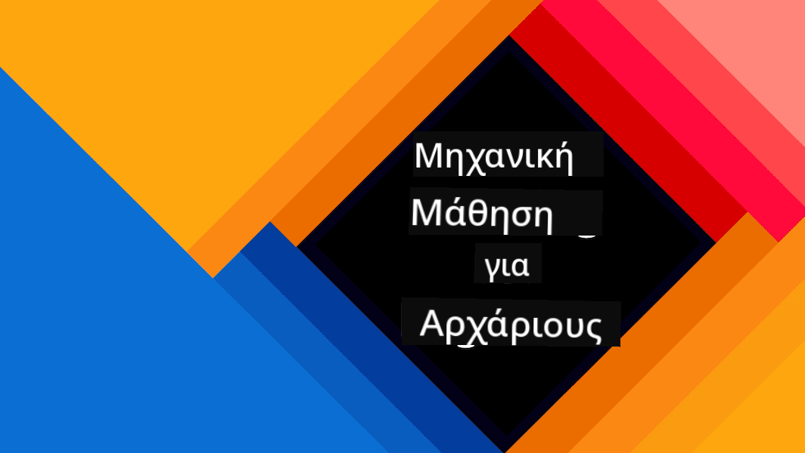

<!--
CO_OP_TRANSLATOR_METADATA:
{
  "original_hash": "06ca1b0138e65b964481ae83275b270e",
  "translation_date": "2025-10-03T08:15:14+00:00",
  "source_file": "lessons/1-Intro/README.md",
  "language_code": "el"
}
-->
# Εισαγωγή στην Τεχνητή Νοημοσύνη

> Σκίτσο από την [Tomomi Imura](https://twitter.com/girlie_mac)

## [Προ-διάλεξη κουίζ](https://ff-quizzes.netlify.app/en/ai/quiz/1)

**Τεχνητή Νοημοσύνη** είναι μια συναρπαστική επιστημονική πειθαρχία που μελετά πώς μπορούμε να κάνουμε τους υπολογιστές να επιδεικνύουν ευφυή συμπεριφορά, π.χ. να κάνουν πράγματα στα οποία οι άνθρωποι είναι καλοί.

Αρχικά, οι υπολογιστές εφευρέθηκαν από τον [Charles Babbage](https://en.wikipedia.org/wiki/Charles_Babbage) για να λειτουργούν με αριθμούς ακολουθώντας μια καλά καθορισμένη διαδικασία - έναν αλγόριθμο. Οι σύγχρονοι υπολογιστές, παρόλο που είναι σημαντικά πιο εξελιγμένοι από το αρχικό μοντέλο που προτάθηκε τον 19ο αιώνα, εξακολουθούν να ακολουθούν την ίδια ιδέα ελεγχόμενων υπολογισμών. Έτσι, είναι δυνατόν να προγραμματίσουμε έναν υπολογιστή να κάνει κάτι αν γνωρίζουμε την ακριβή ακολουθία βημάτων που πρέπει να ακολουθήσουμε για να επιτύχουμε τον στόχο.

> Φωτογραφία από την [Vickie Soshnikova](http://twitter.com/vickievalerie)

> ✅ Ο καθορισμός της ηλικίας ενός ατόμου από τη φωτογραφία του είναι μια εργασία που δεν μπορεί να προγραμματιστεί ρητά, επειδή δεν γνωρίζουμε πώς καταλήγουμε σε έναν αριθμό στο μυαλό μας όταν το κάνουμε.

---

Υπάρχουν κάποιες εργασίες, ωστόσο, που δεν γνωρίζουμε ρητά πώς να λύσουμε. Σκεφτείτε τον καθορισμό της ηλικίας ενός ατόμου από τη φωτογραφία του. Με κάποιο τρόπο μαθαίνουμε να το κάνουμε, επειδή έχουμε δει πολλά παραδείγματα ανθρώπων διαφορετικών ηλικιών, αλλά δεν μπορούμε να εξηγήσουμε ρητά πώς το κάνουμε, ούτε μπορούμε να προγραμματίσουμε τον υπολογιστή να το κάνει. Αυτού του είδους οι εργασίες είναι ακριβώς αυτές που ενδιαφέρουν την **Τεχνητή Νοημοσύνη** (συντομογραφία AI).

✅ Σκεφτείτε κάποιες εργασίες που θα μπορούσατε να αναθέσετε σε έναν υπολογιστή και που θα επωφελούνταν από την Τεχνητή Νοημοσύνη. Σκεφτείτε τους τομείς των οικονομικών, της ιατρικής και των τεχνών - πώς επωφελούνται αυτοί οι τομείς σήμερα από την Τεχνητή Νοημοσύνη;

## Αδύναμη ΤΝ vs. Ισχυρή ΤΝ

Αδύναμη ΤΝ | Ισχυρή ΤΝ
---------------------------------------|-------------------------------------
Η Αδύναμη ΤΝ αναφέρεται σε συστήματα ΤΝ που έχουν σχεδιαστεί και εκπαιδευτεί για μια συγκεκριμένη εργασία ή ένα στενό σύνολο εργασιών.|Η Ισχυρή ΤΝ, ή Γενική Τεχνητή Νοημοσύνη (AGI), αναφέρεται σε συστήματα ΤΝ με ανθρώπινο επίπεδο νοημοσύνης και κατανόησης.
Αυτά τα συστήματα ΤΝ δεν είναι γενικά ευφυή· διαπρέπουν στην εκτέλεση μιας προκαθορισμένης εργασίας αλλά στερούνται πραγματικής κατανόησης ή συνείδησης.|Αυτά τα συστήματα ΤΝ έχουν την ικανότητα να εκτελούν οποιαδήποτε πνευματική εργασία που μπορεί να κάνει ένας άνθρωπος, να προσαρμόζονται σε διαφορετικούς τομείς και να διαθέτουν μια μορφή συνείδησης ή αυτογνωσίας.
Παραδείγματα αδύναμης ΤΝ περιλαμβάνουν εικονικούς βοηθούς όπως η Siri ή η Alexa, αλγόριθμους συστάσεων που χρησιμοποιούνται από υπηρεσίες streaming και chatbots που έχουν σχεδιαστεί για συγκεκριμένες εργασίες εξυπηρέτησης πελατών.|Η επίτευξη της Ισχυρής ΤΝ είναι ένας μακροπρόθεσμος στόχος της έρευνας ΤΝ και θα απαιτούσε την ανάπτυξη συστημάτων ΤΝ που μπορούν να συλλογίζονται, να μαθαίνουν, να κατανοούν και να προσαρμόζονται σε ένα ευρύ φάσμα εργασιών και πλαισίων.
Η Αδύναμη ΤΝ είναι εξαιρετικά εξειδικευμένη και δεν διαθέτει ανθρώπινες γνωστικές ικανότητες ή γενικές δυνατότητες επίλυσης προβλημάτων πέρα από τον στενό τομέα της.|Η Ισχυρή ΤΝ είναι επί του παρόντος μια θεωρητική έννοια, και κανένα σύστημα ΤΝ δεν έχει φτάσει σε αυτό το επίπεδο γενικής νοημοσύνης.

Για περισσότερες πληροφορίες ανατρέξτε στο **[Artificial General Intelligence](https://en.wikipedia.org/wiki/Artificial_general_intelligence)** (AGI).

## Ο Ορισμός της Νοημοσύνης και το Τεστ Turing

Ένα από τα προβλήματα όταν ασχολούμαστε με τον όρο **[Νοημοσύνη](https://en.wikipedia.org/wiki/Intelligence)** είναι ότι δεν υπάρχει σαφής ορισμός αυτού του όρου. Κάποιος μπορεί να υποστηρίξει ότι η νοημοσύνη συνδέεται με **αφηρημένη σκέψη**, ή με **αυτογνωσία**, αλλά δεν μπορούμε να την ορίσουμε σωστά.

> [Φωτογραφία](https://unsplash.com/photos/75715CVEJhI) από την [Amber Kipp](https://unsplash.com/@sadmax) στο Unsplash

Για να δείτε την ασάφεια του όρου *νοημοσύνη*, δοκιμάστε να απαντήσετε στην ερώτηση: "Είναι μια γάτα ευφυής;". Διαφορετικοί άνθρωποι τείνουν να δίνουν διαφορετικές απαντήσεις σε αυτή την ερώτηση, καθώς δεν υπάρχει καθολικά αποδεκτό τεστ για να αποδείξει ότι η δήλωση είναι αληθής ή όχι. Και αν πιστεύετε ότι υπάρχει - δοκιμάστε να βάλετε τη γάτα σας σε ένα τεστ IQ...

✅ Σκεφτείτε για ένα λεπτό πώς ορίζετε τη νοημοσύνη. Είναι ένα κοράκι που μπορεί να λύσει έναν λαβύρινθο και να φτάσει σε κάποιο φαγητό ευφυές; Είναι ένα παιδί ευφυές;

---

Όταν μιλάμε για AGI, πρέπει να έχουμε έναν τρόπο να πούμε αν έχουμε δημιουργήσει ένα πραγματικά ευφυές σύστημα. Ο [Alan Turing](https://en.wikipedia.org/wiki/Alan_Turing) πρότεινε έναν τρόπο που ονομάζεται **[Τεστ Turing](https://en.wikipedia.org/wiki/Turing_test)**, το οποίο λειτουργεί επίσης ως ορισμός της νοημοσύνης. Το τεστ συγκρίνει ένα δεδομένο σύστημα με κάτι εγγενώς ευφυές - έναν πραγματικό άνθρωπο, και επειδή οποιαδήποτε αυτόματη σύγκριση μπορεί να παρακαμφθεί από ένα πρόγραμμα υπολογιστή, χρησιμοποιούμε έναν ανθρώπινο ανακριτή. Έτσι, αν ένας άνθρωπος δεν μπορεί να διακρίνει μεταξύ ενός πραγματικού ατόμου και ενός συστήματος υπολογιστή σε διάλογο βασισμένο σε κείμενο - το σύστημα θεωρείται ευφυές.

> Ένα chatbot που ονομάζεται [Eugene Goostman](https://en.wikipedia.org/wiki/Eugene_Goostman), που αναπτύχθηκε στην Αγία Πετρούπολη, πλησίασε να περάσει το Τεστ Turing το 2014 χρησιμοποιώντας ένα έξυπνο κόλπο προσωπικότητας. Δήλωσε εκ των προτέρων ότι ήταν ένα 13χρονο αγόρι από την Ουκρανία, κάτι που θα εξηγούσε την έλλειψη γνώσεων και κάποιες ασυνέπειες στο κείμενο. Το bot έπεισε το 30% των κριτών ότι ήταν άνθρωπος μετά από διάλογο 5 λεπτών, μια μέτρηση που ο Turing πίστευε ότι μια μηχανή θα μπορούσε να περάσει μέχρι το 2000. Ωστόσο, πρέπει να κατανοήσουμε ότι αυτό δεν υποδεικνύει ότι έχουμε δημιουργήσει ένα ευφυές σύστημα ή ότι ένα σύστημα υπολογιστή έχει ξεγελάσει τον ανθρώπινο ανακριτή - το σύστημα δεν ξεγέλασε τους ανθρώπους, αλλά οι δημιουργοί του bot το έκαναν!

✅ Έχετε ποτέ ξεγελαστεί από ένα chatbot ώστε να πιστέψετε ότι μιλάτε με έναν άνθρωπο; Πώς σας έπεισε;

## Διαφορετικές Προσεγγίσεις στην ΤΝ

Αν θέλουμε ένας υπολογιστής να συμπεριφέρεται σαν άνθρωπος, πρέπει με κάποιο τρόπο να μοντελοποιήσουμε μέσα στον υπολογιστή τον τρόπο σκέψης μας. Συνεπώς, πρέπει να προσπαθήσουμε να κατανοήσουμε τι κάνει έναν άνθρωπο ευφυή.

> Για να μπορέσουμε να προγραμματίσουμε τη νοημοσύνη σε μια μηχανή, πρέπει να κατανοήσουμε πώς λειτουργούν οι δικές μας διαδικασίες λήψης αποφάσεων. Αν κάνετε λίγη αυτοπαρατήρηση, θα συνειδητοποιήσετε ότι υπάρχουν κάποιες διαδικασίες που συμβαίνουν υποσυνείδητα – π.χ. μπορούμε να διακρίνουμε μια γάτα από έναν σκύλο χωρίς να το σκεφτούμε - ενώ άλλες περιλαμβάνουν συλλογισμό.

Υπάρχουν δύο πιθανές προσεγγίσεις σε αυτό το πρόβλημα:

Προσέγγιση από πάνω προς τα κάτω (Συμβολικός Συλλογισμός) | Προσέγγιση από κάτω προς τα πάνω (Νευρωνικά Δίκτυα)
---------------------------------------|-------------------------------------
Μια προσέγγιση από πάνω προς τα κάτω μοντελοποιεί τον τρόπο που ένα άτομο συλλογίζεται για να λύσει ένα πρόβλημα. Περιλαμβάνει την εξαγωγή **γνώσης** από έναν άνθρωπο και την αναπαράστασή της σε μορφή αναγνώσιμη από υπολογιστή. Χρειάζεται επίσης να αναπτύξουμε έναν τρόπο να μοντελοποιήσουμε τον **συλλογισμό** μέσα σε έναν υπολογιστή. | Μια προσέγγιση από κάτω προς τα πάνω μοντελοποιεί τη δομή του ανθρώπινου εγκεφάλου, που αποτελείται από έναν τεράστιο αριθμό απλών μονάδων που ονομάζονται **νευρώνες**. Κάθε νευρώνας λειτουργεί σαν ένας σταθμισμένος μέσος όρος των εισόδων του, και μπορούμε να εκπαιδεύσουμε ένα δίκτυο νευρώνων να λύσει χρήσιμα προβλήματα παρέχοντας **δεδομένα εκπαίδευσης**.

Υπάρχουν επίσης κάποιες άλλες πιθανές προσεγγίσεις στη νοημοσύνη:

* Μια **Αναδυόμενη**, **Συνεργιστική** ή **προσέγγιση πολλαπλών πρακτόρων** βασίζεται στο γεγονός ότι η πολύπλοκη ευφυής συμπεριφορά μπορεί να προκύψει από την αλληλεπίδραση ενός μεγάλου αριθμού απλών πρακτόρων. Σύμφωνα με την [εξελικτική κυβερνητική](https://en.wikipedia.org/wiki/Global_brain#Evolutionary_cybernetics), η νοημοσύνη μπορεί να *αναδυθεί* από πιο απλή, αντιδραστική συμπεριφορά στη διαδικασία της *μετάβασης μετασυστήματος*.

* Μια **Εξελικτική προσέγγιση**, ή **γενετικός αλγόριθμος** είναι μια διαδικασία βελτιστοποίησης βασισμένη στις αρχές της εξέλιξης.

Θα εξετάσουμε αυτές τις προσεγγίσεις αργότερα στο μάθημα, αλλά προς το παρόν θα επικεντρωθούμε σε δύο κύριες κατευθύνσεις: από πάνω προς τα κάτω και από κάτω προς τα πάνω.

### Η Προσέγγιση Από Πάνω Προς Τα Κάτω

Σε μια **προσέγγιση από πάνω προς τα κάτω**, προσπαθούμε να μοντελοποιήσουμε τον συλλογισμό μας. Επειδή μπορούμε να ακολουθήσουμε τις σκέψεις μας όταν συλλογιζόμαστε, μπορούμε να προσπαθήσουμε να τυποποιήσουμε αυτή τη διαδικασία και να την προγραμματίσουμε μέσα στον υπολογιστή. Αυτό ονομάζεται **συμβολικός συλλογισμός**.

Οι άνθρωποι τείνουν να έχουν κάποιους κανόνες στο μυαλό τους που καθοδηγούν τις διαδικασίες λήψης αποφάσεων. Για παράδειγμα, όταν ένας γιατρός διαγιγνώσκει έναν ασθενή, μπορεί να συνειδητοποιήσει ότι ένα άτομο έχει πυρετό, και έτσι μπορεί να υπάρχει κάποια φλεγμονή μέσα στο σώμα. Εφαρμόζοντας ένα μεγάλο σύνολο κανόνων σε ένα συγκεκριμένο πρόβλημα, ένας γιατρός μπορεί να καταλήξει στην τελική διάγνωση.

Αυτή η προσέγγιση βασίζεται σε μεγάλο βαθμό στην **αναπαράσταση γνώσης** και στον **συλλογισμό**. Η εξαγωγή γνώσης από έναν ανθρώπινο ειδικό μπορεί να είναι το πιο δύσκολο μέρος, επειδή ένας γιατρός σε πολλές περιπτώσεις δεν θα γνωρίζει ακριβώς γιατί καταλήγει σε μια συγκεκριμένη διάγνωση. Μερικές φορές η λύση απλώς εμφανίζεται στο μυαλό του χωρίς ρητή σκέψη. Κάποιες εργασίες, όπως ο καθορισμός της ηλικίας ενός ατόμου από μια φωτογραφία, δεν μπορούν καθόλου να μειωθούν στη χειραγώγηση γνώσης.

### Προσέγγιση Από Κάτω Προς Τα Πάνω

Εναλλακτικά, μπορούμε να προσπαθήσουμε να μοντελοποιήσουμε τα πιο απλά στοιχεία μέσα στον εγκέφαλό μας – έναν νευρώνα. Μπορούμε να κατασκευάσουμε ένα λεγόμενο **τεχνητό νευρωνικό δίκτυο** μέσα σε έναν υπολογιστή και στη συνέχεια να προσπαθήσουμε να το διδάξουμε να λύσει προβλήματα παρέχοντάς του παραδείγματα. Αυτή η διαδικασία είναι παρόμοια με το πώς ένα νεογέννητο παιδί μαθαίνει για το περιβάλλον του κάνοντας παρατηρήσεις.

✅ Κάντε λίγη έρευνα για το πώς μαθαίνουν τα μωρά. Ποια είναι τα βασικά στοιχεία του εγκεφάλου ενός μωρού;

> | Τι γίνεται με τη Μηχανική Μάθηση;         |      |
> |--------------|-----------|
> | Μέρος της Τεχνητής Νοημοσύνης που βασίζεται στον υπολογιστή να μαθαίνει να λύνει ένα πρόβλημα με βάση κάποια δεδομένα ονομάζεται **Μηχανική Μάθηση**. Δεν θα εξετάσουμε την κλασική μηχανική μάθηση σε αυτό το μάθημα - σας παραπέμπουμε σε ένα ξεχωριστό πρόγραμμα σπουδών [Machine Learning for Beginners](http://aka.ms/ml-beginners). |       |

## Μια Σύντομη Ιστορία της ΤΝ

Η Τεχνητή Νοημοσύνη ξεκίνησε ως πεδίο στα μέσα του εικοστού αιώνα. Αρχικά, η συμβολική συλλογιστική ήταν η κυρίαρχη προσέγγιση, και οδήγησε σε μια σειρά από σημαντικές επιτυχίες, όπως τα συστήματα ειδικών – προγράμματα υπολογιστών που μπορούσαν να λειτουργούν ως ειδικοί σε κάποιους περιορισμένους τομείς προβλημάτων. Ωστόσο, σύντομα έγινε σαφές ότι αυτή η προσέγγιση δεν κλιμακώνεται καλά. Η εξαγωγή της γνώσης από έναν ειδικό, η αναπαράστασή της σε έναν υπολογιστή και η διατήρηση αυτής της βάσης γνώσης ακριβούς αποδεικνύεται μια πολύπλοκη εργασία και πολύ δαπανηρή για να είναι πρακτική σε πολλές περιπτώσεις. Αυτό οδήγησε στον λεγόμενο [Χειμώνα της ΤΝ](https://en.wikipedia.org/wiki/AI_winter) τη δεκαετία του 1970.

> Εικόνα από τον [Dmitry Soshnikov](http://soshnikov.com)

Με την πάροδο του χρόνου, οι υπολογιστικοί πόροι έγιναν φθηνότεροι και περισσότερα δεδομένα έγιναν διαθέσιμα, έτσι οι προσεγγίσεις νευρωνικών δικτύων άρχισαν να δείχνουν εξαιρετική απόδοση στον ανταγωνισμό με τους ανθρώπους σε πολλούς τομείς, όπως η όραση υπολογιστών ή η καταν
> Εικόνα από τον Dmitry Soshnikov, [φωτογραφία](https://unsplash.com/photos/r8LmVbUKgns) από τη [Marina Abrosimova](https://unsplash.com/@abrosimova_marina_foto), Unsplash

## Πρόσφατη Έρευνα στην Τεχνητή Νοημοσύνη

Η μεγάλη πρόσφατη ανάπτυξη στην έρευνα για τα νευρωνικά δίκτυα ξεκίνησε γύρω στο 2010, όταν άρχισαν να γίνονται διαθέσιμα μεγάλα δημόσια σύνολα δεδομένων. Μια τεράστια συλλογή εικόνων που ονομάζεται [ImageNet](https://en.wikipedia.org/wiki/ImageNet), η οποία περιέχει περίπου 14 εκατομμύρια σχολιασμένες εικόνες, έδωσε ζωή στον [ImageNet Large Scale Visual Recognition Challenge](https://image-net.org/challenges/LSVRC/).

> Εικόνα από τον [Dmitry Soshnikov](http://soshnikov.com)

Το 2012, τα [Convolutional Neural Networks](../4-ComputerVision/07-ConvNets/README.md) χρησιμοποιήθηκαν για πρώτη φορά στην ταξινόμηση εικόνων, οδηγώντας σε σημαντική μείωση των σφαλμάτων ταξινόμησης (από σχεδόν 30% σε 16,4%). Το 2015, η αρχιτεκτονική ResNet από τη Microsoft Research [πέτυχε ακρίβεια επιπέδου ανθρώπου](https://doi.org/10.1109/ICCV.2015.123).

Από τότε, τα Νευρωνικά Δίκτυα έχουν δείξει πολύ επιτυχημένη συμπεριφορά σε πολλές εργασίες:

---

Έτος | Επίτευξη Ισοδυναμίας με τον Άνθρωπο
-----|--------
2015 | [Ταξινόμηση Εικόνων](https://doi.org/10.1109/ICCV.2015.123)
2016 | [Αναγνώριση Ομιλίας](https://arxiv.org/abs/1610.05256)
2018 | [Αυτόματη Μετάφραση Μηχανής](https://arxiv.org/abs/1803.05567) (Κινέζικα-Αγγλικά)
2020 | [Λεζάντες Εικόνων](https://arxiv.org/abs/2009.13682)

Τα τελευταία χρόνια έχουμε γίνει μάρτυρες τεράστιων επιτυχιών με μεγάλα γλωσσικά μοντέλα, όπως το BERT και το GPT-3. Αυτό συνέβη κυρίως λόγω του γεγονότος ότι υπάρχει μεγάλη ποσότητα γενικών δεδομένων κειμένου διαθέσιμη, που μας επιτρέπει να εκπαιδεύουμε μοντέλα ώστε να κατανοούν τη δομή και το νόημα των κειμένων, να τα προεκπαιδεύουμε σε γενικές συλλογές κειμένων και στη συνέχεια να εξειδικεύουμε αυτά τα μοντέλα για πιο συγκεκριμένες εργασίες. Θα μάθουμε περισσότερα για την [Επεξεργασία Φυσικής Γλώσσας](../5-NLP/README.md) αργότερα σε αυτό το μάθημα.

## 🚀 Πρόκληση

Κάντε μια περιήγηση στο διαδίκτυο για να προσδιορίσετε πού, κατά τη γνώμη σας, η Τεχνητή Νοημοσύνη χρησιμοποιείται πιο αποτελεσματικά. Είναι σε μια εφαρμογή χαρτογράφησης, σε κάποια υπηρεσία μετατροπής ομιλίας σε κείμενο ή σε ένα βιντεοπαιχνίδι; Ερευνήστε πώς κατασκευάστηκε το σύστημα.

## [Κουίζ μετά το μάθημα](https://ff-quizzes.netlify.app/en/ai/quiz/2)

## Ανασκόπηση & Αυτομελέτη

Ανασκοπήστε την ιστορία της Τεχνητής Νοημοσύνης και της Μηχανικής Μάθησης διαβάζοντας [αυτό το μάθημα](https://github.com/microsoft/ML-For-Beginners/tree/main/1-Introduction/2-history-of-ML). Πάρτε ένα στοιχείο από το σκίτσο στην κορυφή αυτού του μαθήματος ή αυτού εδώ και ερευνήστε το σε μεγαλύτερο βάθος για να κατανοήσετε το πολιτιστικό πλαίσιο που επηρέασε την εξέλιξή του.

**Εργασία**: [Game Jam](assignment.md)

---

**Αποποίηση ευθύνης**:  
Αυτό το έγγραφο έχει μεταφραστεί χρησιμοποιώντας την υπηρεσία αυτόματης μετάφρασης [Co-op Translator](https://github.com/Azure/co-op-translator). Παρόλο που καταβάλλουμε προσπάθειες για ακρίβεια, παρακαλούμε να έχετε υπόψη ότι οι αυτόματες μεταφράσεις ενδέχεται να περιέχουν λάθη ή ανακρίβειες. Το πρωτότυπο έγγραφο στη μητρική του γλώσσα θα πρέπει να θεωρείται η αυθεντική πηγή. Για κρίσιμες πληροφορίες, συνιστάται επαγγελματική ανθρώπινη μετάφραση. Δεν φέρουμε ευθύνη για τυχόν παρεξηγήσεις ή εσφαλμένες ερμηνείες που προκύπτουν από τη χρήση αυτής της μετάφρασης.