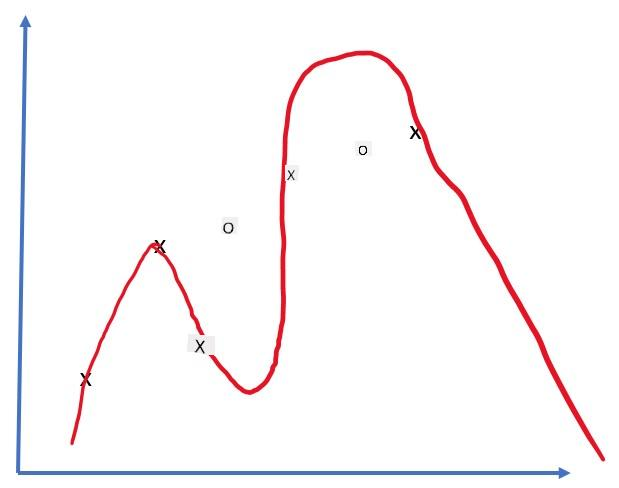
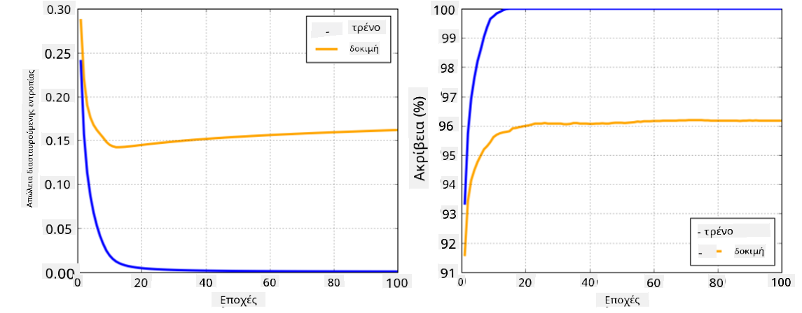

<!--
CO_OP_TRANSLATOR_METADATA:
{
  "original_hash": "2b544f20b796402507fb05a0df893323",
  "translation_date": "2025-08-29T09:10:23+00:00",
  "source_file": "lessons/3-NeuralNetworks/05-Frameworks/README.md",
  "language_code": "el"
}
-->
# Πλαίσια Νευρωνικών Δικτύων

Όπως έχουμε ήδη μάθει, για να εκπαιδεύσουμε αποτελεσματικά νευρωνικά δίκτυα, πρέπει να κάνουμε δύο πράγματα:

* Να δουλεύουμε με τανυστές, π.χ. να πολλαπλασιάζουμε, να προσθέτουμε και να υπολογίζουμε κάποιες συναρτήσεις όπως sigmoid ή softmax.
* Να υπολογίζουμε τις παραγώγους όλων των εκφράσεων, ώστε να εκτελούμε τη βελτιστοποίηση με κατηφόρο γραμμής.

## [Προ-διάλεξης κουίζ](https://red-field-0a6ddfd03.1.azurestaticapps.net/quiz/105)

Ενώ η βιβλιοθήκη `numpy` μπορεί να κάνει το πρώτο μέρος, χρειαζόμαστε κάποιο μηχανισμό για να υπολογίζουμε παραγώγους. Στο [πλαίσιο μας](../04-OwnFramework/OwnFramework.ipynb) που αναπτύξαμε στην προηγούμενη ενότητα, έπρεπε να προγραμματίσουμε χειροκίνητα όλες τις συναρτήσεις παραγώγων μέσα στη μέθοδο `backward`, η οποία εκτελεί την οπισθοδιάδοση. Ιδανικά, ένα πλαίσιο θα πρέπει να μας δίνει τη δυνατότητα να υπολογίζουμε παραγώγους για *οποιαδήποτε έκφραση* μπορούμε να ορίσουμε.

Ένα άλλο σημαντικό στοιχείο είναι η δυνατότητα εκτέλεσης υπολογισμών σε GPU ή σε άλλες εξειδικευμένες μονάδες υπολογισμού, όπως [TPU](https://en.wikipedia.org/wiki/Tensor_Processing_Unit). Η εκπαίδευση βαθιών νευρωνικών δικτύων απαιτεί *πάρα πολλούς* υπολογισμούς, και η δυνατότητα παραλληλοποίησης αυτών των υπολογισμών σε GPUs είναι πολύ σημαντική.

> ✅ Ο όρος "παραλληλοποίηση" σημαίνει τη διανομή των υπολογισμών σε πολλαπλές συσκευές.

Αυτή τη στιγμή, τα δύο πιο δημοφιλή πλαίσια νευρωνικών δικτύων είναι: [TensorFlow](http://TensorFlow.org) και [PyTorch](https://pytorch.org/). Και τα δύο παρέχουν ένα API χαμηλού επιπέδου για τη διαχείριση τανυστών τόσο σε CPU όσο και σε GPU. Πάνω από το API χαμηλού επιπέδου, υπάρχει επίσης ένα API υψηλού επιπέδου, που ονομάζεται [Keras](https://keras.io/) και [PyTorch Lightning](https://pytorchlightning.ai/) αντίστοιχα.

Low-Level API | [TensorFlow](http://TensorFlow.org) | [PyTorch](https://pytorch.org/)
--------------|-------------------------------------|--------------------------------
High-level API| [Keras](https://keras.io/) | [PyTorch Lightning](https://pytorchlightning.ai/)

**Τα APIs χαμηλού επιπέδου** και στα δύο πλαίσια σας επιτρέπουν να δημιουργείτε τα λεγόμενα **υπολογιστικά γραφήματα**. Αυτό το γράφημα ορίζει πώς να υπολογίζετε την έξοδο (συνήθως τη συνάρτηση απώλειας) με δεδομένες παραμέτρους εισόδου και μπορεί να προωθηθεί για υπολογισμό σε GPU, αν είναι διαθέσιμη. Υπάρχουν συναρτήσεις για τη διαφοροποίηση αυτού του υπολογιστικού γραφήματος και τον υπολογισμό παραγώγων, οι οποίες μπορούν στη συνέχεια να χρησιμοποιηθούν για τη βελτιστοποίηση των παραμέτρων του μοντέλου.

**Τα APIs υψηλού επιπέδου** θεωρούν τα νευρωνικά δίκτυα ως μια **ακολουθία επιπέδων**, καθιστώντας την κατασκευή των περισσότερων νευρωνικών δικτύων πολύ πιο εύκολη. Η εκπαίδευση του μοντέλου συνήθως απαιτεί την προετοιμασία των δεδομένων και στη συνέχεια την κλήση μιας συνάρτησης `fit` για να ολοκληρωθεί η διαδικασία.

Το API υψηλού επιπέδου σας επιτρέπει να κατασκευάζετε τυπικά νευρωνικά δίκτυα πολύ γρήγορα χωρίς να ανησυχείτε για πολλές λεπτομέρειες. Ταυτόχρονα, το API χαμηλού επιπέδου προσφέρει πολύ μεγαλύτερο έλεγχο στη διαδικασία εκπαίδευσης και γι' αυτό χρησιμοποιείται συχνά στην έρευνα, όταν ασχολείστε με νέες αρχιτεκτονικές νευρωνικών δικτύων.

Είναι επίσης σημαντικό να κατανοήσετε ότι μπορείτε να χρησιμοποιήσετε και τα δύο APIs μαζί, π.χ. μπορείτε να αναπτύξετε τη δική σας αρχιτεκτονική επιπέδου δικτύου χρησιμοποιώντας το API χαμηλού επιπέδου και στη συνέχεια να το χρησιμοποιήσετε μέσα σε ένα μεγαλύτερο δίκτυο που κατασκευάζεται και εκπαιδεύεται με το API υψηλού επιπέδου. Ή μπορείτε να ορίσετε ένα δίκτυο χρησιμοποιώντας το API υψηλού επιπέδου ως ακολουθία επιπέδων και στη συνέχεια να χρησιμοποιήσετε τον δικό σας βρόχο εκπαίδευσης χαμηλού επιπέδου για τη βελτιστοποίηση. Και τα δύο APIs χρησιμοποιούν τις ίδιες βασικές υποκείμενες έννοιες και έχουν σχεδιαστεί για να συνεργάζονται καλά.

## Μάθηση

Σε αυτό το μάθημα, προσφέρουμε το μεγαλύτερο μέρος του περιεχομένου τόσο για το PyTorch όσο και για το TensorFlow. Μπορείτε να επιλέξετε το προτιμώμενο πλαίσιο και να παρακολουθήσετε μόνο τα αντίστοιχα σημειωματάρια. Αν δεν είστε σίγουροι ποιο πλαίσιο να επιλέξετε, διαβάστε κάποιες συζητήσεις στο διαδίκτυο σχετικά με το **PyTorch vs. TensorFlow**. Μπορείτε επίσης να ρίξετε μια ματιά και στα δύο πλαίσια για να αποκτήσετε καλύτερη κατανόηση.

Όπου είναι δυνατόν, θα χρησιμοποιήσουμε APIs υψηλού επιπέδου για απλότητα. Ωστόσο, πιστεύουμε ότι είναι σημαντικό να κατανοήσετε πώς λειτουργούν τα νευρωνικά δίκτυα από τη βάση, γι' αυτό στην αρχή ξεκινάμε δουλεύοντας με API χαμηλού επιπέδου και τανυστές. Ωστόσο, αν θέλετε να ξεκινήσετε γρήγορα και δεν θέλετε να αφιερώσετε πολύ χρόνο στη μάθηση αυτών των λεπτομερειών, μπορείτε να παραλείψετε αυτά και να προχωρήσετε κατευθείαν στα σημειωματάρια API υψηλού επιπέδου.

## ✍️ Ασκήσεις: Πλαίσια

Συνεχίστε τη μάθησή σας στα παρακάτω σημειωματάρια:

Low-Level API | [TensorFlow+Keras Notebook](IntroKerasTF.ipynb) | [PyTorch](IntroPyTorch.ipynb)
--------------|-------------------------------------|--------------------------------
High-level API| [Keras](IntroKeras.ipynb) | *PyTorch Lightning*

Αφού κατακτήσετε τα πλαίσια, ας ανακεφαλαιώσουμε την έννοια της υπερπροσαρμογής.

# Υπερπροσαρμογή

Η υπερπροσαρμογή είναι μια εξαιρετικά σημαντική έννοια στη μηχανική μάθηση και είναι πολύ σημαντικό να την κατανοήσουμε σωστά!

Ας εξετάσουμε το παρακάτω πρόβλημα προσέγγισης 5 σημείων (που αναπαρίστανται από `x` στα παρακάτω γραφήματα):

 | 
-------------------------|--------------------------
**Γραμμικό μοντέλο, 2 παράμετροι** | **Μη γραμμικό μοντέλο, 7 παράμετροι**
Σφάλμα εκπαίδευσης = 5.3 | Σφάλμα εκπαίδευσης = 0
Σφάλμα επικύρωσης = 5.1 | Σφάλμα επικύρωσης = 20

* Στα αριστερά, βλέπουμε μια καλή προσέγγιση με ευθεία γραμμή. Επειδή ο αριθμός των παραμέτρων είναι επαρκής, το μοντέλο κατανοεί τη διανομή των σημείων σωστά.
* Στα δεξιά, το μοντέλο είναι υπερβολικά ισχυρό. Επειδή έχουμε μόνο 5 σημεία και το μοντέλο έχει 7 παραμέτρους, μπορεί να προσαρμοστεί έτσι ώστε να περνά από όλα τα σημεία, κάνοντας το σφάλμα εκπαίδευσης να είναι 0. Ωστόσο, αυτό εμποδίζει το μοντέλο να κατανοήσει το σωστό μοτίβο πίσω από τα δεδομένα, με αποτέλεσμα το σφάλμα επικύρωσης να είναι πολύ υψηλό.

Είναι πολύ σημαντικό να βρούμε τη σωστή ισορροπία μεταξύ της πολυπλοκότητας του μοντέλου (αριθμός παραμέτρων) και του αριθμού των δειγμάτων εκπαίδευσης.

## Γιατί συμβαίνει η υπερπροσαρμογή

  * Μη επαρκή δεδομένα εκπαίδευσης
  * Υπερβολικά ισχυρό μοντέλο
  * Πάρα πολύ θόρυβος στα δεδομένα εισόδου

## Πώς να ανιχνεύσετε την υπερπροσαρμογή

Όπως μπορείτε να δείτε από το παραπάνω γράφημα, η υπερπροσαρμογή μπορεί να ανιχνευθεί από ένα πολύ χαμηλό σφάλμα εκπαίδευσης και ένα υψηλό σφάλμα επικύρωσης. Κατά τη διάρκεια της εκπαίδευσης, συνήθως βλέπουμε τόσο το σφάλμα εκπαίδευσης όσο και το σφάλμα επικύρωσης να μειώνονται, και στη συνέχεια σε κάποιο σημείο το σφάλμα επικύρωσης μπορεί να σταματήσει να μειώνεται και να αρχίσει να αυξάνεται. Αυτό θα είναι ένα σημάδι υπερπροσαρμογής και η ένδειξη ότι πιθανώς πρέπει να σταματήσουμε την εκπαίδευση σε αυτό το σημείο (ή τουλάχιστον να αποθηκεύσουμε ένα στιγμιότυπο του μοντέλου).

## Πώς να αποτρέψετε την υπερπροσαρμογή

Αν παρατηρήσετε ότι συμβαίνει υπερπροσαρμογή, μπορείτε να κάνετε ένα από τα εξής:

 * Αυξήστε την ποσότητα των δεδομένων εκπαίδευσης
 * Μειώστε την πολυπλοκότητα του μοντέλου
 * Χρησιμοποιήστε κάποια [τεχνική κανονικοποίησης](../../4-ComputerVision/08-TransferLearning/TrainingTricks.md), όπως το [Dropout](../../4-ComputerVision/08-TransferLearning/TrainingTricks.md#Dropout), την οποία θα εξετάσουμε αργότερα.

## Υπερπροσαρμογή και Συμβιβασμός Μεροληψίας-Διακύμανσης

Η υπερπροσαρμογή είναι στην πραγματικότητα μια περίπτωση ενός πιο γενικού προβλήματος στη στατιστική που ονομάζεται [Συμβιβασμός Μεροληψίας-Διακύμανσης](https://en.wikipedia.org/wiki/Bias%E2%80%93variance_tradeoff). Αν εξετάσουμε τις πιθανές πηγές σφάλματος στο μοντέλο μας, μπορούμε να δούμε δύο τύπους σφαλμάτων:

* **Σφάλματα μεροληψίας** προκαλούνται από το γεγονός ότι ο αλγόριθμός μας δεν μπορεί να καταγράψει σωστά τη σχέση μεταξύ των δεδομένων εκπαίδευσης. Αυτό μπορεί να οφείλεται στο γεγονός ότι το μοντέλο μας δεν είναι αρκετά ισχυρό (**υποπροσαρμογή**).
* **Σφάλματα διακύμανσης**, τα οποία προκαλούνται από το γεγονός ότι το μοντέλο προσαρμόζεται στον θόρυβο των δεδομένων εισόδου αντί για τη σημαντική σχέση (**υπερπροσαρμογή**).

Κατά τη διάρκεια της εκπαίδευσης, το σφάλμα μεροληψίας μειώνεται (καθώς το μοντέλο μας μαθαίνει να προσεγγίζει τα δεδομένα) και το σφάλμα διακύμανσης αυξάνεται. Είναι σημαντικό να σταματήσουμε την εκπαίδευση - είτε χειροκίνητα (όταν ανιχνεύουμε υπερπροσαρμογή) είτε αυτόματα (εισάγοντας κανονικοποίηση) - για να αποτρέψουμε την υπερπροσαρμογή.

## Συμπέρασμα

Σε αυτό το μάθημα, μάθατε για τις διαφορές μεταξύ των διάφορων APIs για τα δύο πιο δημοφιλή πλαίσια AI, TensorFlow και PyTorch. Επιπλέον, μάθατε για ένα πολύ σημαντικό θέμα, την υπερπροσαρμογή.

## 🚀 Πρόκληση

Στα συνοδευτικά σημειωματάρια, θα βρείτε "εργασίες" στο τέλος. Εργαστείτε μέσα από τα σημειωματάρια και ολοκληρώστε τις εργασίες.

## [Μετα-διάλεξης κουίζ](https://red-field-0a6ddfd03.1.azurestaticapps.net/quiz/205)

## Ανασκόπηση & Αυτομελέτη

Κάντε έρευνα για τα παρακάτω θέματα:

- TensorFlow
- PyTorch
- Υπερπροσαρμογή

Ρωτήστε τον εαυτό σας τις εξής ερωτήσεις:

- Ποια είναι η διαφορά μεταξύ TensorFlow και PyTorch;
- Ποια είναι η διαφορά μεταξύ υπερπροσαρμογής και υποπροσαρμογής;

## [Εργασία](lab/README.md)

Σε αυτό το εργαστήριο, σας ζητείται να λύσετε δύο προβλήματα ταξινόμησης χρησιμοποιώντας πλήρως συνδεδεμένα δίκτυα ενός και πολλαπλών επιπέδων με PyTorch ή TensorFlow.

* [Οδηγίες](lab/README.md)
* [Σημειωματάριο](lab/LabFrameworks.ipynb)

---

**Αποποίηση ευθύνης**:  
Αυτό το έγγραφο έχει μεταφραστεί χρησιμοποιώντας την υπηρεσία αυτόματης μετάφρασης [Co-op Translator](https://github.com/Azure/co-op-translator). Παρόλο που καταβάλλουμε προσπάθειες για ακρίβεια, παρακαλούμε να έχετε υπόψη ότι οι αυτόματες μεταφράσεις ενδέχεται να περιέχουν σφάλματα ή ανακρίβειες. Το πρωτότυπο έγγραφο στη μητρική του γλώσσα θα πρέπει να θεωρείται η αυθεντική πηγή. Για κρίσιμες πληροφορίες, συνιστάται επαγγελματική ανθρώπινη μετάφραση. Δεν φέρουμε ευθύνη για τυχόν παρεξηγήσεις ή εσφαλμένες ερμηνείες που προκύπτουν από τη χρήση αυτής της μετάφρασης.