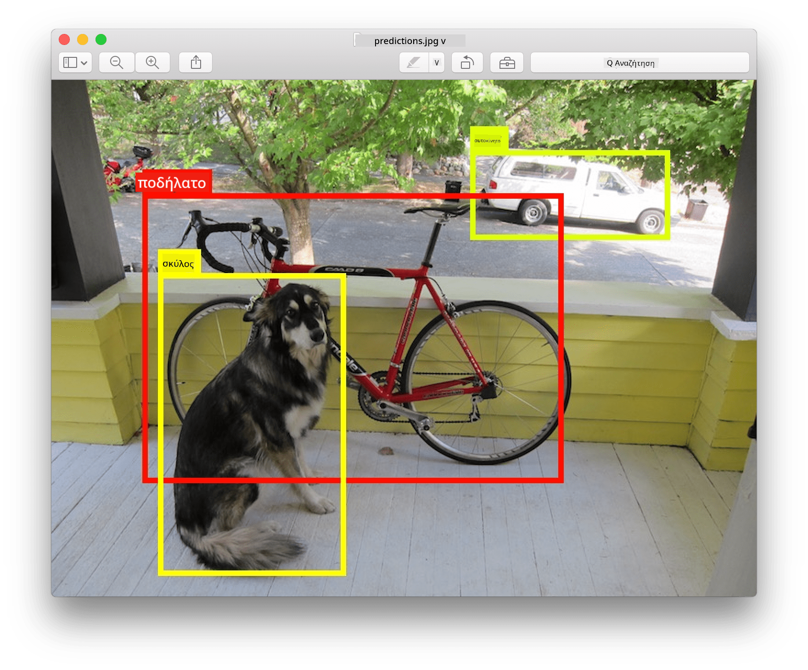
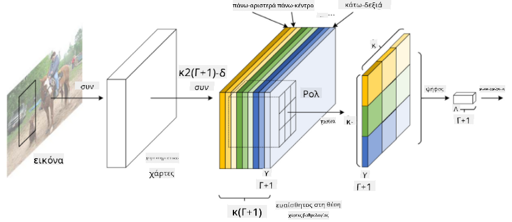
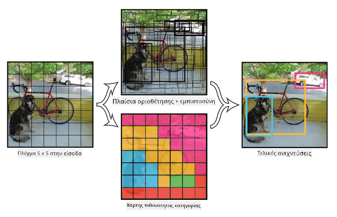

<!--
CO_OP_TRANSLATOR_METADATA:
{
  "original_hash": "d76a7eda28de5210c8b1ba50a6216c69",
  "translation_date": "2025-09-23T08:51:44+00:00",
  "source_file": "lessons/4-ComputerVision/11-ObjectDetection/README.md",
  "language_code": "el"
}
-->
# Ανίχνευση Αντικειμένων

Τα μοντέλα ταξινόμησης εικόνων που έχουμε εξετάσει μέχρι τώρα λαμβάνουν μια εικόνα και παράγουν ένα κατηγορηματικό αποτέλεσμα, όπως η κατηγορία 'αριθμός' σε ένα πρόβλημα MNIST. Ωστόσο, σε πολλές περιπτώσεις δεν θέλουμε απλώς να γνωρίζουμε ότι μια εικόνα απεικονίζει αντικείμενα - θέλουμε να μπορούμε να προσδιορίσουμε την ακριβή τους θέση. Αυτό ακριβώς είναι το νόημα της **ανίχνευσης αντικειμένων**.

## [Προ-μάθημα κουίζ](https://ff-quizzes.netlify.app/en/ai/quiz/21)

> Εικόνα από [ιστοσελίδα YOLO v2](https://pjreddie.com/darknet/yolov2/)

## Μια Αφελής Προσέγγιση για Ανίχνευση Αντικειμένων

Ας υποθέσουμε ότι θέλουμε να βρούμε μια γάτα σε μια εικόνα. Μια πολύ αφελής προσέγγιση για την ανίχνευση αντικειμένων θα ήταν η εξής:

1. Διασπάστε την εικόνα σε έναν αριθμό πλακιδίων.
2. Εκτελέστε ταξινόμηση εικόνας σε κάθε πλακίδιο.
3. Τα πλακίδια που δίνουν αρκετά υψηλή ενεργοποίηση μπορούν να θεωρηθούν ότι περιέχουν το αντικείμενο που αναζητούμε.

> *Εικόνα από [Exercise Notebook](ObjectDetection-TF.ipynb)*

Ωστόσο, αυτή η προσέγγιση απέχει πολύ από το ιδανικό, καθώς επιτρέπει στον αλγόριθμο να εντοπίσει το πλαίσιο του αντικειμένου πολύ αόριστα. Για πιο ακριβή εντοπισμό, πρέπει να εκτελέσουμε κάποιο είδος **παλινδρόμησης** για να προβλέψουμε τις συντεταγμένες των πλαισίων - και για αυτό, χρειαζόμαστε συγκεκριμένα σύνολα δεδομένων.

## Παλινδρόμηση για Ανίχνευση Αντικειμένων

[Αυτό το άρθρο](https://towardsdatascience.com/object-detection-with-neural-networks-a4e2c46b4491) παρέχει μια εξαιρετική εισαγωγή στην ανίχνευση σχημάτων.

## Σύνολα Δεδομένων για Ανίχνευση Αντικειμένων

Μπορεί να συναντήσετε τα εξής σύνολα δεδομένων για αυτήν την εργασία:

* [PASCAL VOC](http://host.robots.ox.ac.uk/pascal/VOC/) - 20 κατηγορίες
* [COCO](http://cocodataset.org/#home) - Common Objects in Context. 80 κατηγορίες, πλαίσια και μάσκες τμηματοποίησης

## Μετρικές Ανίχνευσης Αντικειμένων

### Intersection over Union

Ενώ για την ταξινόμηση εικόνων είναι εύκολο να μετρήσουμε πόσο καλά αποδίδει ο αλγόριθμος, για την ανίχνευση αντικειμένων πρέπει να μετρήσουμε τόσο την ορθότητα της κατηγορίας όσο και την ακρίβεια της προβλεπόμενης θέσης του πλαισίου. Για το τελευταίο, χρησιμοποιούμε τη λεγόμενη **Intersection over Union** (IoU), η οποία μετρά πόσο καλά δύο πλαίσια (ή δύο αυθαίρετες περιοχές) επικαλύπτονται.

> *Εικόνα 2 από [αυτό το εξαιρετικό άρθρο για το IoU](https://pyimagesearch.com/2016/11/07/intersection-over-union-iou-for-object-detection/)*

Η ιδέα είναι απλή - διαιρούμε την περιοχή της τομής μεταξύ δύο σχημάτων με την περιοχή της ένωσής τους. Για δύο πανομοιότυπες περιοχές, το IoU θα είναι 1, ενώ για εντελώς ασύνδετες περιοχές θα είναι 0. Διαφορετικά, θα κυμαίνεται από 0 έως 1. Συνήθως λαμβάνουμε υπόψη μόνο εκείνα τα πλαίσια για τα οποία το IoU είναι πάνω από μια συγκεκριμένη τιμή.

### Average Precision

Ας υποθέσουμε ότι θέλουμε να μετρήσουμε πόσο καλά αναγνωρίζεται μια δεδομένη κατηγορία αντικειμένων $C$. Για να το μετρήσουμε, χρησιμοποιούμε τη μετρική **Average Precision**, η οποία υπολογίζεται ως εξής:

1. Εξετάζουμε την καμπύλη Precision-Recall που δείχνει την ακρίβεια ανάλογα με την τιμή του κατωφλίου ανίχνευσης (από 0 έως 1).
2. Ανάλογα με το κατώφλι, θα εντοπιστούν περισσότερα ή λιγότερα αντικείμενα στην εικόνα, και θα έχουμε διαφορετικές τιμές ακρίβειας και ανάκλησης.
3. Η καμπύλη θα μοιάζει με αυτή:

> *Εικόνα από [NeuroWorkshop](http://github.com/shwars/NeuroWorkshop)*

Η μέση ακρίβεια για μια δεδομένη κατηγορία $C$ είναι η περιοχή κάτω από αυτήν την καμπύλη. Πιο συγκεκριμένα, ο άξονας Recall συνήθως διαιρείται σε 10 μέρη, και η ακρίβεια υπολογίζεται ως μέσος όρος σε όλα αυτά τα σημεία:

$$
AP = {1\over11}\sum_{i=0}^{10}\mbox{Precision}(\mbox{Recall}={i\over10})
$$

### AP και IoU

Θα εξετάσουμε μόνο εκείνες τις ανιχνεύσεις για τις οποίες το IoU είναι πάνω από μια συγκεκριμένη τιμή. Για παράδειγμα, στο σύνολο δεδομένων PASCAL VOC συνήθως $\mbox{IoU Threshold} = 0.5$, ενώ στο COCO το AP μετριέται για διαφορετικές τιμές του $\mbox{IoU Threshold}$.

> *Εικόνα από [NeuroWorkshop](http://github.com/shwars/NeuroWorkshop)*

### Mean Average Precision - mAP

Η κύρια μετρική για την Ανίχνευση Αντικειμένων ονομάζεται **Mean Average Precision**, ή **mAP**. Είναι η τιμή της Μέσης Ακρίβειας, μέσος όρος σε όλες τις κατηγορίες αντικειμένων, και μερικές φορές επίσης πάνω από το $\mbox{IoU Threshold}$. Η διαδικασία υπολογισμού του **mAP** περιγράφεται
[σε αυτό το άρθρο](https://medium.com/@timothycarlen/understanding-the-map-evaluation-metric-for-object-detection-a07fe6962cf3)), καθώς και [εδώ με δείγματα κώδικα](https://gist.github.com/tarlen5/008809c3decf19313de216b9208f3734).

## Διαφορετικές Προσεγγίσεις Ανίχνευσης Αντικειμένων

Υπάρχουν δύο ευρείες κατηγορίες αλγορίθμων ανίχνευσης αντικειμένων:

* **Region Proposal Networks** (R-CNN, Fast R-CNN, Faster R-CNN). Η βασική ιδέα είναι να δημιουργηθούν **Regions of Interests** (ROI) και να εκτελεστεί CNN πάνω τους, αναζητώντας μέγιστη ενεργοποίηση. Είναι κάπως παρόμοιο με την αφελή προσέγγιση, με τη διαφορά ότι τα ROI δημιουργούνται με πιο έξυπνο τρόπο. Ένα από τα κύρια μειονεκτήματα αυτών των μεθόδων είναι ότι είναι αργές, επειδή απαιτούν πολλές περάσεις του ταξινομητή CNN πάνω από την εικόνα.
* **One-pass** (YOLO, SSD, RetinaNet) μέθοδοι. Σε αυτές τις αρχιτεκτονικές σχεδιάζουμε το δίκτυο να προβλέπει τόσο τις κατηγορίες όσο και τα ROI σε μία μόνο περά.

### R-CNN: Region-Based CNN

Το [R-CNN](http://islab.ulsan.ac.kr/files/announcement/513/rcnn_pami.pdf) χρησιμοποιεί [Selective Search](http://www.huppelen.nl/publications/selectiveSearchDraft.pdf) για να δημιουργήσει ιεραρχική δομή περιοχών ROI, οι οποίες στη συνέχεια περνούν από εξαγωγείς χαρακτηριστικών CNN και ταξινομητές SVM για να προσδιοριστεί η κατηγορία του αντικειμένου, και γραμμική παλινδρόμηση για να προσδιοριστούν οι συντεταγμένες του *bounding box*. [Επίσημο Άρθρο](https://arxiv.org/pdf/1506.01497v1.pdf)

> *Εικόνα από van de Sande et al. ICCV’11*

> *Εικόνες από [αυτό το άρθρο](https://towardsdatascience.com/r-cnn-fast-r-cnn-faster-r-cnn-yolo-object-detection-algorithms-36d53571365e)*

### F-RCNN - Fast R-CNN

Αυτή η προσέγγιση είναι παρόμοια με το R-CNN, αλλά οι περιοχές ορίζονται αφού έχουν εφαρμοστεί τα επίπεδα συνελικτικής.

> Εικόνα από [το Επίσημο Άρθρο](https://www.cv-foundation.org/openaccess/content_iccv_2015/papers/Girshick_Fast_R-CNN_ICCV_2015_paper.pdf), [arXiv](https://arxiv.org/pdf/1504.08083.pdf), 2015

### Faster R-CNN

Η βασική ιδέα αυτής της προσέγγισης είναι να χρησιμοποιηθεί ένα νευρωνικό δίκτυο για να προβλέψει τα ROI - το λεγόμενο *Region Proposal Network*. [Άρθρο](https://arxiv.org/pdf/1506.01497.pdf), 2016

> Εικόνα από [το επίσημο άρθρο](https://arxiv.org/pdf/1506.01497.pdf)

### R-FCN: Region-Based Fully Convolutional Network

Αυτός ο αλγόριθμος είναι ακόμα πιο γρήγορος από το Faster R-CNN. Η βασική ιδέα είναι η εξής:

1. Εξάγουμε χαρακτηριστικά χρησιμοποιώντας ResNet-101.
1. Τα χαρακτηριστικά επεξεργάζονται από **Position-Sensitive Score Map**. Κάθε αντικείμενο από $C$ κατηγορίες διαιρείται σε $k\times k$ περιοχές, και εκπαιδεύουμε το δίκτυο να προβλέπει μέρη αντικειμένων.
1. Για κάθε μέρος από τις $k\times k$ περιοχές, όλα τα δίκτυα ψηφίζουν για τις κατηγορίες αντικειμένων, και η κατηγορία αντικειμένου με τη μέγιστη ψήφο επιλέγεται.

> Εικόνα από [επίσημο άρθρο](https://arxiv.org/abs/1605.06409)

### YOLO - You Only Look Once

Το YOLO είναι ένας αλγόριθμος πραγματικού χρόνου με μία μόνο περά. Η βασική ιδέα είναι η εξής:

 * Η εικόνα διαιρείται σε $S\times S$ περιοχές.
 * Για κάθε περιοχή, **CNN** προβλέπει $n$ πιθανά αντικείμενα, τις συντεταγμένες του *bounding box* και την *confidence*=*πιθανότητα* * IoU.

 

> Εικόνα από [επίσημο άρθρο](https://arxiv.org/abs/1506.02640)

### Άλλοι Αλγόριθμοι

* RetinaNet: [επίσημο άρθρο](https://arxiv.org/abs/1708.02002)
   - [Υλοποίηση PyTorch στο Torchvision](https://pytorch.org/vision/stable/_modules/torchvision/models/detection/retinanet.html)
   - [Υλοποίηση Keras](https://github.com/fizyr/keras-retinanet)
   - [Ανίχνευση Αντικειμένων με RetinaNet](https://keras.io/examples/vision/retinanet/) στα δείγματα Keras
* SSD (Single Shot Detector): [επίσημο άρθρο](https://arxiv.org/abs/1512.02325)

## ✍️ Ασκήσεις: Ανίχνευση Αντικειμένων

Συνεχίστε τη μάθησή σας στο παρακάτω notebook:

[ObjectDetection.ipynb](ObjectDetection.ipynb)

## Συμπέρασμα

Σε αυτό το μάθημα κάνατε μια γρήγορη περιήγηση σε όλους τους διάφορους τρόπους με τους οποίους μπορεί να επιτευχθεί η ανίχνευση αντικειμένων!

## 🚀 Πρόκληση

Διαβάστε αυτά τα άρθρα και notebooks σχετικά με το YOLO και δοκιμάστε τα μόνοι σας:

* [Καλό άρθρο](https://www.analyticsvidhya.com/blog/2018/12/practical-guide-object-detection-yolo-framewor-python/) που περιγράφει το YOLO
 * [Επίσημη ιστοσελίδα](https://pjreddie.com/darknet/yolo/)
 * Yolo: [Υλοποίηση Keras](https://github.com/experiencor/keras-yolo2), [notebook βήμα-βήμα](https://github.com/experiencor/basic-yolo-keras/blob/master/Yolo%20Step-by-Step.ipynb)
 * Yolo v2: [Υλοποίηση Keras](https://github.com/experiencor/keras-yolo2), [notebook βήμα-βήμα](https://github.com/experiencor/keras-yolo2/blob/master/Yolo%20Step-by-Step.ipynb)

## [Μετά-μάθημα κουίζ](https://ff-quizzes.netlify.app/en/ai/quiz/22)

## Ανασκόπηση & Αυτομελέτη

* [Ανίχνευση Αντικειμένων](https://tjmachinelearning.com/lectures/1718/obj/) από τον Nikhil Sardana
* [Μια καλή σύγκριση αλγορίθμων ανίχνευσης αντικειμένων](https://lilianweng.github.io/lil-log/2018/12/27/object-detection-part-4.html)
* [Ανασκόπηση Αλγορίθμων Deep Learning για Ανίχνευση Αντικειμένων](https://medium.com/comet-app/review-of-deep-learning-algorithms-for-object-detection-c1f3d437b852)
* [Εισαγωγή βήμα-βήμα στους βασικούς αλγορίθμους ανίχνευσης αντικειμένων](https://www.analyticsvidhya.com/blog/2018/10/a-step-by-step-introduction-to-the-basic-object-detection-algorithms-part-1/)
* [Υλοποίηση του Faster R-CNN σε Python για Ανίχνευση Αντικειμένων](https://www.analyticsvidhya.com/blog/2018/11/implementation-faster-r-cnn-python-object-detection/)

## [Εργασία: Ανίχνευση Αντικειμένων](lab/README.md)

---

