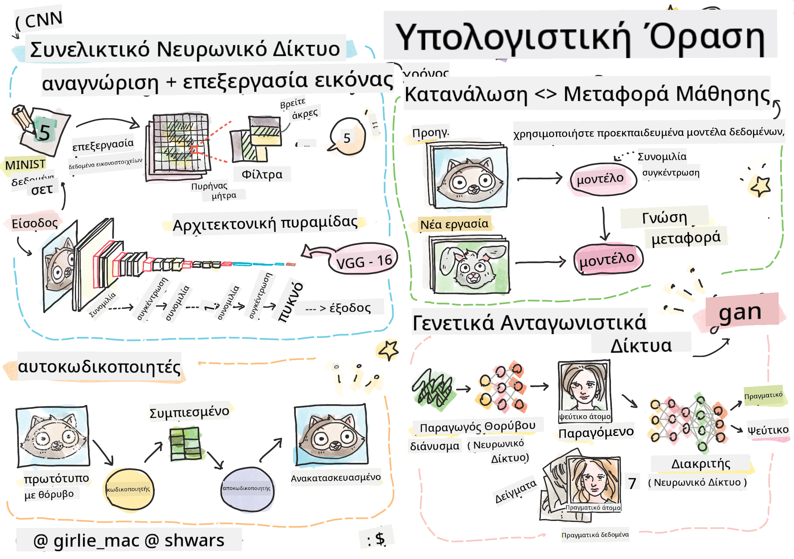

<!--
CO_OP_TRANSLATOR_METADATA:
{
  "original_hash": "58a52f000089c1d8906a4daa4ab1169b",
  "translation_date": "2025-08-29T08:45:13+00:00",
  "source_file": "lessons/4-ComputerVision/README.md",
  "language_code": "el"
}
-->
# Υπολογιστική Όραση

Σε αυτήν την ενότητα θα μάθουμε για:

* [Εισαγωγή στην Υπολογιστική Όραση και το OpenCV](06-IntroCV/README.md)
* [Συνελικτικά Νευρωνικά Δίκτυα](07-ConvNets/README.md)
* [Προεκπαιδευμένα Δίκτυα και Μεταφορά Μάθησης](08-TransferLearning/README.md) 
* [Αυτοκωδικοποιητές](09-Autoencoders/README.md)
* [Γενετικά Ανταγωνιστικά Δίκτυα](10-GANs/README.md)
* [Ανίχνευση Αντικειμένων](11-ObjectDetection/README.md)
* [Σημασιολογική Τμηματοποίηση](12-Segmentation/README.md)

---

**Αποποίηση ευθύνης**:  
Αυτό το έγγραφο έχει μεταφραστεί χρησιμοποιώντας την υπηρεσία αυτόματης μετάφρασης [Co-op Translator](https://github.com/Azure/co-op-translator). Παρόλο που καταβάλλουμε προσπάθειες για ακρίβεια, παρακαλούμε να έχετε υπόψη ότι οι αυτόματες μεταφράσεις ενδέχεται να περιέχουν σφάλματα ή ανακρίβειες. Το πρωτότυπο έγγραφο στη μητρική του γλώσσα θα πρέπει να θεωρείται η αυθεντική πηγή. Για κρίσιμες πληροφορίες, συνιστάται επαγγελματική ανθρώπινη μετάφραση. Δεν φέρουμε ευθύνη για τυχόν παρεξηγήσεις ή εσφαλμένες ερμηνείες που προκύπτουν από τη χρήση αυτής της μετάφρασης.