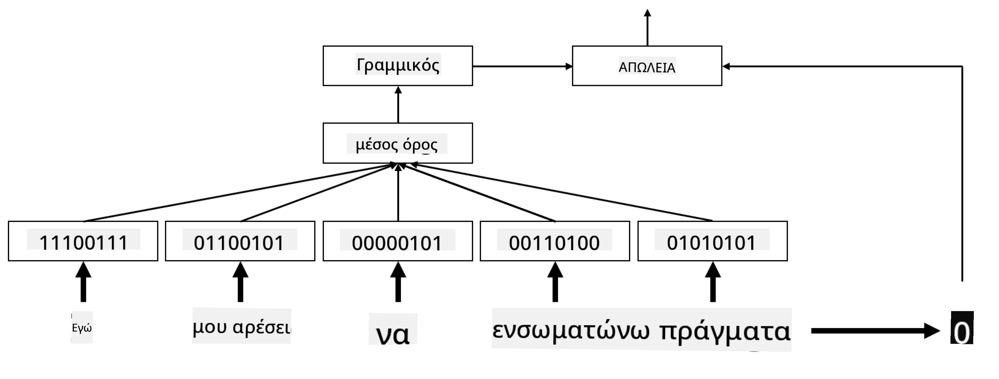

<!--
CO_OP_TRANSLATOR_METADATA:
{
  "original_hash": "b708c9b85b833864c73c6281f1e6b96e",
  "translation_date": "2025-09-23T09:00:44+00:00",
  "source_file": "lessons/5-NLP/14-Embeddings/README.md",
  "language_code": "el"
}
-->
# Ενσωματώσεις

## [Προ-διάλεξης κουίζ](https://ff-quizzes.netlify.app/en/ai/quiz/27)

Όταν εκπαιδεύαμε ταξινομητές βασισμένους σε BoW ή TF/IDF, δουλεύαμε με διανύσματα υψηλής διάστασης τύπου bag-of-words με μήκος `vocab_size`, και μετατρέπαμε ρητά από διανύσματα χαμηλής διάστασης σε αραιά διανύσματα one-hot. Ωστόσο, αυτή η αναπαράσταση one-hot δεν είναι αποδοτική από άποψη μνήμης. Επιπλέον, κάθε λέξη αντιμετωπίζεται ανεξάρτητα από τις άλλες, δηλαδή τα διανύσματα one-hot δεν εκφράζουν καμία σημασιολογική ομοιότητα μεταξύ των λέξεων.

Η ιδέα της **ενσωμάτωσης** (embedding) είναι να αναπαραστήσουμε τις λέξεις με διανύσματα χαμηλότερης διάστασης, τα οποία με κάποιο τρόπο αντικατοπτρίζουν τη σημασιολογική έννοια μιας λέξης. Αργότερα θα συζητήσουμε πώς να δημιουργήσουμε ουσιαστικές ενσωματώσεις λέξεων, αλλά προς το παρόν ας σκεφτούμε τις ενσωματώσεις ως έναν τρόπο μείωσης της διάστασης ενός διανύσματος λέξης.

Έτσι, το επίπεδο ενσωμάτωσης θα παίρνει μια λέξη ως είσοδο και θα παράγει ένα διανυσματικό αποτέλεσμα με καθορισμένο `embedding_size`. Με μια έννοια, είναι πολύ παρόμοιο με ένα επίπεδο `Linear`, αλλά αντί να παίρνει ένα διάνυσμα one-hot, θα μπορεί να παίρνει έναν αριθμό λέξης ως είσοδο, επιτρέποντάς μας να αποφύγουμε τη δημιουργία μεγάλων διανυσμάτων one-hot.

Χρησιμοποιώντας ένα επίπεδο ενσωμάτωσης ως το πρώτο επίπεδο στο δίκτυο ταξινόμησής μας, μπορούμε να μεταβούμε από ένα μοντέλο bag-of-words σε ένα μοντέλο **embedding bag**, όπου πρώτα μετατρέπουμε κάθε λέξη στο κείμενό μας στην αντίστοιχη ενσωμάτωσή της και στη συνέχεια υπολογίζουμε κάποια συνάρτηση συσσωμάτωσης πάνω σε όλες αυτές τις ενσωματώσεις, όπως `sum`, `average` ή `max`.  

> Εικόνα από τον συγγραφέα

## ✍️ Ασκήσεις: Ενσωματώσεις

Συνεχίστε τη μάθησή σας στα παρακάτω notebooks:
* [Ενσωματώσεις με PyTorch](EmbeddingsPyTorch.ipynb)
* [Ενσωματώσεις με TensorFlow](EmbeddingsTF.ipynb)

## Σημασιολογικές Ενσωματώσεις: Word2Vec

Ενώ το επίπεδο ενσωμάτωσης μαθαίνει να αντιστοιχεί λέξεις σε διανυσματική αναπαράσταση, αυτή η αναπαράσταση δεν έχει απαραίτητα μεγάλη σημασιολογική αξία. Θα ήταν χρήσιμο να μάθουμε μια διανυσματική αναπαράσταση τέτοια ώστε παρόμοιες λέξεις ή συνώνυμα να αντιστοιχούν σε διανύσματα που είναι κοντά μεταξύ τους με βάση κάποια απόσταση διανυσμάτων (π.χ. Ευκλείδεια απόσταση).

Για να το πετύχουμε αυτό, πρέπει να προεκπαιδεύσουμε το μοντέλο ενσωμάτωσης σε μια μεγάλη συλλογή κειμένων με συγκεκριμένο τρόπο. Ένας τρόπος για να εκπαιδεύσουμε σημασιολογικές ενσωματώσεις είναι το [Word2Vec](https://en.wikipedia.org/wiki/Word2vec). Βασίζεται σε δύο κύριες αρχιτεκτονικές που χρησιμοποιούνται για την παραγωγή μιας κατανεμημένης αναπαράστασης λέξεων:

 - **Συνεχές bag-of-words** (CBoW) — σε αυτή την αρχιτεκτονική, εκπαιδεύουμε το μοντέλο να προβλέπει μια λέξη από το περιβάλλον της. Δεδομένου του ngram $(W_{-2},W_{-1},W_0,W_1,W_2)$, ο στόχος του μοντέλου είναι να προβλέψει το $W_0$ από το $(W_{-2},W_{-1},W_1,W_2)$.
 - **Συνεχές skip-gram** — είναι το αντίθετο του CBoW. Το μοντέλο χρησιμοποιεί το παράθυρο των λέξεων περιβάλλοντος για να προβλέψει την τρέχουσα λέξη.

Το CBoW είναι ταχύτερο, ενώ το skip-gram είναι πιο αργό, αλλά αποδίδει καλύτερα στην αναπαράσταση σπάνιων λέξεων.

> Εικόνα από [αυτό το άρθρο](https://arxiv.org/pdf/1301.3781.pdf)

Οι προεκπαιδευμένες ενσωματώσεις Word2Vec (όπως και άλλα παρόμοια μοντέλα, όπως το GloVe) μπορούν επίσης να χρησιμοποιηθούν αντί για το επίπεδο ενσωμάτωσης στα νευρωνικά δίκτυα. Ωστόσο, πρέπει να διαχειριστούμε τα λεξιλόγια, επειδή το λεξιλόγιο που χρησιμοποιείται για την προεκπαίδευση του Word2Vec/GloVe πιθανότατα διαφέρει από το λεξιλόγιο στο κείμενό μας. Ρίξτε μια ματιά στα παραπάνω Notebooks για να δείτε πώς μπορεί να λυθεί αυτό το πρόβλημα.

## Ενσωματώσεις με Συμφραζόμενα

Ένας βασικός περιορισμός των παραδοσιακών προεκπαιδευμένων ενσωματώσεων, όπως το Word2Vec, είναι το πρόβλημα της αποσαφήνισης της έννοιας μιας λέξης. Ενώ οι προεκπαιδευμένες ενσωματώσεις μπορούν να αποτυπώσουν κάποια από τη σημασία των λέξεων στο συμφραζόμενο, κάθε πιθανή έννοια μιας λέξης κωδικοποιείται στην ίδια ενσωμάτωση. Αυτό μπορεί να προκαλέσει προβλήματα σε μεταγενέστερα μοντέλα, καθώς πολλές λέξεις, όπως η λέξη "play", έχουν διαφορετικές έννοιες ανάλογα με το συμφραζόμενο στο οποίο χρησιμοποιούνται.

Για παράδειγμα, η λέξη "play" στις παρακάτω προτάσεις έχει αρκετά διαφορετική σημασία:

- Πήγα σε μια **παράσταση** στο θέατρο.
- Ο Γιάννης θέλει να **παίξει** με τους φίλους του.

Οι παραπάνω προεκπαιδευμένες ενσωματώσεις αναπαριστούν και τις δύο αυτές έννοιες της λέξης "play" στην ίδια ενσωμάτωση. Για να ξεπεράσουμε αυτόν τον περιορισμό, πρέπει να δημιουργήσουμε ενσωματώσεις βασισμένες στο **γλωσσικό μοντέλο**, το οποίο εκπαιδεύεται σε ένα μεγάλο σώμα κειμένων και "γνωρίζει" πώς οι λέξεις μπορούν να συνδυαστούν σε διαφορετικά συμφραζόμενα. Η συζήτηση για τις ενσωματώσεις με συμφραζόμενα είναι εκτός του πεδίου αυτού του μαθήματος, αλλά θα επιστρέψουμε σε αυτές όταν μιλήσουμε για τα γλωσσικά μοντέλα αργότερα στο μάθημα.

## Συμπέρασμα

Σε αυτό το μάθημα, ανακαλύψατε πώς να δημιουργείτε και να χρησιμοποιείτε επίπεδα ενσωμάτωσης στο TensorFlow και το Pytorch για να αποτυπώνετε καλύτερα τις σημασιολογικές έννοιες των λέξεων.

## 🚀 Πρόκληση

Το Word2Vec έχει χρησιμοποιηθεί για μερικές ενδιαφέρουσες εφαρμογές, όπως η δημιουργία στίχων τραγουδιών και ποίησης. Ρίξτε μια ματιά σε [αυτό το άρθρο](https://www.politetype.com/blog/word2vec-color-poems), το οποίο εξηγεί πώς ο συγγραφέας χρησιμοποίησε το Word2Vec για να δημιουργήσει ποίηση. Δείτε επίσης [αυτό το βίντεο από τον Dan Shiffmann](https://www.youtube.com/watch?v=LSS_bos_TPI&ab_channel=TheCodingTrain) για μια διαφορετική εξήγηση αυτής της τεχνικής. Στη συνέχεια, προσπαθήστε να εφαρμόσετε αυτές τις τεχνικές στο δικό σας σώμα κειμένων, ίσως από δεδομένα που θα βρείτε στο Kaggle.

## [Μετά-διάλεξης κουίζ](https://ff-quizzes.netlify.app/en/ai/quiz/28)

## Ανασκόπηση & Αυτομελέτη

Διαβάστε αυτό το άρθρο για το Word2Vec: [Efficient Estimation of Word Representations in Vector Space](https://arxiv.org/pdf/1301.3781.pdf)

## [Εργασία: Notebooks](assignment.md)

---

