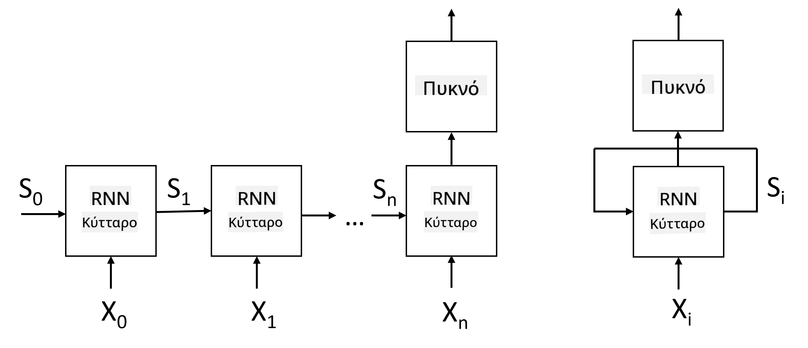
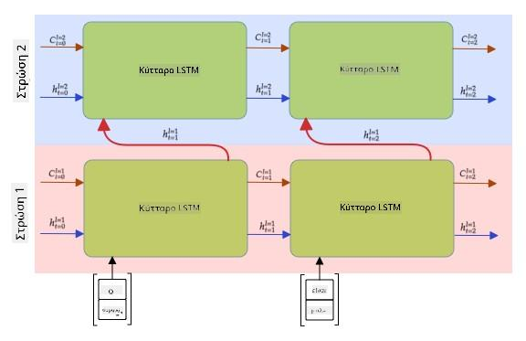

<!--
CO_OP_TRANSLATOR_METADATA:
{
  "original_hash": "58bf4adb210aab53e8f78c8082040e7c",
  "translation_date": "2025-08-29T09:24:00+00:00",
  "source_file": "lessons/5-NLP/16-RNN/README.md",
  "language_code": "el"
}
-->
# Επαναλαμβανόμενα Νευρωνικά Δίκτυα

## [Προ-διάλεξης κουίζ](https://red-field-0a6ddfd03.1.azurestaticapps.net/quiz/116)

Στις προηγούμενες ενότητες, χρησιμοποιούσαμε πλούσιες σημασιολογικές αναπαραστάσεις κειμένου και έναν απλό γραμμικό ταξινομητή πάνω από τα embeddings. Αυτή η αρχιτεκτονική καταγράφει τη συνολική σημασία των λέξεων σε μια πρόταση, αλλά δεν λαμβάνει υπόψη τη **σειρά** των λέξεων, επειδή η λειτουργία συσσωμάτωσης πάνω από τα embeddings αφαιρεί αυτή την πληροφορία από το αρχικό κείμενο. Επειδή αυτά τα μοντέλα δεν μπορούν να μοντελοποιήσουν τη σειρά των λέξεων, δεν μπορούν να λύσουν πιο σύνθετα ή αμφίσημα καθήκοντα, όπως η δημιουργία κειμένου ή η απάντηση σε ερωτήσεις.

Για να κατανοήσουμε τη σημασία μιας ακολουθίας κειμένου, πρέπει να χρησιμοποιήσουμε μια άλλη αρχιτεκτονική νευρωνικού δικτύου, που ονομάζεται **επαναλαμβανόμενο νευρωνικό δίκτυο** ή RNN. Στο RNN, περνάμε την πρότασή μας μέσα από το δίκτυο ένα σύμβολο τη φορά, και το δίκτυο παράγει μια **κατάσταση**, την οποία στη συνέχεια περνάμε ξανά στο δίκτυο μαζί με το επόμενο σύμβολο.

> Εικόνα από τον συγγραφέα

Δεδομένης της εισόδου μιας ακολουθίας συμβόλων X0,...,Xn, το RNN δημιουργεί μια ακολουθία μπλοκ νευρωνικού δικτύου και εκπαιδεύει αυτή την ακολουθία από άκρη σε άκρη χρησιμοποιώντας backpropagation. Κάθε μπλοκ δικτύου λαμβάνει ένα ζεύγος (Xi,Si) ως είσοδο και παράγει το Si+1 ως αποτέλεσμα. Η τελική κατάσταση Sn ή (έξοδος Yn) περνάει σε έναν γραμμικό ταξινομητή για να παραχθεί το αποτέλεσμα. Όλα τα μπλοκ του δικτύου μοιράζονται τα ίδια βάρη και εκπαιδεύονται από άκρη σε άκρη με μία διέλευση backpropagation.

Επειδή οι διανύσματα κατάστασης S0,...,Sn περνούν μέσα από το δίκτυο, αυτό είναι σε θέση να μάθει τις διαδοχικές εξαρτήσεις μεταξύ των λέξεων. Για παράδειγμα, όταν η λέξη *όχι* εμφανίζεται κάπου στην ακολουθία, μπορεί να μάθει να αναιρεί ορισμένα στοιχεία μέσα στο διάνυσμα κατάστασης, οδηγώντας σε άρνηση.

> ✅ Επειδή τα βάρη όλων των μπλοκ RNN στην παραπάνω εικόνα είναι κοινά, η ίδια εικόνα μπορεί να αναπαρασταθεί ως ένα μπλοκ (στα δεξιά) με έναν επαναλαμβανόμενο βρόχο ανάδρασης, που περνά την έξοδο κατάστασης του δικτύου πίσω στην είσοδο.

## Ανατομία ενός Κυττάρου RNN

Ας δούμε πώς οργανώνεται ένα απλό κύτταρο RNN. Δέχεται την προηγούμενη κατάσταση Si-1 και το τρέχον σύμβολο Xi ως εισόδους και πρέπει να παράγει την έξοδο κατάστασης Si (και, μερικές φορές, μας ενδιαφέρει επίσης κάποια άλλη έξοδος Yi, όπως στην περίπτωση των γεννητικών δικτύων).

Ένα απλό κύτταρο RNN έχει δύο πίνακες βαρών στο εσωτερικό του: ένας μετασχηματίζει ένα σύμβολο εισόδου (ας τον ονομάσουμε W) και ένας άλλος μετασχηματίζει μια κατάσταση εισόδου (H). Σε αυτή την περίπτωση, η έξοδος του δικτύου υπολογίζεται ως σ(W×Xi+H×Si-1+b), όπου σ είναι η συνάρτηση ενεργοποίησης και b είναι μια πρόσθετη προκατάληψη.

> Εικόνα από τον συγγραφέα

Σε πολλές περιπτώσεις, τα σύμβολα εισόδου περνούν μέσα από το επίπεδο embedding πριν εισέλθουν στο RNN για να μειωθεί η διαστατικότητα. Σε αυτή την περίπτωση, αν η διάσταση των διανυσμάτων εισόδου είναι *emb_size* και το διάνυσμα κατάστασης είναι *hid_size*, τότε το μέγεθος του W είναι *emb_size*×*hid_size* και το μέγεθος του H είναι *hid_size*×*hid_size*.

## Μνήμη Μακράς και Βραχείας Διάρκειας (LSTM)

Ένα από τα κύρια προβλήματα των κλασικών RNN είναι το λεγόμενο πρόβλημα **εξασθένισης των κλίσεων**. Επειδή τα RNN εκπαιδεύονται από άκρη σε άκρη σε μία διέλευση backpropagation, δυσκολεύονται να μεταδώσουν το σφάλμα στα πρώτα επίπεδα του δικτύου, και έτσι το δίκτυο δεν μπορεί να μάθει σχέσεις μεταξύ απομακρυσμένων συμβόλων. Ένας από τους τρόπους για να αποφευχθεί αυτό το πρόβλημα είναι η εισαγωγή **ρητής διαχείρισης κατάστασης** μέσω της χρήσης των λεγόμενων **πυλών**. Υπάρχουν δύο γνωστές αρχιτεκτονικές αυτού του είδους: **Μνήμη Μακράς και Βραχείας Διάρκειας** (LSTM) και **Μονάδα Ελεγχόμενης Μεταφοράς** (GRU).

> Πηγή εικόνας TBD

Το Δίκτυο LSTM είναι οργανωμένο με τρόπο παρόμοιο με το RNN, αλλά υπάρχουν δύο καταστάσεις που μεταφέρονται από επίπεδο σε επίπεδο: η πραγματική κατάσταση C και το κρυφό διάνυσμα H. Σε κάθε μονάδα, το κρυφό διάνυσμα Hi συνενώνεται με την είσοδο Xi και ελέγχουν τι συμβαίνει στην κατάσταση C μέσω **πυλών**. Κάθε πύλη είναι ένα νευρωνικό δίκτυο με ενεργοποίηση sigmoid (έξοδος στο εύρος [0,1]), που μπορεί να θεωρηθεί ως μάσκα bitwise όταν πολλαπλασιάζεται με το διάνυσμα κατάστασης. Υπάρχουν οι εξής πύλες (από αριστερά προς τα δεξιά στην παραπάνω εικόνα):

* Η **πύλη λήθης** λαμβάνει ένα κρυφό διάνυσμα και καθορίζει ποια στοιχεία του διανύσματος C πρέπει να ξεχάσουμε και ποια να περάσουμε.
* Η **πύλη εισόδου** λαμβάνει πληροφορίες από τα διανύσματα εισόδου και κρυφού και τις εισάγει στην κατάσταση.
* Η **πύλη εξόδου** μετασχηματίζει την κατάσταση μέσω ενός γραμμικού επιπέδου με ενεργοποίηση *tanh* και στη συνέχεια επιλέγει ορισμένα από τα στοιχεία της χρησιμοποιώντας το κρυφό διάνυσμα Hi για να παράγει μια νέα κατάσταση Ci+1.

Τα στοιχεία της κατάστασης C μπορούν να θεωρηθούν ως σημαίες που μπορούν να ενεργοποιηθούν ή να απενεργοποιηθούν. Για παράδειγμα, όταν συναντάμε το όνομα *Αλίκη* στην ακολουθία, μπορεί να υποθέσουμε ότι αναφέρεται σε γυναικείο χαρακτήρα και να ενεργοποιήσουμε τη σημαία στην κατάσταση ότι έχουμε ένα θηλυκό ουσιαστικό στην πρόταση. Όταν στη συνέχεια συναντήσουμε τη φράση *και ο Τομ*, θα ενεργοποιήσουμε τη σημαία ότι έχουμε πληθυντικό ουσιαστικό. Έτσι, με τη διαχείριση της κατάστασης μπορούμε υποθετικά να παρακολουθούμε τις γραμματικές ιδιότητες των μερών της πρότασης.

> ✅ Ένας εξαιρετικός πόρος για την κατανόηση των εσωτερικών λειτουργιών του LSTM είναι αυτό το υπέροχο άρθρο [Understanding LSTM Networks](https://colah.github.io/posts/2015-08-Understanding-LSTMs/) του Christopher Olah.

## Διπλής Κατεύθυνσης και Πολυεπίπεδα RNN

Έχουμε συζητήσει επαναλαμβανόμενα δίκτυα που λειτουργούν προς μία κατεύθυνση, από την αρχή μιας ακολουθίας προς το τέλος. Αυτό φαίνεται φυσικό, επειδή μοιάζει με τον τρόπο που διαβάζουμε και ακούμε ομιλία. Ωστόσο, δεδομένου ότι σε πολλές πρακτικές περιπτώσεις έχουμε τυχαία πρόσβαση στην ακολουθία εισόδου, μπορεί να έχει νόημα να εκτελούμε επαναλαμβανόμενους υπολογισμούς και προς τις δύο κατευθύνσεις. Τέτοια δίκτυα ονομάζονται **διπλής κατεύθυνσης** RNN. Όταν ασχολούμαστε με δίκτυο διπλής κατεύθυνσης, θα χρειαζόμαστε δύο κρυφά διανύσματα κατάστασης, ένα για κάθε κατεύθυνση.

Ένα επαναλαμβανόμενο δίκτυο, είτε μονοκατευθυντικό είτε διπλής κατεύθυνσης, καταγράφει ορισμένα μοτίβα μέσα σε μια ακολουθία και μπορεί να τα αποθηκεύσει σε ένα διάνυσμα κατάστασης ή να τα περάσει στην έξοδο. Όπως και με τα συνελικτικά δίκτυα, μπορούμε να κατασκευάσουμε ένα άλλο επαναλαμβανόμενο επίπεδο πάνω από το πρώτο για να καταγράψουμε μοτίβα υψηλότερου επιπέδου και να χτίσουμε από τα μοτίβα χαμηλού επιπέδου που εξάγονται από το πρώτο επίπεδο. Αυτό μας οδηγεί στην έννοια ενός **πολυεπίπεδου RNN**, το οποίο αποτελείται από δύο ή περισσότερα επαναλαμβανόμενα δίκτυα, όπου η έξοδος του προηγούμενου επιπέδου περνά στο επόμενο επίπεδο ως είσοδος.

*Εικόνα από [αυτή την υπέροχη ανάρτηση](https://towardsdatascience.com/from-a-lstm-cell-to-a-multilayer-lstm-network-with-pytorch-2899eb5696f3) του Fernando López*

## ✍️ Ασκήσεις: Embeddings

Συνεχίστε τη μάθησή σας στα παρακάτω notebooks:

* [RNNs με PyTorch](RNNPyTorch.ipynb)
* [RNNs με TensorFlow](RNNTF.ipynb)

## Συμπέρασμα

Σε αυτή την ενότητα, είδαμε ότι τα RNN μπορούν να χρησιμοποιηθούν για ταξινόμηση ακολουθιών, αλλά στην πραγματικότητα, μπορούν να χειριστούν πολλά περισσότερα καθήκοντα, όπως η δημιουργία κειμένου, η μηχανική μετάφραση και άλλα. Θα εξετάσουμε αυτά τα καθήκοντα στην επόμενη ενότητα.

## 🚀 Πρόκληση

Διαβάστε κάποια βιβλιογραφία σχετικά με τα LSTM και εξετάστε τις εφαρμογές τους:

- [Grid Long Short-Term Memory](https://arxiv.org/pdf/1507.01526v1.pdf)
- [Show, Attend and Tell: Neural Image Caption
Generation with Visual Attention](https://arxiv.org/pdf/1502.03044v2.pdf)

## [Μετά-διάλεξης κουίζ](https://red-field-0a6ddfd03.1.azurestaticapps.net/quiz/216)

## Ανασκόπηση & Αυτομελέτη

- [Understanding LSTM Networks](https://colah.github.io/posts/2015-08-Understanding-LSTMs/) του Christopher Olah.

## [Εργασία: Notebooks](assignment.md)

---

**Αποποίηση Ευθύνης**:  
Αυτό το έγγραφο έχει μεταφραστεί χρησιμοποιώντας την υπηρεσία αυτόματης μετάφρασης [Co-op Translator](https://github.com/Azure/co-op-translator). Παρόλο που καταβάλλουμε προσπάθειες για ακρίβεια, παρακαλούμε να έχετε υπόψη ότι οι αυτόματες μεταφράσεις ενδέχεται να περιέχουν σφάλματα ή ανακρίβειες. Το πρωτότυπο έγγραφο στη μητρική του γλώσσα θα πρέπει να θεωρείται η αυθεντική πηγή. Για κρίσιμες πληροφορίες, συνιστάται επαγγελματική ανθρώπινη μετάφραση. Δεν φέρουμε ευθύνη για τυχόν παρεξηγήσεις ή εσφαλμένες ερμηνείες που προκύπτουν από τη χρήση αυτής της μετάφρασης.