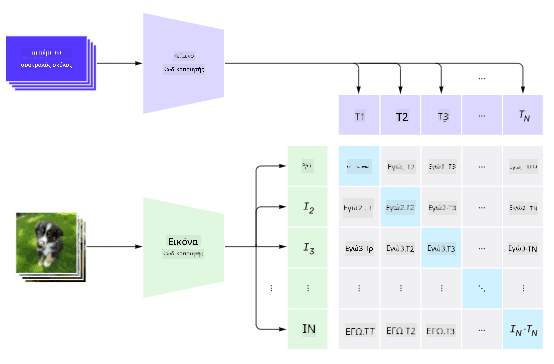
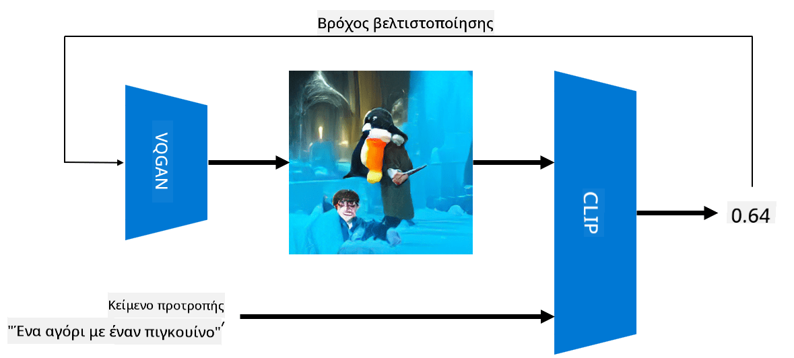

<!--
CO_OP_TRANSLATOR_METADATA:
{
  "original_hash": "9c592c26aca16ca085d268c732284187",
  "translation_date": "2025-08-29T08:43:54+00:00",
  "source_file": "lessons/X-Extras/X1-MultiModal/README.md",
  "language_code": "el"
}
-->
# Δίκτυα Πολλαπλών Τρόπων

Μετά την επιτυχία των μοντέλων transformer για την επίλυση εργασιών NLP, οι ίδιες ή παρόμοιες αρχιτεκτονικές έχουν εφαρμοστεί σε εργασίες υπολογιστικής όρασης. Υπάρχει αυξανόμενο ενδιαφέρον για την ανάπτυξη μοντέλων που θα *συνδυάζουν* δυνατότητες όρασης και φυσικής γλώσσας. Μία από αυτές τις προσπάθειες έγινε από την OpenAI και ονομάζεται CLIP και DALL.E.

## Αντίθετη Προεκπαίδευση Εικόνας (CLIP)

Η βασική ιδέα του CLIP είναι να μπορεί να συγκρίνει κείμενα με εικόνες και να καθορίζει πόσο καλά η εικόνα αντιστοιχεί στο κείμενο.

> *Εικόνα από [αυτήν την ανάρτηση στο blog](https://openai.com/blog/clip/)*

Το μοντέλο εκπαιδεύεται σε εικόνες που έχουν ληφθεί από το Διαδίκτυο και τις λεζάντες τους. Για κάθε παρτίδα, λαμβάνουμε N ζεύγη (εικόνα, κείμενο) και τα μετατρέπουμε σε κάποιες διανυσματικές αναπαραστάσεις I, ..., I / T, ..., T. Αυτές οι αναπαραστάσεις στη συνέχεια αντιστοιχίζονται μεταξύ τους. Η συνάρτηση απώλειας ορίζεται ώστε να μεγιστοποιεί την συνημιτονοειδή ομοιότητα μεταξύ των διανυσμάτων που αντιστοιχούν σε ένα ζεύγος (π.χ. I και T) και να ελαχιστοποιεί την συνημιτονοειδή ομοιότητα μεταξύ όλων των άλλων ζευγών. Γι' αυτόν τον λόγο αυτή η προσέγγιση ονομάζεται **αντίθετη**.

Η βιβλιοθήκη/μοντέλο CLIP είναι διαθέσιμη από το [GitHub της OpenAI](https://github.com/openai/CLIP). Η προσέγγιση περιγράφεται σε [αυτήν την ανάρτηση στο blog](https://openai.com/blog/clip/) και με περισσότερες λεπτομέρειες σε [αυτό το άρθρο](https://arxiv.org/pdf/2103.00020.pdf).

Αφού το μοντέλο προεκπαιδευτεί, μπορούμε να του δώσουμε μια παρτίδα εικόνων και μια παρτίδα κειμένων, και αυτό θα επιστρέψει έναν τανυστή με πιθανότητες. Το CLIP μπορεί να χρησιμοποιηθεί για διάφορες εργασίες:

**Ταξινόμηση Εικόνων**

Ας υποθέσουμε ότι πρέπει να ταξινομήσουμε εικόνες μεταξύ, για παράδειγμα, γάτες, σκύλους και ανθρώπους. Σε αυτήν την περίπτωση, μπορούμε να δώσουμε στο μοντέλο μια εικόνα και μια σειρά από κείμενα: "*μια εικόνα μιας γάτας*", "*μια εικόνα ενός σκύλου*", "*μια εικόνα ενός ανθρώπου*". Στον προκύπτοντα διανυσματικό πίνακα με 3 πιθανότητες, απλώς πρέπει να επιλέξουμε τον δείκτη με τη μεγαλύτερη τιμή.

> *Εικόνα από [αυτήν την ανάρτηση στο blog](https://openai.com/blog/clip/)*

**Αναζήτηση Εικόνων με Βάση Κείμενο**

Μπορούμε επίσης να κάνουμε το αντίθετο. Εάν έχουμε μια συλλογή εικόνων, μπορούμε να περάσουμε αυτήν τη συλλογή στο μοντέλο και ένα κείμενο - αυτό θα μας δώσει την εικόνα που είναι πιο παρόμοια με το δεδομένο κείμενο.

## ✍️ Παράδειγμα: [Χρήση του CLIP για Ταξινόμηση Εικόνων και Αναζήτηση Εικόνων](Clip.ipynb)

Ανοίξτε το [Clip.ipynb](Clip.ipynb) notebook για να δείτε το CLIP σε δράση.

## Δημιουργία Εικόνων με VQGAN+CLIP

Το CLIP μπορεί επίσης να χρησιμοποιηθεί για **δημιουργία εικόνων** από κείμενο. Για να το κάνουμε αυτό, χρειαζόμαστε ένα **μοντέλο δημιουργίας** που θα μπορεί να δημιουργεί εικόνες βάσει κάποιου διανυσματικού εισόδου. Ένα από αυτά τα μοντέλα ονομάζεται [VQGAN](https://compvis.github.io/taming-transformers/) (Vector-Quantized GAN).

Οι βασικές ιδέες του VQGAN που το διαφοροποιούν από τα συνηθισμένα [GAN](../../4-ComputerVision/10-GANs/README.md) είναι οι εξής:
* Χρήση αρχιτεκτονικής transformer για τη δημιουργία μιας ακολουθίας πλούσιων σε περιεχόμενο οπτικών τμημάτων που συνθέτουν την εικόνα. Αυτά τα οπτικά τμήματα μαθαίνονται από [CNN](../../4-ComputerVision/07-ConvNets/README.md).
* Χρήση διακριτικού υπο-εικόνας που ανιχνεύει αν τμήματα της εικόνας είναι "πραγματικά" ή "ψεύτικα" (σε αντίθεση με την προσέγγιση "όλα ή τίποτα" στα παραδοσιακά GAN).

Μάθετε περισσότερα για το VQGAN στον ιστότοπο [Taming Transformers](https://compvis.github.io/taming-transformers/).

Μία από τις σημαντικές διαφορές μεταξύ VQGAN και παραδοσιακού GAN είναι ότι το τελευταίο μπορεί να παράγει μια αξιοπρεπή εικόνα από οποιοδήποτε διανυσματικό εισόδου, ενώ το VQGAN είναι πιθανό να παράγει μια εικόνα που δεν είναι συνεκτική. Επομένως, πρέπει να καθοδηγήσουμε περαιτέρω τη διαδικασία δημιουργίας εικόνας, και αυτό μπορεί να γίνει χρησιμοποιώντας το CLIP.

Για να δημιουργήσουμε μια εικόνα που αντιστοιχεί σε ένα κείμενο, ξεκινάμε με κάποιο τυχαίο διανυσματικό κωδικοποίησης που περνάει μέσω του VQGAN για να παράγει μια εικόνα. Στη συνέχεια, το CLIP χρησιμοποιείται για να παράγει μια συνάρτηση απώλειας που δείχνει πόσο καλά η εικόνα αντιστοιχεί στο κείμενο. Ο στόχος είναι να ελαχιστοποιήσουμε αυτήν την απώλεια, χρησιμοποιώντας back propagation για να προσαρμόσουμε τις παραμέτρους του διανυσματικού εισόδου.

Μια εξαιρετική βιβλιοθήκη που υλοποιεί το VQGAN+CLIP είναι το [Pixray](http://github.com/pixray/pixray).

 |   | 
----|----|----
Εικόνα που δημιουργήθηκε από το κείμενο *μια κοντινή ακουαρέλα πορτραίτο ενός νεαρού άνδρα δασκάλου λογοτεχνίας με ένα βιβλίο* | Εικόνα που δημιουργήθηκε από το κείμενο *μια κοντινή ελαιογραφία πορτραίτο μιας νεαρής γυναίκας δασκάλας πληροφορικής με έναν υπολογιστή* | Εικόνα που δημιουργήθηκε από το κείμενο *μια κοντινή ελαιογραφία πορτραίτο ενός ηλικιωμένου άνδρα δασκάλου μαθηματικών μπροστά από έναν πίνακα*

> Εικόνες από τη συλλογή **Artificial Teachers** του [Dmitry Soshnikov](http://soshnikov.com)

## DALL-E
### [DALL-E 1](https://openai.com/research/dall-e)
Το DALL-E είναι μια έκδοση του GPT-3 που έχει εκπαιδευτεί για να δημιουργεί εικόνες από κείμενα. Έχει εκπαιδευτεί με 12 δισεκατομμύρια παραμέτρους.

Σε αντίθεση με το CLIP, το DALL-E λαμβάνει τόσο το κείμενο όσο και την εικόνα ως μια ενιαία ροή από tokens για εικόνες και κείμενα. Επομένως, από πολλαπλά κείμενα, μπορείτε να δημιουργήσετε εικόνες βάσει του κειμένου.

### [DALL-E 2](https://openai.com/dall-e-2)
Η κύρια διαφορά μεταξύ DALL-E 1 και 2 είναι ότι το δεύτερο δημιουργεί πιο ρεαλιστικές εικόνες και τέχνη.

Παραδείγματα δημιουργίας εικόνων με το DALL-E:
 |   | 
----|----|----
Εικόνα που δημιουργήθηκε από το κείμενο *μια κοντινή ακουαρέλα πορτραίτο ενός νεαρού άνδρα δασκάλου λογοτεχνίας με ένα βιβλίο* | Εικόνα που δημιουργήθηκε από το κείμενο *μια κοντινή ελαιογραφία πορτραίτο μιας νεαρής γυναίκας δασκάλας πληροφορικής με έναν υπολογιστή* | Εικόνα που δημιουργήθηκε από το κείμενο *μια κοντινή ελαιογραφία πορτραίτο ενός ηλικιωμένου άνδρα δασκάλου μαθηματικών μπροστά από έναν πίνακα*

## Αναφορές

* Άρθρο VQGAN: [Taming Transformers for High-Resolution Image Synthesis](https://compvis.github.io/taming-transformers/paper/paper.pdf)
* Άρθρο CLIP: [Learning Transferable Visual Models From Natural Language Supervision](https://arxiv.org/pdf/2103.00020.pdf)

---

**Αποποίηση ευθύνης**:  
Αυτό το έγγραφο έχει μεταφραστεί χρησιμοποιώντας την υπηρεσία αυτόματης μετάφρασης [Co-op Translator](https://github.com/Azure/co-op-translator). Παρόλο που καταβάλλουμε προσπάθειες για ακρίβεια, παρακαλούμε να έχετε υπόψη ότι οι αυτοματοποιημένες μεταφράσεις ενδέχεται να περιέχουν λάθη ή ανακρίβειες. Το πρωτότυπο έγγραφο στη μητρική του γλώσσα θα πρέπει να θεωρείται η αυθεντική πηγή. Για κρίσιμες πληροφορίες, συνιστάται επαγγελματική ανθρώπινη μετάφραση. Δεν φέρουμε ευθύνη για τυχόν παρεξηγήσεις ή εσφαλμένες ερμηνείες που προκύπτουν από τη χρήση αυτής της μετάφρασης.