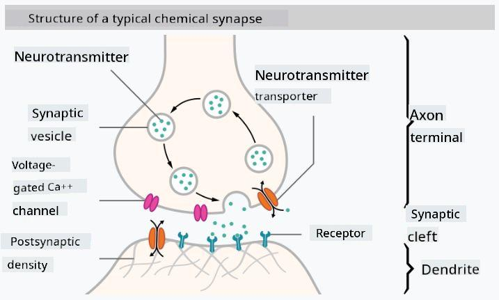

<!--
CO_OP_TRANSLATOR_METADATA:
{
  "original_hash": "f862a99d88088163df12270e2f2ad6c3",
  "translation_date": "2025-10-03T12:40:53+00:00",
  "source_file": "lessons/3-NeuralNetworks/README.md",
  "language_code": "en"
}
-->
# Introduction to Neural Networks

As discussed in the introduction, one way to achieve intelligence is by training a **computer model** or an **artificial brain**. Since the mid-20th century, researchers have experimented with various mathematical models, and in recent years, this approach has proven to be highly successful. These mathematical models of the brain are known as **neural networks**.

> Neural networks are sometimes referred to as *Artificial Neural Networks* (ANNs) to clarify that we are discussing models, not actual networks of biological neurons.

## Machine Learning

Neural Networks are part of a broader field called **Machine Learning**, which aims to use data to train computer models capable of solving problems. Machine Learning is a significant component of Artificial Intelligence, but this curriculum does not cover classical ML.

> Check out our separate **[Machine Learning for Beginners](http://github.com/microsoft/ml-for-beginners)** curriculum to learn more about traditional Machine Learning.

In Machine Learning, we assume we have a dataset of examples **X** and corresponding output values **Y**. Examples are often N-dimensional vectors composed of **features**, while outputs are referred to as **labels**.

We will explore the two most common types of machine learning problems:

* **Classification**, where the goal is to categorize an input object into two or more classes.
* **Regression**, where the goal is to predict a numerical value for each input sample.

> When inputs and outputs are represented as tensors, the input dataset is a matrix of size M&times;N, where M is the number of samples and N is the number of features. Output labels **Y** form a vector of size M.

This curriculum focuses exclusively on neural network models.

## A Model of a Neuron

Biologically, we know that the brain is composed of neural cells (neurons), each with multiple "inputs" (dendrites) and a single "output" (axon). Both dendrites and axons transmit electrical signals, and the connections between them — called synapses — can vary in conductivity, regulated by neurotransmitters.

 | 
----|----
Real Neuron *([Image](https://en.wikipedia.org/wiki/Synapse#/media/File:SynapseSchematic_lines.svg) from Wikipedia)* | Artificial Neuron *(Image by Author)*

The simplest mathematical model of a neuron includes several inputs X1, ..., XN, an output Y, and a set of weights W1, ..., WN. The output is calculated as:

where **f** is a non-linear **activation function**.

> Early neuron models were described in the seminal paper [A logical calculus of the ideas immanent in nervous activity](https://www.cs.cmu.edu/~./epxing/Class/10715/reading/McCulloch.and.Pitts.pdf) by Warren McCullock and Walter Pitts in 1943. Donald Hebb, in his book "[The Organization of Behavior: A Neuropsychological Theory](https://books.google.com/books?id=VNetYrB8EBoC)," proposed methods for training such networks.

## In this Section

In this section, we will explore:
* [Perceptron](03-Perceptron/README.md), one of the earliest neural network models for two-class classification
* [Multi-layered networks](04-OwnFramework/README.md) along with a notebook on [how to build our own framework](04-OwnFramework/OwnFramework.ipynb)
* [Neural Network Frameworks](05-Frameworks/README.md), accompanied by these notebooks: [PyTorch](05-Frameworks/IntroPyTorch.ipynb) and [Keras/Tensorflow](05-Frameworks/IntroKerasTF.ipynb)
* [Overfitting](../../../../lessons/3-NeuralNetworks/05-Frameworks)

---

**Disclaimer**:  
This document has been translated using the AI translation service [Co-op Translator](https://github.com/Azure/co-op-translator). While we strive for accuracy, please note that automated translations may contain errors or inaccuracies. The original document in its native language should be considered the authoritative source. For critical information, professional human translation is recommended. We are not liable for any misunderstandings or misinterpretations resulting from the use of this translation.