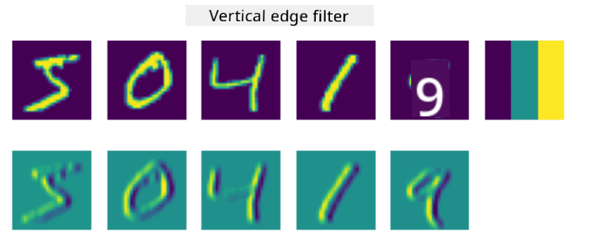
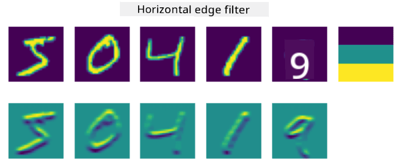
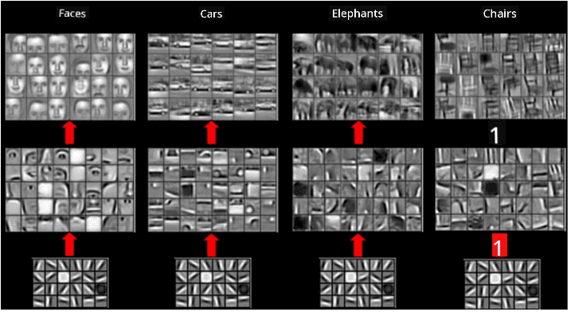

<!--
CO_OP_TRANSLATOR_METADATA:
{
  "original_hash": "a560d5b845962cf33dc102266e409568",
  "translation_date": "2025-09-23T11:44:10+00:00",
  "source_file": "lessons/4-ComputerVision/07-ConvNets/README.md",
  "language_code": "en"
}
-->
# Convolutional Neural Networks

Previously, we saw that neural networks are quite effective at handling images, and even a single-layer perceptron can recognize handwritten digits from the MNIST dataset with decent accuracy. However, the MNIST dataset is unique in that all digits are centered within the image, simplifying the task.

## [Pre-lecture quiz](https://ff-quizzes.netlify.app/en/ai/quiz/13)

In real-world scenarios, we want to be able to recognize objects in an image regardless of their exact location. Computer vision differs from general classification because, when searching for a specific object in an image, we scan the image for particular **patterns** and their combinations. For instance, when identifying a cat, we might first look for horizontal lines that could form whiskers, and then a specific combination of whiskers might indicate that the image is indeed of a cat. The relative position and presence of certain patterns matter, not their exact location in the image.

To extract these patterns, we use **convolutional filters**. As you know, an image is represented as a 2D matrix or a 3D tensor with color depth. Applying a filter involves using a relatively small **filter kernel** matrix and calculating the weighted average with neighboring points for each pixel in the original image. This process can be visualized as a small window sliding across the entire image, averaging out all pixels based on the weights in the filter kernel matrix.

 | 
----|----

> Image by Dmitry Soshnikov

For example, applying 3x3 vertical edge and horizontal edge filters to MNIST digits can highlight areas (e.g., high values) where vertical and horizontal edges exist in the original image. These filters can "search for" edges. Similarly, we can design other filters to detect different low-level patterns:

> Image of [Leung-Malik Filter Bank](https://www.robots.ox.ac.uk/~vgg/research/texclass/filters.html)

While we can manually design filters to extract certain patterns, we can also structure the network to learn these patterns automatically. This is one of the core ideas behind CNNs.

## Main ideas behind CNN

The functionality of CNNs is based on the following key concepts:

* Convolutional filters can extract patterns.
* Networks can be designed to train filters automatically.
* The same approach can be used to identify patterns in high-level features, not just in the original image. CNNs extract features hierarchically, starting with low-level pixel combinations and progressing to higher-level combinations of image components.

> Image from [a paper by Hislop-Lynch](https://www.semanticscholar.org/paper/Computer-vision-based-pedestrian-trajectory-Hislop-Lynch/26e6f74853fc9bbb7487b06dc2cf095d36c9021d), based on [their research](https://dl.acm.org/doi/abs/10.1145/1553374.1553453)

## ✍️ Exercises: Convolutional Neural Networks

Let’s dive deeper into how convolutional neural networks work and how we can achieve trainable filters by exploring the following notebooks:

* [Convolutional Neural Networks - PyTorch](ConvNetsPyTorch.ipynb)
* [Convolutional Neural Networks - TensorFlow](ConvNetsTF.ipynb)

## Pyramid Architecture

Most CNNs used for image processing follow a pyramid architecture. The first convolutional layer applied to the original images typically uses a relatively small number of filters (8-16), which correspond to simple pixel combinations, such as horizontal or vertical lines. At the next level, the spatial dimensions of the network are reduced, and the number of filters increases, allowing for more complex combinations of basic features. As we progress through the layers toward the final classifier, the spatial dimensions of the image decrease while the number of filters grows.

For example, consider the architecture of VGG-16, a network that achieved 92.7% accuracy in ImageNet's top-5 classification in 2014:

> Image from [Researchgate](https://www.researchgate.net/figure/Vgg16-model-structure-To-get-the-VGG-NIN-model-we-replace-the-2-nd-4-th-6-th-7-th_fig2_335194493)

## Best-Known CNN Architectures

[Continue your study about the best-known CNN architectures](CNN_Architectures.md)

---

