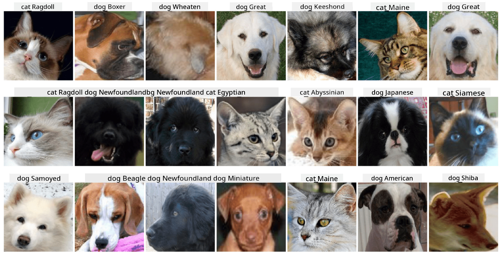

<!--
CO_OP_TRANSLATOR_METADATA:
{
  "original_hash": "b70fcf7fcee862990f848c679090943f",
  "translation_date": "2025-10-03T14:51:38+00:00",
  "source_file": "lessons/4-ComputerVision/07-ConvNets/lab/README.md",
  "language_code": "en"
}
-->
# Classification of Pets Faces

Lab Assignment from [AI for Beginners Curriculum](https://github.com/microsoft/ai-for-beginners).

## Task

Imagine you need to develop an application for a pet nursery to catalog all pets. One of the great features of such an application would be automatically identifying the breed from a photograph. This can be successfully achieved using neural networks.

Your task is to train a convolutional neural network to classify different breeds of cats and dogs using the **Pet Faces** dataset.

## The Dataset

We will use the [Oxford-IIIT Pet Dataset](https://www.robots.ox.ac.uk/~vgg/data/pets/), which contains images of 37 different breeds of dogs and cats.



To download the dataset, use this code snippet:

```python
!wget https://thor.robots.ox.ac.uk/~vgg/data/pets/images.tar.gz
!tar xfz images.tar.gz
!rm images.tar.gz
```

**Note:** The Oxford-IIIT Pet Dataset images are organized by filename (e.g., `Abyssinian_1.jpg`, `Bengal_2.jpg`). The notebook includes code to organize these images into breed-specific subdirectories for easier classification.

## Starting Notebook

Begin the lab by opening [PetFaces.ipynb](PetFaces.ipynb)

## Takeaway

You have tackled a relatively complex problem of image classification from scratch! Despite the large number of classes, you were able to achieve reasonable accuracy! It’s also a good idea to measure top-k accuracy, as some classes can be easily confused, even by humans, due to their similarities.

---

**Disclaimer**:  
This document has been translated using the AI translation service [Co-op Translator](https://github.com/Azure/co-op-translator). While we strive for accuracy, please note that automated translations may contain errors or inaccuracies. The original document in its native language should be considered the authoritative source. For critical information, professional human translation is recommended. We are not liable for any misunderstandings or misinterpretations arising from the use of this translation.