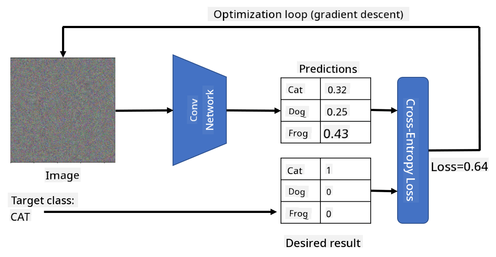

<!--
CO_OP_TRANSLATOR_METADATA:
{
  "original_hash": "717775c4050ccbffbe0c961ad8bf7bf7",
  "translation_date": "2025-08-31T17:36:54+00:00",
  "source_file": "lessons/4-ComputerVision/08-TransferLearning/README.md",
  "language_code": "en"
}
-->
# Pre-trained Networks and Transfer Learning

Training CNNs can be time-consuming and requires a significant amount of data. However, much of the time is spent learning the best low-level filters that a network can use to extract patterns from images. This raises a natural question: can we use a neural network trained on one dataset and adapt it to classify different images without undergoing a full training process?

## [Pre-lecture quiz](https://red-field-0a6ddfd03.1.azurestaticapps.net/quiz/108)

This approach is called **transfer learning**, as it involves transferring knowledge from one neural network model to another. In transfer learning, we typically start with a pre-trained model that has been trained on a large image dataset, such as **ImageNet**. These models are already adept at extracting various features from generic images, and in many cases, simply building a classifier on top of these extracted features can yield good results.

> ✅ Transfer Learning is a term also used in other academic fields, such as Education. It refers to the process of applying knowledge from one domain to another.

## Pre-Trained Models as Feature Extractors

The convolutional networks discussed in the previous section consist of multiple layers, each designed to extract features from an image. These range from low-level pixel combinations (e.g., horizontal/vertical lines or strokes) to higher-level feature combinations, such as the shape of an eye or a flame. If a CNN is trained on a sufficiently large and diverse dataset, it should learn to extract these common features.

Both Keras and PyTorch provide functions to easily load pre-trained neural network weights for popular architectures, most of which were trained on ImageNet images. The most commonly used ones are described on the [CNN Architectures](../07-ConvNets/CNN_Architectures.md) page from the previous lesson. In particular, you might consider using one of the following:

* **VGG-16/VGG-19**: Relatively simple models that still achieve good accuracy. These are often a good starting point to test how transfer learning works.
* **ResNet**: A family of models introduced by Microsoft Research in 2015. These models have more layers and require more resources.
* **MobileNet**: A family of smaller models designed for mobile devices. Use these if you have limited resources and can tolerate a slight drop in accuracy.

Below are sample features extracted from a picture of a cat using the VGG-16 network:

## Cats vs. Dogs Dataset

In this example, we will use a dataset of [Cats and Dogs](https://www.microsoft.com/download/details.aspx?id=54765&WT.mc_id=academic-77998-cacaste), which closely resembles a real-world image classification scenario.

## ✍️ Exercise: Transfer Learning

Let’s see transfer learning in action in the following notebooks:

* [Transfer Learning - PyTorch](TransferLearningPyTorch.ipynb)
* [Transfer Learning - TensorFlow](TransferLearningTF.ipynb)

## Visualizing Adversarial Cat

A pre-trained neural network contains various patterns within its *brain*, including representations of an **ideal cat** (as well as an ideal dog, zebra, etc.). It would be fascinating to **visualize this image**. However, this is not straightforward because the patterns are distributed across the network's weights and organized hierarchically.

One approach is to start with a random image and use the **gradient descent optimization** technique to adjust the image so that the network begins to perceive it as a cat.

However, this process often results in something resembling random noise. This happens because *there are many ways to make the network think an input image is a cat*, including ways that don’t make visual sense. While these images contain many patterns typical of a cat, there’s nothing to constrain them to be visually coherent.

To improve the result, we can add another term to the loss function called **variation loss**. This metric measures how similar neighboring pixels in the image are. Minimizing variation loss smooths the image and reduces noise, revealing more visually appealing patterns. Below are examples of such "ideal" images classified as a cat and a zebra with high confidence:

 | 
-----|-----
*Ideal Cat* | *Ideal Zebra*

A similar approach can be used to perform **adversarial attacks** on a neural network. For example, suppose we want to trick a neural network into classifying a dog as a cat. Starting with an image of a dog that the network correctly identifies, we can tweak it slightly using gradient descent optimization until the network classifies it as a cat:

 | 
-----|-----
*Original picture of a dog* | *Picture of a dog classified as a cat*

You can find the code to reproduce the above results in the following notebook:

* [Ideal and Adversarial Cat - TensorFlow](AdversarialCat_TF.ipynb)

## Conclusion

Using transfer learning, you can quickly create a classifier for a custom object classification task and achieve high accuracy. However, as tasks become more complex, they require greater computational power and are not easily solvable on a CPU. In the next unit, we will explore a more lightweight implementation to train the same model using fewer computational resources, with only a slight reduction in accuracy.

## 🚀 Challenge

In the accompanying notebooks, there are notes at the bottom about how transfer learning works best with somewhat similar training data (e.g., a new type of animal). Experiment with completely different types of images to see how well or poorly your transfer learning models perform.

## [Post-lecture quiz](https://red-field-0a6ddfd03.1.azurestaticapps.net/quiz/208)

## Review & Self Study

Read through [TrainingTricks.md](TrainingTricks.md) to deepen your understanding of other methods for training your models.

## [Assignment](lab/README.md)

In this lab, we will use the real-world [Oxford-IIIT](https://www.robots.ox.ac.uk/~vgg/data/pets/) pets dataset, which includes 35 breeds of cats and dogs, to build a transfer learning classifier.

---

**Disclaimer**:  
This document has been translated using the AI translation service [Co-op Translator](https://github.com/Azure/co-op-translator). While we aim for accuracy, please note that automated translations may include errors or inaccuracies. The original document in its native language should be regarded as the authoritative source. For critical information, professional human translation is advised. We are not responsible for any misunderstandings or misinterpretations resulting from the use of this translation.