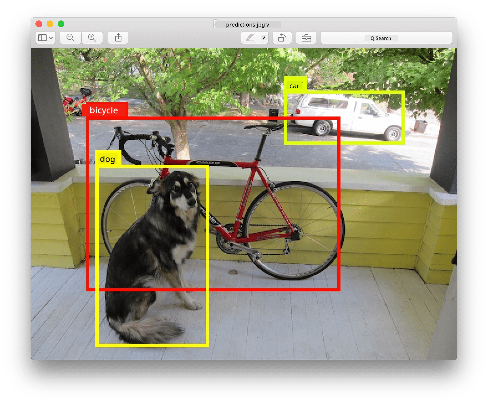
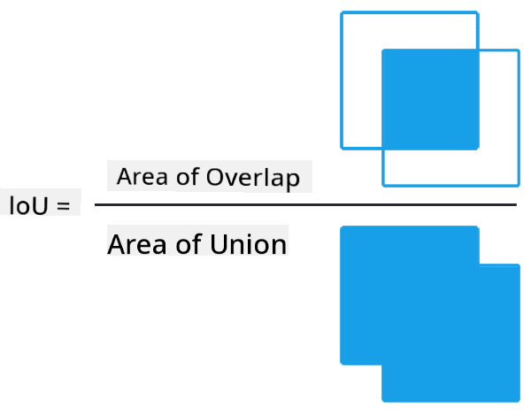
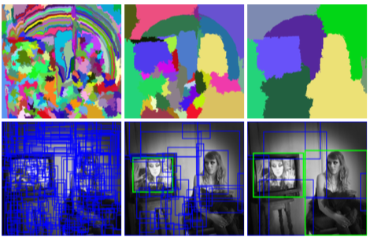
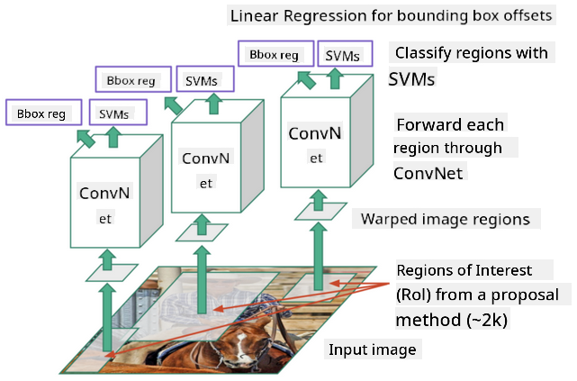
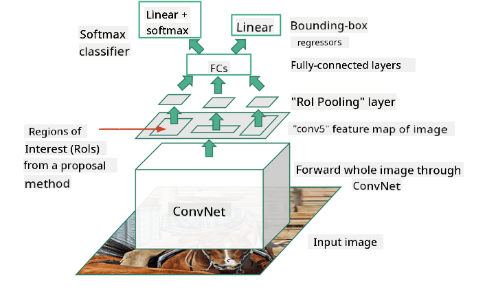
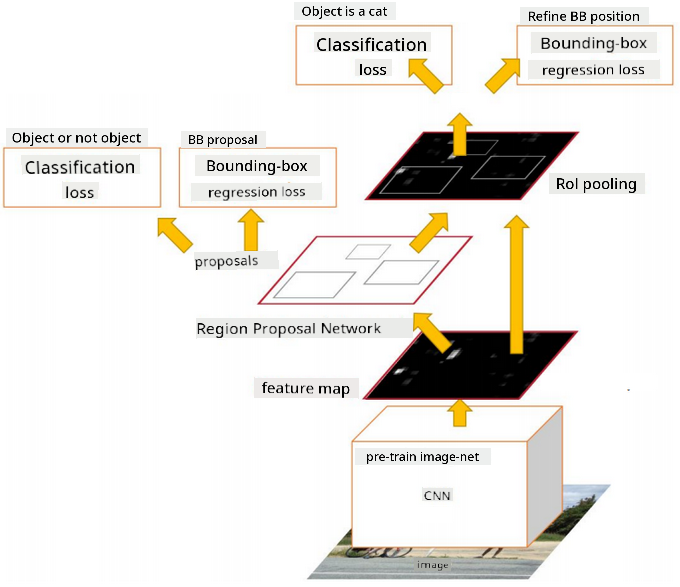
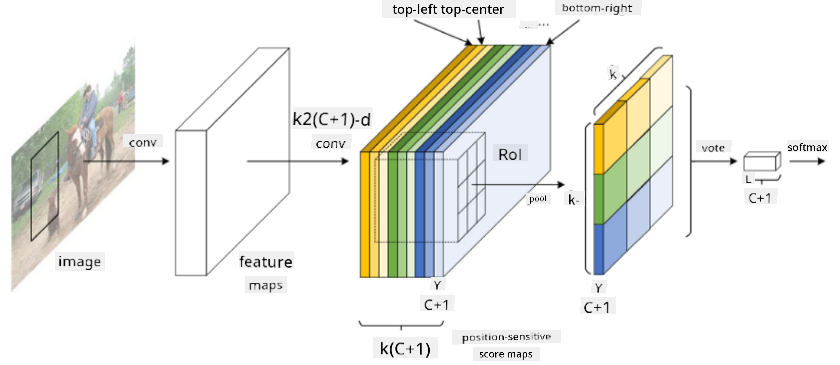

<!--
CO_OP_TRANSLATOR_METADATA:
{
  "original_hash": "d85c8b08f6d1b48fd7f35b99f93c1138",
  "translation_date": "2025-08-31T17:40:06+00:00",
  "source_file": "lessons/4-ComputerVision/11-ObjectDetection/README.md",
  "language_code": "en"
}
-->
# Object Detection

The image classification models we have explored so far take an image and produce a categorical result, such as the class 'number' in the MNIST problem. However, in many cases, we don't just want to know that an image contains objects—we want to determine their exact location. This is the purpose of **object detection**.

## [Pre-lecture quiz](https://red-field-0a6ddfd03.1.azurestaticapps.net/quiz/111)

> Image from [YOLO v2 web site](https://pjreddie.com/darknet/yolov2/)

## A Naive Approach to Object Detection

Suppose we want to find a cat in a picture. A very naive approach to object detection would involve the following steps:

1. Divide the picture into a grid of tiles.
2. Run image classification on each tile.
3. Identify the tiles with sufficiently high activation as containing the object of interest.

> *Image from [Exercise Notebook](ObjectDetection-TF.ipynb)*

However, this approach is far from ideal because it only allows the algorithm to locate the object's bounding box imprecisely. For more precise localization, we need to perform **regression** to predict the bounding box coordinates—and for that, we need specific datasets.

## Regression for Object Detection

[This blog post](https://towardsdatascience.com/object-detection-with-neural-networks-a4e2c46b4491) provides an excellent introduction to detecting shapes.

## Datasets for Object Detection

You may encounter the following datasets for object detection tasks:

* [PASCAL VOC](http://host.robots.ox.ac.uk/pascal/VOC/) - 20 classes
* [COCO](http://cocodataset.org/#home) - Common Objects in Context. 80 classes, bounding boxes, and segmentation masks

## Object Detection Metrics

### Intersection over Union

While measuring the performance of image classification is straightforward, object detection requires evaluating both the correctness of the class and the precision of the predicted bounding box location. For the latter, we use **Intersection over Union** (IoU), which measures how well two boxes (or two arbitrary areas) overlap.

> *Figure 2 from [this excellent blog post on IoU](https://pyimagesearch.com/2016/11/07/intersection-over-union-iou-for-object-detection/)*

The concept is simple: divide the area of intersection between two shapes by the area of their union. For two identical areas, IoU equals 1, while for completely disjoint areas, it equals 0. Otherwise, it ranges between 0 and 1. Typically, we only consider bounding boxes with IoU above a certain threshold.

### Average Precision

To evaluate how well a specific class of objects $C$ is recognized, we use the **Average Precision** metric, calculated as follows:

1. Plot a Precision-Recall curve, which shows accuracy as a function of the detection threshold (ranging from 0 to 1).
2. Depending on the threshold, the number of detected objects and the precision and recall values will vary.
3. The curve will look like this:

> *Image from [NeuroWorkshop](http://github.com/shwars/NeuroWorkshop)*

The Average Precision for a given class $C$ is the area under this curve. More specifically, the Recall axis is typically divided into 10 parts, and Precision is averaged over all these points:

$$
AP = {1\over11}\sum_{i=0}^{10}\mbox{Precision}(\mbox{Recall}={i\over10})
$$

### AP and IoU

We only consider detections with IoU above a certain threshold. For example, in the PASCAL VOC dataset, the typical $\mbox{IoU Threshold} = 0.5$, while in COCO, AP is measured for various $\mbox{IoU Threshold}$ values.

> *Image from [NeuroWorkshop](http://github.com/shwars/NeuroWorkshop)*

### Mean Average Precision - mAP

The primary metric for object detection is **Mean Average Precision** or **mAP**. It is the Average Precision value averaged across all object classes, and sometimes also across $\mbox{IoU Threshold}$ values. The process of calculating **mAP** is explained in detail [in this blog post](https://medium.com/@timothycarlen/understanding-the-map-evaluation-metric-for-object-detection-a07fe6962cf3) and [here with code samples](https://gist.github.com/tarlen5/008809c3decf19313de216b9208f3734).

## Different Object Detection Approaches

Object detection algorithms can be broadly categorized into two types:

* **Region Proposal Networks** (R-CNN, Fast R-CNN, Faster R-CNN): These methods generate **Regions of Interest** (ROI) and run CNNs over them to find maximum activation. This approach is somewhat similar to the naive method, except that ROIs are generated more intelligently. However, these methods are slow because they require multiple passes of the CNN classifier over the image.
* **One-pass** methods (YOLO, SSD, RetinaNet): These architectures are designed to predict both classes and ROIs in a single pass.

### R-CNN: Region-Based CNN

[R-CNN](http://islab.ulsan.ac.kr/files/announcement/513/rcnn_pami.pdf) uses [Selective Search](http://www.huppelen.nl/publications/selectiveSearchDraft.pdf) to generate a hierarchical structure of ROI regions. These regions are then passed through CNN feature extractors and SVM classifiers to determine the object class, and linear regression is used to determine *bounding box* coordinates. [Official Paper](https://arxiv.org/pdf/1506.01497v1.pdf)

> *Image from van de Sande et al. ICCV’11*

> *Images from [this blog](https://towardsdatascience.com/r-cnn-fast-r-cnn-faster-r-cnn-yolo-object-detection-algorithms-36d53571365e)*

### F-RCNN - Fast R-CNN

This approach is similar to R-CNN, but regions are defined after convolution layers are applied.

> Image from [the Official Paper](https://www.cv-foundation.org/openaccess/content_iccv_2015/papers/Girshick_Fast_R-CNN_ICCV_2015_paper.pdf), [arXiv](https://arxiv.org/pdf/1504.08083.pdf), 2015

### Faster R-CNN

The key idea of this approach is to use a neural network to predict ROIs, known as the *Region Proposal Network*. [Paper](https://arxiv.org/pdf/1506.01497.pdf), 2016

> Image from [the official paper](https://arxiv.org/pdf/1506.01497.pdf)

### R-FCN: Region-Based Fully Convolutional Network

This algorithm is even faster than Faster R-CNN. The main idea is as follows:

1. Extract features using ResNet-101.
2. Process features using a **Position-Sensitive Score Map**. Each object from $C$ classes is divided into $k\times k$ regions, and the network is trained to predict parts of objects.
3. For each part of the $k\times k$ regions, all networks vote for object classes, and the class with the maximum vote is selected.

> Image from [official paper](https://arxiv.org/abs/1605.06409)

### YOLO - You Only Look Once

YOLO is a real-time, one-pass algorithm. The main idea is as follows:

 * Divide the image into $S\times S$ regions.
 * For each region, **CNN** predicts $n$ possible objects, *bounding box* coordinates, and *confidence* = *probability* * IoU.

 

> Image from [official paper](https://arxiv.org/abs/1506.02640)

### Other Algorithms

* RetinaNet: [official paper](https://arxiv.org/abs/1708.02002)
   - [PyTorch Implementation in Torchvision](https://pytorch.org/vision/stable/_modules/torchvision/models/detection/retinanet.html)
   - [Keras Implementation](https://github.com/fizyr/keras-retinanet)
   - [Object Detection with RetinaNet](https://keras.io/examples/vision/retinanet/) in Keras Samples
* SSD (Single Shot Detector): [official paper](https://arxiv.org/abs/1512.02325)

## ✍️ Exercises: Object Detection

Continue your learning in the following notebook:

[ObjectDetection.ipynb](ObjectDetection.ipynb)

## Conclusion

In this lesson, you explored a variety of methods for performing object detection!

## 🚀 Challenge

Read these articles and notebooks about YOLO and try them out:

* [Good blog post](https://www.analyticsvidhya.com/blog/2018/12/practical-guide-object-detection-yolo-framewor-python/) describing YOLO
 * [Official site](https://pjreddie.com/darknet/yolo/)
 * YOLO: [Keras implementation](https://github.com/experiencor/keras-yolo2), [step-by-step notebook](https://github.com/experiencor/basic-yolo-keras/blob/master/Yolo%20Step-by-Step.ipynb)
 * YOLO v2: [Keras implementation](https://github.com/experiencor/keras-yolo2), [step-by-step notebook](https://github.com/experiencor/keras-yolo2/blob/master/Yolo%20Step-by-Step.ipynb)

## [Post-lecture quiz](https://red-field-0a6ddfd03.1.azurestaticapps.net/quiz/211)

## Review & Self Study

* [Object Detection](https://tjmachinelearning.com/lectures/1718/obj/) by Nikhil Sardana
* [A good comparison of object detection algorithms](https://lilianweng.github.io/lil-log/2018/12/27/object-detection-part-4.html)
* [Review of Deep Learning Algorithms for Object Detection](https://medium.com/comet-app/review-of-deep-learning-algorithms-for-object-detection-c1f3d437b852)
* [A Step-by-Step Introduction to the Basic Object Detection Algorithms](https://www.analyticsvidhya.com/blog/2018/10/a-step-by-step-introduction-to-the-basic-object-detection-algorithms-part-1/)
* [Implementation of Faster R-CNN in Python for Object Detection](https://www.analyticsvidhya.com/blog/2018/11/implementation-faster-r-cnn-python-object-detection/)

## [Assignment: Object Detection](lab/README.md)

---

**Disclaimer**:  
This document has been translated using the AI translation service [Co-op Translator](https://github.com/Azure/co-op-translator). While we aim for accuracy, please note that automated translations may include errors or inaccuracies. The original document in its native language should be regarded as the authoritative source. For critical information, professional human translation is advised. We are not responsible for any misunderstandings or misinterpretations resulting from the use of this translation.