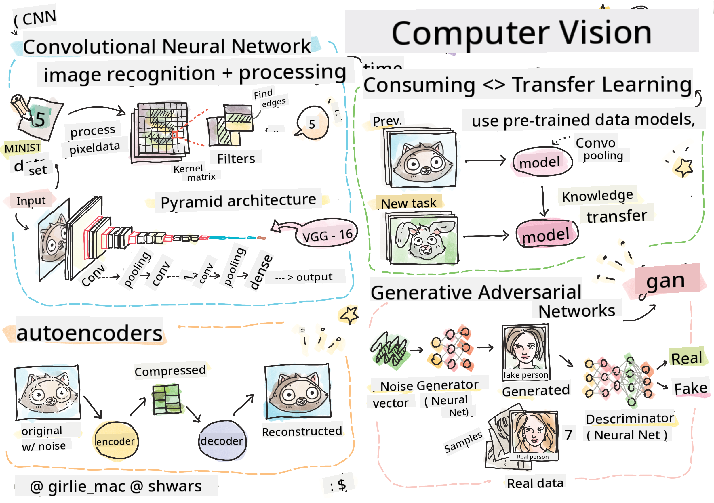

<!--
CO_OP_TRANSLATOR_METADATA:
{
  "original_hash": "58a52f000089c1d8906a4daa4ab1169b",
  "translation_date": "2025-08-31T17:35:27+00:00",
  "source_file": "lessons/4-ComputerVision/README.md",
  "language_code": "en"
}
-->
# Computer Vision

In this section, we will explore:

* [Introduction to Computer Vision and OpenCV](06-IntroCV/README.md)
* [Convolutional Neural Networks](07-ConvNets/README.md)
* [Pre-trained Networks and Transfer Learning](08-TransferLearning/README.md) 
* [Autoencoders](09-Autoencoders/README.md)
* [Generative Adversarial Networks](10-GANs/README.md)
* [Object Detection](11-ObjectDetection/README.md)
* [Semantic Segmentation](12-Segmentation/README.md)

---

**Disclaimer**:  
This document has been translated using the AI translation service [Co-op Translator](https://github.com/Azure/co-op-translator). While we strive for accuracy, please note that automated translations may contain errors or inaccuracies. The original document in its native language should be regarded as the authoritative source. For critical information, professional human translation is recommended. We are not responsible for any misunderstandings or misinterpretations resulting from the use of this translation.