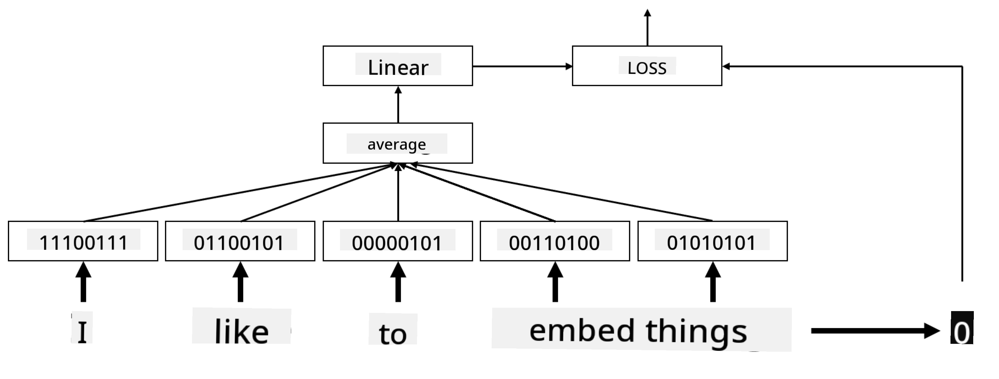

<!--
CO_OP_TRANSLATOR_METADATA:
{
  "original_hash": "b708c9b85b833864c73c6281f1e6b96e",
  "translation_date": "2025-09-23T11:54:00+00:00",
  "source_file": "lessons/5-NLP/14-Embeddings/README.md",
  "language_code": "en"
}
-->
# Embeddings

## [Pre-lecture quiz](https://ff-quizzes.netlify.app/en/ai/quiz/27)

When training classifiers using BoW or TF/IDF, we worked with high-dimensional bag-of-words vectors with a length of `vocab_size`, explicitly converting low-dimensional positional representation vectors into sparse one-hot representations. However, this one-hot representation is not memory-efficient. Additionally, each word is treated independently, meaning one-hot encoded vectors do not capture any semantic similarity between words.

The concept of **embedding** involves representing words as lower-dimensional dense vectors that reflect the semantic meaning of a word. We'll later explore how to create meaningful word embeddings, but for now, think of embeddings as a way to reduce the dimensionality of word vectors.

An embedding layer takes a word as input and produces an output vector of a specified `embedding_size`. In essence, it is similar to a `Linear` layer, but instead of requiring a one-hot encoded vector, it can take a word number as input, eliminating the need for large one-hot-encoded vectors.

By using an embedding layer as the first layer in our classifier network, we can transition from a bag-of-words model to an **embedding bag** model. Here, each word in the text is converted into its corresponding embedding, and an aggregate function, such as `sum`, `average`, or `max`, is applied to all those embeddings.

> Image by the author

## ✍️ Exercises: Embeddings

Continue your learning in the following notebooks:
* [Embeddings with PyTorch](EmbeddingsPyTorch.ipynb)
* [Embeddings TensorFlow](EmbeddingsTF.ipynb)

## Semantic Embeddings: Word2Vec

While the embedding layer maps words to vector representations, these representations may not necessarily carry semantic meaning. Ideally, we want vector representations where similar words or synonyms correspond to vectors that are close to each other based on some vector distance (e.g., Euclidean distance).

To achieve this, we need to pre-train our embedding model on a large text corpus in a specific way. One popular method for training semantic embeddings is [Word2Vec](https://en.wikipedia.org/wiki/Word2vec). It relies on two main architectures to produce distributed word representations:

 - **Continuous bag-of-words** (CBoW) — In this architecture, the model is trained to predict a word based on its surrounding context. Given the n-gram $(W_{-2},W_{-1},W_0,W_1,W_2)$, the model's goal is to predict $W_0$ using $(W_{-2},W_{-1},W_1,W_2)$.
 - **Continuous skip-gram** — This is the opposite of CBoW. The model uses the surrounding context words to predict the current word.

CBoW is faster, while skip-gram is slower but performs better at representing infrequent words.

> Image from [this paper](https://arxiv.org/pdf/1301.3781.pdf)

Pre-trained Word2Vec embeddings (and similar models like GloVe) can be used as replacements for embedding layers in neural networks. However, handling vocabularies is necessary since the vocabulary used to pre-train Word2Vec/GloVe may differ from the vocabulary in our text corpus. Check the above notebooks to learn how to address this issue.

## Contextual Embeddings

A key limitation of traditional pre-trained embeddings like Word2Vec is the issue of word sense disambiguation. While these embeddings can capture some contextual meaning, they encode all possible meanings of a word into the same embedding. This can lead to problems in downstream models, as many words, such as "play," have different meanings depending on the context.

For example, the word "play" has distinct meanings in these sentences:

- I went to a **play** at the theatre.
- John wants to **play** with his friends.

Traditional embeddings represent both meanings of "play" in the same vector. To address this limitation, we need embeddings based on a **language model** trained on a large text corpus, which understands how words are used in different contexts. While discussing contextual embeddings is beyond the scope of this tutorial, we will revisit them when exploring language models later in the course.

## Conclusion

In this lesson, you learned how to create and use embedding layers in TensorFlow and PyTorch to better capture the semantic meanings of words.

## 🚀 Challenge

Word2Vec has been applied to fascinating projects, such as generating song lyrics and poetry. Check out [this article](https://www.politetype.com/blog/word2vec-color-poems) to see how the author used Word2Vec to create poetry. Watch [this video by Dan Shiffmann](https://www.youtube.com/watch?v=LSS_bos_TPI&ab_channel=TheCodingTrain) for another explanation of this technique. Then, try applying these methods to your own text corpus, perhaps sourced from Kaggle.

## [Post-lecture quiz](https://ff-quizzes.netlify.app/en/ai/quiz/28)

## Review & Self Study

Read this paper on Word2Vec: [Efficient Estimation of Word Representations in Vector Space](https://arxiv.org/pdf/1301.3781.pdf)

## [Assignment: Notebooks](assignment.md)

---

