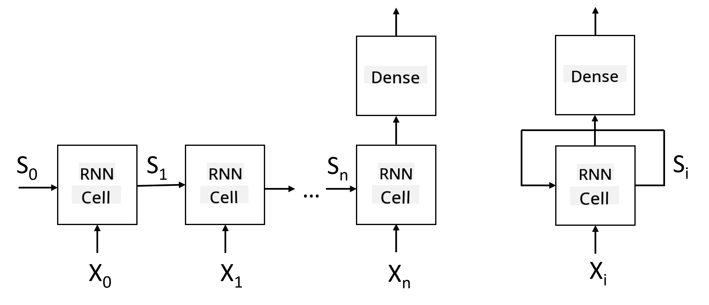
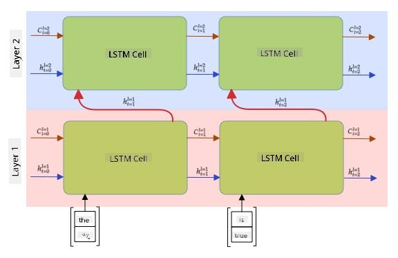

<!--
CO_OP_TRANSLATOR_METADATA:
{
  "original_hash": "58bf4adb210aab53e8f78c8082040e7c",
  "translation_date": "2025-08-31T17:59:48+00:00",
  "source_file": "lessons/5-NLP/16-RNN/README.md",
  "language_code": "en"
}
-->
# Recurrent Neural Networks

## [Pre-lecture quiz](https://red-field-0a6ddfd03.1.azurestaticapps.net/quiz/116)

In previous sections, we used rich semantic representations of text along with a simple linear classifier on top of embeddings. This architecture captures the overall meaning of words in a sentence but does not account for the **order** of words, as the aggregation operation on embeddings removes this information from the original text. Since these models cannot represent word order, they struggle with more complex or ambiguous tasks like text generation or question answering.

To understand the meaning of text sequences, we need a different neural network architecture called a **recurrent neural network** (RNN). In an RNN, we process a sentence one symbol at a time, and the network generates a **state**, which is then passed back into the network along with the next symbol.

> Image by the author

Given an input sequence of tokens X0,...,Xn, an RNN creates a sequence of neural network blocks and trains this sequence end-to-end using backpropagation. Each network block takes a pair (Xi,Si) as input and produces Si+1 as output. The final state Sn (or output Yn) is passed to a linear classifier to generate the result. All network blocks share the same weights and are trained end-to-end in a single backpropagation pass.

Because state vectors S0,...,Sn are passed through the network, it can learn sequential dependencies between words. For instance, when the word *not* appears in the sequence, the network can learn to negate certain elements within the state vector, resulting in negation.

> ✅ Since the weights of all RNN blocks in the image above are shared, the same diagram can be simplified into one block (on the right) with a recurrent feedback loop that passes the network's output state back to the input.

## Anatomy of an RNN Cell

Let’s explore the structure of a simple RNN cell. It takes the previous state Si-1 and the current symbol Xi as inputs and produces the output state Si. Sometimes, we are also interested in another output Yi, as in generative networks.

A simple RNN cell contains two weight matrices: one transforms the input symbol (let’s call it W), and the other transforms the input state (H). The network output is calculated as σ(W×Xi+H×Si-1+b), where σ is the activation function and b is an additional bias term.

> Image by the author

In many cases, input tokens are passed through an embedding layer before entering the RNN to reduce dimensionality. If the input vector dimension is *emb_size* and the state vector dimension is *hid_size*, the size of W is *emb_size*×*hid_size*, and the size of H is *hid_size*×*hid_size*.

## Long Short Term Memory (LSTM)

One major issue with classical RNNs is the **vanishing gradients** problem. Since RNNs are trained end-to-end in a single backpropagation pass, it becomes difficult to propagate errors to the earlier layers of the network, making it hard to learn relationships between distant tokens. One solution to this problem is **explicit state management** using **gates**. Two popular architectures that implement this are **Long Short Term Memory** (LSTM) and **Gated Relay Unit** (GRU).

> Image source TBD

The LSTM network is similar to an RNN but passes two states between layers: the actual state C and the hidden vector H. At each unit, the hidden vector Hi is concatenated with input Xi, and they control the state C through **gates**. Each gate is a neural network with sigmoid activation (output range [0,1]), which acts like a bitwise mask when multiplied by the state vector. The gates (from left to right in the image above) are:

* The **forget gate** determines which components of the vector C should be forgotten and which should be retained.
* The **input gate** incorporates information from the input and hidden vectors into the state.
* The **output gate** transforms the state via a linear layer with *tanh* activation and selects certain components using the hidden vector Hi to produce a new state Ci+1.

The components of state C can be thought of as flags that can be toggled on or off. For example, encountering the name *Alice* in a sequence might set a flag indicating a female character. Later, encountering the phrase *and Tom* might set a flag for a plural noun. By manipulating the state, the network can track grammatical properties of sentence parts.

> ✅ A great resource for understanding LSTM internals is Christopher Olah’s article [Understanding LSTM Networks](https://colah.github.io/posts/2015-08-Understanding-LSTMs/).

## Bidirectional and Multilayer RNNs

So far, we’ve discussed recurrent networks that process sequences in one direction, from start to finish. This approach feels natural, as it mirrors how we read or listen to speech. However, in many practical scenarios, we have random access to the input sequence, so it can be useful to run recurrent computations in both directions. Such networks are called **bidirectional** RNNs. In bidirectional networks, two hidden state vectors are used—one for each direction.

A recurrent network, whether unidirectional or bidirectional, captures patterns within a sequence and stores them in a state vector or passes them to the output. Similar to convolutional networks, we can stack another recurrent layer on top of the first to capture higher-level patterns based on the low-level patterns extracted by the first layer. This leads to the concept of a **multi-layer RNN**, which consists of two or more recurrent networks, where the output of one layer serves as the input to the next.

*Picture from [this wonderful post](https://towardsdatascience.com/from-a-lstm-cell-to-a-multilayer-lstm-network-with-pytorch-2899eb5696f3) by Fernando López*

## ✍️ Exercises: Embeddings

Continue your learning in the following notebooks:

* [RNNs with PyTorch](RNNPyTorch.ipynb)
* [RNNs with TensorFlow](RNNTF.ipynb)

## Conclusion

In this unit, we explored how RNNs can be used for sequence classification. However, RNNs are capable of handling many other tasks, such as text generation, machine translation, and more. We will delve into these tasks in the next unit.

## 🚀 Challenge

Read some literature about LSTMs and explore their applications:

- [Grid Long Short-Term Memory](https://arxiv.org/pdf/1507.01526v1.pdf)
- [Show, Attend and Tell: Neural Image Caption
Generation with Visual Attention](https://arxiv.org/pdf/1502.03044v2.pdf)

## [Post-lecture quiz](https://red-field-0a6ddfd03.1.azurestaticapps.net/quiz/216)

## Review & Self Study

- [Understanding LSTM Networks](https://colah.github.io/posts/2015-08-Understanding-LSTMs/) by Christopher Olah.

## [Assignment: Notebooks](assignment.md)

---

**Disclaimer**:  
This document has been translated using the AI translation service [Co-op Translator](https://github.com/Azure/co-op-translator). While we aim for accuracy, please note that automated translations may include errors or inaccuracies. The original document in its native language should be regarded as the authoritative source. For critical information, professional human translation is advised. We are not responsible for any misunderstandings or misinterpretations resulting from the use of this translation.