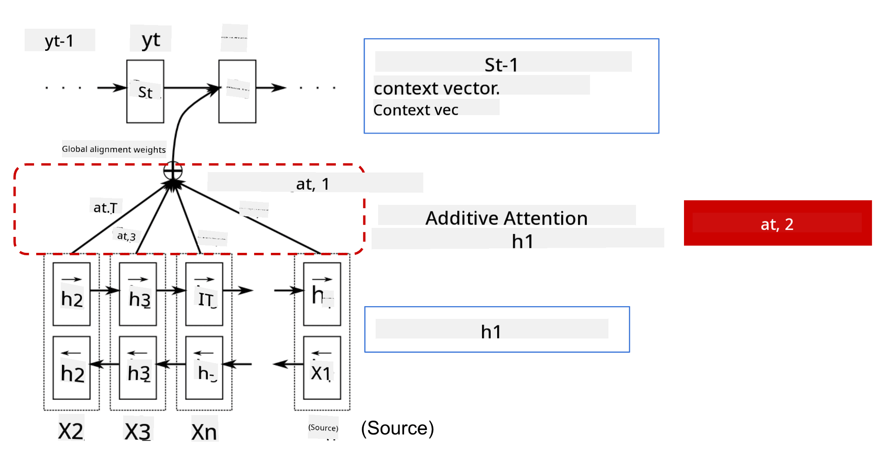
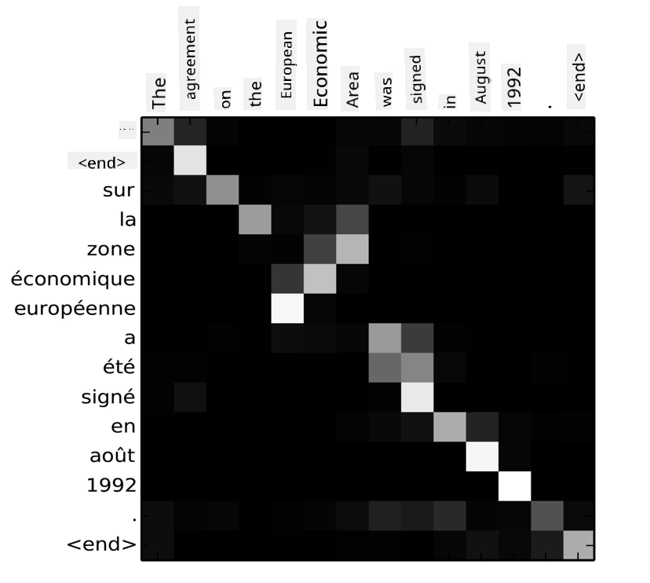
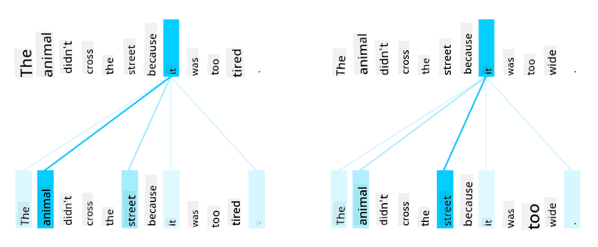
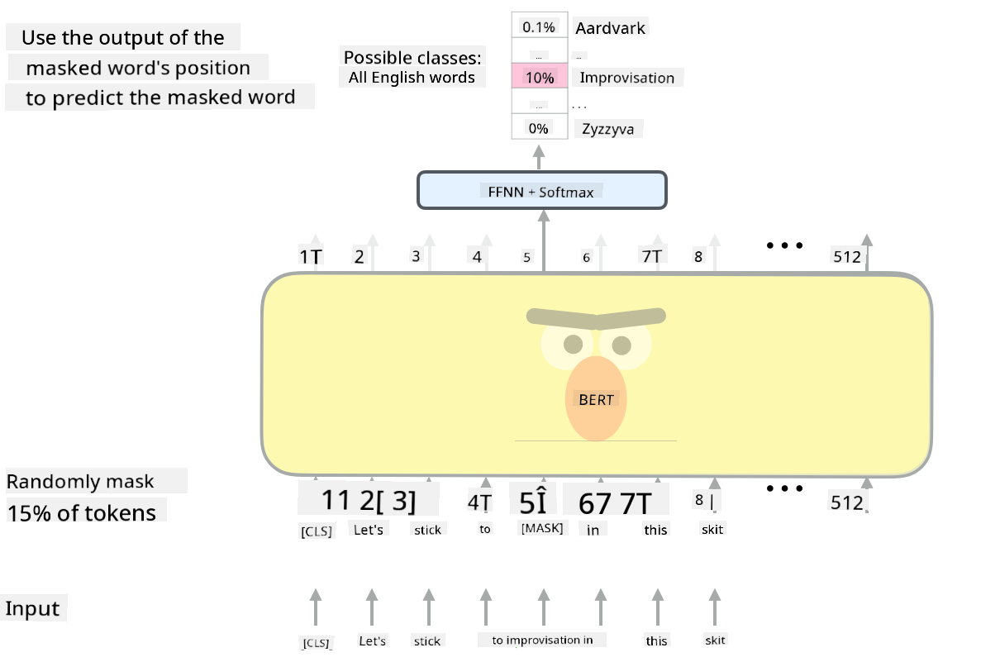

<!--
CO_OP_TRANSLATOR_METADATA:
{
  "original_hash": "7e617f0b8de85a43957a853aba09bfeb",
  "translation_date": "2025-08-31T17:56:56+00:00",
  "source_file": "lessons/5-NLP/18-Transformers/README.md",
  "language_code": "en"
}
-->
# Attention Mechanisms and Transformers

## [Pre-lecture quiz](https://red-field-0a6ddfd03.1.azurestaticapps.net/quiz/118)

One of the most significant challenges in the field of NLP is **machine translation**, a critical task that powers tools like Google Translate. In this section, we will focus on machine translation or, more broadly, on any *sequence-to-sequence* task (also known as **sentence transduction**).

With RNNs, sequence-to-sequence tasks are implemented using two recurrent networks: the **encoder**, which compresses an input sequence into a hidden state, and the **decoder**, which expands this hidden state into a translated output. However, this approach has some limitations:

* The encoder's final state struggles to retain information from the beginning of a sentence, leading to poor performance on long sentences.
* All words in a sequence are treated as equally important, even though, in reality, some words in the input sequence have a greater influence on the output than others.

**Attention Mechanisms** address these issues by assigning different weights to the contextual influence of each input vector on each output prediction in the RNN. This is achieved by creating shortcuts between the intermediate states of the input RNN and the output RNN. When generating an output symbol yt, all input hidden states hi are considered, each with a different weight coefficient αt,i.

> The encoder-decoder model with additive attention mechanism in [Bahdanau et al., 2015](https://arxiv.org/pdf/1409.0473.pdf), cited from [this blog post](https://lilianweng.github.io/lil-log/2018/06/24/attention-attention.html)

The attention matrix {αi,j} represents the extent to which specific input words contribute to the generation of a particular word in the output sequence. Below is an example of such a matrix:

> Figure from [Bahdanau et al., 2015](https://arxiv.org/pdf/1409.0473.pdf) (Fig.3)

Attention mechanisms are a cornerstone of many state-of-the-art NLP models. However, adding attention significantly increases the number of model parameters, which creates scaling challenges for RNNs. A major limitation of RNNs is their sequential nature, which makes it difficult to batch and parallelize training. In an RNN, each element of a sequence must be processed in order, preventing easy parallelization.

> Figure from [Google's Blog](https://research.googleblog.com/2016/09/a-neural-network-for-machine.html)

The combination of attention mechanisms and the limitations of RNNs led to the development of today's state-of-the-art Transformer Models, such as BERT and Open-GPT3.

## Transformer models

The key innovation of transformers is their ability to avoid the sequential nature of RNNs, enabling parallelizable training. This is achieved through two main ideas:

* Positional encoding
* Using a self-attention mechanism to capture patterns instead of relying on RNNs (or CNNs). This is why the paper introducing transformers is titled *[Attention is all you need](https://arxiv.org/abs/1706.03762)*.

### Positional Encoding/Embedding

The concept of positional encoding is as follows:
1. In RNNs, the relative position of tokens is inherently represented by the number of steps, so explicit representation is unnecessary.
2. However, with attention mechanisms, the relative positions of tokens within a sequence must be explicitly represented.
3. To achieve positional encoding, we augment the sequence of tokens with their positions in the sequence (e.g., 0, 1, 2, ...).
4. We then combine the token positions with token embedding vectors. To transform positions (integers) into vectors, we can use different methods:

* Trainable embeddings, similar to token embeddings. This is the approach we use here. Embedding layers are applied to both tokens and their positions, producing embedding vectors of the same dimensions, which are then added together.
* Fixed position encoding functions, as proposed in the original paper.

> Image by the author

The resulting positional embedding encodes both the original token and its position within the sequence.

### Multi-Head Self-Attention

Next, we need to identify patterns within the sequence. Transformers achieve this using a **self-attention** mechanism, which applies attention to the same sequence for both input and output. Self-attention allows the model to consider the **context** of a sentence and identify interrelated words. For example, it can determine which words are referenced by pronouns like *it* and incorporate the surrounding context:

> Image from the [Google Blog](https://research.googleblog.com/2017/08/transformer-novel-neural-network.html)

Transformers use **Multi-Head Attention** to capture various types of dependencies, such as long-term vs. short-term word relationships, co-references, and more.

[TensorFlow Notebook](TransformersTF.ipynb) provides more details on implementing transformer layers.

### Encoder-Decoder Attention

In transformers, attention is applied in two areas:

* To capture patterns within the input text using self-attention.
* To perform sequence translation via the attention layer between the encoder and decoder.

Encoder-decoder attention is similar to the attention mechanism used in RNNs, as described earlier. This animated diagram illustrates the role of encoder-decoder attention.

Since each input position is independently mapped to each output position, transformers can parallelize more effectively than RNNs. This enables the creation of larger and more expressive language models. Each attention head can learn different relationships between words, improving downstream NLP tasks.

## BERT

**BERT** (Bidirectional Encoder Representations from Transformers) is a large, multi-layer transformer network with 12 layers for *BERT-base* and 24 for *BERT-large*. The model is pre-trained on a massive text corpus (Wikipedia + books) using unsupervised training (predicting masked words in a sentence). During pre-training, the model acquires a deep understanding of language, which can then be fine-tuned on other datasets. This process is known as **transfer learning**.

> Image [source](http://jalammar.github.io/illustrated-bert/)

## ✍️ Exercises: Transformers

Continue your learning in the following notebooks:

* [Transformers in PyTorch](TransformersPyTorch.ipynb)
* [Transformers in TensorFlow](TransformersTF.ipynb)

## Conclusion

In this lesson, you learned about Transformers and Attention Mechanisms, essential tools in the NLP toolkit. There are many variations of Transformer architectures, including BERT, DistilBERT, BigBird, OpenGPT3, and more, which can be fine-tuned. The [HuggingFace package](https://github.com/huggingface/) provides a repository for training many of these architectures using both PyTorch and TensorFlow.

## 🚀 Challenge

## [Post-lecture quiz](https://red-field-0a6ddfd03.1.azurestaticapps.net/quiz/218)

## Review & Self Study

* [Blog post](https://mchromiak.github.io/articles/2017/Sep/12/Transformer-Attention-is-all-you-need/), explaining the classical [Attention is all you need](https://arxiv.org/abs/1706.03762) paper on transformers.
* [A series of blog posts](https://towardsdatascience.com/transformers-explained-visually-part-1-overview-of-functionality-95a6dd460452) on transformers, explaining the architecture in detail.

## [Assignment](assignment.md)

---

**Disclaimer**:  
This document has been translated using the AI translation service [Co-op Translator](https://github.com/Azure/co-op-translator). While we aim for accuracy, please note that automated translations may include errors or inaccuracies. The original document in its native language should be regarded as the authoritative source. For critical information, professional human translation is advised. We are not responsible for any misunderstandings or misinterpretations resulting from the use of this translation.