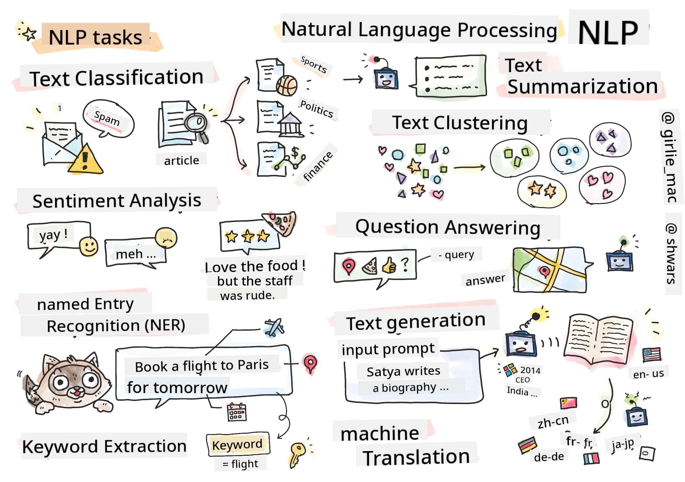

<!--
CO_OP_TRANSLATOR_METADATA:
{
  "original_hash": "8ef02a9318257ea140ed3ed74442096d",
  "translation_date": "2025-08-31T17:54:49+00:00",
  "source_file": "lessons/5-NLP/README.md",
  "language_code": "en"
}
-->
# Natural Language Processing



In this section, we will explore how Neural Networks can be used to tackle tasks related to **Natural Language Processing (NLP)**. There are numerous NLP challenges we aim for computers to solve:

* **Text classification** involves categorizing text sequences into predefined classes. Examples include identifying emails as spam or not, or classifying articles into categories like sports, business, politics, etc. Additionally, when building chatbots, it's crucial to understand user intent — this is known as **intent classification**, which often involves handling multiple categories.
* **Sentiment analysis** is a regression problem where we assign a numerical value (sentiment) to indicate how positive or negative a sentence is. A more advanced form of sentiment analysis is **aspect-based sentiment analysis** (ABSA), where sentiment is attributed to specific parts of a sentence (aspects), e.g., *In this restaurant, I liked the cuisine, but the atmosphere was awful*.
* **Named Entity Recognition** (NER) focuses on extracting specific entities from text. For instance, in the sentence *I need to fly to Paris tomorrow*, the word *tomorrow* represents a DATE, and *Paris* is a LOCATION.
* **Keyword extraction** is similar to NER but involves automatically identifying words that are significant to the meaning of a sentence, without pre-training for specific entity types.
* **Text clustering** is useful for grouping similar sentences, such as clustering similar requests in technical support conversations.
* **Question answering** refers to a model's ability to answer specific questions. The model takes a text passage and a question as inputs and identifies the part of the text containing the answer (or sometimes generates the answer itself).
* **Text Generation** involves creating new text. It can be seen as a classification task where the next letter/word is predicted based on a given *text prompt*. Advanced text generation models like GPT-3 can also solve other NLP tasks, such as classification, using techniques like [prompt programming](https://towardsdatascience.com/software-3-0-how-prompting-will-change-the-rules-of-the-game-a982fbfe1e0) or [prompt engineering](https://medium.com/swlh/openai-gpt-3-and-prompt-engineering-dcdc2c5fcd29).
* **Text summarization** enables a computer to "read" lengthy text and condense it into a few sentences.
* **Machine translation** combines understanding text in one language and generating text in another.

Historically, many NLP tasks were addressed using traditional methods like grammars. For example, in machine translation, parsers were used to convert sentences into syntax trees, extract higher-level semantic structures to represent meaning, and generate results based on the target language's grammar. Today, neural networks are more effective for solving many NLP tasks.

> Many traditional NLP methods are implemented in the Python library [Natural Language Processing Toolkit (NLTK)](https://www.nltk.org). The [NLTK Book](https://www.nltk.org/book/) is an excellent online resource that explains how various NLP tasks can be solved using NLTK.

In this course, we will primarily focus on using Neural Networks for NLP, incorporating NLTK when necessary.

We have already learned how neural networks handle tabular data and images. The key difference with text is that it is a variable-length sequence, whereas the input size for images is fixed. While convolutional networks can identify patterns in input data, patterns in text are more complex. For example, negation can be separated from the subject by many words (e.g., *I do not like oranges* vs. *I do not like those big colorful tasty oranges*), yet it should still be interpreted as a single pattern. To process language effectively, we need specialized neural network types like *recurrent networks* and *transformers*.

## Install Libraries

If you're using a local Python setup for this course, you may need to install the required libraries for NLP with the following commands:

**For PyTorch**
```bash
pip install -r requirements-torch.txt
```
**For TensorFlow**
```bash
pip install -r requirements-tf.txt
```

> You can explore NLP with TensorFlow on [Microsoft Learn](https://docs.microsoft.com/learn/modules/intro-natural-language-processing-tensorflow/?WT.mc_id=academic-77998-cacaste)

## GPU Warning

In this section, some examples will involve training large models.
* **Use a GPU-Enabled Computer**: To reduce waiting times when working with large models, it's recommended to use a computer with GPU support.
* **GPU Memory Constraints**: Training large models on a GPU may lead to memory shortages.
* **GPU Memory Consumption**: The amount of GPU memory used during training depends on factors like minibatch size.
* **Minimize Minibatch Size**: If you encounter GPU memory issues, try reducing the minibatch size in your code.
* **TensorFlow GPU Memory Release**: Older TensorFlow versions may not release GPU memory properly when training multiple models in one Python kernel. To manage GPU memory effectively, configure TensorFlow to allocate memory only as needed.
* **Code Inclusion**: To set TensorFlow to grow GPU memory allocation dynamically, include the following code in your notebooks:

```python
physical_devices = tf.config.list_physical_devices('GPU') 
if len(physical_devices)>0:
    tf.config.experimental.set_memory_growth(physical_devices[0], True) 
```

If you're interested in learning NLP from a traditional machine learning perspective, check out [this suite of lessons](https://github.com/microsoft/ML-For-Beginners/tree/main/6-NLP).

## In this Section
In this section, we will cover:

* [Representing text as tensors](13-TextRep/README.md)
* [Word Embeddings](14-Emdeddings/README.md)
* [Language Modeling](15-LanguageModeling/README.md)
* [Recurrent Neural Networks](16-RNN/README.md)
* [Generative Networks](17-GenerativeNetworks/README.md)
* [Transformers](18-Transformers/README.md)

---

**Disclaimer**:  
This document has been translated using the AI translation service [Co-op Translator](https://github.com/Azure/co-op-translator). While we aim for accuracy, please note that automated translations may include errors or inaccuracies. The original document in its native language should be regarded as the authoritative source. For critical information, professional human translation is advised. We are not responsible for any misunderstandings or misinterpretations resulting from the use of this translation.