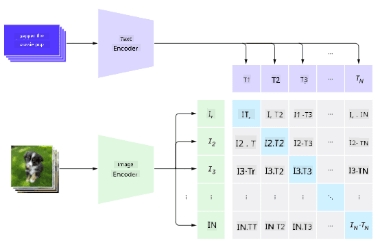
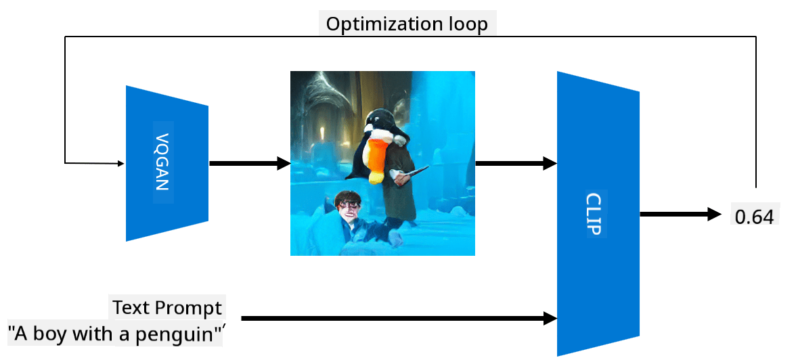
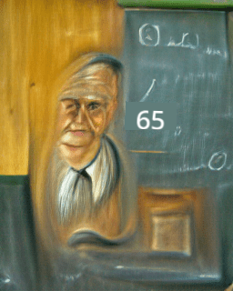

<!--
CO_OP_TRANSLATOR_METADATA:
{
  "original_hash": "9c592c26aca16ca085d268c732284187",
  "translation_date": "2025-08-31T17:34:46+00:00",
  "source_file": "lessons/X-Extras/X1-MultiModal/README.md",
  "language_code": "en"
}
-->
# Multi-Modal Networks

After the success of transformer models in solving NLP tasks, similar architectures have been applied to computer vision tasks. There is growing interest in developing models that *combine* vision and natural language capabilities. One such attempt was made by OpenAI, resulting in CLIP and DALL.E.

## Contrastive Image Pre-Training (CLIP)

The main idea behind CLIP is to compare text prompts with an image and determine how well the image matches the prompt.

> *Image from [this blog post](https://openai.com/blog/clip/)*

The model is trained on images sourced from the Internet along with their captions. For each batch, N pairs of (image, text) are taken and converted into vector representations I and T. These representations are then matched. The loss function is designed to maximize the cosine similarity between vectors corresponding to a single pair (e.g., I and T) while minimizing cosine similarity between all other pairs. This approach is called **contrastive** for this reason.

The CLIP model/library is available on [OpenAI GitHub](https://github.com/openai/CLIP). The approach is explained in [this blog post](https://openai.com/blog/clip/) and in greater detail in [this paper](https://arxiv.org/pdf/2103.00020.pdf).

Once the model is pre-trained, it can process a batch of images and text prompts, returning a tensor with probabilities. CLIP can be used for several tasks:

**Image Classification**

For example, if we need to classify images into categories like cats, dogs, and humans, we can provide the model with an image and a series of text prompts: "*a picture of a cat*", "*a picture of a dog*", "*a picture of a human*". From the resulting vector of three probabilities, we select the index with the highest value.

> *Image from [this blog post](https://openai.com/blog/clip/)*

**Text-Based Image Search**

The reverse is also possible. If we have a collection of images, we can pass this collection to the model along with a text prompt, and it will return the image most similar to the given prompt.

## ✍️ Example: [Using CLIP for Image Classification and Image Search](Clip.ipynb)

Open the [Clip.ipynb](Clip.ipynb) notebook to see CLIP in action.

## Image Generation with VQGAN+CLIP

CLIP can also be used for **image generation** from a text prompt. To achieve this, a **generator model** capable of creating images based on vector input is required. One such model is [VQGAN](https://compvis.github.io/taming-transformers/) (Vector-Quantized GAN).

The key features of VQGAN that distinguish it from traditional [GAN](../../4-ComputerVision/10-GANs/README.md) are:
* Using an autoregressive transformer architecture to generate a sequence of context-rich visual components that make up the image. These visual components are learned by [CNN](../../4-ComputerVision/07-ConvNets/README.md).
* Employing a sub-image discriminator to determine whether parts of the image are "real" or "fake" (as opposed to the "all-or-nothing" approach in traditional GANs).

Learn more about VQGAN on the [Taming Transformers](https://compvis.github.io/taming-transformers/) website.

A significant difference between VQGAN and traditional GANs is that the latter can produce a coherent image from any input vector, while VQGAN may generate an incoherent image. Therefore, the image creation process needs additional guidance, which can be provided using CLIP.

To generate an image based on a text prompt, we start with a random encoding vector that is passed through VQGAN to produce an image. CLIP is then used to calculate a loss function that measures how well the image matches the text prompt. The goal is to minimize this loss by using backpropagation to adjust the input vector parameters.

A great library that implements VQGAN+CLIP is [Pixray](http://github.com/pixray/pixray).

 |   | 
----|----|----
Image generated from prompt *a closeup watercolor portrait of young male teacher of literature with a book* | Image generated from prompt *a closeup oil portrait of young female teacher of computer science with a computer* | Image generated from prompt *a closeup oil portrait of old male teacher of mathematics in front of blackboard*

> Images from the **Artificial Teachers** collection by [Dmitry Soshnikov](http://soshnikov.com)

## DALL-E
### [DALL-E 1](https://openai.com/research/dall-e)
DALL-E is a version of GPT-3 trained to generate images from text prompts. It has been trained with 12 billion parameters.

Unlike CLIP, DALL-E processes both text and image as a single stream of tokens for both modalities. This allows it to generate images based on multiple prompts.

### [DALL-E 2](https://openai.com/dall-e-2)
The main difference between DALL-E 1 and DALL-E 2 is that the latter generates more realistic images and artwork.

Examples of image generation with DALL-E:
 |   | 
----|----|----
Image generated from prompt *a closeup watercolor portrait of young male teacher of literature with a book* | Image generated from prompt *a closeup oil portrait of young female teacher of computer science with a computer* | Image generated from prompt *a closeup oil portrait of old male teacher of mathematics in front of blackboard*

## References

* VQGAN Paper: [Taming Transformers for High-Resolution Image Synthesis](https://compvis.github.io/taming-transformers/paper/paper.pdf)
* CLIP Paper: [Learning Transferable Visual Models From Natural Language Supervision](https://arxiv.org/pdf/2103.00020.pdf)

---

**Disclaimer**:  
This document has been translated using the AI translation service [Co-op Translator](https://github.com/Azure/co-op-translator). While we aim for accuracy, please note that automated translations may include errors or inaccuracies. The original document in its native language should be regarded as the authoritative source. For critical information, professional human translation is advised. We are not responsible for any misunderstandings or misinterpretations resulting from the use of this translation.