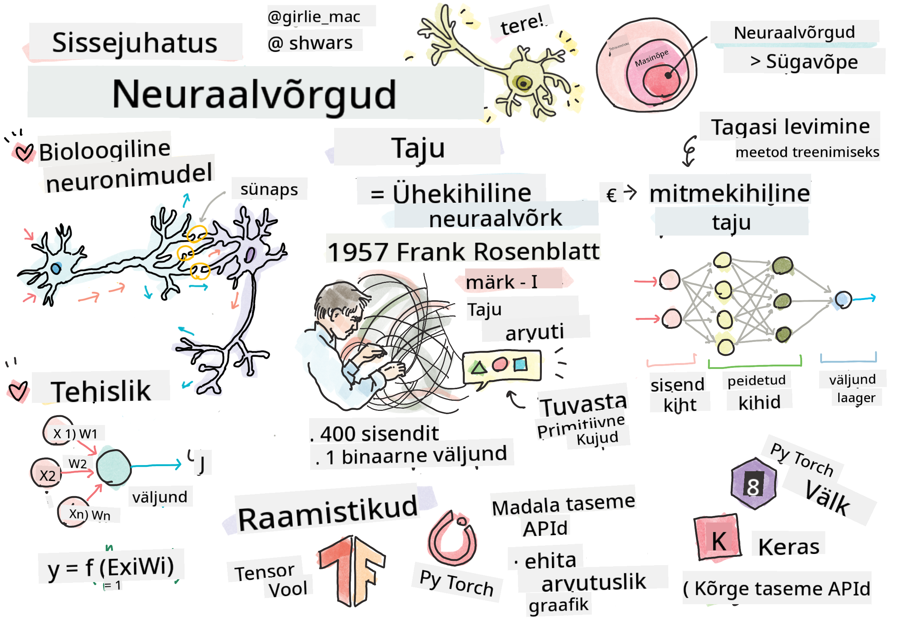

<!--
CO_OP_TRANSLATOR_METADATA:
{
  "original_hash": "f862a99d88088163df12270e2f2ad6c3",
  "translation_date": "2025-10-11T11:30:01+00:00",
  "source_file": "lessons/3-NeuralNetworks/README.md",
  "language_code": "et"
}
-->
# Sissejuhatus tehisnärvivõrkudesse

Nagu me arutasime sissejuhatuses, on üks viis intelligentsuse saavutamiseks treenida **arvutimudelit** või **tehisaju**. Alates 20. sajandi keskpaigast on teadlased katsetanud erinevaid matemaatilisi mudeleid, kuni viimastel aastatel osutus see suund väga edukaks. Selliseid aju matemaatilisi mudeleid nimetatakse **närvivõrkudeks**.

> Mõnikord nimetatakse närvivõrke *tehisnärvivõrkudeks* ehk ANNs, et rõhutada, et tegemist on mudelitega, mitte päris neuronivõrkudega.

## Masinõpe

Närvivõrgud kuuluvad suurema distsipliini, mida nimetatakse **masinõppeks**, alla. Selle eesmärk on kasutada andmeid arvutimudelite treenimiseks, mis suudavad probleeme lahendada. Masinõpe moodustab suure osa tehisintellektist, kuid klassikalist masinõpet me selles õppekavas ei käsitle.

> Külastage meie eraldi **[Masinõpe algajatele](http://github.com/microsoft/ml-for-beginners)** õppekava, et õppida rohkem klassikalisest masinõppest.

Masinõppes eeldame, et meil on olemas mingi näidete andmestik **X** ja vastavad väljundväärtused **Y**. Näited on sageli N-mõõtmelised vektorid, mis koosnevad **tunnustest**, ja väljundeid nimetatakse **siltideks**.

Me käsitleme kahte kõige tavalisemat masinõppe probleemi:

* **Klassifikatsioon**, kus peame sisendobjekti klassifitseerima kaheks või enamaks klassiks.
* **Regressioon**, kus peame ennustama iga sisendnäidise jaoks arvulise väärtuse.

> Kui sisendeid ja väljundeid esitatakse tensoritena, siis sisendi andmestik on M&times;N suurusega maatriks, kus M on näidiste arv ja N on tunnuste arv. Väljundite sildid Y on M suurusega vektor.

Selles õppekavas keskendume ainult närvivõrkude mudelitele.

## Neuroni mudel

Bioloogiast teame, et meie aju koosneb närvirakkudest (neuronitest), millest igaühel on mitu "sisendit" (dendriidid) ja üks "väljund" (akson). Nii dendriidid kui aksonid suudavad juhtida elektrilisi signaale ning nende vahelised ühendused — sünapsid — võivad näidata erinevat juhtivust, mida reguleerivad neurotransmitterid.

 | 
----|----
Päris neuron *([Pilt](https://en.wikipedia.org/wiki/Synapse#/media/File:SynapseSchematic_lines.svg) Wikipediast)* | Tehisneuron *(Pilt autorilt)*

Seega sisaldab neuroni lihtsaim matemaatiline mudel mitut sisendit X1, ..., XN ja ühte väljundit Y ning mitmeid kaale W1, ..., WN. Väljund arvutatakse järgmiselt:

kus f on mingi mittelineaarne **aktiveerimisfunktsioon**.

> Varased neuroni mudelid kirjeldati klassikalises artiklis [A logical calculus of the ideas immanent in nervous activity](https://www.cs.cmu.edu/~./epxing/Class/10715/reading/McCulloch.and.Pitts.pdf), mille autorid olid Warren McCullock ja Walter Pitts 1943. aastal. Donald Hebb pakkus oma raamatus "[The Organization of Behavior: A Neuropsychological Theory](https://books.google.com/books?id=VNetYrB8EBoC)" välja viisi, kuidas neid võrke treenida.

## Selles osas

Selles osas õpime:
* [Perceptronist](03-Perceptron/README.md), ühest varasemast kahe klassi klassifikatsiooni närvivõrgu mudelist
* [Mitmekihilistest võrkudest](04-OwnFramework/README.md) koos seotud märkmikuga [kuidas luua oma raamistikku](04-OwnFramework/OwnFramework.ipynb)
* [Närvivõrkude raamistikest](05-Frameworks/README.md), koos nende märkmikega: [PyTorch](05-Frameworks/IntroPyTorch.ipynb) ja [Keras/Tensorflow](05-Frameworks/IntroKerasTF.ipynb)
* [Ületreenimisest](../../../../lessons/3-NeuralNetworks/05-Frameworks)

---

**Lahtiütlus**:  
See dokument on tõlgitud AI tõlketeenuse [Co-op Translator](https://github.com/Azure/co-op-translator) abil. Kuigi püüame tagada täpsust, palume arvestada, et automaatsed tõlked võivad sisaldada vigu või ebatäpsusi. Algne dokument selle algses keeles tuleks pidada autoriteetseks allikaks. Olulise teabe puhul soovitame kasutada professionaalset inimtõlget. Me ei vastuta selle tõlke kasutamisest tulenevate arusaamatuste või valesti tõlgenduste eest.