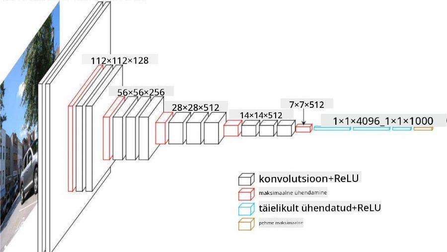

<!--
CO_OP_TRANSLATOR_METADATA:
{
  "original_hash": "53faab85adfcebd8c10bcd71dc2fa557",
  "translation_date": "2025-10-11T11:25:35+00:00",
  "source_file": "lessons/4-ComputerVision/07-ConvNets/CNN_Architectures.md",
  "language_code": "et"
}
-->
# Tuntud CNN arhitektuurid

### VGG-16

VGG-16 on võrk, mis saavutas 2014. aastal ImageNet top-5 klassifikatsioonis 92,7% täpsuse. Sellel on järgmine kihistruktuur:

Nagu näha, järgib VGG traditsioonilist püramiidstruktuuri, mis koosneb järjestikustest konvolutsiooni- ja koondamiskihidest.

> Pilt [Researchgate](https://www.researchgate.net/figure/Vgg16-model-structure-To-get-the-VGG-NIN-model-we-replace-the-2-nd-4-th-6-th-7-th_fig2_335194493) lehelt

### ResNet

ResNet on mudelite perekond, mille Microsoft Research esitas 2015. aastal. ResNeti peamine idee on kasutada **jääkblokke**:

> Pilt [sellest artiklist](https://arxiv.org/pdf/1512.03385.pdf)

Identiteedi läbipääsu kasutamise põhjus on see, et kiht ennustab **erinevust** eelmise kihi tulemuse ja jääkbloki väljundi vahel - sellest tuleneb nimi *jääk*. Need blokid on palju lihtsamini treenitavad ning nende abil saab luua võrke, mis koosnevad sadadest sellistest blokkidest (kõige levinumad variandid on ResNet-52, ResNet-101 ja ResNet-152).

Seda võrku võib mõelda ka kui võimet kohandada oma keerukust vastavalt andmekogule. Alguses, kui võrgu treenimist alustatakse, on kaalude väärtused väikesed ja enamik signaalist läbib identiteedi kihte. Treeningu edenedes ja kaalude suurenedes kasvab võrgu parameetrite tähtsus ning võrk kohandub, et saavutada vajalik väljendusvõime treeningpiltide korrektseks klassifitseerimiseks.

### Google Inception

Google Inception arhitektuur viib selle idee veelgi kaugemale ja ehitab iga võrgu kihi mitme erineva tee kombinatsioonina:

> Pilt [Researchgate](https://www.researchgate.net/figure/Inception-module-with-dimension-reductions-left-and-schema-for-Inception-ResNet-v1_fig2_355547454) lehelt

Siin tuleb rõhutada 1x1 konvolutsioonide rolli, sest esialgu ei tundu need loogilised. Miks peaksime pildi läbi töötlema 1x1 filtriga? Kuid tuleb meeles pidada, et konvolutsioonifiltrid töötavad ka mitme sügavuskanaliga (alguses - RGB värvid, järgnevatel kihtidel - kanalid erinevate filtrite jaoks) ning 1x1 konvolutsiooni kasutatakse nende sisendkanalite segamiseks erinevate treenitavate kaalude abil. Seda võib vaadelda ka kui kanalimõõtme vähendamist (koondamist).

Siin on [hea blogipostitus](https://medium.com/analytics-vidhya/talented-mr-1x1-comprehensive-look-at-1x1-convolution-in-deep-learning-f6b355825578) selle teema kohta ja [originaalartikkel](https://arxiv.org/pdf/1312.4400.pdf).

### MobileNet

MobileNet on mudelite perekond, millel on vähendatud suurus ja mis sobivad mobiilseadmetele. Kasutage neid, kui teil on piiratud ressursid ja saate ohverdada veidi täpsust. Nende peamine idee on nn **sügavuse järgi eraldatav konvolutsioon**, mis võimaldab konvolutsioonifiltreid esitada ruumiliste konvolutsioonide ja 1x1 konvolutsioonide kompositsioonina sügavuskanalite üle. See vähendab oluliselt parameetrite arvu, muutes võrgu väiksemaks ja ka lihtsamini treenitavaks väiksema andmehulgaga.

Siin on [hea blogipostitus MobileNeti kohta](https://medium.com/analytics-vidhya/image-classification-with-mobilenet-cc6fbb2cd470).

## Kokkuvõte

Selles osas õppisite arvutinägemise närvivõrkude peamist kontseptsiooni - konvolutsioonivõrke. Päriselus kasutatavad arhitektuurid, mis toetavad pildiklassifikatsiooni, objektituvastust ja isegi pildigeneratsiooni võrke, põhinevad kõik CNN-idel, lihtsalt rohkemate kihtide ja mõningate täiendavate treeningnippidega.

## 🚀 Väljakutse

Kaasaolevates märkmikes on allosas märkmeid selle kohta, kuidas saavutada suuremat täpsust. Tehke katseid, et näha, kas suudate saavutada suuremat täpsust.

## [Loengu järgne viktoriin](https://ff-quizzes.netlify.app/en/ai/quiz/14)

## Ülevaade ja iseseisev õppimine

Kuigi CNN-e kasutatakse kõige sagedamini arvutinägemise ülesannete jaoks, sobivad need üldiselt hästi fikseeritud suurusega mustrite tuvastamiseks. Näiteks kui tegeleme helidega, võime samuti soovida kasutada CNN-e, et otsida konkreetseid mustreid helisignaalis - sel juhul oleksid filtrid 1-mõõtmelised (ja seda CNN-i nimetatakse 1D-CNN-iks). Samuti kasutatakse mõnikord 3D-CNN-i, et ekstraktida omadusi mitmemõõtmelises ruumis, näiteks teatud sündmuste tuvastamiseks videos - CNN suudab tabada teatud mustreid omaduste muutumises ajas. Tehke ülevaade ja iseseisev õppimine teiste ülesannete kohta, mida CNN-idega saab teha.

## [Ülesanne](lab/README.md)

Selles laboris on teie ülesandeks klassifitseerida erinevaid kasside ja koerte tõuge. Need pildid on keerukamad kui MNIST andmestik, suuremate mõõtmetega ja rohkem kui 10 klassiga.

---

**Lahtiütlus**:  
See dokument on tõlgitud AI tõlketeenuse [Co-op Translator](https://github.com/Azure/co-op-translator) abil. Kuigi püüame tagada täpsust, palume arvestada, et automaatsed tõlked võivad sisaldada vigu või ebatäpsusi. Algne dokument selle algses keeles tuleks pidada autoriteetseks allikaks. Olulise teabe puhul soovitame kasutada professionaalset inimtõlget. Me ei vastuta selle tõlke kasutamisest tulenevate arusaamatuste või valesti tõlgenduste eest.