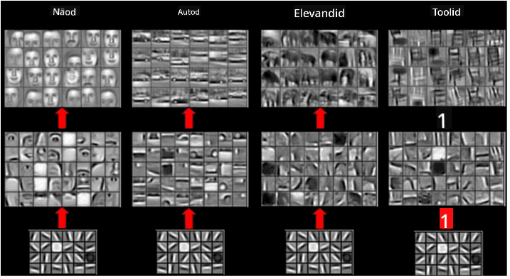

<!--
CO_OP_TRANSLATOR_METADATA:
{
  "original_hash": "a560d5b845962cf33dc102266e409568",
  "translation_date": "2025-10-11T11:26:10+00:00",
  "source_file": "lessons/4-ComputerVision/07-ConvNets/README.md",
  "language_code": "et"
}
-->
# Konvolutsioonilised närvivõrgud

Oleme varem näinud, et närvivõrgud on üsna head piltidega töötamisel ja isegi ühekihiline perceptron suudab MNIST andmestikus käsitsi kirjutatud numbreid mõistliku täpsusega ära tunda. Kuid MNIST andmestik on väga eriline, kuna kõik numbrid on pildi keskel, mis teeb ülesande lihtsamaks.

## [Eelloengu viktoriin](https://ff-quizzes.netlify.app/en/ai/quiz/13)

Päriselus tahame olla võimelised tuvastama objekte pildil sõltumata nende täpsest asukohast. Arvutinägemine erineb üldisest klassifitseerimisest, sest kui püüame leida kindlat objekti pildilt, skaneerime pilti, otsides konkreetseid **mustreid** ja nende kombinatsioone. Näiteks, kui otsime kassi, võime esmalt otsida horisontaalseid jooni, mis võivad moodustada vurre, ja teatud vurrude kombinatsioon võib meile öelda, et tegemist on kassi pildiga. Mustrite suhteline asukoht ja olemasolu on olulised, mitte nende täpne asukoht pildil.

Mustrite leidmiseks kasutame **konvolutsioonifiltrite** mõistet. Nagu teate, on pilt esitatud 2D-maatriksina või 3D-tensorina koos värvisügavusega. Filtri rakendamine tähendab, et võtame suhteliselt väikese **filtrituuma** maatriksi ja arvutame iga originaalpildi pikseli jaoks kaalutud keskmise koos naaberpunktidega. Seda võib vaadelda kui väikest akent, mis libiseb üle kogu pildi ja keskmistab kõik pikslid vastavalt filtrituuma maatriksi kaaludele.

 | 
----|----

> Pilt: Dmitry Soshnikov

Näiteks, kui rakendame MNIST numbritele 3x3 vertikaalse ja horisontaalse serva filtreid, saame esile tõsta (nt kõrged väärtused) kohad, kus originaalpildil on vertikaalsed ja horisontaalsed servad. Seega saab neid kahte filtrit kasutada servade "otsimiseks". Samamoodi saame kujundada erinevaid filtreid, et otsida teisi madala taseme mustreid:

> Pilt: [Leung-Malik filtripank](https://www.robots.ox.ac.uk/~vgg/research/texclass/filters.html)

Kuigi me saame filtreid käsitsi kujundada, et teatud mustreid välja tuua, saame võrgu kujundada ka nii, et see õpiks mustreid automaatselt. See on üks CNN-i peamisi ideid.

## CNN-i peamised ideed

CNN-i töö põhineb järgmistel olulistel ideedel:

* Konvolutsioonifiltrid suudavad mustreid välja tuua
* Võrgu saab kujundada nii, et filtrid treenitakse automaatselt
* Sama lähenemist saab kasutada mustrite leidmiseks kõrgetasemelistes omadustes, mitte ainult originaalpildil. Seega töötab CNN-i omaduste tuvastamine hierarhias, alustades madala taseme pikslikombinatsioonidest kuni kõrgema taseme pildiosade kombinatsioonideni.

> Pilt: [Hislop-Lynchi artikkel](https://www.semanticscholar.org/paper/Computer-vision-based-pedestrian-trajectory-Hislop-Lynch/26e6f74853fc9bbb7487b06dc2cf095d36c9021d), põhineb [nende uurimusel](https://dl.acm.org/doi/abs/10.1145/1553374.1553453)

## ✍️ Harjutused: Konvolutsioonilised närvivõrgud

Jätkame uurimist, kuidas konvolutsioonilised närvivõrgud töötavad ja kuidas saavutada treenitavaid filtreid, töötades vastavate märkmikega:

* [Konvolutsioonilised närvivõrgud - PyTorch](ConvNetsPyTorch.ipynb)
* [Konvolutsioonilised närvivõrgud - TensorFlow](ConvNetsTF.ipynb)

## Püramiidne arhitektuur

Enamik pilttöötluseks kasutatavaid CNN-e järgib nn püramiidset arhitektuuri. Esimene konvolutsioonikiht, mis rakendatakse originaalpiltidele, sisaldab tavaliselt suhteliselt väikest arvu filtreid (8-16), mis vastavad erinevatele pikslikombinatsioonidele, nagu horisontaalsed/vertikaalsed jooned või tõmbed. Järgmises kihis vähendame võrgu ruumilist mõõdet ja suurendame filtrite arvu, mis vastab lihtsate omaduste rohkematele kombinatsioonidele. Iga kihiga, kui liigume lõpliku klassifikaatori poole, pildi ruumilised mõõtmed vähenevad ja filtrite arv kasvab.

Näiteks vaatame VGG-16 arhitektuuri, võrku, mis saavutas 2014. aastal ImageNeti top-5 klassifikatsioonis 92,7% täpsuse:

> Pilt: [Researchgate](https://www.researchgate.net/figure/Vgg16-model-structure-To-get-the-VGG-NIN-model-we-replace-the-2-nd-4-th-6-th-7-th_fig2_335194493)

## Tuntumad CNN-i arhitektuurid

[Jätka õpinguid tuntumate CNN-i arhitektuuride kohta](CNN_Architectures.md)

---

**Lahtiütlus**:  
See dokument on tõlgitud AI tõlketeenuse [Co-op Translator](https://github.com/Azure/co-op-translator) abil. Kuigi püüame tagada täpsust, palume arvestada, et automaatsed tõlked võivad sisaldada vigu või ebatäpsusi. Algne dokument selle algses keeles tuleks pidada autoriteetseks allikaks. Olulise teabe puhul soovitame kasutada professionaalset inimtõlget. Me ei vastuta selle tõlke kasutamisest tulenevate arusaamatuste või valesti tõlgenduste eest.