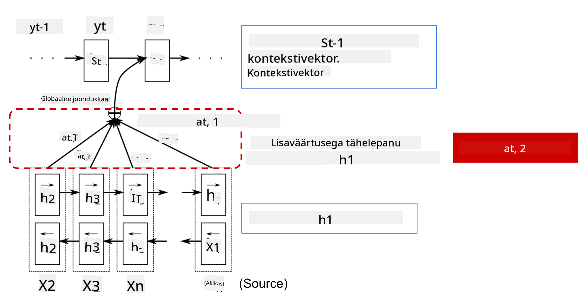
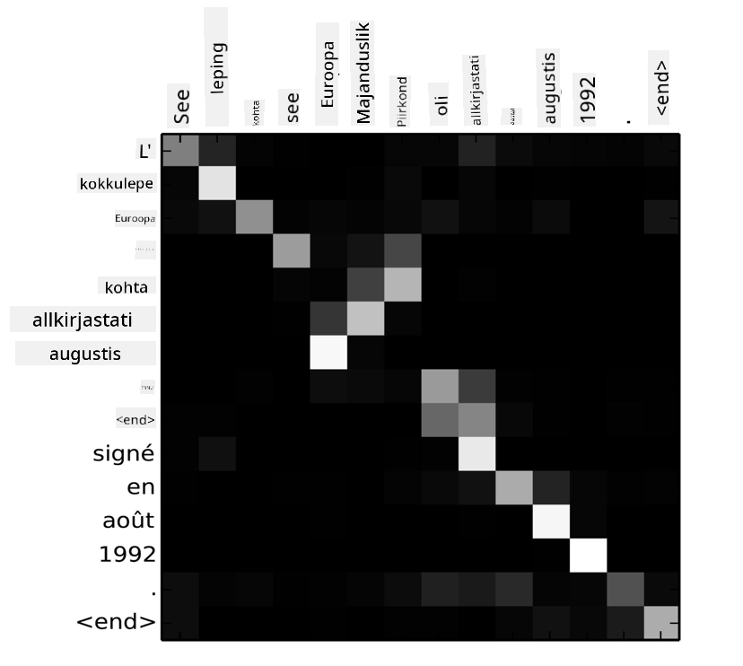
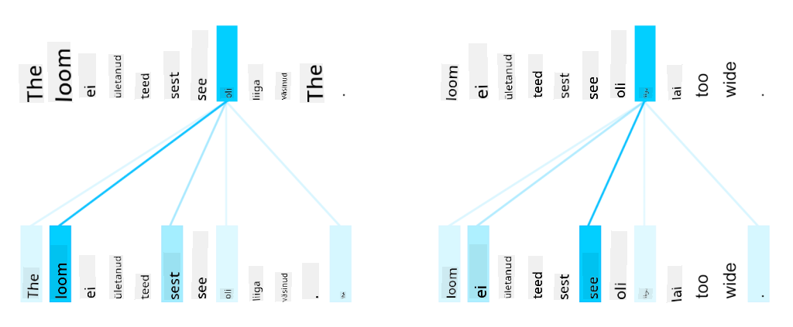
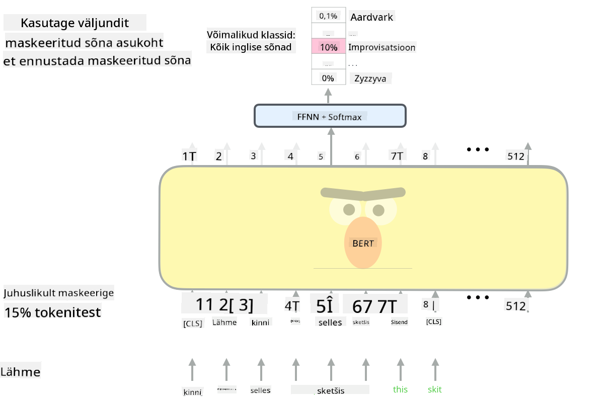

<!--
CO_OP_TRANSLATOR_METADATA:
{
  "original_hash": "f335dfcb4a993920504c387973a36957",
  "translation_date": "2025-10-11T11:39:25+00:00",
  "source_file": "lessons/5-NLP/18-Transformers/README.md",
  "language_code": "et"
}
-->
# Tähelepanu mehhanismid ja Transformerid

## [Eelloengu viktoriin](https://ff-quizzes.netlify.app/en/ai/quiz/35)

Üks olulisemaid probleeme NLP valdkonnas on **masintõlge**, mis on oluline ülesanne selliste tööriistade nagu Google Translate aluseks. Selles osas keskendume masintõlkele või üldisemalt igale *järjestusest-järjestusse* ülesandele (mida nimetatakse ka **lause transduktsiooniks**).

RNN-idega rakendatakse järjestusest-järjestusse meetodit kahe korduva võrgu abil, kus üks võrk, **kodeerija**, koondab sisendjärjestuse varjatud olekusse, samal ajal kui teine võrk, **dekodeerija**, laotab selle varjatud oleku tõlgitud tulemuseks. Selle lähenemisega kaasnevad mõned probleemid:

* Kodeerija võrgu lõplik olek ei suuda hästi meeles pidada lause algust, mis põhjustab mudeli kehva kvaliteeti pikkade lausete puhul.
* Kõigil sõnadel järjestuses on sama mõju tulemusele. Tegelikkuses on aga konkreetsetel sõnadel sisendjärjestuses sageli suurem mõju järjestikustele väljunditele kui teistel.

**Tähelepanu mehhanismid** pakuvad võimalust kaaluda iga sisendvektori kontekstuaalset mõju RNN-i iga väljundprognoosi puhul. Seda rakendatakse, luues otseteid sisend-RNN-i vaheolekute ja väljund-RNN-i vahel. Sel viisil, kui genereerime väljundisümbolit yt, võtame arvesse kõiki sisendvarjatud olekuid hi, erinevate kaalukoefitsientidega &alpha;t,i.

> Kodeerija-dekodeerija mudel aditiivse tähelepanu mehhanismiga [Bahdanau et al., 2015](https://arxiv.org/pdf/1409.0473.pdf), viidatud [sellest blogipostitusest](https://lilianweng.github.io/lil-log/2018/06/24/attention-attention.html)

Tähelepanu maatriks {&alpha;i,j} esindab, millises ulatuses teatud sisendsõnad mõjutavad antud sõna genereerimist väljundjärjestuses. Allpool on näide sellisest maatriksist:

> Joonis [Bahdanau et al., 2015](https://arxiv.org/pdf/1409.0473.pdf) (Joonis 3)

Tähelepanu mehhanismid vastutavad suure osa praeguse või peaaegu praeguse NLP tipptaseme eest. Tähelepanu lisamine suurendab aga oluliselt mudeli parameetrite arvu, mis põhjustas RNN-idega skaleerimisprobleeme. RNN-ide skaleerimise peamine piirang on see, et mudelite korduv olemus muudab treeningu rühmitamise ja paralleelimise keeruliseks. RNN-is tuleb iga järjestuse element töödelda järjestikuses järjekorras, mis tähendab, et seda ei saa lihtsalt paralleelselt töödelda.

> Joonis [Google'i blogist](https://research.googleblog.com/2016/09/a-neural-network-for-machine.html)

Tähelepanu mehhanismide kasutuselevõtt koos selle piiranguga viis tänapäeval tuntud ja kasutatavate tipptasemel Transformer mudelite loomiseni, nagu BERT ja Open-GPT3.

## Transformer mudelid

Üks peamisi ideid transformerite taga on vältida RNN-ide järjestikust olemust ja luua mudel, mis on treeningu ajal paralleelsem. See saavutatakse kahe idee rakendamisega:

* positsiooniline kodeerimine
* mustrite tuvastamine isetähelepanu mehhanismi abil RNN-ide (või CNN-ide) asemel (seetõttu on transformerite tutvustav artikkel pealkirjaga *[Attention is all you need](https://arxiv.org/abs/1706.03762)*)

### Positsiooniline kodeerimine/Embedimine

Positsioonilise kodeerimise idee on järgmine. 
1. RNN-ide kasutamisel esindab tokenite suhtelist positsiooni sammude arv, mistõttu ei pea seda otseselt esindama. 
2. Kui aga lülitume tähelepanule, peame teadma tokenite suhtelisi positsioone järjestuses. 
3. Positsioonilise kodeerimise saamiseks täiendame oma tokenite järjestust järjestuse tokenipositsioonide järjestusega (st numbrite järjestus 0,1, ...).
4. Seejärel segame tokeni positsiooni tokeni embedimise vektoriga. Positsiooni (täisarvu) vektoriks teisendamiseks saame kasutada erinevaid lähenemisi:

* Treenitav embedimine, sarnane tokeni embedimisele. See on lähenemine, mida siin kaalume. Rakendame embedimise kihid nii tokenitele kui ka nende positsioonidele, mille tulemuseks on sama mõõtmetega embedimise vektorid, mille me seejärel kokku liidame.
* Fikseeritud positsioonilise kodeerimise funktsioon, nagu on välja pakutud algses artiklis.

> Pilt autorilt

Positsioonilise embedimise tulemusena saame vektori, mis sisaldab nii algset tokenit kui ka selle positsiooni järjestuses.

### Mitmepealine isetähelepanu

Järgmine samm on mustrite tuvastamine järjestuses. Selleks kasutavad transformerid **isetähelepanu** mehhanismi, mis on sisuliselt tähelepanu rakendamine samale järjestusele sisendi ja väljundina. Isetähelepanu rakendamine võimaldab meil arvestada **konteksti** lauses ja näha, millised sõnad on omavahel seotud. Näiteks võimaldab see meil näha, millistele sõnadele viitavad kooreferentsid, nagu *see*, ja arvestada konteksti:

> Pilt [Google'i blogist](https://research.googleblog.com/2017/08/transformer-novel-neural-network.html)

Transformerites kasutame **Mitmepealist Tähelepanu**, et anda võrgule võime tuvastada mitut erinevat tüüpi sõltuvusi, nt. pikaajalised vs. lühiajalised sõnade suhted, kooreferentsid vs. midagi muud jne.

[TensorFlow Notebook](TransformersTF.ipynb) sisaldab rohkem detaile transformerite kihtide rakendamise kohta.

### Kodeerija-Dekodeerija Tähelepanu

Transformerites kasutatakse tähelepanu kahes kohas:

* Mustrite tuvastamiseks sisendteksti sees isetähelepanu abil
* Järjestuse tõlkimiseks - see on tähelepanu kiht kodeerija ja dekodeerija vahel.

Kodeerija-dekodeerija tähelepanu on väga sarnane RNN-ides kasutatava tähelepanu mehhanismiga, nagu kirjeldatud selle jaotise alguses. See animeeritud diagramm selgitab kodeerija-dekodeerija tähelepanu rolli.

Kuna iga sisendi positsioon kaardistatakse sõltumatult iga väljundi positsiooniga, saavad transformerid paremini paralleelselt töötada kui RNN-id, mis võimaldab palju suuremaid ja väljendusrikkamaid keelemudeleid. Iga tähelepanu pea saab kasutada erinevate sõnadevaheliste suhete õppimiseks, mis parandab NLP ülesandeid.

## BERT

**BERT** (Bidirectional Encoder Representations from Transformers) on väga suur mitmekihiline transformer võrk, millel on 12 kihti *BERT-base* jaoks ja 24 kihti *BERT-large* jaoks. Mudel treenitakse esmalt suure tekstikorpuse (Wikipedia + raamatud) peal kasutades juhendamata treeningut (ennustades maskeeritud sõnu lauses). Treeningu käigus omandab mudel märkimisväärsel tasemel keele mõistmist, mida saab seejärel kasutada teiste andmekogumitega peenhäälestamise abil. Seda protsessi nimetatakse **ülekandeõppeks**.

> Pildi [allikas](http://jalammar.github.io/illustrated-bert/)

## ✍️ Harjutused: Transformerid

Jätka õppimist järgmistes märkmikes:

* [Transformerid PyTorchis](TransformersPyTorch.ipynb)
* [Transformerid TensorFlowis](TransformersTF.ipynb)

## Kokkuvõte

Selles õppetunnis õppisite Transformerite ja Tähelepanu Mehhanismide kohta, mis on NLP tööriistakasti olulised vahendid. Transformerite arhitektuuril on palju variatsioone, sealhulgas BERT, DistilBERT, BigBird, OpenGPT3 ja palju muud, mida saab peenhäälestada. [HuggingFace pakett](https://github.com/huggingface/) pakub mitmete nende arhitektuuride treenimiseks nii PyTorchi kui ka TensorFlowi jaoks.

## 🚀 Väljakutse

## [Järelloengu viktoriin](https://ff-quizzes.netlify.app/en/ai/quiz/36)

## Ülevaade ja iseseisev õppimine

* [Blogipostitus](https://mchromiak.github.io/articles/2017/Sep/12/Transformer-Attention-is-all-you-need/), mis selgitab klassikalist [Attention is all you need](https://arxiv.org/abs/1706.03762) artiklit transformeritest.
* [Blogipostituste seeria](https://towardsdatascience.com/transformers-explained-visually-part-1-overview-of-functionality-95a6dd460452) transformeritest, mis selgitab arhitektuuri üksikasjalikult.

## [Ülesanne](assignment.md)

---

**Lahtiütlus**:  
See dokument on tõlgitud AI tõlketeenuse [Co-op Translator](https://github.com/Azure/co-op-translator) abil. Kuigi püüame tagada täpsust, palume arvestada, et automaatsed tõlked võivad sisaldada vigu või ebatäpsusi. Algne dokument selle algses keeles tuleks pidada autoriteetseks allikaks. Olulise teabe puhul soovitame kasutada professionaalset inimtõlget. Me ei vastuta selle tõlke kasutamisest tulenevate arusaamatuste või valesti tõlgenduste eest.