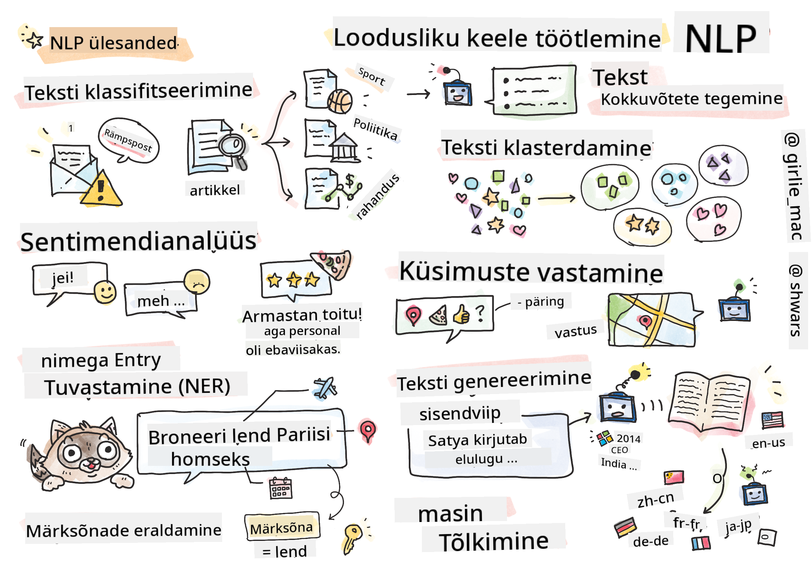

<!--
CO_OP_TRANSLATOR_METADATA:
{
  "original_hash": "8ef02a9318257ea140ed3ed74442096d",
  "translation_date": "2025-10-11T11:38:36+00:00",
  "source_file": "lessons/5-NLP/README.md",
  "language_code": "et"
}
-->
# Loodusliku keele töötlemine



Selles osas keskendume **loodusliku keele töötlemise (NLP)** ülesannete lahendamisele, kasutades tehisnärvivõrke. On palju NLP probleeme, mida soovime, et arvutid suudaksid lahendada:

* **Teksti klassifitseerimine** on tüüpiline klassifitseerimisülesanne, mis puudutab tekstijadasid. Näideteks on e-kirjade klassifitseerimine rämpspostiks või mitte-rämpspostiks, või artiklite kategoriseerimine spordi, äri, poliitika jne valdkondadesse. Samuti, kui arendame vestlusroboteid, peame sageli mõistma, mida kasutaja tahtis öelda – sel juhul tegeleme **intentsioonide klassifitseerimisega**. Intentsioonide klassifitseerimisel tuleb sageli toime tulla paljude kategooriatega.
* **Sentimendi analüüs** on tüüpiline regressiooniülesanne, kus peame omistama lausele numbri (sentimendi), mis vastab sellele, kui positiivne/negatiivne lause tähendus on. Sentimendi analüüsi arenenum versioon on **aspektipõhine sentimendi analüüs** (ABSA), kus me ei omista sentimenti kogu lausele, vaid selle erinevatele osadele (aspektidele), nt. *Selles restoranis meeldis mulle köök, kuid atmosfäär oli kohutav*.
* **Nimega entiteetide tuvastamine** (NER) viitab probleemile, kus tekstist tuleb välja võtta teatud entiteedid. Näiteks peame mõistma, et fraasis *Ma pean homme Pariisi lendama* viitab sõna *homme* KUUPÄEVALE ja *Pariis* ASUKOHALE.  
* **Märksõnade tuvastamine** on sarnane NER-ile, kuid siin tuleb automaatselt välja võtta lause tähenduse seisukohalt olulised sõnad, ilma et oleks eelnevalt treenitud konkreetsete entiteeditüüpide jaoks.
* **Teksti klasterdamine** võib olla kasulik, kui soovime grupeerida sarnaseid lauseid, näiteks tehnilise toe vestlustes sarnaseid päringuid.
* **Küsimustele vastamine** viitab mudeli võimele vastata konkreetsele küsimusele. Mudel saab sisendiks tekstilõigu ja küsimuse ning peab leidma tekstist koha, kus küsimuse vastus asub (või mõnikord genereerima vastuse teksti).
* **Teksti genereerimine** on mudeli võime luua uut teksti. Seda võib pidada klassifitseerimisülesandeks, mis ennustab järgmist tähte/sõna, lähtudes mingist *teksti vihjest*. Arenenud teksti genereerimise mudelid, nagu GPT-3, suudavad lahendada ka teisi NLP ülesandeid, kasutades tehnikat, mida nimetatakse [vihje programmeerimiseks](https://towardsdatascience.com/software-3-0-how-prompting-will-change-the-rules-of-the-game-a982fbfe1e0) või [vihje inseneriks](https://medium.com/swlh/openai-gpt-3-and-prompt-engineering-dcdc2c5fcd29).
* **Teksti kokkuvõtete tegemine** on tehnika, kus soovime, et arvuti "loeks" pikka teksti ja võtaks selle kokku mõne lausega.
* **Masintõlge** võib olla vaadeldav kui teksti mõistmise kombinatsioon ühes keeles ja teksti genereerimine teises keeles.

Alguses lahendati enamik NLP ülesandeid traditsiooniliste meetoditega, nagu grammatikad. Näiteks masintõlkes kasutati parsereid, et muuta algne lause süntaksipuuks, seejärel eraldati kõrgema taseme semantilised struktuurid, et esitada lause tähendust, ja selle tähenduse ning sihtkeele grammatika põhjal genereeriti tulemus. Tänapäeval lahendatakse paljusid NLP ülesandeid tõhusamalt tehisnärvivõrkude abil.

> Paljud klassikalised NLP meetodid on rakendatud [Natural Language Processing Toolkit (NLTK)](https://www.nltk.org) Python'i raamatukogus. Veebis on saadaval suurepärane [NLTK raamat](https://www.nltk.org/book/), mis käsitleb, kuidas erinevaid NLP ülesandeid saab lahendada NLTK abil.

Meie kursusel keskendume peamiselt tehisnärvivõrkude kasutamisele NLP jaoks ning kasutame NLTK-d vajadusel.

Oleme juba õppinud tehisnärvivõrkude kasutamist tabelandmete ja piltidega töötamiseks. Peamine erinevus nende andmetüüpide ja teksti vahel on see, et tekst on muutuva pikkusega jada, samas kui piltide puhul on sisendi suurus ette teada. Kuigi konvolutsioonivõrgud suudavad sisendandmetest mustreid välja tuua, on mustrid tekstis keerukamad. Näiteks võib eitus olla subjektist eraldatud suvalise arvu sõnadega (nt. *Mulle ei meeldi apelsinid* vs. *Mulle ei meeldi need suured värvilised maitsvad apelsinid*), ja seda tuleks siiski tõlgendada ühe mustrina. Seega, keele töötlemiseks peame kasutusele võtma uued tehisnärvivõrkude tüübid, nagu *rekurentvõrgud* ja *transformerid*.

## Raamatukogude paigaldamine

Kui kasutate selle kursuse läbimiseks kohalikku Python'i installatsiooni, peate võib-olla paigaldama kõik vajalikud NLP raamatukogud, kasutades järgmisi käske:

**PyTorch'i jaoks**
```bash
pip install -r requirements-torch.txt
```
**TensorFlow jaoks**
```bash
pip install -r requirements-tf.txt
```

> NLP-d TensorFlow'ga saate proovida [Microsoft Learnis](https://docs.microsoft.com/learn/modules/intro-natural-language-processing-tensorflow/?WT.mc_id=academic-77998-cacaste)

## GPU hoiatus

Selles osas treenime mõnes näites üsna suuri mudeleid.
* **Kasuta GPU-toega arvutit**: Soovitatav on käivitada oma märkmikud GPU-toega arvutis, et vähendada ooteaega suurte mudelitega töötamisel.
* **GPU mälu piirangud**: GPU kasutamine võib viia olukordadeni, kus GPU mälu saab otsa, eriti suurte mudelite treenimisel.
* **GPU mälu tarbimine**: GPU mälu tarbimine treenimise ajal sõltub mitmest tegurist, sealhulgas minibatch'i suurusest.
* **Vähenda minibatch'i suurust**: Kui teil tekib GPU mälu probleeme, kaaluge minibatch'i suuruse vähendamist oma koodis võimaliku lahendusena.
* **TensorFlow GPU mälu vabastamine**: TensorFlow vanemad versioonid ei pruugi GPU mälu õigesti vabastada, kui treenitakse mitut mudelit ühe Python'i kerneli sees. GPU mälu kasutamise tõhusaks haldamiseks saate seadistada TensorFlow'i nii, et see eraldaks GPU mälu ainult vajaduse korral.
* **Koodi lisamine**: Et seadistada TensorFlow GPU mälu eraldama ainult vajaduse korral, lisage oma märkmikesse järgmine kood:

```python
physical_devices = tf.config.list_physical_devices('GPU') 
if len(physical_devices)>0:
    tf.config.experimental.set_memory_growth(physical_devices[0], True) 
```

Kui olete huvitatud klassikalise masinõppe perspektiivist NLP õppimisest, külastage [seda õppetundide komplekti](https://github.com/microsoft/ML-For-Beginners/tree/main/6-NLP)

## Selles osas
Selles osas õpime:

* [Teksti esitamist tensoritena](13-TextRep/README.md)
* [Sõnaembeddingsid](14-Emdeddings/README.md)
* [Keelemudelit](15-LanguageModeling/README.md)
* [Rekurentseid närvivõrke](16-RNN/README.md)
* [Generatiivseid võrke](17-GenerativeNetworks/README.md)
* [Transformereid](18-Transformers/README.md)

---

**Lahtiütlus**:  
See dokument on tõlgitud AI tõlketeenuse [Co-op Translator](https://github.com/Azure/co-op-translator) abil. Kuigi püüame tagada täpsust, palume arvestada, et automaatsed tõlked võivad sisaldada vigu või ebatäpsusi. Algne dokument selle algses keeles tuleks pidada autoriteetseks allikaks. Olulise teabe puhul soovitame kasutada professionaalset inimtõlget. Me ei vastuta selle tõlke kasutamisest tulenevate arusaamatuste või valesti tõlgenduste eest.