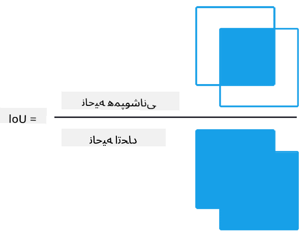
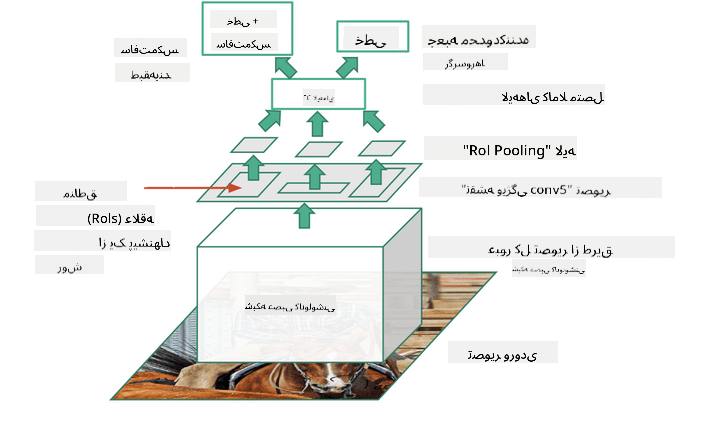
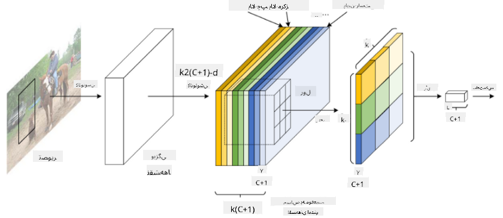
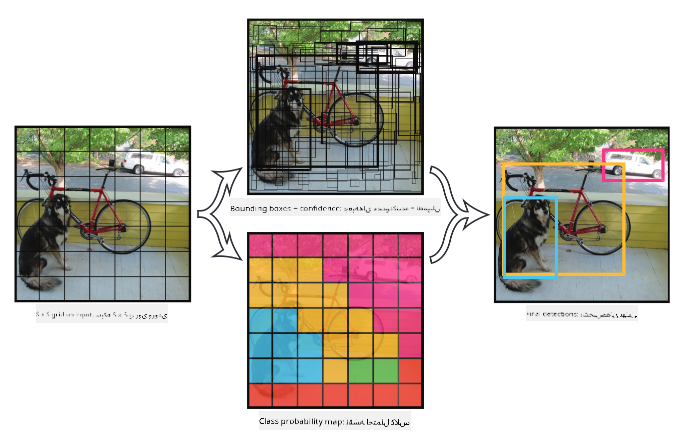

<!--
CO_OP_TRANSLATOR_METADATA:
{
  "original_hash": "d76a7eda28de5210c8b1ba50a6216c69",
  "translation_date": "2025-09-23T12:28:28+00:00",
  "source_file": "lessons/4-ComputerVision/11-ObjectDetection/README.md",
  "language_code": "fa"
}
-->
# تشخیص اشیا

مدل‌های طبقه‌بندی تصویر که تاکنون با آن‌ها کار کرده‌ایم، یک تصویر را گرفته و یک نتیجه دسته‌بندی شده تولید می‌کردند، مانند کلاس "عدد" در مسئله MNIST. اما در بسیاری از موارد، ما فقط نمی‌خواهیم بدانیم که یک تصویر اشیایی را نشان می‌دهد - بلکه می‌خواهیم مکان دقیق آن‌ها را نیز تعیین کنیم. این دقیقاً هدف **تشخیص اشیا** است.

## [پیش‌کوئیز](https://ff-quizzes.netlify.app/en/ai/quiz/21)

> تصویر از [وب‌سایت YOLO v2](https://pjreddie.com/darknet/yolov2/)

## یک رویکرد ساده برای تشخیص اشیا

فرض کنید می‌خواهیم یک گربه را در یک تصویر پیدا کنیم. یک رویکرد بسیار ساده برای تشخیص اشیا می‌تواند به این صورت باشد:

1. تصویر را به تعدادی کاشی تقسیم کنید.
2. طبقه‌بندی تصویر را روی هر کاشی اجرا کنید.
3. کاشی‌هایی که منجر به فعال‌سازی کافی بالا می‌شوند، می‌توانند به عنوان حاوی شیء مورد نظر در نظر گرفته شوند.

> *تصویر از [دفترچه تمرین](ObjectDetection-TF.ipynb)*

اما این رویکرد ایده‌آل نیست، زیرا فقط به الگوریتم اجازه می‌دهد که جعبه محدودکننده شیء را به صورت بسیار نادقیق مکان‌یابی کند. برای مکان‌یابی دقیق‌تر، باید نوعی **رگرسیون** اجرا کنیم تا مختصات جعبه‌های محدودکننده را پیش‌بینی کنیم - و برای این کار، به مجموعه داده‌های خاصی نیاز داریم.

## رگرسیون برای تشخیص اشیا

[این پست وبلاگ](https://towardsdatascience.com/object-detection-with-neural-networks-a4e2c46b4491) مقدمه‌ای عالی و ساده برای تشخیص اشکال ارائه می‌دهد.

## مجموعه داده‌ها برای تشخیص اشیا

ممکن است با مجموعه داده‌های زیر برای این کار مواجه شوید:

* [PASCAL VOC](http://host.robots.ox.ac.uk/pascal/VOC/) - شامل ۲۰ کلاس
* [COCO](http://cocodataset.org/#home) - اشیای عمومی در زمینه. شامل ۸۰ کلاس، جعبه‌های محدودکننده و ماسک‌های تقسیم‌بندی

## معیارهای تشخیص اشیا

### تقاطع بر اتحاد (IoU)

در حالی که برای طبقه‌بندی تصویر اندازه‌گیری عملکرد الگوریتم آسان است، برای تشخیص اشیا باید هم درستی کلاس و هم دقت مکان‌یابی جعبه محدودکننده استنباط شده را اندازه‌گیری کنیم. برای مورد دوم، از معیاری به نام **تقاطع بر اتحاد** (IoU) استفاده می‌کنیم که میزان همپوشانی دو جعبه (یا دو ناحیه دلخواه) را اندازه‌گیری می‌کند.

> *شکل ۲ از [این پست وبلاگ عالی درباره IoU](https://pyimagesearch.com/2016/11/07/intersection-over-union-iou-for-object-detection/)*

ایده ساده است - مساحت تقاطع بین دو شکل را بر مساحت اتحاد آن‌ها تقسیم می‌کنیم. برای دو ناحیه یکسان، IoU برابر ۱ خواهد بود، در حالی که برای نواحی کاملاً جدا از هم، ۰ خواهد بود. در غیر این صورت، مقدار آن بین ۰ تا ۱ متغیر خواهد بود. معمولاً فقط جعبه‌های محدودکننده‌ای را در نظر می‌گیریم که IoU آن‌ها بالاتر از مقدار مشخصی باشد.

### دقت متوسط (Average Precision)

فرض کنید می‌خواهیم اندازه‌گیری کنیم که یک کلاس خاص از اشیا $C$ چقدر خوب تشخیص داده می‌شود. برای اندازه‌گیری آن، از معیار **دقت متوسط** استفاده می‌کنیم که به صورت زیر محاسبه می‌شود:

1. منحنی دقت-بازخوانی (Precision-Recall) را در نظر بگیرید که دقت را بر اساس مقدار آستانه تشخیص (از ۰ تا ۱) نشان می‌دهد.
2. بسته به آستانه، تعداد اشیای تشخیص داده شده در تصویر و مقادیر دقت و بازخوانی متفاوت خواهد بود.
3. منحنی به این شکل خواهد بود:

> *تصویر از [NeuroWorkshop](http://github.com/shwars/NeuroWorkshop)*

دقت متوسط برای یک کلاس خاص $C$ مساحت زیر این منحنی است. به طور دقیق‌تر، محور بازخوانی معمولاً به ۱۰ قسمت تقسیم می‌شود و دقت در تمام این نقاط میانگین‌گیری می‌شود:

$$
AP = {1\over11}\sum_{i=0}^{10}\mbox{Precision}(\mbox{Recall}={i\over10})
$$

### AP و IoU

ما فقط آن تشخیص‌هایی را در نظر خواهیم گرفت که IoU آن‌ها بالاتر از مقدار مشخصی باشد. برای مثال، در مجموعه داده PASCAL VOC معمولاً $\mbox{IoU Threshold} = 0.5$ فرض می‌شود، در حالی که در COCO، AP برای مقادیر مختلف $\mbox{IoU Threshold}$ اندازه‌گیری می‌شود.

> *تصویر از [NeuroWorkshop](http://github.com/shwars/NeuroWorkshop)*

### دقت متوسط میانگین - mAP

معیار اصلی برای تشخیص اشیا **دقت متوسط میانگین** یا **mAP** نامیده می‌شود. این مقدار دقت متوسط است که به طور میانگین در تمام کلاس‌های اشیا و گاهی نیز بر اساس $\mbox{IoU Threshold}$ محاسبه می‌شود. فرآیند محاسبه **mAP** به طور مفصل در 
[این پست وبلاگ](https://medium.com/@timothycarlen/understanding-the-map-evaluation-metric-for-object-detection-a07fe6962cf3) توضیح داده شده است، و همچنین [اینجا با نمونه کد](https://gist.github.com/tarlen5/008809c3decf19313de216b9208f3734).

## روش‌های مختلف تشخیص اشیا

دو دسته کلی از الگوریتم‌های تشخیص اشیا وجود دارد:

* **شبکه‌های پیشنهاد ناحیه** (R-CNN، Fast R-CNN، Faster R-CNN). ایده اصلی این است که **ناحیه‌های مورد علاقه** (ROI) تولید کنیم و CNN را روی آن‌ها اجرا کنیم تا به دنبال حداکثر فعال‌سازی بگردیم. این روش کمی شبیه به رویکرد ساده است، با این تفاوت که ROIها به روش هوشمندانه‌تری تولید می‌شوند. یکی از معایب اصلی این روش‌ها این است که کند هستند، زیرا نیاز به چندین بار عبور از طبقه‌بندی‌کننده CNN روی تصویر دارند.
* روش‌های **یک‌مرحله‌ای** (YOLO، SSD، RetinaNet). در این معماری‌ها، شبکه به گونه‌ای طراحی شده است که هم کلاس‌ها و هم ROIها را در یک مرحله پیش‌بینی کند.

### R-CNN: شبکه عصبی کانولوشنی مبتنی بر ناحیه

[R-CNN](http://islab.ulsan.ac.kr/files/announcement/513/rcnn_pami.pdf) از [جستجوی انتخابی](http://www.huppelen.nl/publications/selectiveSearchDraft.pdf) برای تولید ساختار سلسله‌مراتبی ناحیه‌های ROI استفاده می‌کند که سپس از طریق استخراج‌کننده‌های ویژگی CNN و طبقه‌بندی‌کننده‌های SVM عبور داده می‌شوند تا کلاس شیء تعیین شود، و از رگرسیون خطی برای تعیین مختصات *جعبه محدودکننده* استفاده می‌شود. [مقاله رسمی](https://arxiv.org/pdf/1506.01497v1.pdf)

> *تصویر از van de Sande et al. ICCV’11*

> *تصاویر از [این وبلاگ](https://towardsdatascience.com/r-cnn-fast-r-cnn-faster-r-cnn-yolo-object-detection-algorithms-36d53571365e)*

### F-RCNN - Fast R-CNN

این روش مشابه R-CNN است، اما ناحیه‌ها پس از اعمال لایه‌های کانولوشنی تعریف می‌شوند.

> تصویر از [مقاله رسمی](https://www.cv-foundation.org/openaccess/content_iccv_2015/papers/Girshick_Fast_R-CNN_ICCV_2015_paper.pdf)، [arXiv](https://arxiv.org/pdf/1504.08083.pdf)، ۲۰۱۵

### Faster R-CNN

ایده اصلی این روش استفاده از شبکه عصبی برای پیش‌بینی ROIها است - به اصطلاح *شبکه پیشنهاد ناحیه*. [مقاله](https://arxiv.org/pdf/1506.01497.pdf)، ۲۰۱۶

> تصویر از [مقاله رسمی](https://arxiv.org/pdf/1506.01497.pdf)

### R-FCN: شبکه کاملاً کانولوشنی مبتنی بر ناحیه

این الگوریتم حتی سریع‌تر از Faster R-CNN است. ایده اصلی به شرح زیر است:

1. ویژگی‌ها با استفاده از ResNet-101 استخراج می‌شوند.
2. ویژگی‌ها توسط **نقشه امتیاز حساس به موقعیت** پردازش می‌شوند. هر شیء از کلاس‌های $C$ به ناحیه‌های $k\times k$ تقسیم می‌شود و ما برای پیش‌بینی بخش‌های اشیا آموزش می‌بینیم.
3. برای هر بخش از ناحیه‌های $k\times k$، تمام شبکه‌ها برای کلاس‌های اشیا رأی می‌دهند و کلاس شیء با بیشترین رأی انتخاب می‌شود.

> تصویر از [مقاله رسمی](https://arxiv.org/abs/1605.06409)

### YOLO - فقط یک بار نگاه کن

YOLO یک الگوریتم یک‌مرحله‌ای بلادرنگ است. ایده اصلی به شرح زیر است:

 * تصویر به ناحیه‌های $S\times S$ تقسیم می‌شود.
 * برای هر ناحیه، **CNN** $n$ شیء ممکن، مختصات *جعبه محدودکننده* و *اعتماد* = *احتمال* * IoU را پیش‌بینی می‌کند.

 

> تصویر از [مقاله رسمی](https://arxiv.org/abs/1506.02640)

### سایر الگوریتم‌ها

* RetinaNet: [مقاله رسمی](https://arxiv.org/abs/1708.02002)
   - [پیاده‌سازی PyTorch در Torchvision](https://pytorch.org/vision/stable/_modules/torchvision/models/detection/retinanet.html)
   - [پیاده‌سازی Keras](https://github.com/fizyr/keras-retinanet)
   - [تشخیص اشیا با RetinaNet](https://keras.io/examples/vision/retinanet/) در نمونه‌های Keras
* SSD (Single Shot Detector): [مقاله رسمی](https://arxiv.org/abs/1512.02325)

## ✍️ تمرین‌ها: تشخیص اشیا

یادگیری خود را در دفترچه زیر ادامه دهید:

[ObjectDetection.ipynb](ObjectDetection.ipynb)

## نتیجه‌گیری

در این درس، شما یک مرور سریع از روش‌های مختلفی که می‌توان برای تشخیص اشیا استفاده کرد، داشتید!

## 🚀 چالش

این مقالات و دفترچه‌ها درباره YOLO را بخوانید و خودتان آن‌ها را امتحان کنید:

* [یک پست وبلاگ خوب](https://www.analyticsvidhya.com/blog/2018/12/practical-guide-object-detection-yolo-framewor-python/) که YOLO را توضیح می‌دهد
 * [سایت رسمی](https://pjreddie.com/darknet/yolo/)
 * YOLO: [پیاده‌سازی Keras](https://github.com/experiencor/keras-yolo2)، [دفترچه گام‌به‌گام](https://github.com/experiencor/basic-yolo-keras/blob/master/Yolo%20Step-by-Step.ipynb)
 * YOLO v2: [پیاده‌سازی Keras](https://github.com/experiencor/keras-yolo2)، [دفترچه گام‌به‌گام](https://github.com/experiencor/keras-yolo2/blob/master/Yolo%20Step-by-Step.ipynb)

## [پس‌کوئیز](https://ff-quizzes.netlify.app/en/ai/quiz/22)

## مرور و مطالعه شخصی

* [تشخیص اشیا](https://tjmachinelearning.com/lectures/1718/obj/) توسط نیکیل ساردانا
* [مقایسه خوبی از الگوریتم‌های تشخیص اشیا](https://lilianweng.github.io/lil-log/2018/12/27/object-detection-part-4.html)
* [مروری بر الگوریتم‌های یادگیری عمیق برای تشخیص اشیا](https://medium.com/comet-app/review-of-deep-learning-algorithms-for-object-detection-c1f3d437b852)
* [مقدمه‌ای گام‌به‌گام بر الگوریتم‌های پایه تشخیص اشیا](https://www.analyticsvidhya.com/blog/2018/10/a-step-by-step-introduction-to-the-basic-object-detection-algorithms-part-1/)
* [پیاده‌سازی Faster R-CNN در پایتون برای تشخیص اشیا](https://www.analyticsvidhya.com/blog/2018/11/implementation-faster-r-cnn-python-object-detection/)

## [تکلیف: تشخیص اشیا](lab/README.md)

---

