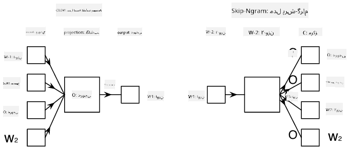

<!--
CO_OP_TRANSLATOR_METADATA:
{
  "original_hash": "7ba20f54a5bfcd6521018cdfb17c7c57",
  "translation_date": "2025-09-23T12:34:04+00:00",
  "source_file": "lessons/5-NLP/15-LanguageModeling/README.md",
  "language_code": "fa"
}
-->
# مدل‌سازی زبان

بردارهای معنایی، مانند Word2Vec و GloVe، در واقع اولین گام به سوی **مدل‌سازی زبان** هستند - ایجاد مدل‌هایی که به نوعی *ماهیت* یا *نمایش* زبان را درک کنند.

## [پرسش‌نامه پیش از درس](https://ff-quizzes.netlify.app/en/ai/quiz/29)

ایده اصلی پشت مدل‌سازی زبان، آموزش آن‌ها بر روی مجموعه داده‌های بدون برچسب به صورت غیرنظارتی است. این موضوع مهم است زیرا ما حجم عظیمی از متن‌های بدون برچسب در دسترس داریم، در حالی که مقدار متن‌های برچسب‌دار همیشه محدود به میزان تلاش ما برای برچسب‌گذاری خواهد بود. اغلب، می‌توانیم مدل‌های زبانی بسازیم که بتوانند **کلمات گمشده** در متن را پیش‌بینی کنند، زیرا حذف تصادفی یک کلمه از متن و استفاده از آن به عنوان نمونه آموزشی کار آسانی است.

## آموزش بردارها

در مثال‌های قبلی، ما از بردارهای معنایی از پیش آموزش‌دیده استفاده کردیم، اما جالب است بدانیم که این بردارها چگونه آموزش داده می‌شوند. چندین ایده ممکن وجود دارد که می‌توان از آن‌ها استفاده کرد:

* **مدل‌سازی زبان با N-Gram**، که در آن یک توکن را با نگاه به N توکن قبلی پیش‌بینی می‌کنیم (N-gram).
* **کیسه کلمات پیوسته** (CBoW)، که در آن توکن میانی $W_0$ را در یک دنباله توکن $W_{-N}$, ..., $W_N$ پیش‌بینی می‌کنیم.
* **Skip-gram**، که در آن مجموعه‌ای از توکن‌های همسایه {$W_{-N},\dots, W_{-1}, W_1,\dots, W_N$} را از توکن میانی $W_0$ پیش‌بینی می‌کنیم.

> تصویر از [این مقاله](https://arxiv.org/pdf/1301.3781.pdf)

## ✍️ مثال‌های عملی: آموزش مدل CBoW

یادگیری خود را در نوت‌بوک‌های زیر ادامه دهید:

* [آموزش CBoW Word2Vec با TensorFlow](CBoW-TF.ipynb)
* [آموزش CBoW Word2Vec با PyTorch](CBoW-PyTorch.ipynb)

## نتیجه‌گیری

در درس قبلی دیدیم که بردارهای کلمات مانند جادو عمل می‌کنند! اکنون می‌دانیم که آموزش بردارهای کلمات کار پیچیده‌ای نیست و باید بتوانیم بردارهای کلمات خود را برای متن‌های خاص حوزه مورد نظر آموزش دهیم.

## [پرسش‌نامه پس از درس](https://ff-quizzes.netlify.app/en/ai/quiz/30)

## مرور و مطالعه خودآموز

* [آموزش رسمی PyTorch درباره مدل‌سازی زبان](https://pytorch.org/tutorials/beginner/nlp/word_embeddings_tutorial.html).
* [آموزش رسمی TensorFlow درباره آموزش مدل Word2Vec](https://www.TensorFlow.org/tutorials/text/word2vec).
* استفاده از چارچوب **gensim** برای آموزش رایج‌ترین بردارها تنها در چند خط کد در [این مستندات](https://pytorch.org/tutorials/beginner/nlp/word_embeddings_tutorial.html) توضیح داده شده است.

## 🚀 [تکلیف: آموزش مدل Skip-Gram](lab/README.md)

در آزمایشگاه، از شما می‌خواهیم کد این درس را تغییر دهید تا به جای CBoW مدل Skip-Gram را آموزش دهید. [جزئیات را بخوانید](lab/README.md)

---

